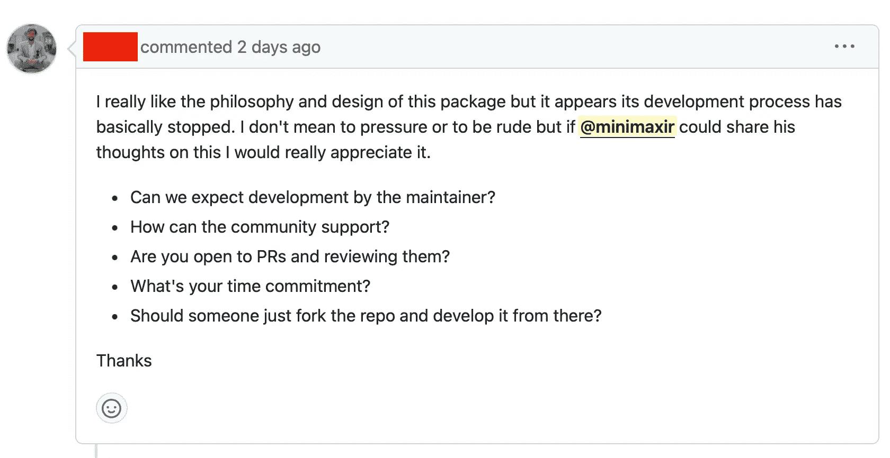
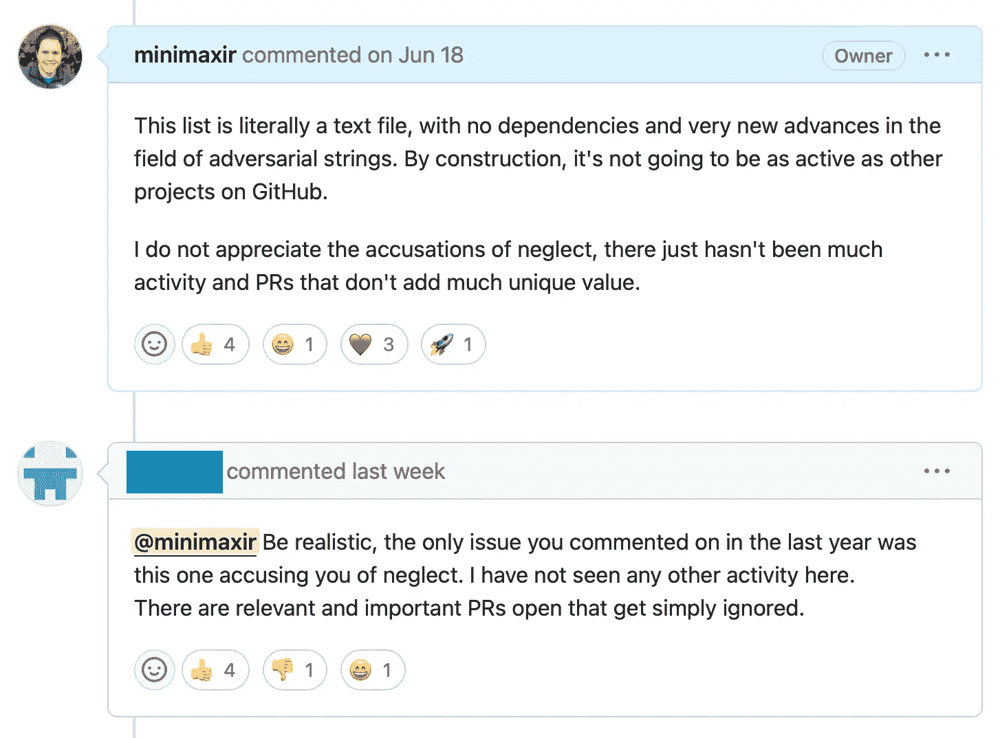

# 请不要询问一个开源项目是否已经死亡 | Max Woolf 的博客

> 原文：[`minimaxir.com/2023/11/open-source-dead-github/`](https://minimaxir.com/2023/11/open-source-dead-github/)

在过去的几个月里，我对在 GitHub 上的开源 AI 工作感到[存在危机](https://minimaxir.com/2023/10/ai-sturgeons-law/)，特别是因为对 AI 的反感越来越严重，以及因为 AI 行业发展如此迅速，我根本没有足够的带宽来跟进。在那段时间里，我暂停了我的项目工作，这本应该没问题。我的最新的开源项目之一是[simpleaichat](https://github.com/minimaxir/simpleaichat)，一个用于与[ChatGPT](https://chat.openai.com)进行交互的 Python 包，拥有 3k 个 GitHub 星标，它明确设计为范围有限且依赖最小，以便我可以在不破坏代码的情况下休息。

在我精神状态良好，准备恢复我的开源工作时，我瞥了一眼 simpleaichat 的 GitHub 问题，有人提交了一个标题简单为“这个项目已经被放弃了吗？”的问题，另一个 GitHub 用户跟进说“恕我直言，我也对答案感兴趣。”

到底怎么了？我感到恐慌，检查是否有新的重大问题或依赖项，但没有。

两天后，另一个人提交了另一个问题：“这个包仍在持续开发中吗？”

要非常清楚，这绝对是施加压力和粗鲁的行为。

## 开源软件开发的期望

我从未见过任何关于是否适当询问开源存储库是否已经死亡的讨论或文章。是否有一种隐含的合同要积极维护您发布的任何开源软件？如果您在 GitHub 上获得一定数量的星标或通过 GitHub 赞助/Patreon 寻求资金，您是否有义务提供免费支持？毕竟，大多数开源代码许可证（如[MIT 许可证](https://en.wikipedia.org/wiki/MIT_License)）都包含“软件按原样提供，不附带任何形式的保证”。

遗憾的是，simpleaichat 并不是我第一个有这种投诉的开源项目。我大约十年前推送到 GitHub 的[Naughty Strings 大列表](https://github.com/minimaxir/big-list-of-naughty-strings)用于跟踪对抗性用户输入文本字符串，基本上只是一个带有 45k 个 GitHub 星标的`txt`文件。永远不会有依赖问题，而且对列表的添加如果不针对特定字符串问题，可能会使列表变得更加混乱，因此我不愿意接受每个拉取请求。但尽管如此，人们还是生气。

评论反应的二元性。

有些人似乎认为 GitHub 问题零或拉取请求零是存在的，就像[inbox-zero](https://www.techtarget.com/whatis/definition/inbox-zero)一样，在实践中是不可行的，这是由于职业生活的现实。^(每个非平凡的开源项目都会有一个问题/PR 队列，这需要对优先级进行分类：不是所有问题和 PR 都是相等的，需要时间和精力来筛选队列。这是我作为维护者不得不反复吸取的教训，因为接受一个错误的 PR 会产生[技术债务](https://en.wikipedia.org/wiki/Technical_debt)，并需要更多的努力来解决。)

我知道发现一个很酷的 GitHub 项目很久没有更新是令人沮丧的。我经常遇到这种情况。如果代码仍然有效，那太好了，我很高兴。但如果不行，我会继续前进，或者将其作为一个有趣的新机会来满足我的需求。这就是开源的美妙之处！如果有一个不活跃的开源项目对你自己的商业项目非常关键，那么这是一个提供咨询合同或悬赏以添加适当功能的好理由。

开源的一个伟大之处在于，如果一个具有宽松许可的开源项目变得不活跃，它可以无缝地被[分叉](https://docs.github.com/en/get-started/quickstart/fork-a-repo)。有时分叉甚至可以变得比原始项目更好，这对每个人都是好事！但根据我的经验，它却被用作一种*威胁*。这是维护者的错，因为他们创造了一个分叉的理由，并使开发社区分裂。

人工智能行业是独特的，因为它确实发展迅速，发展预期已经发生变化。最近受益于 ChatGPT 繁荣的项目，如[LangChain](https://github.com/langchain-ai/langchain)、[LlamaIndex](https://github.com/run-llama/llama_index)和[AutoGPT](https://github.com/Significant-Gravitas/AutoGPT)已经产生了一种错误的观念，即开源人工智能项目必须**始终在运行**🚀🚀🚀。不同之处在于，它们由全职从事此工作的人维护，并且现在作为获得大量风险资本支持的公司进行管理。

持续为开源项目提供支持的压力已经成为我继续进行开源工作的最大阻力。就个人而言，我已经停止推动有趣的一次性项目和人工智能模型，因为当项目的依赖关系在几年后出现问题时，我可能没有足够的带宽来处理不可避免的“嗨，这个有问题，请修复，谢谢”私信。如果我能够通过全职从事开源项目工作获得相当的薪水，我愿意辞去我作为数据科学家的专业工作。最终，如今使其运作的唯一方法将是像所有那些人工智能初创公司一样筹集风险资本。

询问一个开源项目是否已经停止更新的最好情况是你会惹恼维护者并延迟开发。*最糟糕*的情况是你给了维护者一个重新考虑是否继续在开源项目上工作的机会。
