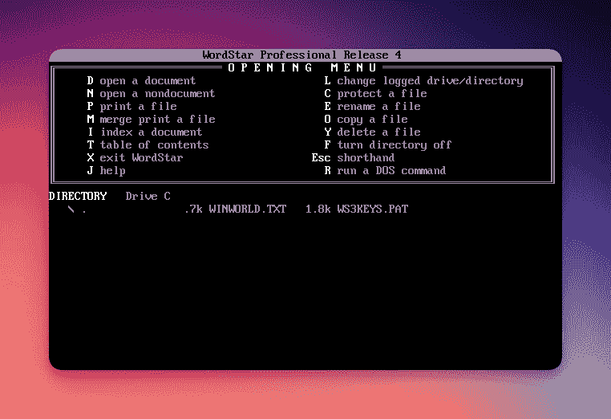

# 完成软件的美 | 何塞·M。

> 原文：[`josem.co/the-beauty-of-finished-software/`](https://josem.co/the-beauty-of-finished-software/)

让我向你介绍[WordStar 4.0](https://en.wikipedia.org/wiki/WordStar)，这是 80 年代初期流行的文字处理器。

<picture></picture> *WordStar 4.0*

尽管看起来很老，乔治·R·R·马丁用它来写《冰与火之歌》。

为什么有人会使用这么老的软件来写超过 5000 页？我喜欢他是如何表达的：

> 它做我想要的文字处理程序做的一切，而且不做其他任何事情。我不需要任何帮助。我讨厌一些现代系统，你输入一个小写字母，它就变成了大写。我不想要大写，如果我想要大写，我会输入大写的。乔治·R·R·马丁

这个程序体现了完成软件的概念——一个你可以永远使用而不需要不必要更改的软件。

完成的软件是不会被期望改变的软件，这就是一个特性！你可以依赖它来做一些真正的工作。

一旦你习惯了这个软件，一旦软件为你工作，你就不需要学习任何新东西；界面将完全相同，所有你的文件将保持相关。没有迁移，没有新的付款，没有新的变化。

这种软件可以有意地创建，创作者们做出妥协，他们不会用你不需要的东西来打扰你，只有绝对必要的东西会改变，比如小更新以使其与新操作系统兼容。

有时，完成的软件是偶然发生的；也许背后的公司已经消失，或者产品已经被放弃。

UNIX 世界中也有一些很好的完成软件的例子：像`cd`（改变当前目录）或`ls`（列出当前目录内容）这样的命令不会在重大程度上改变。你可以依赖它们直到你的职业生涯结束。

## 不断更新的诱惑

我们对软件的期望与我们日常生活中使用的其他产品不同。

当我们购买一个物理产品时，我们接受它在其寿命内不会改变。我们会使用它直到它磨损，然后替换它。我们可以依赖于那个产品不会发展；我的汽车油门永远会在同一个位置。

然而，当涉及到软件时，我们通常有永久更新的内在期望。我们相信如果软件不发展，它将会变得无聊、老旧和无法使用。如果我们看到一款应用在过去一年没有更新，我们会认为创作者可能已经去世了。

我们也期望任何软件的新版本都会比之前的更好。一旦发布，我们的大部分问题将会得到解决！多么欺骗性的谎言。

有时，软件升级是向后退的一步：更不易使用，更不稳定，带有新的错误。即使它确实更好，也有学习曲线。你在旧版本上效率很高，但现在你最常用的按钮在屏幕的另一边，隐藏在一个菜单下面。

## 完成的软件是一个很好的提醒

在一个不断变化是常态的世界中，完成的软件提供了一股清新的空气。它提醒我们可靠性、一致性和用户满意度可以在软件开发领域共存。

所以下次当你渴望最新更新时，请记住有时候，最好的软件是那些根本不改变的软件。

* * *

### 参考资料

[1] 乔治·R·R·马丁在 Conan 节目中（2014 年）。[`www.youtube.com/watch?v=X5REM-3nWHg`](https://www.youtube.com/watch?v=X5REM-3nWHg)。 
