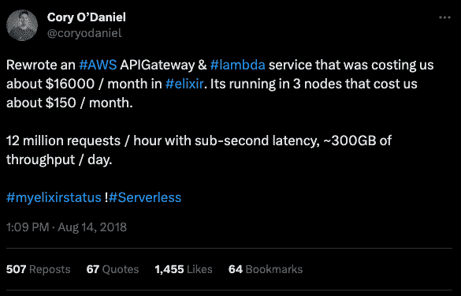

# Elixir 每年为 Pinterest 节省 200 万美元的服务器成本

> 原文：[`paraxial.io/blog/elixir-savings`](https://paraxial.io/blog/elixir-savings)

[**Elixir 编程语言**](https://elixir-lang.org/)在软件界中以业务成功关键性的稳定性而闻名。官方描述称，“Elixir 是一种用于构建可扩展和可维护应用程序的动态、函数式语言。”这只是对 Elixir 所包含的巨大力量的谦逊总结，它已经为各行业的企业节省了数百万美元。

书籍“[《Adopting Elixir, From Concept to Production (2018)》](https://pragprog.com/titles/tvmelixir/adopting-elixir/)”由 Ben Marx、José Valim、Bruce Tate 编写，是一个关于在业务中使用 Elixir 的战略和技术原因的优秀指南。第一章清楚地说明了其中的好处。

*Pinterest 使用 Elixir 来构建专注、高容量、高影响力的性能工具和监控服务。Steve Cohen 是一位软件工程师，一直与他们的早期采用团队合作：*

***José**: 为什么选择 Elixir？*

***Steve**: 我们选择 Elixir 是因为我们正在寻找一个易于程序员理解并能更好利用我们服务器的系统。我对 Elixir 友好的语法、强大的元编程功能和 Actor 模型的结合感到着迷。*

***José**: 你的公司如何从 Elixir 中受益？*

***Steve**: 这很简单。当我加入垃圾邮件团队时，我们有近 1400 台服务器在运行。当我们将几个部分转换为 Elixir 时，我们将其减少了大约 95%。一个原本在 200 台 Python 服务器上运行的系统现在在四台 Elixir 服务器上运行（实际上可以在两台服务器上运行，但我们觉得四台提供了更多的容错能力）。更好的架构和 Elixir 的结合效果使 Pinterest 每年节省了 200 万美元的服务器成本。此外，尽管运行在大大减少的硬件上，系统的性能和可靠性也有所提高。当我们的通知系统运行在 Java 上时，需要 30 个 c32.xl 实例。当我们转换到 Elixir 时，我们只需要 15 个。尽管运行在更少的硬件上，响应时间显著下降，错误也减少了。*

一种能够让公司节省成本同时提高可靠性和性能的语言似乎是幻想。Elixir 能够展示这一令人难以置信的结果，因为该语言是建立在 Erlang 之上的，Erlang 是一种设计用于必须保持在线的并发软件的平台。银行门户、电子商务网站和 SaaS 产品只是一些例子，大多数商业软件今天都有这个要求。Elixir 改进产品同时降低成本的故事一再重演。

* * *

*@coryodaniel*

*重写了一个在#AWS APIGateway 和#lambda 服务中花费约每月 16000 美元的#elixir。现在它在 3 个节点上运行，每月成本约为 150 美元。*

*每小时处理 1200 万个请求，延迟在亚秒级别，每天吞吐量约为 300GB。*

* * *

[Cory O’Daniel](https://twitter.com/coryodaniel)在 2018 年注意到了这一好处，[发布了一篇详细的技术博客文章](https://medium.com/coryodaniel/from-erverless-to-elixir-48752db4d7bc)，基于他的推文引起的巨大兴趣。对于那些曾经在复杂的无服务器系统上工作过的人来说，上述例子并不令人意外。托管成本很快变得不合理，可能无法在本地机器上运行代码进行更改，这会增加昂贵的开发时间。开发人员喜欢 Elixir 提供的出色体验，企业喜欢提前完成更多工作。

Bleacher Report 是一家顶级的实时体育和媒体网站，由于业务成功而遇到了扩展问题。通过 Elixir，他们能够[将平均每日流量负载增加 8 倍，从 150 台服务器减少到只有 5 台](https://web.archive.org/web/20181011093614/https://www.techworld.com/apps-wearables/how-elixir-helped-bleacher-report-handle-8x-more-traffic-3653957/)：

*该网站最初是基于 Ruby on Rails 框架编写的，但根据 BR 的高级工程总监戴夫·马克斯的说法，Bleacher Report 达到了无法再扩展的地步。*

*Elixir 已经被证明是如此高效，以至于测试我们服务的极限成为一个挑战，需要投资于新的基准测试工具和策略。例如，在最近的一次测试中，我们最繁忙的服务能够处理平均流量的 8 倍，而无需自动扩展，直到数据库被证明是一个瓶颈，“他说。*

*“在我们的单体系统上，我们大约需要 150 台服务器来支持 BR 的更密集部分。在我们转向 Elixir 后，我们现在能够在五台服务器上运行相同的功能，而且我们可能过度配置了。我们可能可以在两台服务器上完成，”马克斯说。*

让我们进行一个费米估算，每台服务器的成本为每年$17,000。

| 一台服务器： | 每年$17,000（示例） |
| --- | --- |
| 150 台服务器： | 每年$2,550,000 |
| 5 台服务器： | 每年$85,000 |
| 节省： | 每年$2,465,000 |
|  |  |
| 节省 30 倍成本， | 最终账单减少了 97% |

最终结果是服务器费用减少了 97%，可靠性和性能得到了改善。所有这些都是可能的，因为 Elixir 和底层的 Erlang 平台基本上是为具有许多用户的始终在线软件而设计的。当您使用正确的工具来完成工作时，好处是明显的。

* * *

*[Paraxial.io](https://paraxial.io/) 通过保护您的 Elixir 和 Phoenix 应用程序来阻止数据泄露。[立即检测和修复关键安全问题。](https://calendly.com/paraxial/paraxial-io)*
