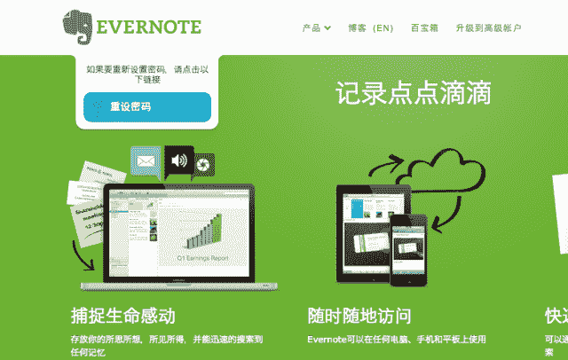
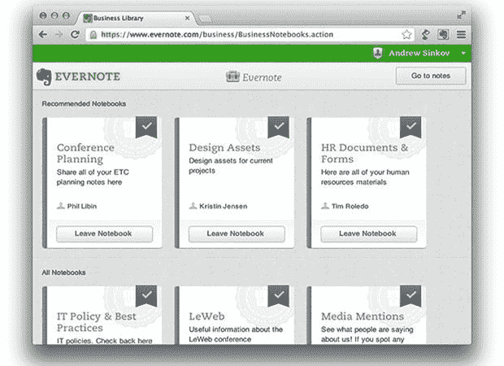

# 为什么 Evernote 未能实现其潜力【完整历史】

> [`nira.com/evernote-history/`](https://nira.com/evernote-history/)

传奇投资者、程序员和 Y Combinator 联合创始人保罗·格雷厄姆曾经写道，想出下一个创业公司的最好方法之一是问问自己，你希望有人为你制作什么产品。

对于 Evernote 的创始人 Stepan Pachikov 来说，那个产品是帮助他记住事情的方法。

尽管 Pachikov 最初于 2002 年开始着手于最终成为 Evernote 的项目，但他对人类记忆的迷恋源于他在前苏联成长的经历。对 Pachikov 来说，Evernote 不仅仅是另一个应用程序，也不仅仅是利用硅谷对个人生产力的狂热。它是人类思维本身的延伸，让用户记住一切。

自 Pachikov 十七年前开始着手开发该应用以来，Evernote 已经走过了很长的路。Evernote 是并仍然是免费产品的最佳示范之一。尽管如此，Evernote 一直受到一系列管理失误和失败产品推出的困扰，公司的未来仍然不确定。

本文将探讨以下内容：

+   Evernote 成功的时机为何如此重要，以及联合创始人兼前首席执行官 Phil Libin 对产品的愿景如何为 Evernote 的增长创造了重要的助力

+   公司如何抵制投资者的压力，坚守对 Evernote 作为免费产品价值的信念

+   Evernote 如何迷失了原始愿景，以及这几乎导致了公司的失败

Evernote 的创始人 Stepan Pachikov 的个人追求启发了 Evernote 的创意。他的目标是解决一个巨大的问题：克服人类记忆的局限性。

## 2008-2011: 创造一个不可能的愿景

Stepan Pachikov 想要记住一切。

Pachikov 是硅谷最具远见的技术专家之一。作为虚拟现实、计算机手写分析和光学字符识别的先驱，Pachikov 一生大部分时间都在致力于解决计算机领域一些最具挑战性的问题。

Pachikov 在经济数学方面接受过训练，他在莫斯科苏联社会主义共和国联合会科学院获得了模糊逻辑博士学位。作为一个生活和工作在苏联俄罗斯共产主义统治下的科学家，Pachikov 对被遗忘并不陌生。他亲眼看到苏联俄罗斯逐渐崩溃威胁到几代人的文化和集体记忆。由于几乎没有办法保存它们，即使是他自己过去的重要时刻也被时间的洪流所淹没。

“即使 30 年前，我已经丢失了很多信息。名字。笑话。短语。事实。我可以学习和重新学习我忘记的东西，但我无法回到我的学校时代，我的大学时代，回忆我所知道的。老师。朋友。经历。在过去的 20 年里，我已经把 75000 张照片放入我的照片数据库。但在那之前的照片都丢失了。”- Evernote 创始人 Stepan Pachikov

Pachikov 认为计算机不仅是保存个人和文化记忆的手段，也是赋予在 20 世纪 80 年代苏联政治和社会动荡中成长的孩子们力量的方式。为此，Pachikov 从 1986 年开始与他的朋友、世界著名国际象棋大师加里·卡斯帕罗夫合作，两人在莫斯科成立了该国第一个计算机俱乐部。Pachikov 和卡斯帕罗夫设计了一种鼓励俄罗斯儿童发展书写技能的方式，以简单游戏的形式。这个游戏最终成为 Paragraph，世界上第一个商业化的计算机手写识别软件。

帕奇科夫教育实验的结果参差不齐，但他的工作引起了苹果公司的注意，苹果公司要求帕奇科夫为牛顿手持计算机开发他的手写识别软件。帕奇科夫离开了莫斯科的严寒气候，来到了加利福尼亚北部的库比蒂诺，开始了在美国的新生活。

苹果的牛顿项目——以及由此延伸的 Paragraph——最终失败了。帕奇科夫并没有气馁，他再次将注意力转向教育儿童。在 90 年代，他开始了一系列项目，包括一款尖端的虚拟现实产品，让孩子们通过穿越时光回到古希腊时代来学习历史。

直到 2002 年，帕奇科夫才开始着手开发后来成为 Evernote 的项目。

除了他对保存和扩展人类记忆的终身迷恋外，帕奇科夫的职业生涯还被他的理念雄心所定义。帕奇科夫对未来的愿景一直领先于当时的技术。最初，帕奇科夫对 Evernote 的愿景更接近于神经技术公司（如埃隆·马斯克的 Neuralink）承诺的脑机接口。帕奇科夫希望开发一种技术，可以作为人与机器之间的中介。

然而，尽管 Evernote 作为一个概念具有幻想性质，但该产品将具有坚实的实际应用。

“当你记不住某人的名字时，你看起来很愚蠢。记忆和智慧是相互融合的。我们都有成千上万的信息，但如果我们找不到其中任何一条，那就是无用的。在商业中，我们最糟糕的说法是‘哦，对不起，我忘了你的名字。’这是我自己需要的产品。”——Evernote 创始人斯蒂潘·帕奇科夫

尽管帕奇科夫的萌芽想法与谷歌几乎没有共同之处，但两种产品都基于同样的基本原则：在未来，知道如何查找信息将比记住信息更重要。

帕奇科夫花了两年时间制作 Evernote 的原型（最初被称为 EverNote），并于 2004 年发布了 Windows 版本的工具的测试版。帕奇科夫决定瞄准微软的旗舰操作系统是有道理的。2002 年，[微软控制了几乎 94%的客户端操作系统市场](https://www.itworld.com/article/2804237/operating-systems/microsoft-dominance-of-os-market-grows--idc-study-says.html)。苹果的 OS X，刚在 2001 年 3 月发布，市场份额仅略高于 2%。帕奇科夫早期的原型还有些粗糙，但核心功能大多都在那里——包括他在 Paragraph 开创的电子手写识别技术。

[来源：phoneArena](https://www.phonearena.com/news/Two-thirds-of-app-users-in-U.S.-have-paid-for-at-least-one_id30191)

2006 年，在美国波士顿的另一边，连续创业家菲尔·利宾正在计划他的下一步。像帕奇科夫一样，利宾年轻时从俄罗斯移民到美国。而且，像帕奇科夫一样，利宾对人类记忆的局限性很感兴趣。在推出并出售了一家成功的电子商务软件公司和一家信息技术安全公司之后，利宾正在研究通过电子手段增强人类记忆的可能性。他称之为 Ribbon 的第三个创业项目将是一个组织工具，帮助人们保存和获取他们需要的信息。

就在那时，利宾第一次听说了帕奇科夫的 EverNote 项目。

EverNote 和 Ribbon 在形式和功能上非常相似。然而，Pachikov 在 Libin 准备开始开发自己公司技术时，已经在 EverNote 上取得了重大进展。Libin 从波士顿前往硅谷与 Pachikov 会面，两人决定将他们的两家新兴公司合并，而不是互相竞争。

Pachikov 和 Libin 都对人类思维的局限性感到不满。然而，虽然两人对他们的想法都充满理想主义，甚至哲学意味，但 Libin 具有 Pachikov 所缺乏的商业眼光——这是 Pachikov 认为使 Libin 成为理想合作伙伴的品质。

*“[Phil Libin]聪明、受过教育，我完全相信他会比我更好地担任 CEO。他的俄语比我的英语好。我相信他会改变公司并使其成功。” — Evernote 创始人 Stepan Pachikov*

在两家公司合并后，Libin 开始着手工作。Libin 的第一个任务之一是简化 Pachikov 及其团队一直在进行的各种内部项目，并坚持让公司将所有努力集中在完善产品背后的理念上：赋予用户捕捉、搜索和存储任何信息的能力，无论他们身在何处。

然而，Libin 对这家不断发展的公司最重要的贡献是在很早的时候，他将 Evernote 从 Windows 转向了一个全新的领域——移动设备。

Evernote 的核心前提是可访问性。如果 Evernote 要帮助人们记住一切，那么用户必须能够捕捉一切。这意味着移动设备。然而，在 2006 年，移动设备远未成为今天的主导平台。苹果的旗舰 iPhone 要再过一年才会发布，而根据[Libin 自己的承认](https://mashable.com/2011/08/11/evernote-phil-libin-interview/)，在移动设备上大胆投资正是一场赌博。

*“从一开始，我们向用户做出了一个重大承诺——我们将帮助他们记住一切。为了实现这一目标，Evernote 需要能够轻松访问每台计算机、手机或其他设备，以及一个人使用的设备，直到他们的生命结束。因此，我们并不是预测了移动设备的崛起，而是觉得移动设备对我们的成功至关重要。” — Evernote 前 CEO Phil Libin*

这场赌注成功了。当 iPhone 在 2007 年推出时，Evernote 已经准备就绪。该产品在外观和感觉上与早期版本完全不同。Evernote 的美学是时尚、干净和时尚的，使用起来感觉非常棒。

[来源：Archive.org](https://web.archive.org/web/20081201043203/http://www.evernote.com/)

然而，驱动 Evernote 初期采用的主要不是其移动应用的美学，而是应用商店的出现。正如智能手机应用是一种全新的软件使用方式，应用市场也是全新的、现成的分发渠道，为开发人员提供了立即接触数百万潜在用户的机会。Evernote 的工程师们不知疲倦地努力确保 Evernote 在每个新的应用市场推出时都能使用，每一个应用市场的推出都大大扩展了 Evernote 的影响范围。

Libin 的独特关注驱动了 Evernote 的初期发展。2008 年，Evernote 推出了一个面向硅谷生产力狂热者的有限私人测试版。

[来源：Keyword Suggest](http://keywordsuggest.org/gallery/431092.html)

李宾对 Evernote 的愿景是实现无缝体验，成功地弥合了物理世界和数字世界之间的鸿沟。为了实现这一目标，Evernote 将每一条信息——从实际手写笔记到保存的 URL 链接——都视为“笔记”，并将其组织成主题“笔记本”。这是一个巧妙而熟悉的惯例，至今 Evernote 仍在使用。即使在早期阶段，Evernote 的功能也令人印象深刻。用户可以在几秒钟内保存各种信息。数字化的手写笔记、音频录音、用户移动设备上拍摄的图片、保存的图像、待办事项列表、剪贴的文章——几乎用户在网上找到的任何东西都可以保存、归档并在多个设备之间同步。

然而，Evernote 真正的亮点在于其搜索功能，李宾描述为“电子版的舌尖上的东西”。用户可以使用惊人范围的搜索条件搜索保存的项目，包括日期、关键词、主题、位置、联系人，或以上任意组合。用户甚至可以下载附加组件，允许根据图像的主要颜色搜索笔记。这使得查找保存的笔记变得更加容易，因为用户只需回忆起一个细节就可以开始搜索，就像我们的记忆工作方式一样。这不仅对 Evernote 的核心目标至关重要，而且在重新创造记忆的愉悦、满足感方面也是必不可少的，这将定义使用 Evernote 作为产品的体验。

“Evernote 找到了你的思维方式，并为你提供了越来越多的记忆钩子。” —— Andrew Sinkov，Evernote 前市场营销副总裁

在李宾看来，这种乐趣和满足感至关重要。Evernote 在快速增长的个人生产力领域中的独特地位并没有被该公司的首席执行官忽视。Evernote 在每一个转折点都面临着现有竞争对手。Box、Dropbox、iCloud 和 Google Drive 已经主导了在线存储领域。Instapaper 提供了网页剪贴工具，而它的主要竞争对手 Spool 已经停止运营。Evernote 在 2012 年 Canva 推出之前就先于免费在线图像编辑工具的浪潮，但 Evernote 的图像编辑工具并不独特。

对李宾来说，使用 Evernote 的体验将是其竞争优势。

李宾的产品理念导致了 Evernote 的少数基于硬件的缺陷之一——在用户的设备上本地存储数据。李宾认为，响应速度对于 Evernote 的体验至关重要，搜索和找到结果之间的延迟应该是微乎其微的。这正是驱动 Spotify 早期发展的原则。丹尼尔·埃克希望 Spotify 让用户感觉就像拥有整个世界的音乐都在他们的硬盘上一样。李宾希望 Evernote 的体验也能够同样具有响应性，并相信这将是用户对该体验满意度的核心。

不幸的是，李宾正在进行一场失败的战斗。随着 Evernote 加大本地存储的投入，其他所有服务提供商都在专注于云端。尽管这个决定在 2008 年并没有给 Evernote 带来任何存在问题，但这是 Evernote 与后来会给公司带来许多麻烦的科技趋势背道而驰的第一个迹象。

Evernote 作为一款免费产品推出。这对利宾来说至关重要。他相信，用户使用产品的时间越长，捕捉和存储的内容越多，Evernote 对用户的价值就会越来越大。因此，利宾希望尽可能地使 Evernote 变得粘性，并通过使产品的免费版本非常慷慨来实现这一目标。几乎没有功能限制或其他激励措施让用户升级到付费计划。事实上，升级到每月 5 美元的付费订阅的唯一好处是额外的存储空间。

“我不需要从你身上榨取钱财。我会有你的余生来拿你的钱。这是我的长期贪婪策略。我们的口号是，‘我们宁愿你留下来，也不愿你付款。’”- 菲尔·利宾，Evernote 的前 CEO

利宾对免费软件的态度可能受到了 Evernote 不断增长的用户群的欢迎，但对投资者来说却是令人反感的。一个接一个的风险投资公司拒绝了利宾的公司。对产品没有任何抱怨，相反，但是对于免费用户升级到付费计划来说，没有足够的激励。

在努力获得机构投资的过程中，Evernote 与一家欧洲风险投资公司达成协议，该公司将获得 1000 万美元的资金。2008 年 10 月的一个早晨，当两家公司应该会面签署文件时，投资者取消了会议并撤回了资金提供的提议。手头只有三周的现金，利宾意识到 Evernote 作为一家公司将无法生存。资金匮乏，前景渺茫，利宾苦恼于如何向团队和员工传达这个消息。

大约在那个时候，利宾收到了一封来自瑞典用户的电子邮件，他热爱 Evernote。这位用户，至今身份仍然是个秘密，告诉利宾，Evernote 让他更快乐、更有生产力。然而，这位瑞典用户不仅仅想告诉利宾他有多么喜欢这个应用程序，他还想投资。利宾承认公司需要资金，此时神秘的瑞典 Evernote 传道者提出为公司提供 50 万美元的资金。

Evernote 得救了。

他只是一个计算机迷和企业家。他有一些钱，爱上了我们的产品，就这么简单。这只是好运气。如果我早睡了十分钟，我就不会立刻打开他的电子邮件，可能会去工作并关闭公司。- [菲尔·利宾](https://www.americanexpress.com/en-us/business/trends-and-insights/articles/phil-libin-of-evernote-building-an-empire/)，Evernote 的前 CEO

Evernote 的匿名恩人不仅拯救了公司，还为 Evernote 一直追求的机构投资打开了大门。在接下来的两年里，Evernote 展开了一系列融资轮次，将公司推向了新的增长高度。公司首次在 2009 年 9 月由 DoCoMo Capital 领导的 A 轮融资中筹集了 2600 万美元。两个月后的 2009 年 11 月，Evernote 在由 Morgenthaler Ventures 和 Sequoia Capital 领导的 B 轮融资中再次筹集了 1000 万美元。不到一年后的 2010 年 10 月，Evernote 在由 Sequoia 领导的 C 轮融资中再次筹集了 2000 万美元，以及在 2011 年 7 月由 Sequoia 领导的风险轮中筹集了 5000 万美元。

在不到三年的时间里，Evernote 从风险投资的受害者变成了硅谷的宠儿，这期间筹集了超过 1 亿美元的资金。

利宾的公司充分利用了其突然逆转的命运，利用大部分新资金扩大了其工程团队，并超越了位于加利福尼亚州雷德伍德城的总部。然而，Evernote 并没有在新获得的财富上花一分钱用于广告。

自 2008 年私人测试版推出以来，Evernote 的增长一直是逐渐、稳定且完全有机的。在 Evernote 从封闭测试版中走出来之前，该产品已经拥有超过 125,000 用户，部分归功于 TechCrunch 上的一篇文章，为其带来了数千个注册。

[来源：SlideShare](https://www.slideshare.net/nasakin/evernote-overview-sept-2011)

在封闭测试期间，Evernote 仅限邀请。然而，虽然许多产品使用邀请作为一种营销策略，以利用独家访问的独特性，但 Evernote 这样做是出于极度谨慎。在同步多个平台上的本地应用程序并实时工作与新类型的后端服务器架构之间存在技术开销时，Libin 的工程师们更关心他们系统的稳定性，而不是制造炒作。

*“你必须注册并发送邀请才能进入，这实际上引起了一些轰动。这从来不是我们的意图；我们从未将封闭测试版视为一种营销活动。我们实际上非常害怕一切都会一直崩溃。” — [Phil Libin](http://www.doeswhat.com/2012/02/25/interview-with-phil-libin-evernote)，前 Evernote CEO*

Evernote 的免费模式可能不受投资者喜欢，但 Libin 对于缓慢但长期增长的直觉已被证明是正确的。2011 年初，仅仅三年后，Evernote 实现了盈利。Evernote 有 80 名员工，超过 1000 万用户，年销售额约为 1600 万美元。

Evernote 在全球金融危机的边缘危险地接近崩溃，但最终不仅幸免于难，还获得了风险投资的资金。该公司在短短三年内实现了盈利，并且 Evernote 的未来看起来一片光明——直到公司在 2011 年开始迷失方向，一系列失败的产品推出危及了公司所建立的一切。

## 2011-2015 年：新产品、新市场、新问题

Evernote 从 2011 年到 2015 年的这一时期处于非常强劲的位置。Evernote 已经盈利，并且手头的资金比它知道如何使用的还要多。该公司稳步增长，招聘新人才并扩展到新地点。最重要的是，该产品每个月吸引了超过一百万新用户。然而，蜜月期并没有持续下去。为了多元化收入来源，公司进行了一系列灾难性的产品推出，使用户和投资者都感到困惑——所有这些都使公司越来越远离其创始人的核心愿景。

2011 年夏天，Evernote 推出了在接下来的六个月内将推出的三款独立产品之一：Evernote Peek。Peek 是苹果新发布的 iPad 2 的第一个智能保护套应用，是一个简单的问答应用，利用了 iPad 的智能保护套功能。用户可以抬起 iPad 的一部分智能保护套来看屏幕上的一个问答题。要揭示答案，他们只需抬起剩下的部分保护套。用户可以使用 Peek 的问题或他们自己的答案作为主要 Evernote 应用内笔记本的基础，但 Peek 除了短暂的分心外，为用户提供了很少的实用性。

几个月后的 2011 年 12 月，Evernote 发布了两款 iOS 独立应用程序：Evernote Food 和 Evernote Hello。Evernote Food 本质上是主要 Evernote 应用程序的简化、专业版本，允许用户记录和记录他们的餐点在数字笔记本中，方式与主要 Evernote 应用程序允许他们捕捉和存储其他一切的方式相同。用户可以通过标记位置和其他人来组织他们的烹饪记忆，使用户更容易记住他们吃了什么，和谁一起吃，以及在哪里。Food 和主要 Evernote 应用程序之间唯一的真正区别是与 Facebook 和 Twitter 的集成。客户可以使用这些集成与他们的网络分享上一顿美味的餐点的细节，以及一些与食物相关的导航元素。

[来源：Behance](https://www.behance.net/gallery/6761663/Evernote-Food-for-iOS)

Evernote Hello 比 Evernote Food 更奇怪。Hello 的目的表面上是让用户更容易记住人。用户可以在 Hello 中创建联系人列表，方式类似于在手机中添加新联系人。然而，使 Hello 如此奇怪——最终造成破坏的产品是，Evernote Hello 中的一切都必须手动完成。该应用程序不支持[近场通信](https://squareup.com/guides/nfc)（NFC），这是支持无接触支付系统（如 Apple Pay）的通信协议，允许移动设备交换少量数据。Hello 甚至没有基本的电子名片阅读器。每个字段都必须手动填写。

用户和投资者对 Food 和 Hello 完全感到困惑。首先，主要的 Evernote 应用程序已经可以做到 Evernote Food 所能做的一切，甚至更多。没有任何动机让人们使用 Food 而不是主要的 Evernote 应用程序。其次，对于一个联系人管理产品来说，Hello 缺乏 NFC 或电子名片支持是一个不可饶恕的错误。要求用户或他们的新熟人手动输入联系方式是产品要克服的巨大障碍，对用户几乎没有回报。

[来源：El androide libre](https://elandroidelibre.elespanol.com/2012/05/evernote-hello-una-nueva-agenda-para-no-olvidar-a-tus-nuevos-contactos.html)

看到这两款产品背后的理由并不难。

食物自拍在几年后才成为当今的流行文化标志，但到 2011 年，[许多人已经热情地拍摄他们的食物](https://www.nytimes.com/2010/04/07/dining/07camera.html)并在社交媒体上分享。Evernote Food 是 Evernote 透明地试图成为食物摄影的主要目的地，这个位置当时由 Flickr 主导。

尽管当时可能并不像现在这样，但 Evernote Hello 与 Pachikov 最初的愿景高度契合，即帮助用户记住一切。Pachikov 本人经常以在专业环境中忘记别人的名字为一个主要例子，说明 Evernote 如何成为人们日常生活中不可或缺的一部分。然而，Hello 的问题在于执行。如果 Hello 支持 NFC，它可能会为 Evernote 的产品开拓一个全新的商业用户市场。它必须是无需费力就能运作的。事实上，Evernote Hello 几乎毫无用处，除了削弱 Evernote 品牌外几乎没有取得任何成就。

Evernote 不断增加的产品范围令人困惑，但并没有阻止投资者。2012 年 5 月，Evernote 正式获得“独角兽”地位——估值超过 10 亿美元——在由 CBC Capital 领导的 D 轮融资中筹集了 7000 万美元。

印象笔记不需要再筹集资金。公司仍然保留着迄今为止筹集的 9600 万美元中的大部分资金，但公司计划利用最新一轮资金进一步扩展中国市场。与大多数西方科技公司不同，这些公司的产品往往会很快被中国公司复制并重新品牌，印象笔记决定为中国市场创建自己的克隆品，印象笔记中国版，或称“印象笔记”。这最终被证明是一个明智的举动，中国后来成为印象笔记在美国以外的第二大市场。

[来源：Ars Technica](https://arstechnica.com/information-technology/2013/03/evernote-so-useful-even-malware-loves-it/)

经过一系列令人担忧的决定和令人困惑的产品推出后，印象笔记试图在 2012 年 8 月通过推出印象笔记商务来纠正错误。

对于公司来说，这是一个合乎逻辑但可预测的举动。在印象笔记商务推出时，印象笔记已经非常受欢迎。该公司在全球拥有大约 230 名员工，将与印象笔记 API 合作的开发人员数量增加了三倍，用户数量也从 1200 万增加到了[一年内超过 3800 万](https://techcrunch.com/2012/08/24/evernote-business-launch/)。

接受了近 1 亿美元的风险投资后，印象笔记面临着巨大的压力，要多样化其收入来源，并更积极地追求商业用户。专业用户可以轻松地将他们的商业账户与个人账户连接起来。这鼓励商业用户将印象笔记带到工作中，[就像 Slack 在早期增长阶段所做的那样](https://producthabits.com/how-slack-became-a-5-billion-business-by-making-work-less-boring/)。为了使交易更加诱人，将个人账户连接到商业账户的用户的基本免费账户升级为印象笔记高级账户。

[来源：Engadget](https://www.engadget.com/2012/12/04/evernote-business-launches/)

在 2012 年 11 月，印象笔记在其由英国风险基金 M8 Capital 领导的二级市场轮次中再次筹集了 8500 万美元，进一步加大了追求商业用户的压力。这使印象笔记的风险投资总额超过了 2.5 亿美元，估值达到 20 亿美元。

印象笔记的下一个重大产品发布在将近一年后的 2013 年 9 月。然而，这个产品不是印象笔记应用程序的另一个专门版本，而是公司将通过其新的印象笔记市场销售的大量实体印象笔记品牌产品。

[来源：The Verge](https://www.theverge.com/2013/9/26/4769844/evernote-market-lifestyle)

在短短几年的时间里，印象笔记实现了盈利，拥有数百万美元的资金，公司发展迅速。

印象笔记市场几乎浪费了公司所有的品牌资产。

*“如果你制造不同的产品，并且它们很棒，人们会说，‘那太聪明了！显然，这是正确的做法。’如果你专注于一个产品，但失败了，人们会说，‘这家公司不再有创新能力了。’” — Phil Libin，印象笔记前 CEO*

通过印象笔记市场销售的品牌产品对印象笔记品牌造成的损害难以低估。这完全没有意义。用户不想要印象笔记品牌的平板电脑触控笔，也不想要印象笔记 Moleskine 笔记本或印象笔记背包。他们想要一个能够工作的组织和生产力产品。

2013 年版本的印象笔记被广泛认为是公司迄今发布的最具错误和不稳定性的版本，这让人感到受辱。

印象笔记没有修复用户实际关心的软件问题，而是开始销售品牌背包。

Evernote Market 不仅仅是一个令人担忧的迹象，表明公司——以及菲尔·利宾本人——已经开始迷失方向。这是另一个远离帕奇科夫对 Evernote 未来设想的重要步骤。

帕奇科夫和利宾都渴望创建一个“百年公司”，但 Evernote Market 没有为实现或推进帕奇科夫将 Evernote 视为人类思维延伸的愿景做任何工作。帕奇科夫的愿景是大胆、雄心勃勃且具有变革性的。相比之下，Evernote Market 感觉像是一个廉价的金钱抓取。

公司在 2014 年的命运从坏到更糟。

尽管广受欢迎，但 Evernote 在其不断增长的用户群中已经形成了一个声誉，即是一个有 bug、不稳定的产品。在很大程度上，这种抱怨主要局限于产品的官方论坛上的投诉和社交媒体上偶尔的抱怨。

当前 TechCrunch 作家 Jason Kincaid 在他的[个人博客](https://jasonkincaid.net/evernote-the-bug-ridden-elephant/)上发表了一篇名为“Evernote，这只充满 bug 的大象”的文章时，情况发生了变化。

多年来，Kincaid 一直是 Evernote 的重度用户，自发现该产品以来已经记录了近 7000 条笔记。这篇帖子是对 Evernote 臭名昭著的不稳定性的勉强批评，Kincaid 在经历了一系列技术问题后感到有必要写下这篇文章，包括损坏的文件、不完整的备份以及 Evernote 客户支持团队的糟糕回应。这篇帖子迅速传播开来，吸引了很多关注，以至于利宾亲自联系 Kincaid 道歉。

*“这一切都没有什么大不了的，但考虑到我对 Evernote 的依赖程度，这让人深感不安——现在我本能地留下的每个笔记都带着焦虑。我担心当我翻阅我的 Evernote 存档时，我会遇到更多损坏的音频笔记，更糟糕的是，我的偏执越来越确信可能有一些笔记根本没有保存到存档中。” — Jason Kincaid*

一年多后的 2014 年 10 月，Evernote 推出了最新产品 Work Chat。作为一个简单的消息客户端，Work Chat 旨在补充 Evernote 的商业计划。

这也是早就该做的事情。多年来，基于团队的协作一直是 Evernote 设想中的一个巨大盲点。公司已经错过了一个主要的消费者科技趋势，即忽视了产品和服务迁移到云端并坚持将 Evernote 开发为本地应用程序。

同样，Evernote 被设计为个人的组织工具，而几乎市场上的每个其他生产力工具都强调基于团队的协作。Work Chat 是解决这一紧迫问题的第一小步。

不幸的是，对于 Evernote 来说，那艘船已经启航。

总的来说，公司一直在追逐错误的收入来源。Evernote 没有构建一个坚实的基于团队的产品，而是构建了一个食品应用。公司在错误的方向上扩张得太快。

除了主要的 Evernote 应用程序之外，一切都是公司帮助人们记住一切核心使命的分心。像 Slack 和谷歌的 G Suite 这样的产品已成功地从个人产品转变为协作产品，而 Evernote 没有。

[来源：Up](https://www.uplabs.com/posts/evernote-work-chat)

除了在 2014 年 11 月作为 E 轮融资的一部分筹集了额外的 2000 万美元外，Evernote 在接下来的一年左右保持低调，直到 2015 年 7 月，公司对其定价进行了重大变革。根据新结构，Evernote 的高级计划从每年 45 美元增加到每年 50 美元。产品定价的另一个重大变化是引入了一个新的中间选项 Evernote Plus，每年 25 美元。

2015 年，印象笔记不仅改变了其定价结构，还改变了公司的领导层。2015 年 7 月，李斌宣布他将辞去印象笔记的 CEO 职务，将掌舵交给前谷歌眼镜高管克里斯·奥尼尔作为他的继任者。

印象笔记市场的灾难性推出，产品的不稳定性和 bug，公司缺乏明确的方向——这些都对印象笔记公司和首席执行官李斌产生了影响。显然，受到印象笔记未能利用早期成功的打击，据报道，李斌对公司的商业方面表现出很少兴趣。他在关于奥尼尔任命的公告中自称“不热情”，这是一个坦率而令人惊讶的承认。

吸引和留住人才是 CEO 的核心责任，如果李斌对后者真的不感兴趣，他早就应该离开了。我无法想象作为一个印象笔记员工听到你的长期 CEO（仍然是执行主席）公开承认对你的未来毫不在乎的感觉。— [Josh Dickson](https://www.businessinsider.com/evernote-the-first-dead-unicorn-2015-9)，Syrah 创始人

李斌并不是唯一看到墙上字迹的人。随着奥尼尔被任命为印象笔记新 CEO 的消息传开，许多人对奥尼尔的适任性和经验表示怀疑——更不用说产品持续的身份危机了。

李斌直到 2015 年 6 月才任命首席运营官，当公司[提拔琳达·科兹洛夫斯基](http://fortune.com/2015/06/01/evernote-has-a-new-coo-linda-kozlowski/)从全球运营副总裁晋升时，被视为公司领导问题的又一个症状。

从 2011 年到 2015 年，似乎印象笔记每向前迈进一步就后退两步。公司继续投资于新产品的开发，但这些产品中没有一个扩展或建立在印象笔记核心功能或目的之上。随着每一个新的实验和失败的产品，印象笔记越来越远离帕奇科夫的愿景——这是印象笔记从未真正恢复过来的身份危机。

## 2015 年至今：回归印象笔记的根源

对于印象笔记来说，从 2015 年至今的时期可以用四个简短的词来概括：为时已晚。印象笔记为了多样化其产品和收入来源而进行的各种失败实验不仅浪费了数百万美元，还浪费了公司本来就没有的宝贵时间。远离印象笔记产品的核心价值主张是一个巨大的错误。唯一能拯救印象笔记的是回归产品的根本。对于奥尼尔来说，这意味着回到帕奇科夫对印象笔记作为人类思维延伸的最初愿景。不幸的是，公司从未做到。

奥尼尔作为 CEO 的首要任务之一是整顿印象笔记。这始于 2015 年 8 月迅速关闭印象笔记美食。印象笔记美食曾相当受欢迎，但最终，维护它所需的时间和资源不值得——尤其是考虑到主要的印象笔记应用程序已经几乎可以做到印象笔记美食所能做的一切。

[来源：印象笔记论坛](https://discussion.evernote.com/topic/87854-ending-support-for-evernote-food-apps-ios-and-android/)

大约六个月后，公司宣布也将关闭印象笔记市场。据印象笔记称，公司通过印象笔记市场销售了约 1200 万美元的[品牌商品](https://techcrunch.com/2014/10/02/evernote-market-has-sold-12m-in-products-since-launch/)。即使销售额更高，印象笔记市场也给印象笔记品牌造成了相当大的损害。关闭它既是早就应该做的，也是迫切需要的，如果公司要重新赢回用户和投资者的信任。

在 Evernote 关闭其市场仅两个多月后，该公司失去了首位在接下来的几年内将失去的许多高管之一。该公司的创始 CTO Dave Engberg 在将近九年后离开了组织。与同一时间离开公司的许多其他 Evernote 高管一样，Engberg 的离职是低调的。

Engberg 离职后不久，Evernote 对产品定价进行了全面调整。首先，Evernote 的免费计划引入了严格的限制。免费用户只能在两台设备上同步他们的 Evernote 数据。其次，Evernote 将其 Plus 和 Premium 套餐的价格分别提高到每年 34.99 美元和 69.99 美元，涨幅约为 40%。

然而，对于 Evernote 最大且最不受欢迎的变化之一并不是其新的定价。而是应用于 Evernote 免费计划的 60MB 上传限制。对于主要使用 Evernote 上传基于文本的笔记的客户来说，新的限制可能感觉不那么惩罚性。

然而，对于依赖 Evernote 保存图片和其他媒体文件的用户来说，新的上传限制是残酷的。

“我们的目标是持续改进 Evernote，投资于我们的核心产品，使其更加强大和直观，同时提供用户经常要求的新功能。但这需要大量的精力、时间和金钱。” — Evernote 的 CEO Chris O’Neill

对于 Evernote 来说，重组其免费产品早就是迫在眉睫且迫切需要的。然而，对于 Evernote 的用户来说，这是一个打脸。Evernote 不仅削弱了其免费版本，严重限制了免费用户的实用性，而且还未能修复即使是付费版本中仍然存在的许多问题。

公平地说，Evernote 公司别无选择，只能提高价格。多年来，Evernote 极其宽松的免费产品让用户习惯了免费使用 Evernote，并损害了公司的收入增长。公司应该逐渐在免费版本中引入限制激励措施，而不是从慷慨的免费产品过渡到相对昂贵的付费服务，以实现产品的盈利并与客户保持一致。

定价变化是公司可以做的最有影响力的事情之一。多年来，Evernote 没有对其定价进行足够的思考，这就是为什么他们曾经忠诚的用户群在新的定价计划上批评他们的原因。

公司的主要竞争对手——微软的 OneNote 和苹果的 Notes——虽然没有 Evernote 功能那么全面，但他们提供了更多的免费功能，使 Evernote 的新定价变得更不吸引人。

在 O’Neill 领导下，Evernote 的下一个重大变化是在产品定价重组几个月后宣布将从 Evernote 自己的专有数据基础设施迁移到谷歌云。这绝非易事。

当时，Evernote 大约有[3.5PB](http://fortune.com/2016/09/13/evernote-google-cloud/)，即 350 万 GB，的数据，分布在其 2 亿用户中。Evernote 本可以选择使用亚马逊网络服务或微软的 Azure 基础设施来托管其数据。据报道，由于谷歌的机器学习技术的潜在应用，该公司选择了谷歌作为其云服务提供商。尽管迁移涉及成本和大量工作，但这个决定可以被视为 Evernote 朝着 Stepan Pachikov 多年前设想的公司迈出的又一小步。长期以来，有传言称 Evernote 正在开发语音识别和翻译功能，以使信息捕捉变得更加容易。这使得[谷歌的云机器学习引擎](https://cloud.google.com/customers/evernote/)成为智能、响应迅速的功能，如语音识别的理想选择。

数据安全问题在 Evernote 已经存在一段时间。2013 年发生[安全漏洞](https://nakedsecurity.sophos.com/2013/03/02/evernote-hacked-almost-50-million-passwords-reset-after-security-breach/)后，大约 5000 万用户账户遭到破坏，Evernote 决定将其数据基础设施迁移到谷歌云被视为一家拥有如此多数据和用户的公司的明智之举。然而，当 TechCrunch 报道该公司的[新隐私政策](https://techcrunch.com/2016/12/14/evernotes-new-privacy-policy-allows-employees-to-read-your-notes/)允许 Evernote 员工阅读用户的私人笔记时，公司又遭受了另一次公关危机。

*“隐私政策的最新更新允许一些 Evernote 员工监督应用于账户内容的机器学习技术。虽然我们的计算机系统做得相当不错，但有时为了确保一切都按照应有的方式运行，少量人工审查是不可避免的。”*

该政策被构建为 Evernote 确保其机器学习技术准确性的一种方式。用户对政策的结构提出异议。尽管公司后来试图收回，但 Evernote 隐私政策的最初更新明确指出，用户无法选择不让 Evernote 员工查看他们的笔记。

反对声浪强大且立即出现。许多用户在 Twitter 上指出了政策的侵入性，许多人认为公司的回应[温和且令人沮丧地模糊不清](https://mashable.com/2016/12/16/evernote-privacy-reversal/)。

2017 年 2 月，奥尼尔确认，在经历了几个困难的年份后，[Evernote 实现了现金流的正值](https://evernote.com/blog/turning-an-elephant/)。这可能没有像公司再次盈利的公告那样受到热烈欢迎，但对这家备受困扰的公司来说，这是一步重要的步骤。

Evernote 在机器学习隐私风波后保持了相对低调。大约一年后，2018 年 2 月，Evernote 通过推出 Evernote Spaces 迈出了另一个重要的步伐，这是公司第一个真正的协作团队产品。

Spaces 最大的问题不是产品本身，而是 Spaces 发布得太晚了大约六年。Evernote 应该在 2012 年就开发 Spaces，而不是浪费时间、金钱和品牌资产在 Evernote Market 上。

Spaces 发布时，基于团队的生产力市场已经饱和，包括 Slack 用于实时通信，Box 和 Google Drive 用于在线存储，以及 G Suite 用于个人和团队协作。根本没有必要推出 Evernote Spaces。

更具讽刺意味的是 Spaces 开发背后的理由。在一次采访中，O’Neill 声称[Evernote 用户中有 70%](https://www.forbes.com/sites/alexkonrad/2018/02/27/evernote-launches-spaces-in-business-push/)在个人生活和工作中使用该产品。如果 Evernote 早些时候开发了 Spaces，它就可以利用个人和商业用例之间的重大重叠来更好地进入生产力工具市场。

随着 Evernote 试图回归作为一个能帮助用户记住一切的产品，该品牌在 2018 年 8 月经历了一次重大改革。Evernote 迫切需要一个干净的开始，一次重大的重新品牌将体现公司的新使命感。

[来源：Evernote 品牌](https://medium.com/taking-note/ever-better-refreshing-the-evernote-brand-f3f28ff12a88)

Evernote 的新品牌很新颖，但对公司的根本问题几乎没有帮助。

接下来的一个月，TechCrunch 报道称，Evernote 在过去一个月内失去了大部分高管，包括首席财务官 Vincent Toolan、首席产品官 Erik Wrobel、首席技术官 Anirban Kundu 和人力资源负责人 Michelle Wagner。这些离职不仅向世界宣告 Evernote 是一家陷入困境的公司，而且表明这家公司已经完全迷失了方向。

Evernote 不知道自己应该成为什么，只知道自己不应该成为什么。该公司通过在尽可能多的设备上存在而赌得很大，但忽视了产品的可靠性。Evernote 无法满足消费者的期望，这导致公司在错误的方向上扩张过快，最终被市场上的新进入者抛在了后面。

O’Neill 在接任之后努力纠正船只的努力是令人钦佩的，也是迫切需要的，但很明显，Evernote 可能永远不会成为 Stepan Pachikov 多年前最初想象的人类思维的延伸。

现在唯一的问题是 Evernote 的故事将如何结束，公司将如何被人们记住。

## Evernote 接下来该怎么办？

尽管多年来公司和产品饱受问题困扰，但 Evernote 仍然拥有相对庞大的用户群。Evernote 接下来该怎么办？

1.  **开发真正的团队协作产品。** Evernote 可能采取的最乐观的步骤是加倍发展 Spaces 或另一种基于团队的协作产品。Evernote 可能在 2006 年赢得了移动设备的大赌注，但错过了基于云的协作，这彻底改变了个人和专业生产力领域。如果 Evernote 希望生存下去，并成为 Phil Libin 一直认为 Evernote 可以成为的百年公司，那么它将需要开发一个强大的、基于团队的产品，可以与 G Suite 和类似工具竞争。

1.  **致力于修复和改进核心 Evernote 产品。** Evernote 因其 bug 和不稳定性而声名狼藉。多年来，公司忽视了关键的技术缺陷，用户也留意到了。就像 Evernote 如果希望生存下去就必须开发一个基于团队的工具一样，如果公司希望赢回曾经热情的用户的心和思想，它还必须认真对待其传统的技术问题。

1.  **寻找买家。** Evernote 的失势应该成为任何有抱负的创始人或企业家的警示故事。此时，Evernote 的少数选择之一是希望有买家收购该公司。Evernote 离上市还有很长的路要走，虽然公司可能会以比任何人都想要的价格出售，但收购对这家备受困扰的公司来说将是一个理想的终局。

## 我们从 Evernote 中可以学到什么？

尽管令人难过，但印象笔记的故事为希望推出类似雄心勃勃的产品的企业家提供了许多教训。我们可以从印象笔记中学到什么？

1. **时间是一切，即使是偶然的。**根据菲尔·利宾自己的承认，印象笔记的时机对公司的成功至关重要。如果印象笔记的开发进度晚了六个月，它将错过由于其作为 2007 年 iPhone 发布应用程序而带来的巨大增长。印象笔记的时机可能至少部分是偶然的，但它在公司的增长轨迹中发挥了巨大作用。

考虑一下你自己的产品：

+   假设你有机会穿越时光，回到你的产品发布前一年。如果可以的话，你会做些什么不同？你如何利用外部趋势或发展来推动初期增长，就像印象笔记一样？

+   产品发布的时间对初期采用率有影响吗？换句话说，有没有什么你可以做（或已经做了）来控制产品的发布时间，以产生更大的影响？

+   你背后的“顺风”是什么？除了你自己的努力，还有哪些顺风将推动你的产品前进？

2. **即使面对压倒性的反对，也要忠于自己的信念。**菲尔·利宾多年来因在印象笔记的免费产品中提供太多而受到批评。与常规智慧相反，利宾在保护印象笔记的免费版本方面是正确的。印象笔记是一个经典的——如果不是最经典的——免费产品，利宾坚持保持免费版本的功能是正确的，因为这推动了增长，并鼓励用户对印象笔记作为产品产生浓厚兴趣。

迄今为止，考虑一下你的产品的发展历程：

+   你是否记得曾在产品或业务决策上妥协，后来后悔了？如果是这样，为什么要妥协？通过这样做，你或你的产品获得了什么，反之，如果你抵制了那种压力，你会得到什么？

+   你的实际产品与你最初对产品的愿景有多符合？它是否符合你的愿景，还是你已经迷失了产品应该是什么的方向？

+   多年来，利宾的领导受到广泛批评，但他在将印象笔记定位为一个免费公司方面做得非常出色，尤其是在与投资者打交道时。你如何为你为产品所做的决定进行宣传或倡导？

3. **即使现在不影响你，也要密切关注更广泛的趋势。**印象笔记在移动领域押注并取得了成功。印象笔记错失了一个巨大的机会，未能对消费者技术的持续演变做出回应，并选择继续专注于印象笔记作为个人而非团队产品。这可以说为公司未来的失败铺平了道路，因为印象笔记无法及时纠正航向以抵御利用团队协作趋势的新兴竞争对手。

考虑你的产品及其在更广泛的技术生态系统中的位置：

+   对于你的产品，技术面临的最重要趋势是什么，为什么？

+   同样，哪些更广泛的技术发展对你的产品构成最大风险？你如何减轻这种威胁，你的产品是否能够迅速做出反应？

+   你如何在最初的愿景上进行创新？你是否可以针对主要市场的不同部分进行开发？

## 大象永远不会忘记

他们说大象永远不会忘记，硅谷也不例外。尽管公司创始人的愿景具有潜力和大胆，但印象笔记最终迷失了这一愿景。当它意识到这一点时，已经太迟了。

尽管仍然拥有一批忠实的核心用户，印象笔记的未来远非确定。公司能否摆脱当前的困境尚待观察，但毫无疑问的是，印象笔记不会被友好地记住。

你使用 Evernote 吗？您可以在 [3 次点击或更少的情况下使用 FYI](https://nira.com) 找到您的 Evernote 文档，以及其他应用程序的文档。
