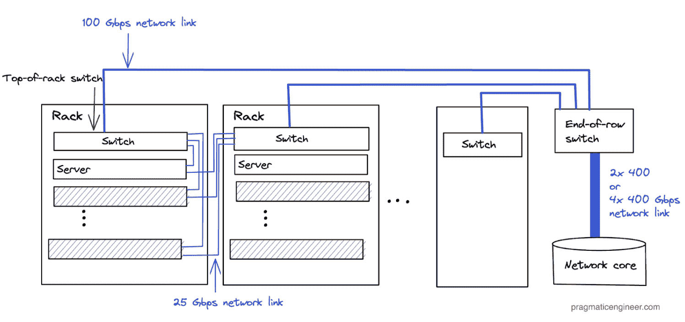

# 在 Agoda 的私有云内部 - 独家 - 实用工程师

> 原文：[`blog.pragmaticengineer.com/inside-agodas-private-cloud/`](https://blog.pragmaticengineer.com/inside-agodas-private-cloud/)

*👋 嗨，这是* [*Gergely*](https://pragmaticengineer.com/?ref=blog.pragmaticengineer.com) *每月免费发布的实用工程师通讯。每期我都会通过工程经理和高级工程师的视角来探讨大型科技公司和初创公司面临的挑战。*

*如果您不是订阅者，您可能错过了关于*[*Shopify 的分级拆分*](https://newsletter.pragmaticengineer.com/p/inside-shopifys-leveling-split?ref=blog.pragmaticengineer.com) *以及* [*其他一些内容*](https://newsletter.pragmaticengineer.com/archive?ref=blog.pragmaticengineer.com)*。订阅以获取每周两期完整的问题。许多订阅者将此通讯费用列入其学习和发展预算。如果您有这样的预算，这里是* [*您可以发送给您的经理的电子邮件*](https://docs.google.com/document/d/1BTgvFmpxNsJX6m9T6duRfZy4jD4CfcySVqoOGSe343I/edit?usp=sharing&ref=blog.pragmaticengineer.com)*。要获取每周类似这样的文章，[请在此处订阅](https://newsletter.pragmaticengineer.com/about?ref=blog.pragmaticengineer.com)。*

在之前的[两部分系列](https://newsletter.pragmaticengineer.com/p/inside-ubers-move-to-the-cloud-part?ref=blog.pragmaticengineer.com)中，我们深入探讨了 Uber 多年来[转向云端](https://newsletter.pragmaticengineer.com/p/uber-move-to-cloud?ref=blog.pragmaticengineer.com)的项目，远离自己运营的数据中心。但在决定正确平衡利用云端和在本地运营基础设施之间时，并没有“一刀切”的策略。

展示这个选择的复杂性以及科技企业处理方式的方式，本文揭示了一家大型科技公司的内部故事，该公司决定暂时不使用云端。

[Agoda](https://www.agoda.com/?ref=blog.pragmaticengineer.com)是亚洲领先的在线旅行预订平台。它由 Booking Holdings Inc 拥有，后者还拥有流行的旅行网站 Kayak 和 Booking.com。与 Uber 不同，Agoda 不使用公共云提供商，而是[决定](https://medium.com/agoda-engineering/private-cloud-and-you-736d8d99a51e?ref=blog.pragmaticengineer.com)构建自己的私有云。

为了了解更多信息，我联系了 Agoda 的 CTO [Idan Zalzberg](https://www.linkedin.com/in/idan-zalzberg-a2300013?ref=blog.pragmaticengineer.com)，他慷慨地分享了以前未公开的细节。

在今天的问题中，我们将涵盖：

1.  **Agoda 的数字。**开发人员数量、物理核心数、数据中心等等。

1.  **Agoda 私有云中的硬件**。每个机架约有 20 台 64 核计算节点，顶部交换机和大量冗余。

1.  **Agoda 的云策略和使用情况。** Agoda 的目标是在云端运营还是在云端运营？公司已经在哪些用例中利用了公共云？

1.  **云端还是自己的数据中心？** Idan 对于任何正在权衡本地与公共云的中型公司的建议。

## 1. Agoda 的数字

Agoda 列出了全球 3.6 百万家酒店和度假屋，其应用程序和网站支持 39 种语言。该公司在高峰时段每秒处理 80,000 次搜索，为了满足所有需求，需要每秒计算 10 百万个不同的“住宿费率”。有趣的是，大多数搜索并不是由度假者在空闲时间“浏览此刻”进行的 - 大多数搜索来自合作伙伴、联盟和搜索引擎！

公司在 31 个市场雇佣了约 6600 人，总部设在新加坡。大约 1600 人从事工程工作，包括软件工程师、数据科学和商业智能（BI）团队以及 DevOps 团队。大多数工程团队位于泰国曼谷。

在 1600 名技术工作者中，硬件团队人数在几十人左右，他们的工作是维护硬件并确保其在数据中心中按预期运行。这个团队不包括基础设施的软件层，这是一个软件团队，负责在 Kubernetes 上构建编排平台（Fleet）。

尽管公司在其数据组织中雇佣了大约 4-500 人，但大约 2 年来没有一个专门的“数据团队”。Agoda 摆脱了这种模式，其数据工程师嵌入到每个团队中。在数据组织中，定义了数据科学家、数据分析师和数据工程师的不同角色。在数据工程中，目前没有数据工程师和机器学习（ML）工程师之间的区分；个人承担这两种角色。*我们在* [*什么是 ML 工程？*](https://newsletter.pragmaticengineer.com/p/what-is-ml-engineering?ref=blog.pragmaticengineer.com) *中更深入地探讨 ML*

公司以 Scrum 团队的形式工作，通常包括产品经理、开发人员、数据科学家/分析师/工程师和 BI 工程师。拥有所有这些人的目标是创建一个共享的业务目的。

在基础设施方面，公司运营大约 6500 台服务器，总共约 60 万个虚拟核心（vCores）和 30 万个物理核心。公司最大的数据集群是 20-30PB（PB：1PB 等于 1000TB 或 1MGB）。十年前，这个数据集群是一个 300GB 的 Hadoop 集群；存储的数据量增加了大约 10 万倍！

公司在美国和欧洲运行 4 个数据中心，亚洲有两个。Agoda 在所有数据中心进行合作，为其机架租赁空间，最大的数据中心消耗约 1 兆瓦的电力。它使用 Spark 作为数据平台。对于事务性数据库，主要是 Microsoft SQL Server，但也包括其他数据库如 PostgreSQL、ScyllaDB 和 Couchbase。在高峰负载时，Agoda 看到每秒大约 750 万个查询作为总负载，分布在其托管的数据库即服务（DBAAS）中。公司使用 HP 服务器，VAST 硬件用于对象存储。Agoda 利用 Akamai 作为其 CDN 供应商。

## 2. Agoda 私有云中的硬件

Agoda 正在标准化其硬件 SKU（库存单位），这是一个捕捉所有重要细节的硬件的唯一代码。公司标准化 SKU 以实现供应链优化和部署便利。典型的计算节点具有：

+   64 个物理核心，启用 SMT（128 个虚拟核心）

+   512GB 内存

+   4TB 的存储

公司的目标是在购买的所有服务器上保持相似的核心/内存/磁盘比例。以下是一个常见的配置：

+   HPE ProLiant DL325 Gen10 Plus v2 服务器

+   CPU：1 个 AMD 7763 CPU（64 个物理核心）

+   内存：512GB RAM

+   存储和 4TB 的 NVMe（[非易失性内存表达](https://www.netapp.com/data-storage/nvme/what-is-nvme?ref=blog.pragmaticengineer.com)）存储。NVMe 是下一代 SSD

HPE ProLiant DL325 Gen10 Plus v2 服务器

Agoda 的机架通常支持每个 6-10 千瓦的负载，具体取决于设施的年龄。通常，大约有十几台服务器部署在一个 6 千瓦的机架上，相当于大约 1.5K 个虚拟核心，可以部署大约 20 台服务器在一个 10 千瓦的机架上，或者大约 2.5K 个虚拟核心。

Agoda 数据中心中的服务器和机架

公司需要仔细规划服务器位置，以避免热点和气流问题。每台服务器有 2 个 25Gbps 的网络接口连接到每个机架一个交换机的双交换机，并且电缆在机架对之间交叉。

顶部交换机通过多个 100 Gbps 链接连接到行末交换机，行末交换机通过 2x400 或 4x400 Gbps 链接连接到网络核心，具体取决于行的大小。根据机架密度，过度订阅比例在 1.3:1 和 2:1 之间。

在网络术语中，**过度订阅**指的是可用网络带宽少于网络理论上可以处理的总容量。例如，假设一个机架有 20 台服务器，每台服务器都有一个 25 Gbps 的网卡。要承载这些服务器的所有网络容量，您需要 500 Gbps 的带宽。然而，如果顶部交换机只有 4x100Gbps 的带宽，那么过度订阅比例为 1.25:1（500Gbps 理论峰值，与实际的 400 Gbps 相比）。

同样，如果您有 10 个每个机架带宽为 400 Gbps 的机架，您需要在机架末端交换机上有 4,000 Gbps 的带宽。然而，假设有 4 个 400Gbps 交换机，过度订阅比例为 2.5:1（4,000:1,600）。

过度订阅是网络规划的一种务实方法，考虑到成本控制。服务器很少会长时间使用其分配的最大带宽，而且很少会同时发生所有服务器在一个机架中，或者所有机架在一排中同时发生这种情况。在 Agoda 的情况下，过度订阅是在了解流量模式之后进行的，这种设置不会影响处理峰值流量负载的能力。

Agoda 数据中心内的网络设置

在 Agoda 新加坡数据中心内的一个机架。黄色的网络电缆是 25 GPS，黑色的是电源电缆

公司在数据中心使用[Arista](https://www.arista.com/?ref=blog.pragmaticengineer.com)设备。由于供应链问题，硬件更新工作有些滞后，因此相当多的机架仍在使用 10Gps 端口。预计到 2024 年所有这些端口都将升级。

**毋庸置疑，Agoda 的基础设施是冗余的。**公司几乎每样东西都有两份，并且有冗余的网络。他们通过以下方式实现数据中心之间的连接：

主数据中心之间的带宽为 40 Gbps，未来将增长到 60 Gbps。它为延迟和路由关键应用程序优化了流量路径。

**为了减少延迟，使用了 CDN**。从客户的角度来看，Agoda 利用了一个在核心地理位置具有大量本地存在的 CDN，[Akamai](https://www.akamai.com/?ref=blog.pragmaticengineer.com)。CDN 管理缓存和路径优化，从客户到 Agoda，减轻了一些远程位置常见的本地访问问题。它还利用这个分布式平台进行安全目的，丰富发送到本地欺诈检测平台的数据。

**对于其数据平台**，Agoda 构建在 Spark 之上。在底层硬件上，它使用双插槽 HP Dl385 服务器，具有：

+   2x64 核 AMD EPYC 7713 CPU

+   2 TB 的 RAM

+   15 TB 的 NVMe，用于缓存目的。

一个 HP Dl385 服务器

一个 HP Dl385 服务器

这些 HP 服务器运行时相当热，每台消耗 800-900W，因此 Agoda 每个机架只能承载 7 台左右。

**对于数据存储**，它使用运行在[VAST](https://vastdata.com/?ref=blog.pragmaticengineer.com)硬件上的[对象存储](https://en.wikipedia.org/wiki/Object_storage?ref=blog.pragmaticengineer.com)集群。在这个集群中，可以存储大约 15 PB 的原始数据和 21 PB 的逻辑数据。由于 VAST 的[数据去重](https://vastdata.com/blog/data-reduction-redux/?ref=blog.pragmaticengineer.com)，可以存储更多的数据，超过了可用的原始存储空间。

对于交易工作，Agoda 主要使用运行在为核心性能优化的物理服务器上的 Microsoft SQL Server（MSSQL）。它选择了这种设置，因为微软的许可模式有着相当高的每核成本。SQL Server 企业版的许可成本约为每核 7000 美元，因此这种方法增加了这些许可证的利用率。

## 3. Agoda 的云策略和使用

本文的其余部分是 Idan 和我的问答环节。问题以斜体形式出现。

“Agoda 没有迁移到云端是有趣的，因为它是 Booking.com 的“姐妹公司”，后者已经开始迁移到公共云。那么为什么 Agoda 没有这样做？”

“我不能代表 Booking.com 发表评论，但在某些情况下，我认为公司考虑迁移到云端是一个“重新启动”基础设施并解决现有规模/容量问题的机会。我们目前的立场是，我们在容量和性能方面非常满意和稳定，因此我们没有迫切需要对我们的做事方式进行重大改变。对我们来说，迁移到云端需要是一个机会，而不是解决问题的方案；它必须在成本、速度、质量等方面显示出好处。到目前为止，我们还没有能够证明迁移的这种价值。

“我们的策略是达到一个“云就绪”状态。” 我们既没有“是的，我们需要在云端”也没有“不，我们不会迁移到云端”的立场。我们希望达到“我们不在乎在哪里操作”的状态；这是我们的策略。我们如何实现这一点？首先，我们不使用昂贵的设置，比如 SAN（存储区域网络）。我们为我们的硬件堆栈采取了更便宜的方法。通过将所有工作负载迁移到 Kubernetes，我们可以轻松地迁移到云服务提供商，如果需要的话。

成为“云就绪”是我们从 HDFS 协议转移到 S3 的原因，也是我们通过在关键领域使用几家供应商来对冲基础设施所有权的原因。例如，我们使用 VAST 作为存储供应商，而不是自托管的 HDFS 集群。

我们离“云就绪”目标相当近了。我们每年进行几次“搬迁和转移”练习，这是我们对本地基础设施依赖的一种保护。如果发生灾难导致无法访问基础设施，我们已经准备好搬迁。

这些练习需要做很多基础工作。我们与云服务提供商合作，与他们建立光纤连接，在那里设置数据库，并进行搬迁练习。多年来，我们在设置实验方面变得更加高效。例如，最初，我们设置虚拟机在云中运行，即使不使用也必须让所有这些虚拟机运行。如今，我们使用 Kubernetes，在进行练习时启动容器。

“关于使用云来“扩展”您的运营，例如在高峰负载期间？”

“我们实际上研究了扩展负载，但事实证明这并不那么简单。我们最初的想法是仅在高峰流量或高流量时期为云端提供服务。然而，事实证明供应商并没有特别优化来保证每天有 50,000 个核心可供使用 2 小时。从他们的角度来看，这是有道理的；毕竟，其他时间他们会怎么处理所有这些核心呢？

“有一些用例我们确实使用公共云。” 一个例子是 CI/CD，这是一个较小的用例，我们可以接受比在本地运行作业更多的花费。作为回报，我们有保证的 SLA，无论有多少并行构建，构建将在多快的时间内完成。有了这些 SLA，我们的开发人员可以更快地迭代。

在大规模生产用例中，如果我们需要向云服务提供商提出大量要求，而没有明显的基准预算承诺，这在财务上是不合理的。

即使有光纤连接，从服务到数据库的连接速度也很难达到足够快。因此，如果我们想始终在云上保持数据库“热”，那将产生基线成本。这个成本是我们的 MSSQL、Couchbase、ScyllaDB 和其他实例之间的延迟，以及我们的微服务之间的延迟。

虽然我们*可以*重建我们的系统以处理来自权威数据库的更高延迟而几乎不影响用户，但集中式缓存引擎需要以某种方式在云中保持“热”。这也是为什么我们目前不会为生产服务“突发到云端”的基线成本。

**我们有处理流量峰值的方法**，而不是扩展到公共云。这些方法包括：

+   在数据中心之间转移流量。这在我们的数据中心在不同地区具有不同的高峰时间表时效果很好。

+   对于异常的峰值，我们会降级功能，而不是购买更多服务器来确保我们可以处理任何类型的峰值。

+   未来的一个想法是，在极端峰值的情况下，我们将部分负载转移到数据工程数据中心。目前，在峰值期间我们不会将负载转移到数据工程集群。

## 4\. 云端还是您自己的数据中心？

*对于规模足够小的公司，很明显，上云有很多优势。但您会给正在评估是自己运营数据中心还是上云的规模化或中型公司提出什么建议？*

**‘做出基于知识的决策。** 从无知而来的决策是糟糕的，比如“其他人都这样做，所以我们也应该这样做”，或者“我们现在的系统运行良好，我害怕尝试这种新技术。” 另一方面，基于*实际*知识和理解的决策是好决策！因此，收集知识并确保它适用于您的情况。避免[模仿](https://en.wikipedia.org/wiki/Cargo_cult?ref=blog.pragmaticengineer.com) - 当您模仿您不理解的事物时！’

### 具备在本地运营的专业知识和投资

**‘使自己处于一个不必太在意是否在云上的位置。** 最好的位置是不必关心您是在运行自己的基础设施，还是上云。将您的应用程序堆栈整理得可以在任何环境中运行。然后，您可以比锁定在本地或云端更快地进行基础设施更改。

在本地运行时要“云就绪”。即使在本地运行，也要确保您使用的技术相对容易转移到云端。例如，在本地运行我们的堆栈时所做的选择，如使用 Kubernetes 作为编排工具和 S3 协议用于数据，都是我们所做的“云就绪”选择。

**避免将您锁定的软件**。专有软件可能会将您锁定在特定提供商，使得转移变得非常困难和昂贵。

**了解每个云服务的边际。这些费用是否值得您的使用情况？** 云不仅仅是为了获取机器使用；它还包括一系列服务生态系统。

至少一些服务正在运行易于维护和运行的软件，并且没有许可成本。尽管如此，供应商仍然有动机“吓唬”您，让您相信自己无法自行管理。重要的是要与您自己的团队做出判断，并做出明智的决定。

关注所需的专业知识以及您是否能自行管理，这种恐惧营销在销售云服务中非常强烈。在某些情况下，这是有道理的。例如，美国是一个激烈的市场，那里有非常了解云服务的超级人才可以为构建这些服务的公司工作，而优秀的工程师通常更愿意在“源头”工作。但是，当您看看 Agoda 时，我们几乎是泰国唯一一家做到这一点如此深入的公司。

如果我去硅谷说服一位才华横溢的开发者来泰国为 Agoda 工作，那将是困难的。但对于这个地区的开发者来说，我们是一个闪亮的明星，做着有趣、激动人心和具有挑战性的工作，而且我们几乎是唯一一家一直致力于基础设施层的公司。在我们的地理区域，我们是独一无二的。

### 当你已经在云上时

**‘不要让团队在云中使用他们想要的任何东西**。这里的问题是，入职总是非常容易的。然而，离职可能会很困难甚至不可能！在我看来，这种锁定是云的最大风险。解决锁定的一种方法是强制组织中至少使用两个云服务提供商，并且只允许将服务接入到一个云服务提供商，如果它们可以迁移到另一个提供商。

对于添加新技术依赖要保守。除非它真的增加了你当前技术栈无法支持的新功能，否则不要添加。换句话说，除非你真的别无选择，否则不要增加技术栈的大小！

对于使用云服务依赖也是一样。我见过很多云服务被收购、突然转向或关闭的情况。当这种情况发生时，如果你对这样的服务有依赖，你就会面临一个“最后通牒”，需要找到一个新的解决方案，并且你需要从头开始搜索。这是一个非常真实的风险，值得计算。

## 要点

非常感谢[Idan](https://www.linkedin.com/in/idan-zalzberg-a2300013?ref=blog.pragmaticengineer.com)慷慨地分享了 Agoda 在运营本地和使用云的过程中的许多细节。*尽管 Idan 没有要求我提及这一点，我会补充说 Agoda* [*正在亚洲多个地点招聘*](https://careersatagoda.com/?ref=blog.pragmaticengineer.com)。

以下是从 Agoda 的旅程中学到的一些值得注意的地方，特别是与[Uber 的旅程](https://newsletter.pragmaticengineer.com/p/uber-move-to-cloud?ref=blog.pragmaticengineer.com)进行对比。

**每家企业都有独特的限制**。Agoda 在亚洲运营，劳动力成本低于美国和欧洲，但公共云成本更高。该公司已经经营了近 20 年，并且一直管理自己的基础设施。

它有硬件采购员，安装和维护机器的人员，以及构建软件基础设施层以在虚拟机上运行的人员。Agoda 雇佣了数十人来管理基础设施层，并且大约有 100 人在基础设施和 DevOps 的各个部分工作。以下是 Idan 提供的员工人数的细分：

+   维护硬件的人数在 10 到 30 人之间

+   维护 Kafka 或 RabbitMQ 等数据基础设施的 25-30 人。

+   在数据库管理领域工作的 20-30 人

+   构建和维护类似 Fleet 解决方案的团队

如果你的公司在基础设施需求和工程人员数量方面处于类似的位置，并且已经对基础设施进行了类似的投资，那么你可能也能够建立和运营自己的基础设施。如果不是，也不意味着你不能！将本文中的所有细节视为方法的示例，而不是你的公司应该严格遹循的指导。

* * *

以上是关于 Agoda 私有数据中心的两篇仅限订阅者的深度文章中讨论的大约三分之一的主题。[完整的文章系列](https://newsletter.pragmaticengineer.com/p/inside-agodas-private-cloud?ref=blog.pragmaticengineer.com)涵盖了以下额外主题：

1.  **互联网服务提供商（ISP）基础知识。** 什么是一级、二级和三级 ISP？为什么这很重要？为什么 Agoda 要连接到一级 ISP？

1.  **数据中心分级。** 数据中心的 1-4 级如何衡量，流行的云服务提供商认证为哪些级别？为什么 Agoda 要与三级或以上的数据中心共同使用？

1.  **Agoda 数据中心的演变**。从 2012 年的刀片服务器和 Windows 机器，到如今基于 Kubernetes 的内部编排器开发系统。

1.  **数据中心（DCs）和可用性区域。** 公司如何组织其两个地区，哪些服务使用主动-主动或主动-被动的 DC 设置？

1.  **私有云中的应用程序堆栈。** Fleet，Buckbeak，Agoda 的详细数据堆栈和定制开发者门户。

1.  **迁移到云端还是不迁移到云端。** Agoda 如何知道是时候远离本地服务器了。基于位置的费用是否让公司远离公共云？

1.  **雇佣软件工程师的一个意外优势**。拥有端到端的自有堆栈带来意想不到的招聘优势，吸引开发人员。

1.  **Agoda 从运营自己的 DC 中学到的经验。** 标准化的重要性，以及为什么要尽量减少技术堆栈。

[在此阅读完整文章系列](https://newsletter.pragmaticengineer.com/p/inside-agodas-private-cloud?ref=blog.pragmaticengineer.com)。

* * *

### 精选 Pragmatic Engineer 职位

*以上工作至少在[The Pragmatic Engineer Test](https://blog.pragmaticengineer.com/pragmatic-engineer-test/)中得分为 10/12。浏览更多拥有出色工程文化的高级工程师和工程领导职位，或在[The Pragmatic Engineer Job board](https://pallet.xyz/list/pragmatic-engineer/jobs)上添加您自己的职位，并申请加入[The Pragmatic Engineer Talent Collective](https://pragmatic-engineer.pallet.com/talent)。*

**想要从经过审核的科技公司获得有趣的机会吗？** 注册[The Pragmatic Engineer Talent Collective](https://pragmatic-engineer.pallet.com/talent) 并获得伟大的机会 - 与下面的机会类似，没有任何义务。您可以选择公开或匿名，我将精选公司和人员名单。

**您是否在招聘高级工程师或工程经理？** 申请加入[The Pragmatic Engineer Talent Collective](https://pragmatic-engineer.pallet.com/talent) 与世界一流的高级工程师和工程经理/总监联系。每月两次获得经过审核的投递，来自目前在大型科技公司、高增长初创公司和拥有强大工程文化的地方工作的软件工程师 - 全栈、后端、移动端、前端、数据、机器学习和经理。[在这里申请](https://pragmatic-engineer.pallet.com/talent)。
