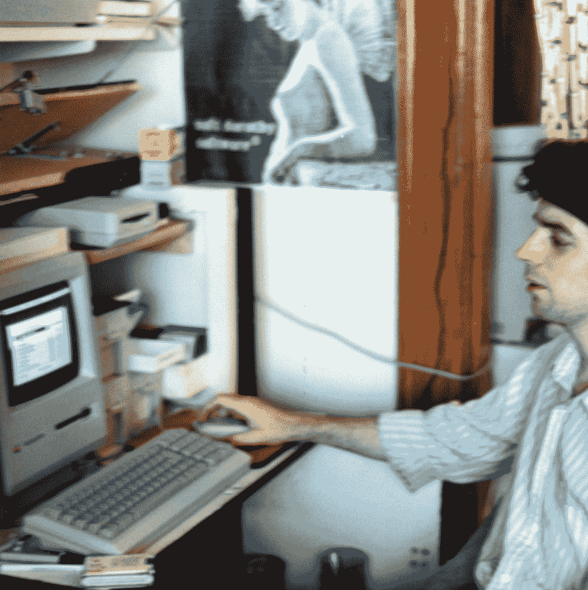
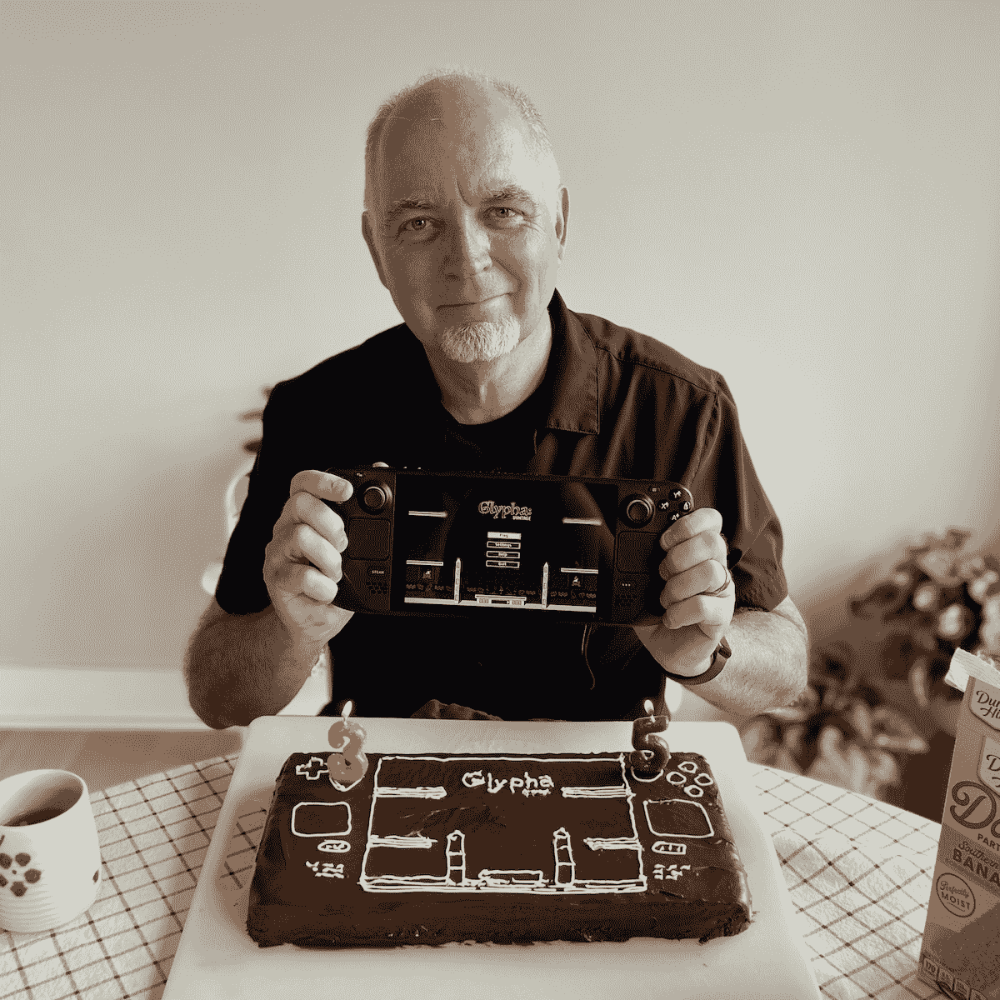

# 同一站

> 原文链接：[`www.engineersneedart.com/blog/samestop/samestop.html`](https://www.engineersneedart.com/blog/samestop/samestop.html)

# 同一站

<date>2023 年 5 月 21 日</date>

一年半前，我在苹果公司担任程序员工作了二十六年后退休了。我不确定哪种情况更令人惊讶：如果我退休后继续在业余时间编程，还是永远不再编程。

我想大多数人可能不会感到惊讶，也许会预料到后一种情况——可能会预料到我退休后会放下键盘，就像我们预料到退休的医生可能停止做手术，开始更多时间在高尔夫球场上度过一样。

事实上，退休后的那段时间，我感到一种解脱，再也不必为了弄清为什么后台线程的调度没有完成而逐行查看代码。我再也不必担心因为我在 git 上的冒险而完全搞砸项目仓库。

尽管退休后的编程休息可能只持续了大约四个月。我开始了一个[小项目](https://github.com/EngineersNeedArt/SystemSix)，部分是为了学习 Python，部分是为了玩电子墨水显示器。我又开始编程了（又开始滥用 git），但当然压力已经解除了。这既是又不是我离开的那份工作。

在大学里，不知不觉地预示着他未来三十年的生活。

我应该提一下，在苹果公司工作了二十六年之前，我最初是为了好玩而写共享软件游戏，之后几年为了生计写了一些商业游戏。由于编程最初对我来说是一种爱好，所以我最终会回到编写代码上可能就不那么令人惊讶了。

> 尽管我不确定这对软件工程师是否仍然适用。是否有年轻的工程师，刚刚开始职业生涯，对编程不仅仅是一份工作，而是他们可以想象在业余时间做的事情？我想我在结束职业生涯时遇到了一些。然而，我确实感觉到，大约在 1988 年左右，当我开始认真学习编程时，我遇到的*所有*同行程序员也都是出于一种激情在做这件事。你怎么会爱上一台机器呢？

在尝试了[用 Javascript 编写游戏](https://www.mooncraft2000.com)之后，我又回到 Python 写了一个应用程序。

但是在 2023 年，我突然发现自己陷入了某种狂热状态。尽管最终我又开始编程了，但在退休的头十四个月里，我还做了各种其他事情。我还忙于木工项目、学习 Blender 和 3D 打印的实验、骑自行车等等。但不知何故，今年我发现自己又开始全职编程。这让我明显地想起了三十五年前为 Macintosh 编写共享软件游戏时度过的无眠日子。

我不确定这是好事。我又开始在深夜编程，第二天早晨喝完咖啡和吃完英式松饼后又开始编程（幸运的是，几十年前我戒烟了）。编程又开始逐渐成为我生活中排他性的事情。（台锯慢慢生锈。自行车挂在车库墙上。）

为了完全圆满，吸引我的不是 Javascript 或 Python（或 Swift），而是我的老对手 C。此外，我有这种愿望重新审视/重写三十多年前写的一些共享软件游戏。

我想说什么？我有编程瘾吗？（也许吧。）

从这里，我可以详细介绍很多事情：在 90 年代为苹果工作与 iPhone 后为苹果工作的区别，为什么有些人把别人认为是工作（编程）当作乐趣，为什么游戏创作吸引大脑的两面。

不过此刻，我只是惊叹于跳下职业列车，却发现自己已经走了一整圈——不知怎么地下车的地方和上车的地方是同一个。也许我可以在未来谈谈其他一些事情。

> 令人发笑的是，我想起了最后一集 MST3K，迈克和机器人们最终回到地球，只是坐在电视机前观看《爬行之眼》，这是十年前他们开玩笑的第一部电影之一。

或许我只是一个回顾和浪漫化早期日子的老家伙。我又开始用 C 编程，写一些无关紧要的小游戏来取悦自己。或许那时有一些魔力。更简单的时代？

让我们明确一点，我不是在 Mac Plus 上编码，带着软盘驱动器，习惯性地每隔几分钟按下命令-S 保存我的进度——没有拨号调制解调器（哈哈，没有座机）。我像其他人一样搜索 StackOverflow，试图弄清楚为什么切换全屏模式会破坏我标记为可定位的 SDL_Textures。（对吧？）

但随着我回到 C 编程的荒野（在这里几乎没有什么*幕后发生*，我要指出——这里没有垃圾收集！），有些东西变得越来越熟悉。那么，为什么不重新编写一些熟悉的小游戏呢？

明确一点，Glypha 已经 35 岁了，不是我，哈哈。
