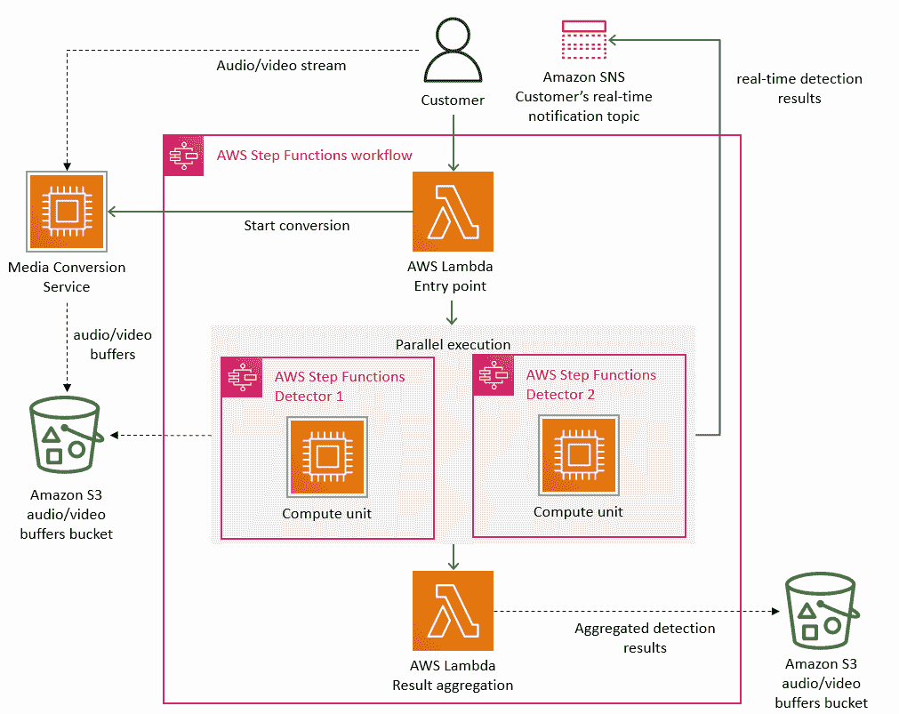
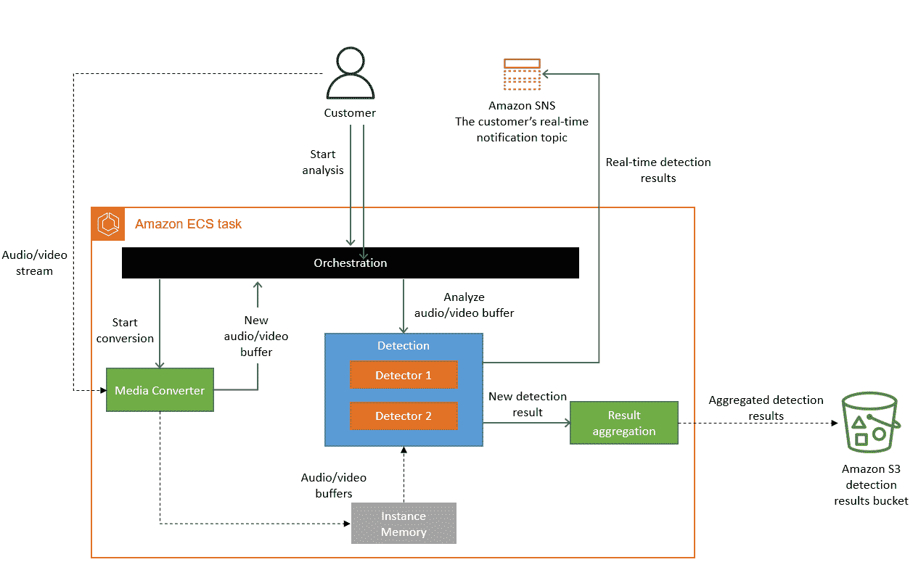
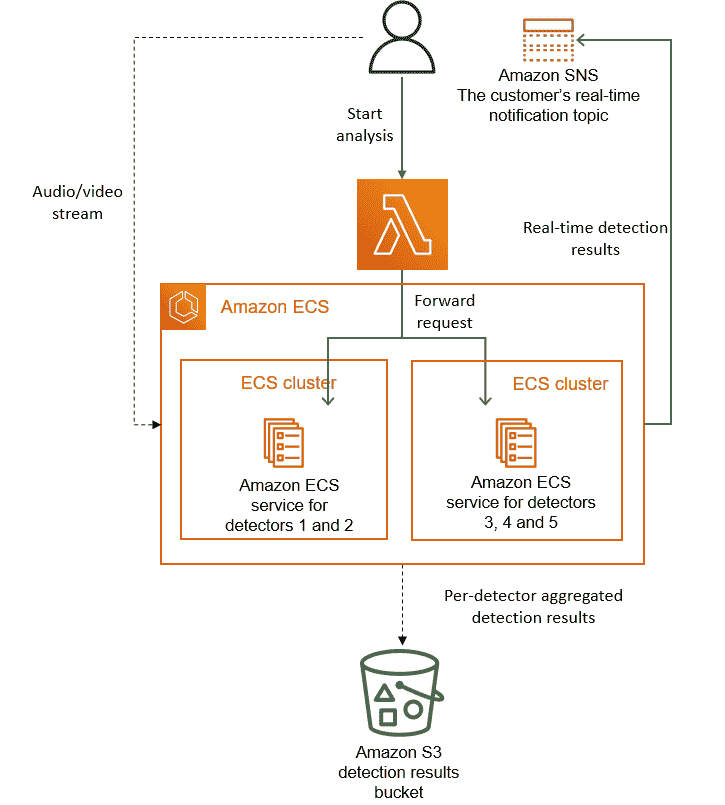

# 扩展 Prime Video 音视频监控服务并将成本降低 90% - Prime Video Tech

> 原文链接：[`www.primevideotech.com/video-streaming/scaling-up-the-prime-video-audio-video-monitoring-service-and-reducing-costs-by-90`](https://www.primevideotech.com/video-streaming/scaling-up-the-prime-video-audio-video-monitoring-service-and-reducing-costs-by-90)

在 Prime Video，我们为客户提供数千个直播流。为了确保客户无缝接收内容，Prime Video 建立了一个工具来监控客户观看的每个流。这个工具使我们能够自动识别感知质量问题（例如，块损坏或音视频同步问题）并触发修复过程。

我们在 Prime Video 的视频质量分析（VQA）团队已经拥有了一个用于音视频质量检查的工具，但我们从未打算也没有设计它以高规模运行（我们的目标是监控数千个并发流并随着时间增长这个数字）。在将更多流接入服务时，我们注意到以高规模运行基础设施非常昂贵。我们还注意到存在阻碍我们监控数千个流的扩展瓶颈。因此，我们退后一步，重新审视了现有服务的架构，专注于成本和扩展瓶颈。

我们服务的初始版本由分布式组件组成，由[AWS Step Functions](https://docs.aws.amazon.com/step-functions/latest/dg/welcome.html)编排。从成本的角度来看，最昂贵的两个操作是编排工作流和分布式组件之间的数据传输。为了解决这个问题，我们将所有组件移动到一个单一进程中，以保持数据传输在进程内存中，这也简化了编排逻辑。因为我们将所有操作编译到一个单一进程中，我们可以依赖可扩展的[Amazon Elastic Compute Cloud（Amazon EC2）](https://docs.aws.amazon.com/AWSEC2/latest/UserGuide/concepts.html)和[Amazon Elastic Container Service（Amazon ECS）](https://docs.aws.amazon.com/AmazonECS/latest/developerguide/Welcome.html)实例进行部署。

### **分布式系统开销**

我们的服务由三个主要组件组成。媒体转换器将输入音频/视频流转换为帧或解密的音频缓冲区，然后发送给检测器。缺陷检测器执行算法，实时分析帧和音频缓冲区，寻找缺陷（如视频冻结、块损坏或音视频同步问题），并在发现缺陷时发送实时通知。有关此主题的更多信息，请参阅我们的[Prime Video 如何使用机器学习确保视频质量](https://www.primevideotech.com/computer-vision/how-prime-video-uses-machine-learning-to-ensure-video-quality)文章。第三个组件提供了控制服务流程的编排。

我们将初始解决方案设计为使用无服务器组件（例如，AWS Step Functions 或[AWS Lambda](https://docs.aws.amazon.com/lambda/latest/dg/welcome.html)）的分布式系统，这对于快速构建服务是一个不错的选择。理论上，这将允许我们独立扩展每个服务组件。然而，我们使用某些组件的方式导致我们在预期负载的约 5%处达到了硬性扩展限制。此外，所有构建块的总成本太高，无法接受在大规模上采用该解决方案。

以下图显示了我们服务的无服务器架构。

<picture></picture>

**我们缺陷检测系统的初始架构。**

架构中的主要扩展瓶颈是使用 AWS Step Functions 实现的编排管理。我们的服务每秒执行多个状态转换，因此我们很快达到了账户限制。此外，AWS Step Functions 按状态转换收取用户费用。

我们发现的第二个成本问题涉及我们在不同组件之间传递视频帧（图像）的方式。为了减少计算密集型的视频转换作业，我们构建了一个微服务，将视频拆分为帧，并临时上传图像到[Amazon Simple Storage Service (Amazon S3)](https://docs.aws.amazon.com/AmazonS3/latest/userguide/Welcome.html)存储桶。缺陷检测器（每个缺陷检测器也作为单独的微服务运行）然后下载图像，并使用 AWS Lambda 并行处理。然而，对 S3 存储桶的 Tier-1 调用次数很高，成本昂贵。

### **从分布式微服务到单体应用**

为了解决瓶颈问题，我们最初考虑分别解决问题以减少成本并增加扩展能力。我们进行了实验并做出了大胆的决定：我们决定重新架构我们的基础设施。

我们意识到，在我们特定的使用情况下，分布式方法并没有带来太多好处，因此我们将所有组件打包到一个单独的进程中。这消除了作为视频帧中间存储的 S3 存储桶的需求，因为我们现在的数据传输是在内存中进行的。我们还实现了在单个实例内控制组件的编排。

以下图显示了迁移到单体架构后系统的架构。

<picture></picture>

**监控系统的更新架构，所有组件都在单个亚马逊 ECS 任务中运行。**

从概念上讲，高级架构保持不变。我们仍然拥有与初始设计中相同的组件（媒体转换、检测器或编排）。这使我们能够重用大量代码，并快速迁移到新架构。

在初始设计中，我们可以水平扩展多个检测器，因为每个检测器都作为一个单独的微服务运行（因此添加新的检测器需要创建一个新的微服务并将其插入到编排中）。然而，在我们的新方法中，检测器的数量只能垂直扩展，因为它们都在同一个实例中运行。我们的团队定期向服务添加更多检测器，我们已经超过了单个实例的容量。为了解决这个问题，我们多次克隆了服务，为每个副本使用不同的检测器子集进行参数化。我们还实现了一个轻量级的编排层来分发客户请求。

以下图表展示了我们在单个实例容量不足时部署检测器的解决方案。

<picture></picture>

**我们部署更多检测器到服务的方法。**

### **结果和收获**

微服务和无服务器组件是在高规模下工作的工具，但是否使用它们取代单体架构必须根据具体情况而定。

将我们的服务迁移到单体架构后，我们的基础设施成本降低了超过 90%。同时，我们的扩展能力也得到了提升。如今，我们能够处理成千上万个流，并且我们仍然有能力进一步扩展服务。将解决方案迁移到亚马逊 EC2 和亚马逊 ECS 还使我们能够使用[亚马逊 EC2 计算节省计划](https://aws.amazon.com/savingsplans/compute-pricing/)，这将进一步降低成本。

我们做出的一些决定并不明显，但却带来了显著的改进。例如，我们复制了一个计算密集型的媒体转换过程，并将其放置在靠近检测器的位置。虽然运行媒体转换一次并缓存其结果可能被认为是一种更便宜的选择，但我们发现这并不是一种划算的方法。

我们所做的改变使 Prime Video 能够监控所有被我们客户观看的流，而不仅仅是观众数量最多的那些。这种方法会带来更高的质量和更好的客户体验。
