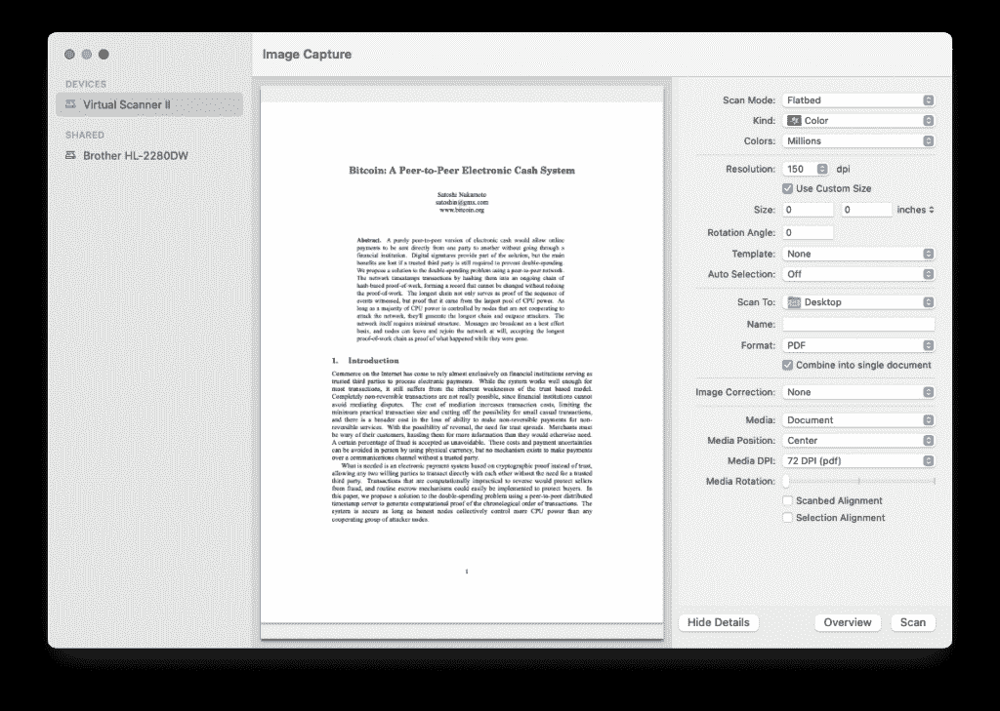

# 每个现代 macOS 副本中都隐藏了比特币白皮书 - Waxy.org

> 原文：[`waxy.org/2023/04/the-bitcoin-whitepaper-is-hidden-in-every-modern-copy-of-macos/`](https://waxy.org/2023/04/the-bitcoin-whitepaper-is-hidden-in-every-modern-copy-of-macos/)

今天在修理打印机时，我发现自 2018 年 Mojave 以来的每个 macOS 副本中似乎都附带了 Satoshi Nakamoto 的[比特币白皮书](https://bitcoin.org/bitcoin.pdf)的 PDF 副本。

我询问了十多位使用 Mac 的朋友来确认，对于每个人来说都存在。该文件在从 Mojave（10.14.0）到当前版本 Ventura（13.3）的每个 macOS 版本中都可以找到，但在 High Sierra（10.13）或更早版本中找不到。**更新：**正如[9to5Mac 确认的](https://9to5mac.com/2023/04/25/apple-removes-bitcoin-whitepaper-from-macos/)，在 macOS Ventura 13.4 beta 3 中已将其移除。

## 亲自查看

如果你使用 Mac，请打开终端并输入以下命令：

> `open /System/Library/Image\ Capture/Devices/VirtualScanner.app/Contents/Resources/simpledoc.pdf`

如果你使用 macOS 10.14 或更高版本，比特币的 PDF 应该会立即在预览中打开。

（如果你不熟悉终端，请打开 Finder，点击 Macintosh HD，然后打开 System→Library→Image Capture→Devices 文件夹。右键点击 VirtualScanner.app 并显示包内容，打开里面的 Contents→Resources 文件夹，然后打开 simpledoc.pdf。）

在 Image Capture 实用程序中，比特币白皮书被用作名为“Virtual Scanner II”的设备的示例文档，该设备可能对每个人默认隐藏或未安装。目前尚不清楚为什么对于某些人而言它是隐藏的，或者它究竟用于什么，但[Reid Beels](https://reidbeels.com/)建议它可能用于支持“从 iPhone 导入”功能。

在 Image Capture 中，如果存在“Virtual Scanner II”设备，请选择它，并在详细信息中将媒体设置为“文档”，媒体 DPI 设置为“72 DPI”。你应该能看到比特币白皮书的第一页预览。

## 但为什么

在世界上所有文档中，为什么选择比特币白皮书？苹果公司有没有秘密的比特币极客？文件名为“simpledoc.pdf”，大小仅为 184 KB。也许它只是一个方便的、轻量级的多页 PDF 用于测试目的，从未被终端用户看到。

在网上几乎找不到任何关于这个的信息。截至目前，谷歌搜索结果中只有几个关于“Virtual Driver II”或白皮书文件的参考。特别是，这是来自设计师 Joshua Dickens 在 2020 年 11 月的 Twitter 线程，他也发现了白皮书 PDF，激发了 2021 年 4 月的[这篇苹果社区帖子](https://discussions.apple.com/thread/252657375)。就是这样！

另一个奇怪之处：在用于测试照片媒体类型的资源文件夹中有一个名为 cover.jpg 的文件，这是一张 2634×3916 像素的 JPEG 照片，拍摄于旧金山湾的[金银岛](https://www.google.com/maps/@37.8252421,-122.3672424,3a,15y,182.29h,84.04t/data=!3m7!1e1!3m5!1sknhGiz09PMlvcbdaJj6Bjg!2e0!5s20110501T000000!7i13312!8i6656)。文件中没有 EXIF 元数据，但摄影师托马斯·霍克[确认了](https://twitter.com/thomashawk/status/1450961809125511168)，这是他 2008 年拍摄的[几乎相同的照片](https://www.flickr.com/photos/thomashawk/3661857599)的地点。

如果您了解更多信息——比如比特币白皮书是如何以及为什么出现在 macOS 中，或者 Virtual Scanner II 是用来做什么的——请联系我们或留下评论。（匿名性得到保证！）

**更新：** 一只小鸟告诉我，有人在将近一年前将其作为问题提交，分配给了最初放置 PDF 的工程师，而那个人至今没有采取行动或对问题发表评论。他们表示这可能会在未来版本中被移除。

**更新（4 月 26 日）：** 正如[9to5Mac 确认的](https://9to5mac.com/2023/04/25/apple-removes-bitcoin-whitepaper-from-macos/)，它在 macOS Ventura 13.4 beta 3 中被移除。
