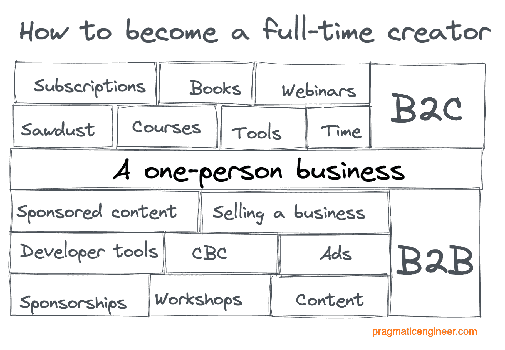

# 作为软件工程师成为全职创作者：具有争议性的建议 - The Pragmatic Engineer

> 原文链接：[`blog.pragmaticengineer.com/how-to-become-a-full-time-creator/`](https://blog.pragmaticengineer.com/how-to-become-a-full-time-creator/)

我靠写作谋生，全职。[我的通讯](https://newsletter.pragmaticengineer.com/about?ref=blog.pragmaticengineer.com)是 Substack 上排名第一的付费技术通讯。

随着远程工作在科技行业变得更加普遍，我收到越来越多的来信，询问同样的问题：他们如何做到我所做的事情？

**尽管被认为是成功的创作者，我不认为“创作者”是一个真实存在的东西** - 至少不是任何人可以或应该追求的类别。

这篇文章汇集了我关于如何成为全职创作者的想法。或者，我更愿意认为，经营一个一人独立、自助、盈利的初创公司。

## 我的背景

当我在 2020 年底离开优步担任工程经理的工作时，我故意没有安排任何事情，并决定花接下来的 6 个月写[一本书](https://www.engguidebook.com/?ref=blog.pragmaticengineer.com)，然后找到一家与平台工程相关的初创公司，很可能获得风险投资。

事情的发展出乎意料。

18 个月后，我[出版了几本书](https://blog.pragmaticengineer.com/books/)，但仍在写作[《软件工程师指南》](https://www.engguidebook.com/?ref=blog.pragmaticengineer.com)。

然而，我从未筹集资金来建立一家初创公司。相反，我加倍努力写作，于 2021 年 9 月开始我的通讯。在开始这个通讯的 4 个月后，它在 Substack 上成为了排名第一的付费技术通讯 - 这里是[这意味着什么的总结](https://newsletter.pragmaticengineer.com/p/2021-review?s=w&ref=blog.pragmaticengineer.com)。

## **我的建议颇具争议**

“创作者经济”正在蓬勃发展，有许多例子表明，人们通过拥有大量订阅者而过上看似令人羡慕的生活。他们靠自己的“名声”谋生。

拥有百万追随者并赚取六位数的[Excel 女孩](https://www.theverge.com/22807858/tiktok-influencer-microsoft-excel-instagram-decoder-podcast?ref=blog.pragmaticengineer.com)是一个这样的故事。如果你在科技行业工作，一位前谷歌和 Facebook 工程师以[TechLead](https://www.youtube.com/channel/UC4xKdmAXFh4ACyhpiQ_3qBw?ref=blog.pragmaticengineer.com)品牌经常吹嘘自己是百万富翁。TechLead 主要通过 YouTube 视频中的赞助和通过类似[出售自己的加密货币](https://www.youtube.com/watch?v=pLrRt8R9zRA&ref=blog.pragmaticengineer.com)、[误导他的追随者](https://youtu.be/pLrRt8R9zRA?t=601&ref=blog.pragmaticengineer.com)以及从中获利[数百万美元](https://youtu.be/pLrRt8R9zRA?t=712&ref=blog.pragmaticengineer.com)来维持生计。

许多人认为，拥有庞大的追随者，并以某种方式“变现”追随者是他们应该追求的目标。

我认为这些例子都很糟糕。它们在知名度和反映大多数离职者如何谋生方面都是离群值。

我的建议是有争议的，因为它与大多数创作者分享的传统建议相悖，通常仅限于建立受众或追随者。我不会触及这一点：更进一步，我会警告不要将建立受众作为你的*主要*最终目标。

而不是谈论作为创作者成功，我将谈论如何作为一个小型企业成功。

## **谋生，但不是作为雇员**

作为科技公司的雇员谋生很简单：找到工作，按照期望表现，得到报酬。晋升或换工作赚更多钱，面对更多挑战，或两者兼而有之。

当你辞去工作时会发生什么？

假设你想要像雇员一样赚取类似的金额，你有几个选择：

**1\. 成为自由职业者或承包商**。为类似公司做几乎相同的工作。你会得到更高的报酬，但必须管理自己的账目并寻找工作。合同通常是固定长度的，你需要找到下一个合同。即使在较长的合同期内，你比起雇员更容易被解雇。

**2\. 自力更生创办自己的企业并雇佣自己**。开展提供服务或销售商品的业务。作为自由职业者，有时出于税收原因会这样做，或者如果你有更多的业务而无法处理，需要雇佣其他人。对于销售商品，我们大多数人在科技领域会销售数字商品，比如构建一个 SaaS 并销售座位，销售数字教育商品如课程或书籍等。

随着企业带来利润，你可以雇佣自己，从企业利润中支付股息，或两者兼而有之。现在你真正成为自己的老板了！

**3\. 筹集资金并创办自己的企业，雇佣自己。** 如果你想要像在科技公司工作时一样赚钱，有时自力更生可能需要太长时间。

有些人会选择筹集资金，比如风险投资，以加速招聘和建立业务。你仍然掌控着，但不像自助创业那样多。在几种情况下，投资者现在有偏好，并且他们会追究你用他们投入的资金的责任。

有一件事要记住，筹集风险投资通常需要你事先做好工作并展示进展，通常是通过自助创业来完成。

**4\. 投资你的储蓄，靠收益生活。** 如果你在科技行业工作了一段时间，很可能你有一些储蓄。你可以利用这些储蓄投资股市，进行日内交易，并且 - 希望 - 获利。我认识几个全职从事日内交易的人。

购买房地产并出租是另一种方法。无论你是雇员还是自雇，投资一部分储蓄都是一个好主意。

令人惊讶的是，上述四种类别涵盖了大多数情况下你如何在不是雇员的情况下谋生。

那么为什么“创作者”在任何地方都没有列出呢？

这是因为成为一个创作者是上述类别之一，取决于你如何对待它。

## **不要想着“创作者”，而是想着“一人企业”**

成为一个创作者听起来像是一个美好的机会，可以做任何你想做的事情，吸引人们的关注，然后以某种方式从中赚钱。

“我可以做我想做的事情，以我想要的方式”这个概念与任何一人、自助创业企业完全相同。只要你不接受外部资金，你就完全掌控，并且可以决定如何赚钱。

**大多数创作者是 B2C（企业对消费者），自助创业企业**。他们通常通过销售来获得收入：

+   **拥有数字产品** 和订阅服务。例如，前 Stripe 工程师 Julia Evans 就是通过创建[Wizard Zines](https://wizardzines.com/?ref=blog.pragmaticengineer.com)这种视觉编程解释器来谋生的。2019 年，她一个月就赚了[超过 30,000 美元](https://jvns.ca/blog/2019/10/01/zine-revenue-2019/?ref=blog.pragmaticengineer.com)。

+   **小型软件产品** 可以由一个人构建。这些包括应用程序、游戏、SaaS 软件等等。例如，软件工程师 Riley Tomasek 开始构建[Standard Resume](https://standardresume.co/?ref=blog.pragmaticengineer.com)作为一个简历生成器，当他申请科技公司时使用。这是帮他在 Dropbox 找到工作的工具。几年后，这个副业增长到[每月 5,000 美元的收入](https://www.indiehackers.com/product/standard-resume/5000-mrr--MPyayx1u17zOjIa0M75?ref=blog.pragmaticengineer.com)，Riley 后来辞掉了全职工作，目前正在致力于这个产品。

+   **赞助和广告**。这是许多拥有大量观众的创作者如何将许多人的关注转化为收入的典型模式。

+   **联盟营销** - 他们从所有销售中获得一部分。

B2C 创作者经常在公开场合展示他们的工作。这样做通常会吸引未来的买家，并有助于建立他们的品牌。最早开始公开展示工作的人之一是 [Pieter Levels](https://twitter.com/levelsio?ref=blog.pragmaticengineer.com)，NomadList、RemoteOK 等网站的创始人。他目前的年收入率为 290 万美元，并[公开分享](https://twitter.com/levelsio?ref=blog.pragmaticengineer.com)他的业务 - 以及收入 - 的进展。[Tony Dinh](https://twitter.com/tdinh_me?ref=blog.pragmaticengineer.com) 也是一个分享他的业务旅程和收入路径的人，他正在构建 SaaS 工具，目前的年收入率约为 70,000 美元。

“自力更生的企业”概念有例外，尽管很少。YouTube 创作者 Marina Mogilko [接受了](https://www.vice.com/en/article/7kb9mg/a-former-facebook-vp-thinks-investing-in-humans-is-the-future-of-vc?ref=blog.pragmaticengineer.com) 一笔 170 万美元的风险投资，换取她未来 30 年创作者收入的 5%。她可能会利用这笔钱来扩大她的 YouTube 和其他服务，通过雇佣更多支持人员：就像一家企业会做的那样。她的设置更接近一家一人获得风险投资的企业。

## **你如何准备经营一家一人企业？**

与其问“我如何才能有一天成为全职创作者”，任何渴望做到这一点的人都应该问“今天我可以做些什么来准备经营一家一人企业？”

原来，即使你全职在科技公司工作，也有很多机会。

+   [**变得更注重产品**](https://blog.pragmaticengineer.com/the-product-minded-engineer/)。了解业务如何运作以及如何赚钱。你需要这种技能来决定最终要提供哪些产品。

+   [**在线销售一些东西**](https://blog.pragmaticengineer.com/want-to-start-a-startup-sell-something-online/)。可以是任何东西：电子书、课程，或者为你的博客赞助。通过这种方式，你会比阅读任何数量的书籍更多地了解成为企业家的知识。[至少我是这样做的](https://blog.pragmaticengineer.com/want-to-start-a-startup-sell-something-online/)。

+   **了解他人的做法以及他们是如何做到的**。跟随那些成功从科技行业转变为全职创作者的人。[丹尼尔·瓦萨洛](https://twitter.com/dvassallo?ref=blog.pragmaticengineer.com)因离开亚马逊而闻名，并在接下来的两年内赚取了 100 万美元，并开始进行一系列小赌注。许多[小赌注社区](https://dvassallo.gumroad.com/l/small-bets?ref=blog.pragmaticengineer.com)的人都在追随丹尼尔的脚步。[朱莉娅·埃文斯](https://twitter.com/b0rk?ref=blog.pragmaticengineer.com)靠出售小册子谋生，[乔什·W·科莫](https://twitter.com/JoshWComeau?ref=blog.pragmaticengineer.com)和[肯特·C·多兹](https://twitter.com/kentcdodds?ref=blog.pragmaticengineer.com)靠教授技术赚钱，[贾斯汀·威尔士](https://twitter.com/JustinSaaS?ref=blog.pragmaticengineer.com)正在建立一个拥有数百万收入的一人企业组合。

+   越来越多的出版物报道了一人企业和创作者经济的现实。我阅读的有[The Information 创作者经济](https://www.theinformation.com/features/creator-economy?rc=6yfluz&ref=blog.pragmaticengineer.com)和[西蒙·欧文的媒体简报](https://simonowens.substack.com/?ref=blog.pragmaticengineer.com)。阅读那些概述[创作者中产阶级的现实](https://simonowens.substack.com/p/the-gritty-reality-for-substacks?s=r&ref=blog.pragmaticengineer.com)的文章，而不仅仅是成功故事。

+   **为利基资源付费**。The Information 的[创作者经济专栏](https://www.theinformation.com/features/creator-economy?rc=6yfluz&ref=blog.pragmaticengineer.com)每月需要花费 20-40 美元。最终你可能会决定不值得为此付费。但在考虑这一点时，有一个需要学习的教训：任何只对少数人感兴趣的利基内容都需要付费，否则它不会成为一个有利可图的业务。在考虑如何让人们为你提供的内容付费时，请考虑这个教训。另一个原因是你应该在[网上销售一些东西](https://blog.pragmaticengineer.com/want-to-start-a-startup-sell-something-online/)。

+   [**成为“科技影响者”**](https://lethain.com/tech-influencer/?ref=blog.pragmaticengineer.com)。尽管“影响者”这个描述可能让人觉得标题党，但我真的很喜欢[威尔·拉森](https://lethain.com/tech-influencer/?ref=blog.pragmaticengineer.com)给出的踏实建议，他告诉你如何吸引更多人关注你的想法和工作。威尔是 Calm 的首席技术官，也是[《优雅的难题》](https://blog.pragmaticengineer.com/an-elegant-puzzle-book-review/)的作者。威尔的建议是，吸引许多人的关注是一项艰苦的工作，也是一种强大的杠杆，因为这些人期望你有有趣、有价值或有趣的事情要说。

## **理解赚钱的模式**

大多数辞职的人面临的最大挑战是：我如何能够自己赚足够的钱？好消息是，作为自己打工的人，你有很多赚钱的选择。然而，并非所有方式都容易，有些可能不适合，这取决于你开始的个人企业类型。

以下是个人企业赚钱的常见方式：

个人企业赚钱的常见方式。

**1\. B2C：面向消费者销售。** 这是一种流行的模式，因为它易于开始，并且是你在 Twitter 上看到的最常见的方法。许多企业销售以下产品：

+   **图书**。尤其是在当今有了像[亚马逊的 KDP 平台](https://kdp.amazon.com/en_US/?ref=blog.pragmaticengineer.com)这样的自助出版工具后，这变得更加容易。这就是我的朋友[Alex Xu](https://twitter.com/alexxubyte?ref=blog.pragmaticengineer.com)在全职写作一年多后，发布了亚马逊计算机科学畅销书排行榜第一的《系统设计面试第 2 卷》(The System Design Interview Volume 2)的方式。几位软件工程师在全职工作的同时，自行出版了他们写的书。Shawn Wang 在他的《编程职业手册》(The Coding Career Handbook)上发布时赚取了 25000 美元，Randall Kanna 在《杰出开发者》(The Standout Developer)上几个月内赚取了 30000 美元，Emma Bostian 在《解码技术面试流程》(Decoding the Technical Interview Process)的预售中赚取了 40000 美元。我也自行出版了[我的所有书籍](https://blog.pragmaticengineer.com/books/)。

+   **课程和网络研讨会**。像[Podia](https://www.podia.com/?ref=blog.pragmaticengineer.com)、[Gumroad](https://gumroad.com/?ref=blog.pragmaticengineer.com)、[Teachable](https://teachable.com/?ref=blog.pragmaticengineer.com)等平台使销售课程和数字商品变得简单。例如，前亚马逊软件工程师[Curtis Einsmann](https://twitter.com/curtiseinsmann?ref=blog.pragmaticengineer.com)就是这样创建了课程[精通代码审查](https://curtiseinsmann.com/?ref=blog.pragmaticengineer.com)，在两个月内赚取了 18000 美元。

+   **工具**。设计师 Traf [在 6 天内赚取了 10.1 万美元](https://tr.af/6?ref=blog.pragmaticengineer.com)，通过销售适用于 iPhone 的 [图标套装](https://icons.tr.af/?ref=blog.pragmaticengineer.com)。同行创作者 Louie Bacaj 建议工程师从这个类别开始。他说：“我真的相信现在比以往任何时候都更容易建立一些小型软件工具并赚钱。之后，你甚至可以在 [Microacquire](https://microacquire.com/?ref=blog.pragmaticengineer.com) 上出售它们。这就是我正在构建 [ThreadX](https://threadx.app/?ref=blog.pragmaticengineer.com) 的方式，这是一个在发布 Twitter 线程之前获取反馈的小应用。”

+   **订阅**。向消费者收取访问新闻简报或 SaaS 服务的重复费用。这就是我正在撰写的 [The Pragmatic Engineer Newsletter](https://newsletter.pragmaticengineer.com/about?ref=blog.pragmaticengineer.com)，拥有数千付费订阅者。这就是前软件工程师 Dru Riley 开始他的新闻简报 Trends.vc，一年后赚取了[接近 30 万美元](https://solocapitalist.co/c/how-dru-riley-of-trendsvc-built-a-sixfigure-oneperson-newsletter?ref=blog.pragmaticengineer.com)。

+   **你的时间**。提供你的时间以进行辅导、指导或建议，并以付费为交换。

+   **你的木屑**。如果你是一个在科技领域工作多年或几十年的人，你很可能只需出售你的木屑：那些已经存在于你脑海中的东西，比如你的过去经验。这就是前工程总监 Louie Bacaj 在录制一门关于[软件工程师的永恒职业建议](https://lbacaj.gumroad.com/?ref=blog.pragmaticengineer.com)课程时所做的事情。Louie 总共花了几天的时间录制这门课程，借鉴了十年的经验。这个术语的创造者是 [Daniel Vassallo](https://twitter.com/dvassallo?ref=blog.pragmaticengineer.com)，在 AWS 工作多年后，他在两周内写了一本关于[AWS 的优点](https://dvassallo.gumroad.com/l/aws-good-parts?ref=blog.pragmaticengineer.com)的书。这本书在[短短几周内就赚了超过 4 万美元](https://twitter.com/dvassallo/status/1229443309648498688?lang=en&ref=blog.pragmaticengineer.com)。

**2\. B2B：向企业销售。**虽然你会听到很多关于 B2C 策略和共享的收入数字，但在涉及 B2B 时，透明度要少得多。向企业销售意味着向更少的客户销售，但向每个客户收取更多费用。事实上，当向企业销售时，你可能能够向每个客户收取不同的费率！

向企业销售更难开始，并更难获得动力。一旦你做到了，通常就不需要太多努力来继续下去，而且 B2B 方法可能比许多 B2C 策略更有利可图。以下是一些 B2B 方法：

+   **广告**。 当你的网站或社交媒体有足够多的访问量时，你可能可以通过通用广告实现盈利。[我在一年内赚了 2300 美元](https://twitter.com/GergelyOrosz/status/1506220563248861185?ref=blog.pragmaticengineer.com)通过在这个博客上放置小广告 - 一个我在 2022 年初已经移除的广告位。

+   **内容制作。** 企业愿意支付自由撰稿人为他们制作文章和视频，并且他们倾向于为技术内容支付更高的费用。这可能从每篇几百美元到数千美元不等。查看网站[Who Pays Technical Writers](https://whopaystechnicalwriters.com/?ref=blog.pragmaticengineer.com)获取资源。

+   **赞助**。 广告的更有利可图的版本是赞助网站、视频、通讯和播客。创作者定制这些内容，并选择对消费者更相关的内容。赞助商的收入通常比放置通用广告要高得多。赞助可能从几百美元开始，甚至可能达到数百万美元。这是 Pieter Levels 如何为他的一个网站[售出了 60 万美元的赞助](https://twitter.com/levelsio/status/1505173986241437698?s=20&t=UF3v2TVNhryGDHmiYcZxSQ&ref=blog.pragmaticengineer.com)的方式。

+   **赞助文章或视频。** 当你拥有足够大的目标受众时，企业可能会开放“超级赞助”，整篇文章都围绕这个主题。这是[《Not Boring》通讯的商业模式](https://theflywheel.substack.com/p/not-boring-packy-m?s=r&ref=blog.pragmaticengineer.com)，其中涵盖了作为赞助深度挖掘的公司，每篇可能需要花费 2-5 万美元。

+   **在线课程**。 Kent C Dodds 创建了课程[Epic React](https://epicreact.dev/?ref=blog.pragmaticengineer.com)，并销售了[超过 1 万个许可证](https://portal.gitnation.org/contents/kent-c-dodds-consume-build-and-teach-and-level-up-your-career?ref=blog.pragmaticengineer.com)，创造了数百万美元的收入。我将这门课程列为 B2B，因为这是一个例子，尽管它作为 B2C 销售，但最大的客户可能是购买这些课程作为员工培训的公司。

+   **研讨会**。 为团队提供现场团体研讨会。这就是 Pat Kua 在[Tech Lead academy](https://techlead.academy/?ref=blog.pragmaticengineer.com)中所做的。

+   **基于同期的课程**。这个类别是近几年才开始兴起的。最古老和最成功的基于同期的课程之一是[Write of Passage](https://writeofpassage.school/?ref=blog.pragmaticengineer.com)，每年举办两次。尽管参加的价格高达$4,000，但这是一个很好的例子，有意定价为那些通过成为有影响力的作家可以获得远远超过$4,000 的人。我曾与参加过这门课程的人交谈过，他们对课程内容和所结识的人的网络都赞不绝口：其中许多人是当前或未来通过写作成为有影响力的人。参加这门课程的人包括同行创作者[Loue Bacaj](https://twitter.com/lbacaj?ref=blog.pragmaticengineer.com)，他分享了这门课程如何改变了他对创作者经济的看法，并最终导致他离开了大科技公司。

+   **开发者工具**。Tailwind CSS。在发布 Tailwind UI 后的五个月里，这个工具为创作者[Adam Wathan](https://adamwathan.me/?ref=blog.pragmaticengineer.com)带来了$2M 的收入。从那时起，这个原本只有一个人的企业已经发展成了一个小型企业。

+   **SaaS 产品**。有许多面向企业销售的 SaaS 服务可以作为一个或两个人的企业建立。Plausible analytics - 我在这个博客上使用的分析工具 - 通过这种方式增长到了每年$500K 的收入。

+   ******出售整个企业。******许多软件工程师设法创建了一些获得一定关注但无法产生全职收入的 SaaS 产品和工具。你可以在[Microacqquire](https://microacquire.com/?ref=blog.pragmaticengineer.com)上出售这些企业。这里有一个关于一位软件工程师如何[以超过$35K 的价格出售了他们的盈利性 SaaS 的故事](https://www.maartenbelmans.com/the-road-to-acquisition-the-story-of-table2site/?ref=blog.pragmaticengineer.com)。

**人们和企业愿意付钱的东西是什么？** 这是你需要了解的问题，如果你想以独立经营的方式谋生。人们和企业都不喜欢花钱。不过，以下是一些他们愿意花钱的类别：

+   **为了赚更多的钱**。最明显的方法。如果一个人或企业通过支付$100 可以直接或间接赚取$1,000，你会发现你的产品更容易销售。

+   **为了专业教育**。如果你能教会人们让他们在职业上更有价值的东西 - 从而使他们能够赚更多的钱，或者使他们的业务更高效运作 - 他们会为此付费。我的通讯属于这个类别。

+   **为了娱乐**。这是一个常见的原因 - 然而，由于你将与 Netflix 或 Spotify 等公司竞争，作为一个独立个体很难成功。

+   **为了教育娱乐**。虽然娱乐是一个难以打入的领域，但教育娱乐 - 即以娱乐方式呈现的教育 - 要容易得多。以有趣的方式解释概念并讲故事的课程和视频是吸引人们付费的绝佳方式。

+   **为了吸引你的观众**。如果你是一个拥有大量追随者的人，公司会有兴趣支付你，以便他们可以向这群人做广告，并最终从中赚钱。

+   **因为他们喜欢你**。是的，这也是一个因素。越多的人了解并关心你，就越有可能有一些人愿意支付，只是为了支持你的旅程。诚然，这并不是最稳定的商业模式。

许多传统的“创作者”试图仅仅靠社交媒体谋生。他们是每周发布多次视频的 YouTuber，运行赞助视频的 Instagrammer。许多这些人最终要么精疲力尽，要么因算法开始减少他们的内容展示而失去收入来源。

**对于“可持续创作者”来说，更好的模式是在一人企业的旁边创作。** 基本上，将大部分精力投入到赚钱的企业经营中，并创作一些与该企业相关的内容。

这是我的方法，例如对于[我的 YouTube 频道](https://www.youtube.com/c/mrgergelyorosz?ref=blog.pragmaticengineer.com)，我的[Twitter](https://twitter.com/gergelyorosz?ref=blog.pragmaticengineer.com)和我的[LinkedIn](https://www.linkedin.com/in/gergelyorosz/?ref=blog.pragmaticengineer.com)。我在有时间的时候发布视频或内容。我试图保持其有用性，并经常从我的主要工作 - 我的通讯 - 中获取内容并在这些渠道上分享。

我并不是唯一一个遵循这种方法的人。[Hacker News 上的一位评论者](https://news.ycombinator.com/item?id=30837318&ref=blog.pragmaticengineer.com)与我分享了他们的观察，即拥有多达 50 万 YouTube 订阅者的摄影师也在做同样的事情：

> *"最近，我又开始重新关注 Youtube，但更加专注于几种不同的爱好；木工/制作和摄影。你描述的情况也被一些人所反映，即，他们并不真的试图仅仅靠 Youtube 过活。相反，Youtube 对他们来说更像是一个营销渠道，带来辅助广告收入。
> 
> 基本上，他们听起来很像你，因为他们都在经营一家小型企业，通常不是纯粹的客户工作。但我认为他们中没有人把 Youtube 视为他们收入的基础；它更多地只是另一个营销渠道。
> 
> 例如[肖恩·塔克，摄影](https://www.youtube.com/watch?v=dI02c5DnRUg&ref=blog.pragmaticengineer.com)和[林肯街木工](https://www.youtube.com/watch?v=fDxs5Y13rlk&ref=blog.pragmaticengineer.com)。
> 
> 我怀疑最好的概括是“1000 真实粉丝”的方法，他们只是试图使用不同的媒体来联系那些真实的粉丝。并围绕这种互动建立一个企业，并尽可能地将其他一切货币化。

虽然许多有抱负的创作者梦想拥有数百万粉丝的观众，但我建议看看这些更踏实的例子。建立一个能够产生收入的企业，并将创作者工具和社交媒体作为帮助营销这个企业的工具，而不是作为手段。

## **尝试多种收入流**

建立自己的企业的好处是你可以进行实验，拥有多个收入来源，并随着时间决定更加关注哪些。

如果你刚开始，尽量早点开始收入流，而不是晚点。赚到第一笔不是来自工资的钱会改变你对金钱、商业、价值以及它们之间联系的理解。

在上述模式中，我利用了广告、联盟、赞助、B2C 图书销售以及 B2C 和 B2B 订阅或与教育相关的销售。请注意，我已经退出了广告和联盟。这是我在广告上[赚了多少钱](https://blog.pragmaticengineer.com/ads/)，以及在联盟上[赚了多少钱](https://blog.pragmaticengineer.com/affiliates/)。

创作具有广泛影响力的内容的人通常从广告、赞助和联盟作为他们的收入来源开始。那些从更具体的领域开始的人往往从订阅、赞助、课程或书籍作为收入来源开始。

在大多数情况下，你不会知道哪种方法更好，直到你尝试过。书籍是一个有趣的领域，因为它们听起来并不是非常有利可图，而且制作起来需要很多工作。然而，由于它们需要做很多工作，对于特定主题的优秀技术书籍来说，与视频、文章甚至课程相比，竞争更少。

## 将你的单人企业经营得像一个正规企业

如果你把自己看作一个单人企业，这里有多少人在工作？一个人，对吧？

错误。

高利润的单人企业与多人合作，这样中间的人 - 你！- 可以最大程度地利用他们的时间。这意味着投资于人员和工具，以更有效地利用你的时间。

**购买能提高你工作效率的工具。** 在我的情况下，这意味着支付[Grammarly](https://grammarly.com/?ref=blog.pragmaticengineer.com)、[Canva](https://www.canva.com/?ref=blog.pragmaticengineer.com)或我的笔记工具（[Craft](https://www.craft.do/?ref=blog.pragmaticengineer.com)）。我购买了一些设备，比如降噪耳机，帮助我在写作时集中注意力，购买了家里的人体工程学桌子，还租了一个办公室，我通常在那里更有效地完成工作。

**为非核心竞争力的事情聘请专家。** 我的核心竞争力是与人交往，研究软件工程中有趣的主题，并撰写相关内容。我可以做的事情，但我不太擅长的包括编辑我的写作，编辑视频和整理税务记录。因此，我雇用了承包商来帮助我处理这些任务。

我相信与承包商合作是一种合作关系，并相应地投资于这些关系。最好的承包商通常有太多的客户，最终会放弃那些不尊重他们的客户，或者不是盈利性的客户。我希望不成为被放弃的客户。尊重承包商，帮助他们在你能帮助的地方，可以走得更远。

决定是否要超越独立经营的企业。前 MD [Ali Abdaal](https://www.youtube.com/channel/UCoOae5nYA7VqaXzerajD0lg?ref=blog.pragmaticengineer.com) 从一个独立经营的企业开始。如今，他雇用了近 20 人经营 Part-Time YouTube Academy，发布课程和播客。2021 年，他的企业创造了[$4.8M 的收入](https://www.youtube.com/watch?v=Toz7XEsSH_o&ref=blog.pragmaticengineer.com)。

阿里是极其透明的创作者之一，这可能令人惊讶。例如，他录制了一部关于[如何开始 YouTube 频道并将其发展成专业业务的深度指南](https://www.youtube.com/watch?v=XpopyNZKYKw&ref=blog.pragmaticengineer.com)。

然而，从成功企业的角度来看，阿里的策略是完全合理的。他经营着一个 B2C 业务，其中大部分收入来自三个来源：

+   人们购买他面向 YouTube 创作者的基于课程的课程

+   人们购买他在 Skillshare 上的课程

+   赞助

作为一家 B2C 企业，对他的数字透明化作为一种营销渠道，吸引了那些渴望像阿里一样取得成功的人。这些视频既是他课程的销售漏斗，也是由于庞大的观众群体而有机会进行赞助广告。

关于阿里值得注意的是，他早早就决定他将经营一个盈利的企业，但不是一个独立经营的企业，并相应地雇用了员工。并非所有创作者都是独立经营的企业。事实上，最成功的创作者在幕后有大型团队与他们合作：只是大多数人没有像阿里那样透明。

## **做好冒险的准备**

你可以进行所有的研究，但如果你从不跨出一步，你永远不会知道自己是否能成为一个独立经营的企业。有一些有助于此的事情包括：

+   **储备一笔积蓄。** 在科技行业工作时储蓄，这样你就有一个财务垫来做一些冒险的事情。

+   **开展副业项目以更多地了解自己。** 我一直这样做，多年来建立了[数十个副业项目](https://twitter.com/GergelyOrosz/status/1504183533371285507?s=20&t=doJXqwakREVyTe0QIadyJQ&ref=blog.pragmaticengineer.com)。

+   **考虑在一旁进行小赌注**。前亚马逊工程师丹尼尔·瓦萨洛是小赌注策略的先驱，他提供了一门课程。我认识的几位工程师[参加了这门课程](https://dvassallo.gumroad.com/l/small-bets?ref=blog.pragmaticengineer.com)，并开始采用他们自己的小赌注方法。

+   **建立不公平的优势**。作为一个独立经营的个体，你必须在提供类似服务的众多企业中脱颖而出 - 提供建议、教育、娱乐等。在你全职工作的同时，你能否开始构建将成为你不公平优势的事物？前 Gatsby 工程师乔希·科莫在推出他的 CSS 课程之前就在他的博客上发表了文章，这使他在推出时赚取了[$500K](https://www.indiehackers.com/post/launched-my-first-course-earned-over-us-500-000-ama-4382405cd5?ref=blog.pragmaticengineer.com)。在取得博客成功的基础上，我在推出[我的新闻简报](https://newsletter.pragmaticengineer.com/about?ref=blog.pragmaticengineer.com)之前写了这篇博客 6 年。

**考虑一人经营业务的替代方案**。不要将自己局限于认为你*需要*开始一人经营业务的想法。为其他、甚至更好的机会敞开大门。

## **没有一条被打破的道路**

离开公司世界后我最大的惊喜是在作为一个独立经营的个体成功方面几乎没有一条被打破的道路。

在优步工作时，我的职业选择很明确。作为个人贡献者晋升到首席工程师级别，或者转向管理者道路，有朝一日成为总监、副总裁工程或首席技术官。

作为一个独立经营的个体，这样的职业道路并不存在。

由你来定义成功的样子。而且不仅可以打破常规：最成功的创作者一直在做这件事。

复制他人成功的策略是一种方法，但我发现通过尝试新想法并在感觉良好时加倍努力取得更多成功。

**当你为自己工作时，没有规则，这既令人恐惧，也是一个巨大的机会。** 在为公司工作多年后，这意味着你需要放下旧习惯，拥抱新习惯。

如果你迈出这一步，要知道一切都会改变。因此，你也会改变。

## 你很少听到失败的故事

有很多成功故事来自那些看起来成功的“创作者”。我认识很多人拥有正确的“虚荣”指标，但缺乏有意义的业务支持。即使在被认为是成功的“创作者”中，只有其中的一小部分拥有可持续的业务。

然后，还有那些你很少听说的人：那些尝试建立独立经营的个体，但最终失败了。

我遇到过一位软件工程师，在一家金融科技初创公司做了 6 年的第一名员工后，决定成为“独立开发者”。在将近一年的时间里，他从零开始建立了几家企业。然而，没有一家成功起飞。一年后，他回到了他离开的同一家金融科技初创公司工作，并告诉我，虽然他很高兴尝试了独立业务，但他意识到现实并不像他想象的那么光鲜。

**“成功故事”的连续流可以误导人们对于建立可持续业务的难易程度。** 一个异常诚实的反思来自于 [Hacker News 上的一篇帖子](https://news.ycombinator.com/item?id=34103896&p=2&ref=blog.pragmaticengineer.com)，一位软件工程师写道：

> “我写这篇帖子是因为我受够了。我再也无法继续了。在三次尝试建立成功创业公司失败后，并花费时间接受治疗，我放弃了我的创业梦想。（...）
> 
> 但让我沮丧的不仅仅是缺乏成功。还有 Twitter 上不断涌现的数字游牧者，他们向像我这样的独立企业家销售极度扭曲、美好且常常虚假的梦想。他们让建立成功的创业公司看起来很容易，任何人只要有正确的心态和一些关键提示就能做到。但现实并不那么简单。这是非常困难的，不仅仅需要积极的态度。
> 
> 对所有独立开发者、黑客新闻和 Reddit 读者，请不要被数字游牧者的虚假承诺所愚弄。创业是一项艰苦的工作，需要时间。

对于这篇帖子的回应中，最好的建议之一是 [这个](https://news.ycombinator.com/item?id=34104278&ref=blog.pragmaticengineer.com)：

> “经过几种选择 -- 创业、工作、内部创业和咨询，我的建议是：
> 
> - 创业不是一种生活方式。除非你有一个好主意并准备执行。
> 
> - 在公司内部尝试你的想法。在公司内部启动新产品比在外部更容易。它没有 10 亿美元的上限，但在各个方面都有足够的上限（不仅仅是财务上的 -- 学习、信誉等）。
> 
> - 如果这不行，只有在你相当有信心成功时才去外部。
> 
> 我的经验是，创业并不是那么困难或需要运气，而是需要大量的基础工作：
> 
> - 你需要多样化的技能。管理。财务。销售。技术。法律。市场研究。等等。这不是专家的地方，需要时间来培养这些技能。你也应该喜欢（或至少不讨厌）其中大部分。
> 
> - 你需要良好的市场时机，这需要经验。
> 
> - 你需要一个有吸引力的好主意。这就是夜晚/周末的用武之地。夜晚/周末不足以为一个成功的创业公司提供足够的时间，但足够进行早期原型设计。
> 
> 作为学生做（失败的）创业是一个很好的学习经验。我希望我做过。我不希望我做过三次，或者作为一个成年人。
> 
> 售卖虚假梦想是成功企业家的一部分。如果人们认为你濒临破产，你将得不到任何客户。

**即使一个企业起飞，也可能需要几年的时间。** 前谷歌工程师[迈克尔·林奇](https://mtlynch.io/?ref=blog.pragmaticengineer.com)的故事突显了建立可持续业务的挑战。2018 年，迈克尔在连续 4 次未获晋升后辞去谷歌工作，开始为自己工作。自那时起，他每年都分享一次年度回顾，分享他的财务结果（这是他可以支付自己工资的金额）：

+   [第一年](https://mtlynch.io/solo-developer-year-1/?ref=blog.pragmaticengineer.com): -$20,000 (收入$2,200)

+   [第二年](https://mtlynch.io/solo-developer-year-2/?ref=blog.pragmaticengineer.com): -$2,400 (收入$7,200)

+   [第三年](https://mtlynch.io/solo-developer-year-3/?ref=blog.pragmaticengineer.com): -$3,900 (收入$63,000)

+   [第四年](https://mtlynch.io/solo-developer-year-4/?ref=blog.pragmaticengineer.com): +$14,500 (收入$479,000)

+   [第五年](https://mtlynch.io/solo-developer-year-5/?ref=blog.pragmaticengineer.com): +$6,000 (收入$807,000)

迈克尔花了 4 年时间，推出了半打项目，才找到了一个起飞的产品 - 硬件项目[TinyPilot](https://tinypilotkvm.com/?ref=blog.pragmaticengineer.com)。在前 3 年，迈克尔无法支付自己的工资：到了第 4-5 年，这种趋势似乎有所改变（尽管他仍然没有支付自己）。

创业有着非常真实的机会成本。对于迈克尔来说，他放弃了在像谷歌这样的地方工作所能赚取的多年工资（和股权！），去寻找产品市场契合度和建立一人企业的不确定性。与此同时，他获得了作为雇员很难获得的经验类型：但他需要提前资助这种经验。

人们很少像迈克尔一样透明地展示他们的业务增长情况 - 尽管我怀疑大多数一人企业更类似于他正在建立的模式。

**每个人的道路都是独一无二的：做符合*你*情况的事情。** 对成功故事要有背景和合理的怀疑，要知道，建立一个一人企业是发现市场机会、执行、过去经验和很多运气的结合。那些向你推销“证明有效”的创业方法的人通常经营着一个出售建议的业务 - 这本身可能是一个足够好的业务，但并不是每个客户都会得到他们认为付费得到的成功。

这些是我所做的观察，最后*不*提供建议。您了解自己的情况，周围的机会和风险：您是最适合决定是否值得追求商业创意、在业余时间尝试，还是最好让其暂时休息。

*感谢* [*Loue Bacaj*](https://twitter.com/LBacaj?ref=blog.pragmaticengineer.com) *审阅本文并提供反馈。Louie 辞去了他在大型科技公司的工程总监职位，开始了他的创作者之旅，他经常* [*发推文*](https://twitter.com/LBacaj?ref=blog.pragmaticengineer.com)*。我非常喜欢他的* [*永恒职业建议课程*](https://lbacaj.gumroad.com/?ref=blog.pragmaticengineer.com) *，这是针对软件工程师和工程经理的未经过滤的建议。*

* * *

### 精选务实工程师职位

*上述职位至少在[务实工程师测试](https://blog.pragmaticengineer.com/pragmatic-engineer-test/)中得分至少 10/12。浏览更多拥有出色工程文化的高级工程师和工程领导职位，或在[务实工程师职位板](https://pallet.xyz/list/pragmatic-engineer/jobs)上添加您自己的职位，并申请加入[务实工程师人才集合](https://pragmatic-engineer.pallet.com/talent)。*

**想要从经过审核的科技公司获得有趣的机会吗？** 注册加入[务实工程师人才集合](https://pragmatic-engineer.pallet.com/talent)，获取优质机会 - 与下面类似的机会，没有任何义务。您可以选择公开或匿名，我将精心筛选公司和人员名单。

**你正在招聘高级工程师或工程经理吗？** 申请加入[务实工程师人才集合](https://pragmatic-engineer.pallet.com/talent)，与世界一流的高级工程师和工程经理/总监联系。每月两次获取经过审核的信息，来自目前在大型科技公司、高增长初创企业和拥有强大工程文化的地方工作的软件工程师 - 全栈、后端、移动端、前端、数据、机器学习 - 以及经理。[在这里申请](https://pragmatic-engineer.pallet.com/talent)。
