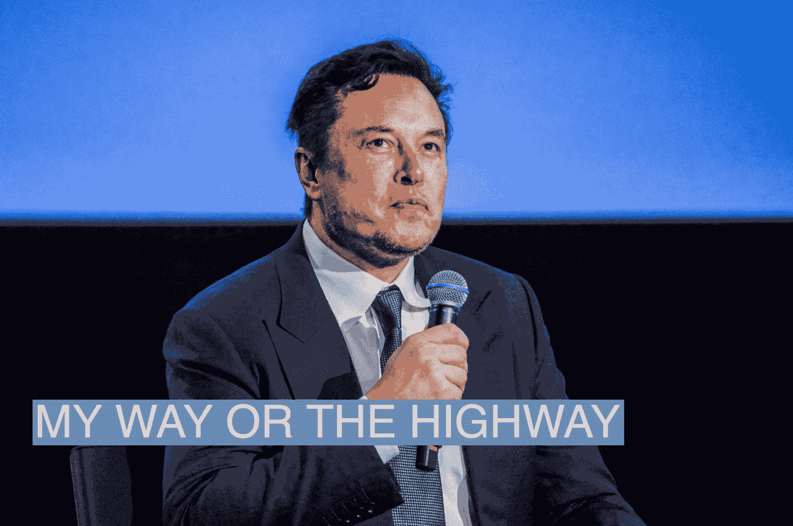

# Elon Musk、Sam Altman 和 OpenAI 的秘密历史 | Semafor

> 原文链接：[`www.semafor.com/article/03/24/2023/the-secret-history-of-elon-musk-sam-altman-and-openai`](https://www.semafor.com/article/03/24/2023/the-secret-history-of-elon-musk-sam-altman-and-openai)

但是在 2018 年，没有理由认为冲动的马斯克或古怪安静的阿尔特曼会成为硅谷叙事的核心，即使他们已经是其中最知名的名字之一。马斯克本人也有其他烦恼。特斯拉正在[努力](https://www.businessinsider.com/why-tesla-is-struggling-to-make-model-3-2017-10)实现 Model 3 轿车的生产目标，股价[下跌](https://www.cnbc.com/2017/11/01/tesla-q3-2017-earnings.html)，威胁着公司的未来。

OpenAI 联合创始人、当时的首席技术官格雷格·布罗克曼也反对马斯克的接管，其他 OpenAI 的人也是如此。据知情人士透露，一场权力斗争随之而来。

阿尔特曼，还经营着强大的初创企业加速器 YCombinator。根据税务文件，他在 2018 年将总裁职务加入到自己的头衔中，除了担任董事。

马斯克随后从 OpenAI 的董事会辞职。公开来说，他和 OpenAI 表示他离开的原因是利益冲突。特斯拉正在开发自己的人工智能用于自动驾驶，将与 OpenAI 竞争人才。

这种竞争确实存在一些真实性。特斯拉已经挖走了 OpenAI 最优秀的头脑之一安德烈·卡帕西，他成为了特斯拉自动驾驶项目的架构师。

但是在 OpenAI，很少有人相信马斯克是因为那个原因离开的，他在离职时在 OpenAI 办公室发表的演讲主要集中在潜在的利益冲突上，并没有得到大多数员工的好评，他们并不完全相信这个故事。

一份 OpenAI 的[公告](https://openai.com/blog/openai-supporters)称，马斯克将继续资助该组织，但据知情人士透露，马斯克并没有这样做。他曾承诺在几年内捐赠大约 10 亿美元（他已经捐赠了 1 亿美元），但据知情人士透露，他在离职后停止了捐款。这让这家非营利组织无法支付在超级计算机上训练 AI 模型所需的[巨额](https://openai.com/research/ai-and-compute)费用。

路透社/NTB/卡琳娜·约翰森

那年秋天，OpenAI 的一些人更加明显地意识到，成为一家尖端人工智能公司的成本将会上升。Google Brain 的“[transformer](https://www.youtube.com/watch?v=9P_VAMyb-7k)”打开了一个新的领域，人工智能可以不断改进。但这意味着要为其提供无限的数据来训练它 —— 这是一项昂贵的事业。

OpenAI 做出了一个重大决定，转向这些 transformer 模型。

2019 年 3 月 11 日，OpenAI 宣布正在创建一个[盈利](https://futurism.com/ai-elon-musk-openai-profit)实体，以便筹集足够的资金来支付追求最雄心勃勃的人工智能模型所需的计算能力。公司当时写道：“我们希望增加筹集资本的能力，同时仍然服务于我们的使命，我们所知道的任何现有法律结构都没有找到合适的平衡点。” OpenAI 表示，它正在为投资者设定利润上限，任何超额利润都将归原非营利组织所有。

阿尔特曼还做出了一项对于科技老板来说不寻常的决定：根据知情人士的说法，他不会在这家新的盈利实体中持有任何股权。阿尔特曼已经非常富有，投资了几家极其成功的科技初创公司，不需要这笔钱。《信息》首次[报道](https://www.theinformation.com/articles/microsoft-openai-inside-techs-hottest-romance?utm_source=ti_app&rc=nocdws)了这笔股权交易。

他还相信公司需要成为一家企业才能继续其工作，但他告诉人们，这个项目并不是为了赚钱。放弃任何所有权利将有助于他与最初的使命保持一致。但这个决定实际上让一些潜在的 OpenAI 投资者感到失望，他们担心阿尔特曼没有看到该项目的上升空间。

不到六个月后，OpenAI 从微软那里获得了[10 亿美元](https://techcrunch.com/2019/07/22/microsoft-invests-1-billion-in-openai-in-new-multiyear-partnership/)，微软不仅提供资金，还提供基础设施专业知识。他们一起建立了一个超级计算机来训练庞大的模型，最终创造了 ChatGPT 和图像生成器 DALL-E。最新的语言模型 GPT-4 有 1 万亿个参数。

当 ChatGPT 在 11 月[推出](https://www.theguardian.com/technology/2022/dec/05/what-is-ai-chatbot-phenomenon-chatgpt-and-could-it-replace-humans)时，OpenAI 立即成为最炙手可热的新科技初创公司，迫使谷歌匆忙跟进。据知情人士称，马斯克感到愤怒。

在 ChatGPT 推出一个月后的 12 月，马斯克[取消了](https://twitter.com/elonmusk/status/1599291104687374338?s=20)OpenAI 对 Twitter“火管道”的数据访问 —— 这是在马斯克收购 Twitter 之前签署的合同。

2 月 17 日，他 [发推文](https://twitter.com/elonmusk/status/1626516035863212034?s=20)，“OpenAI 最初是作为一个开源（这就是为什么我将其命名为“Open” AI）的非营利公司，旨在成为谷歌的对抗力量，但现在它已经变成了一个闭源、追求最大利润的公司，实际上被微软控制。”

3 月 15 日，他 [发推文](https://twitter.com/elonmusk/status/1636047019893481474?s=20)，“我仍然困惑于我捐赠了约 100 百万美元的非营利组织如何变成了一个市值 300 亿美元的盈利公司。如果这是合法的，为什么不是每个人都这样做呢？”

OpenAI 拒绝置评。Musk 没有回应评论请求，但在上周五，他发推文说“我相信一切都会好起来”，并附上了 [一张 Elmo 的表情包](https://twitter.com/elonmusk/status/1639200036578885632?s=20)，上面写着：“我意识到 AI，人类创造的最强大工具，现在掌握在一个残酷的企业垄断手中。”

上周四，《The Information》报道称，OpenAI 董事会成员 Shivon Zilis 辞职了。Zilis 是 Musk 的双胞胎的母亲，但没有回应评论请求。
