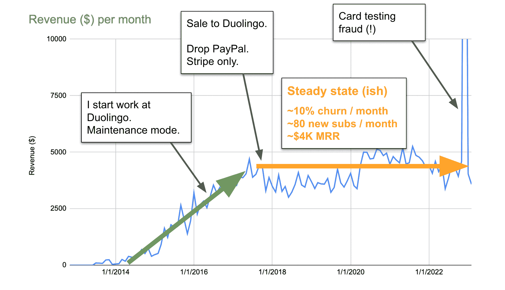
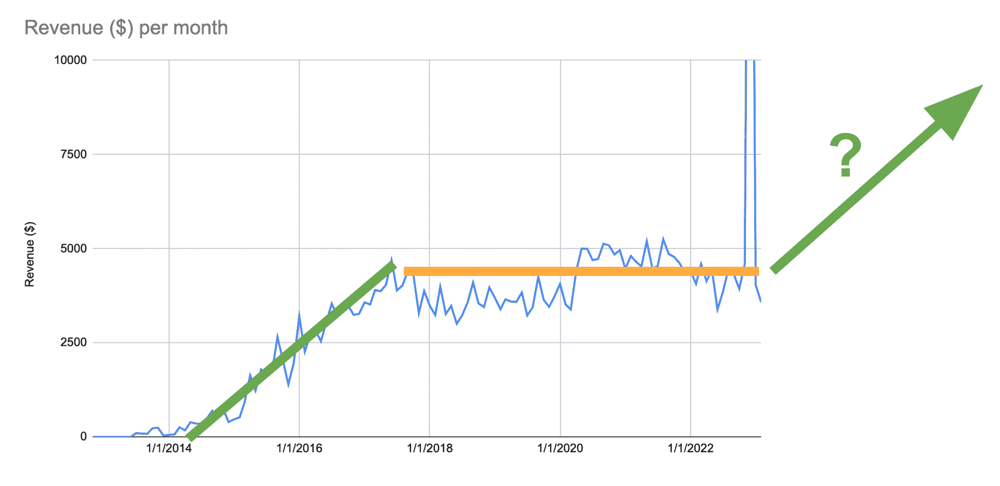

# 我买回了我的被收购初创公司

> 原文：[`steveridout.com/2023/03/23/buy-back.html`](https://steveridout.com/2023/03/23/buy-back.html)

2023 年 3 月 23 日

我曾经在[2014](https://steveridout.com/2014/03/22/readlang-my-bootstrapped-language-learning-web-app.html)年写过关于我的语言学习初创公司[Readlang](https://readlang.com)的文章，然后又在[2016](https://steveridout.com/2016/01/04/readlang-3-years-as-a-one-man-startup.html)年写过，两次都在 Hacker News 上引起了关注，我的一个艰难的单人初创公司的故事似乎引起了共鸣。现在已经过去 7 年了，期间发生了很多事情，所以是时候更新一下了…

## 人才收购

我的 Readlang 故事引起了 Duolingo 的注意，于是我在 2016 年去那里工作了。第一次在哥斯达黎加一个豪华度假胜地与他们见面对我这个过着节俭生活的自给自足者来说是一次文化冲击。另一位工程师说：“你会习惯的”，结果证明他说对了一半。那是一次美妙而超现实的经历。

在我加入 Duolingo 之前，我们曾讨论过潜在的 Readlang 出售。但他们更希望我为其他项目工作。这听起来像是一次人才收购，让我感到不舒服。所以我们同意我会在那里工作一段时间，同时继续保留 Readlang。我在那里的头 9 个月里致力于一个[注定失败的聊天机器人](https://techcrunch.com/2016/10/06/duolingos-chatbots-help-you-learn-a-new-language/)（结果证明为时过早[如今看来](https://blog.duolingo.com/duolingo-max/)）。之后，我决定我还有未竟的事业，于是发邮件说我要离开重新开始做 Readlang。他们很快回复我说我可以全权负责开发一个全新的关于听力的产品。我已经在这个领域有了一些想法，而且这个机会太棒了，无法拒绝。拿钱来开发一个我负责的全新原型？当然愿意！

我的想法是推出一个 MVP，然后离开，再次致力于 Readlang。几个月内，我们推出了 Duolingo Stories 的第一个版本，内部和外部的反响都非常积极。以至于我现在非常兴奋地继续发展它。看起来我们找到了一些东西。鉴于 Stories 有点类似于 Readlang，我觉得在一边经营 Readlang 有点奇怪，所以我再次提出了出售的选项，要么全力以赴 Duolingo，要么离开 Readlang。我想最终我要么在 Duolingo 内部工作 Readlang，要么 Stories 甚至可能发展成为 Readlang 的替代品。所以我们达成了交易。我们将网站迁移到他们的基础设施上，客户的付款转到了 Duolingo 的 Stripe 账户，而不是我的。除此之外，Readlang 没有太多变化。Stories 在增长，但从未成为 Readlang 的替代品。我偶尔会考虑将 Readlang 作为一个要专注的项目，但我无法说服自己它会在 Duolingo 的规模上产生影响，因此它被忽视了。

## 回购

在 2021 年底，[我离开了 Duolingo](https://steveridout.com/2022/04/05/back-to-bootstrapping-a-new-web-app.html)，也离开了 Readlang。我留下了如何维护 Readlang 的说明，但我想总有一天会出问题，他们很可能会想要关闭它。我说如果真的到了那个地步，请与我联系。

我在 2022 年大部分时间都在半心半意地做一些其他项目（[JigglePix](https://jigglepix.com/)，[Flashdown](https://github.com/SteveRidout/flashdown)，[Notepad Calculator](https://notepadcalculator.com/)），直到 12 月份我收到了 3 封来自陌生人的电子邮件，抱怨 Readlang 扣款问题，他们对此毫无头绪。收到 3 封邮件到我的个人邮箱是非常奇怪的。我询问了 Duolingo，他们确认出了问题。原来人们在利用 Readlang 进行[信用卡测试欺诈](https://stripe.com/docs/disputes/prevention/card-testing)。在我帮助他们解决问题并退款后，他们问我是否想要 Readlang 回来以及愿意支付多少。我当然说是！

## Readlang 现在怎么样了？

令人惊讶的还好！如果 7 年前有人问我如果我放弃 Readlang 并将其保持维护模式这么长时间会发生什么，我本来会打赌它会衰退，但实际上，它基本上保持稳定。这里是一个月收入图表：

最初几年显示出良好的增长。在这段时间里，我不断添加新功能，写博客介绍它，它主要是在热情的用户在不同的线上和线下社区分享的情况下有机地传播开来。在 2016 年初将其置于维护模式后，直到出售给 Duolingo，它仍在持续增长。在这一点上，我们为了简化而放弃了 PayPal，导致了一次下降，但之后收入奇迹般地保持稳定。每个月大约有 10%的用户流失，但新用户的供应从未枯竭。人们继续推荐 Readlang，甚至在 2018 年出现在蒂姆·费里斯的“五弹星期五”通讯中！2020 年有一个明显的增长，很可能是由于大流行封锁所推动的。

这就是软件的美妙之处 - 前期工作可以持续多年为您带来价值！

现在我把它拿回来了，我在想如何让它做到这一点…

我有想法。当然，有更多的想法，但时间不够实现它们。最近，我尝试添加由 ChatGPT 提供支持的[智能定义](https://blog.readlang.com/2023/03/23/smart-definitions.html)。但我认为最重要的是改进连续学习机制，让人们更投入每天回来 - 我提到过我在 Duolingo 工作吗？:-) 如果我成功改善增长，那么我甚至可能考虑重新投资利润，并找人帮忙。我并不是永远致力于这种独自创业的方式！

无论如何，我期待着再次改进 Readlang。有我的宝贝回来真是太有趣了！

## 更新
