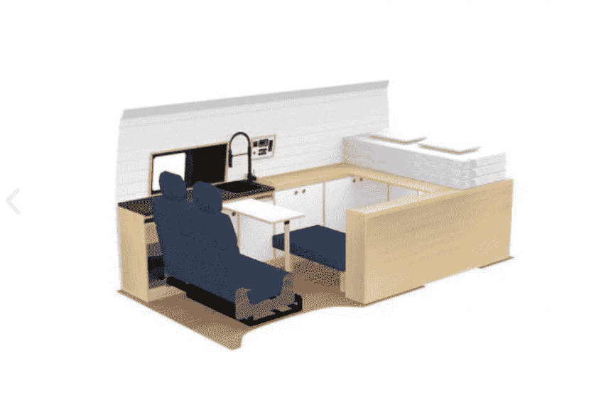
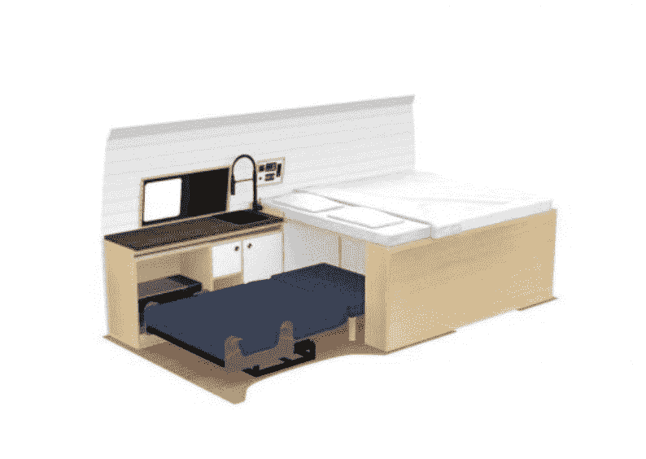
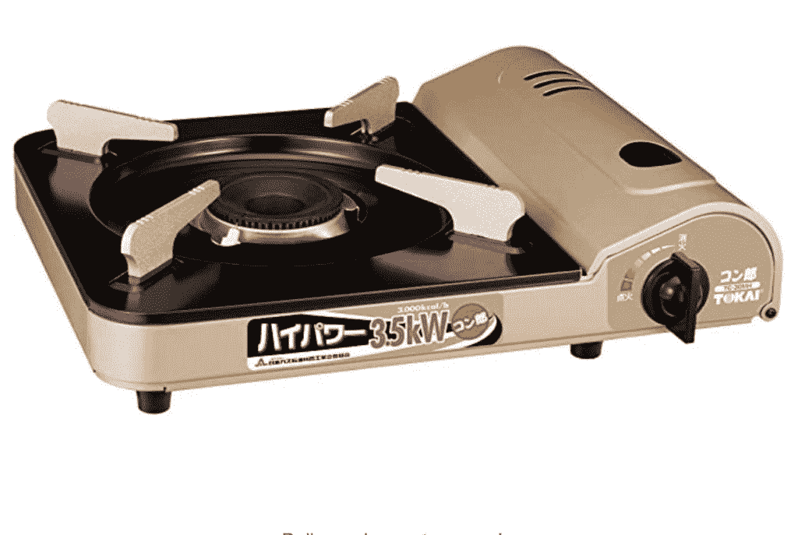
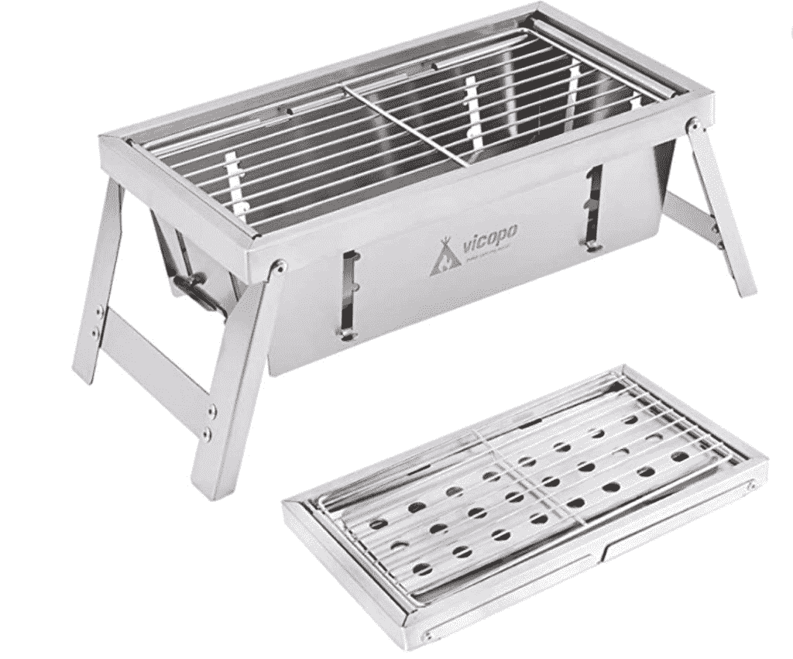
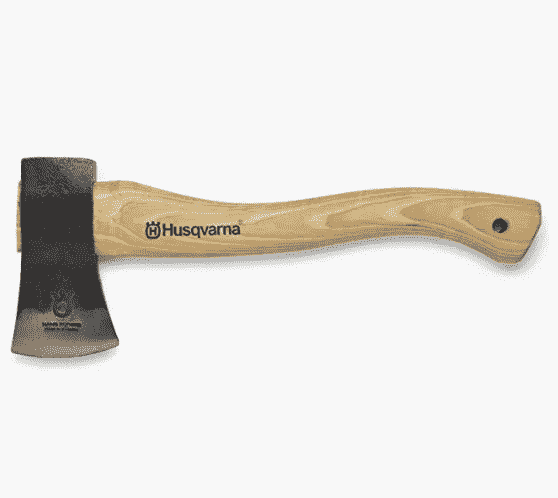
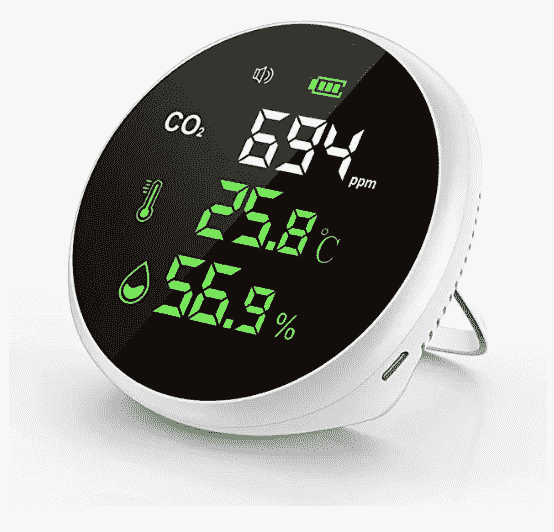
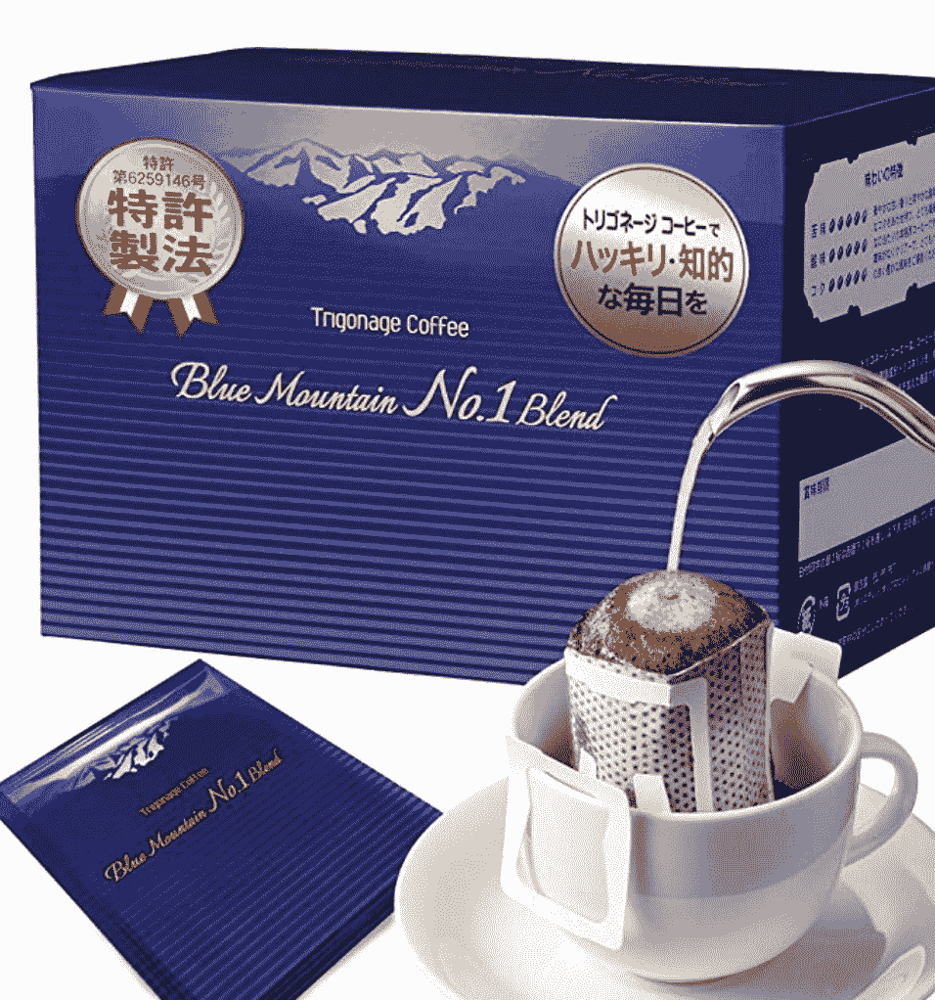
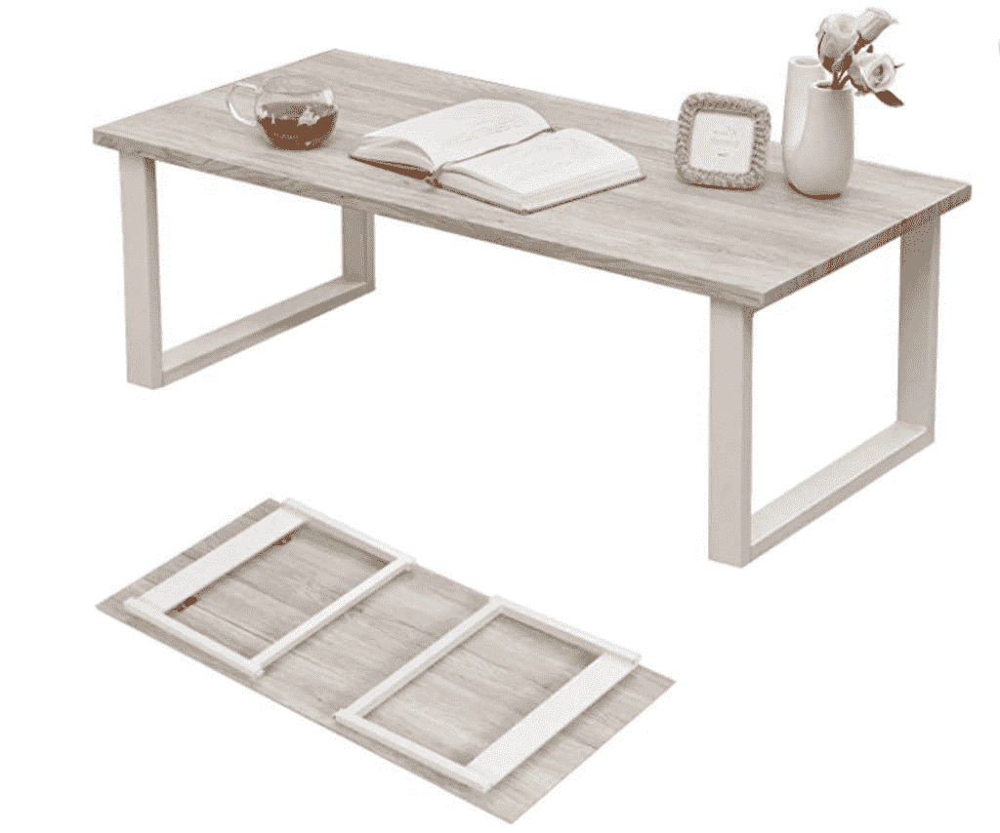
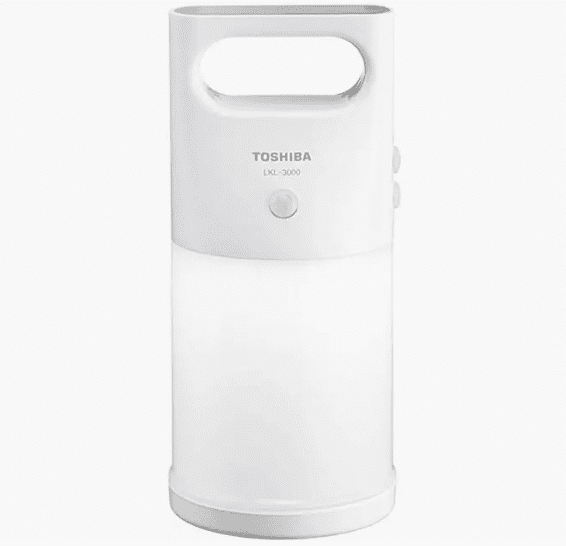
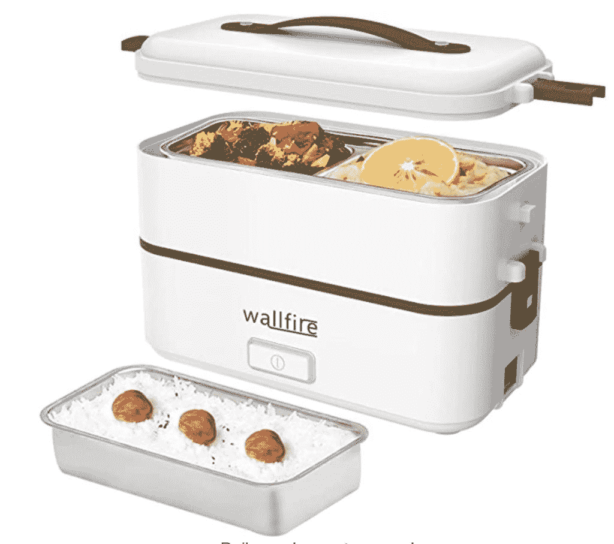

# 日本露营生活指南 - KumaZen

> 原文链接：[`kumazen.com/a-guide-for-van-life-in-japan/`](https://kumazen.com/a-guide-for-van-life-in-japan/)

已经过去了 9 个月和 10,000 公里，我们在日本各地的小房车中生活。我们是一个欧洲/日本混血夫妇，有一个一岁半的孩子。由于很多人对我们的经历感到好奇，我将尽力涵盖你在开始在日本过露营生活或租用房车游览该国之前想知道的一切。

**TLDR**：日本可能是世界上最适合露营生活的国家之一！

✅ 安全

✅ 免费停车和干净的厕所

✅ 多样的自然景观

✅ 美食+便宜餐厅

❌ 垃圾

❌ 露营地可能昂贵且规定严格

* * *

## 你是如何开始在货车里生活的？

我一直热爱旅行、探索和露营。在欧洲度过了第一个冠状病毒年之后，我们决定回到日本（一个欧洲/日本混血夫妇，有一个一岁半的孩子）。我们已经在东京地区生活了几年，但想要体验在乡村生活。由于我们不知道去哪里，我们认为买一辆货车，到处走走，直到找到我们的天堂是解决方案。我一直梦想着这个想法，但是...

这是一个艰难的选择：和一个小孩一起搬进货车，需要前期投资，改变我们的生活方式...

但如果我必须再做一次选择，我肯定会选择这样做！

这绝对不适合每个人！有时候会非常累，但每天在大自然中醒来并发现新地方的魔力是无价的。

## 你使用的是哪种货车？

我们是一辆由[DreamDrive 制造的 Kuma Q](https://www.dreamdrive.life/kuma-sales/)的幸运车主。它基于丰田海狮超长版，我们非常喜欢它。这辆货车配有一张全尺寸床，一个厨房和大量存储空间。与美国/欧洲的货车相比，生活空间相当小，但对我们来说足够居住和存放物品。它还采用木材制成，使用天然油漆，这对我们全职与小孩一起生活非常重要。

我们在床下增加了一些临时存储空间，用于存放衣服/食物和孩子的玩具，这里是一些当它装满时的照片：

晚上我们将婴儿座椅移到前排副驾驶座，并将后排座椅放平。我们在小露营桌上用餐时将其用作榻榻米区域。

想了解日本通常使用的露营车和房车，可以查看[富士露营](https://www.campnofuji.jp/search/search.php?view=1&body=9&sort=publish2&shop=&shopname=&maker=&name=&priceL=0&priceH=0&mission=&nenshikiL=0&nenshikiH=0&color=&oil=&motor=&keyword=&exhaustL=0&exhaustH=0)。

## 你去哪里旅行？

我们主要沿着海岸线和穿越山脉旅行，总是避开大城市。日本提供了丰富多样的自然风光，小村庄保留着独特的氛围，有着小商店和餐馆随时为您取暖。即使我们倾向于不在同一地点连续睡觉两次，但我们旅行缓慢，有时间工作和步行探索，发现小细节。

我们最喜欢的县是宫崎、大分、山口和岛根。不幸的是，我们还没有时间去探索北部。

## 你在哪里睡觉？

我们通常根据所在地和最佳选择在 3 种不同类型的地方过夜：

##### 免费公共停车场（70%）

大多数夜晚我们都在免费的公共停车场过夜，这些停车场通常设有厕所。它们通常位于公园、海滩、河流和旅游景点附近。我们经常发现自己是唯一在那里过夜的人。我们通常在日落前停车，早餐后离开，使用时不会在车里安排任何事情。

##### 露营地（20%）

在日本有很多接受房车和房车的露营地。我们只在找到有很好自然空间的露营地时使用。我们通常避开周末，连续几天放松身心，设置户外桌椅、篷布，并在烧烤架上烧烤。

在日本露营可能会很昂贵，但也是处理垃圾和补充/清空水的好机会。

##### 道之驿（10%）

道之驿（Michi no Eki）是日本各处都能找到的路边站。在乡村地区，它们通常被视为连接当地人和旅行者的中心，一些商店提供当地产品和餐厅。有些甚至有公共浴池（温泉）。尽管它们经常提供很多舒适设施，但在周末可能会变得非常拥挤和嘈杂。很多卡车司机或年轻人在睡觉/看手机时整晚都开着引擎。有一次我们在周六晚上醒来时发现是车辆聚会，而我们睡觉时它是空的..

* * *

当我们发现好的优惠或天气连续几天恶劣时，我们毫不犹豫地住在通过 booking.com 找到的旅馆。这也是放松和享用为您准备的食物的好方法。

当访问大城市如大阪、京都时：我们会住在通过 booking.com/Airbnb 找到的短期租赁公寓/房屋。

这里有一些有关睡觉地点的好资源链接：

## 🚽 厕所？

我们的货车没有厕所，考虑到处理垃圾的困难，我不建议在旅行时使用自己的厕所。日本有很多免费的公共厕所。它们通常非常干净，可以在公共停车场、道之驿或便利店找到。在大自然中睡觉时，我们有时会在外面小便。

在半夜，一个空水瓶/成人尿布有时可能会很有用，避免穿上衣服/鞋子在寒冷的天气中离开货车。

[日本的厕所很棒，你可以在这里查看一些我发现的最好的](https://kumazen.com/?p=13)。

## 🚮 垃圾？

日本有很多垃圾分类规定，有时处理垃圾可能会很困难。我们建议一点点地处理垃圾，一旦遇到垃圾就立即处理。有些棘手的情况，比如婴儿尿布很臭，日本食品通常包装在很多塑料中。一些县/城市有严格的政策，很难找到合法丢弃物品的地方。便利店也有垃圾箱可供使用，但请记住，它们只用于存放店内产品。

在收费高速公路服务区总是有垃圾箱。有时我们发现自己有时只是为了清空袋子而走高速公路..

## 🚰 水？

找到干净的水相当容易。我们有一个 23 升的干净水储备，主要用于洗碗。你经常可以在海滩、公园或公共厕所建筑后找到水龙头。购买使用水龙头的钥匙可能会很有趣，因为它们经常被拆除（这样做可能会惹麻烦..）：

如果找不到免费水源，露营地总是有的。

我们喝水和烹饪时使用从超市/药店购买的瓶装水。（大型超市的水比便利店便宜得多）。

我们的污水箱也是 23 升，我们大多数时候都把它倒入雨水排水口。水中只含有微小的食物/生态洗洁精。

## 🔌 电力？

我们的面包车有两块 100AH 锂电池和一个太阳能电池板。由于我们经常驾驶，而且日本是一个阳光充足的国家，到目前为止我们从未遇到过充电问题。我们最大的能源消耗是一个小电饭锅和笔记本电脑。

## 🛁 洗澡？

与厕所一样，我们的面包车里也没有淋浴设施。我们有一个外部淋浴，只在海滩洗澡后使用。日本有很多温泉和公共浴池。有时你也可以作为日间访客参观旅馆的浴池，或在偏远的自然环境中找到温泉.. 这是一个列出一些[位于完全自然环境中的混合温泉，通常是免费的](https://www.food-travel.jp/)的日语网站。

我们通常不每天都洗澡，而是倾听身体的需求。在冬天比夏天更容易保持清洁，夏天可能会非常炎热潮湿。

如果很难找到公共浴池，你总是可以选择去漫画咖啡馆。它们在日本随处可见，即使在小城市也有，而且 24 小时营业，通常有淋浴设施。（对于家庭来说，氛围可能有点诡异，因为通常只有男性在那里阅读书籍，安静地浏览互联网..）

## 👘 洗衣服？

我们使用投币式洗衣店，一次洗涤和烘干所有衣物，然后过一会再回来取。我们有两套床单，对于自己穿的衣服也相当简约。

## 🍛 食物？

我们经常不吃早餐，只享受一杯咖啡。滴滤袋非常方便使用，因为我们只需烧开水，拿出一杯即可。这些一次性咖啡套装对露营非常方便。

午餐时，我们经常在餐馆吃饭。日本餐馆经常提供价格便宜的套餐，里面有各种不同的食材。它们通常比你自己购买所有食材要便宜，而且你可以放松身心，发现来自不同县的新食物..

晚上我们总是在面包车里做饭。在日本，与世界其他地方相比，日落时间相当早，所以我们享受漫长的晚上与家人一起放松、做饭和吃饭。我们主要使用一个平底锅、一个 Staub 锅、一个小电饭锅和一个便携式燃气炉。

一个节省烹饪时间的有用提示是切很多蔬菜，然后将它们与不同的肉类/香料一起放在冰箱里的几个 Ziplocs 中。这样可以减少烹饪时间和存储空间，因为每种肉类/鱼类总是包装在很多塑料袋中。然后你可以通过在平底锅中烹饪 Ziplock 中的内容并与一些米饭混合来连续几顿饭。

## 👮 安全？

在安全方面，我们从未遇到任何问题，与欧洲相比，我敢在车里放笔记本电脑和相机。在普通停车场睡觉时，我认为保持低调很重要，这样人们就不会打扰你，你也不会惹恼任何人。

在日本，安全在自然方面需要特别注意。请记住，地震和暴雨可能非常危险，当你到达一个新地点时，你应该始终知道如何安全撤离，或者在恶劣条件下不要呆在车内。

在一些地区，也很重要要注意野生动物：日本有很多熊、猴子、蛇和昆虫，你应该留心。

## ☀️ 气候？

大部分日本最适合在九月至十一月和三月至七月访问。夏天可能会非常炎热，除非你去阿尔卑斯山区或北海道（北部），冬天可能会非常寒冷，特别是在一月/二月。在那些夏季月份，我们回到欧洲旅行，并计划在年初（一月/二月）在一些炎热的地方逗留。

在你的房车里安装一个取暖器（比如 Webasto），可以让你在一月到三月享受温暖，而在其余时间保持良好通风（MaxFan）也很重要。

如安全部分所述：监控台风等天气事件至关重要，因为它们对人和物品都可能构成危险。

## 👶 和孩子一起生活？

在搬进我们的房车之前，我认为这将是我们经历失败的唯一原因。但孩子们在适应任何环境方面表现得很出色！

在如此狭小的空间里生活三口之家是一个挑战，但也有很多好处。当一个正在学步的孩子开始探索事物，触摸一切，试验时，而你只想安心睡觉或安全驾驶时，这是一个挑战。但在家里也是一样的... 能够让我们的孩子探索大自然，每天早晨在海滩上散步，对我们来说是一份惊人的礼物。

在如此狭小的空间里三口之家在一起是具有挑战性的，但有助于我们更加紧密地联系在一起。

## 💻 工作？

我是一名远程软件工程师。幸运的是，我热爱我的工作，我是自己的老板，所以我可以根据我们的节奏调整我的工作量。我喜欢在美好的地方/天气中工作很多；在早晨女孩们还在睡觉时，以及当我们安顿下来时。如果你不能完全安排你的工作时间表以适应你的需求，我真的不建议与家人一起住在房车里。

## 🚗 开车？

在日本开车非常顺畅。人们比欧洲人更不具侵略性，几乎到处都有英文指示，而且谷歌地图运作良好！你可以通过汽车访问许多偏远地区，通常可以开车/停车在海滩上。

我们在日常生活中很少使用高速公路，因为我们喜欢花时间，但你绝对应该有一张 ETC 卡，可以在不停车的情况下支付过路费：有些入口/出口只接受 ETC 支付。

一辆货车/房车在一些狭窄的乡村道路/城镇中驾驶可能会很具挑战性。重要的是要时刻保持冷静，不要感到压力，这样你就能安全到达任何地方。

在乡村使用 Google 地图时：如果你犯了错误，最好直接掉头，因为导航经常会通过让你经过狭窄/危险的道路来纠正你的错误。

## 🏕️ 最喜欢的露营地/停车场？

## ⛽ 加油？

我们的货车使用柴油，平均油耗为 10.5 公里/升，续航里程为 580 公里，考虑到动力、尺寸和重量，这并不算太糟糕。我们从未在偏远地区找不到柴油。

## 🛒 必备装备？

这里是我们每天使用并推荐购买的一些东西：

便携式煤气炉

便携式烧烤炉

为了砍柴

CO2 探测器

一次性滴滤咖啡

小折叠桌，可用于床上

便携式 USB 灯

便携式电饭锅

## [🌊](https://emojipedia.org/water-wave/) 冲浪？

我们从迪卡侬带了两个充气冲浪板。一个冲浪 SUP 和一个 7'6 普通板。虽然感觉与普通冲浪板不同，但它们非常方便携带，无需把它们放在车顶上。

日本沿海提供各种各样的浪，我很幸运地在[宫崎](https://kumazen.com/surfing-in-hyuga-miyazaki/)、鹿儿岛、大分、岛根、三重、和歌山、神奈川、鸟取等县冲浪。

## 🔑 租赁？

如果你想在日本度过几周的时间或想体验独特的周末，我们的货车制造公司：[Dream Drive 提供从东京出发的配备货车的租赁服务](https://www.dreamdrive.life/booking/)，并为讲英语的客户提供良好的支持。

## 🎎 日本的房车生活受欢迎吗？

实际上在日本有很多人使用房车和货车露营。传统露营在年轻人中非常受欢迎。房车用户大多是退休人员，主要可以在日本各地的道之驿遇到。随着冠状病毒的传播，这种旅行方式变得更加流行，因为人们试图避免与他人接触，对于养狗的人也很受欢迎，因为很少有酒店允许携带动物。

在周末和国定假日，很难在热门停车场和露营地找到空间。

## 🎥 在 Youtube 上发现？

有一些在 Youtube 上展示这个过程的不错的内容创作者。我可以推荐一些：

## 📝 文书工作？

如果你在日本生活，你需要注册一个地址。日本独特的一点是，你需要拥有或租用一个停车位才能购买车辆。在我们的情况下，我们很幸运能够在一些家庭地址注册我们的地址和车辆。

你还需要为你的车辆购买保险，我们使用的是[Tokio Nishido Marine](https://www.tokiomarine-nichido.co.jp/en/)，他们也提供英文支持。

🕊️自由？

日本可能是世界上最适合搭建房车生活的国家之一。这是因为你可以完全自由地选择睡觉的地方，而不必担心安全问题。这种自由是有代价的，需要时刻尊重周围环境。日本文化有很多规则，作为外国人（来自不同国家甚至日本不同地区的人），重要的是不要打扰他人，保持事物比你发现时更干净，提供微笑或一个谦恭的鞠躬...

* * *

你正在日本的路上生活，想聊天吗？[随时联系我](https://kumazen.com/contact-me/)。如果你有其他问题我还没有回答的，欢迎在评论中告诉我。

### *相关*
