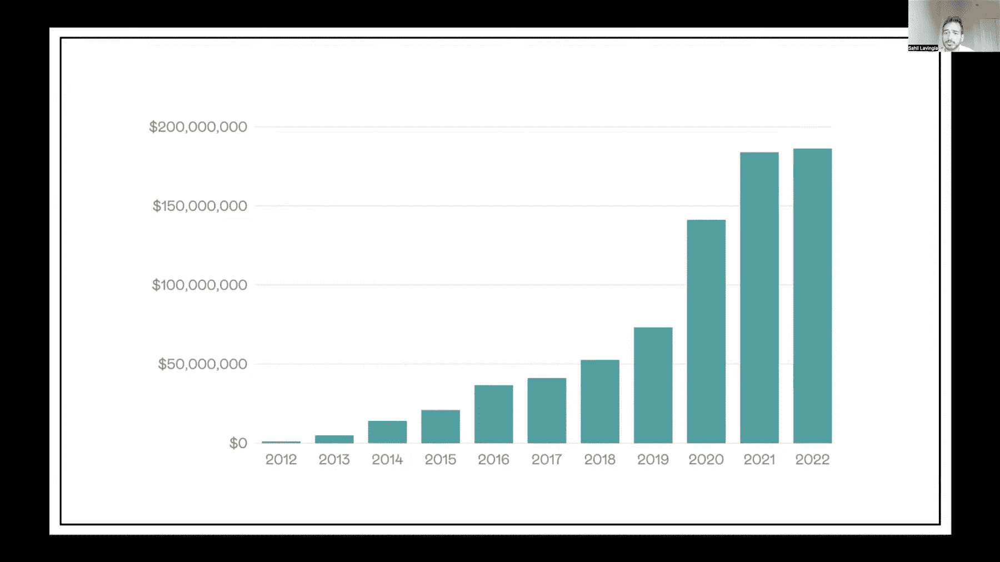

# 作为一个开放的初创公司的黄金时代已经过去

> 原文链接：[`testimonial.to/resources/the-golden-era-of-being-an-open-startup-is-gone`](https://testimonial.to/resources/the-golden-era-of-being-an-open-startup-is-gone)

<main class="notion light-mode notion-page notion-block-99073ed56706462b944ad156c4049f6a selection:!bg-primary-500 selection:!text-primary-50 !text-lg !p-0 [--select-color-0:rgb(var(--primary-500))] prose-a:text-primary-500 prose-blockquote:!border-l-primary-500 prose-li:marker:text-primary-500">

我曾经对开放初创运动所推广的内容和它给初创公司和独立制作者生态系统带来的惊人感觉着迷。

对于那些可能不熟悉的人来说，成为一个开放的初创公司意味着在经营业务时要做一个开放的书。

近年来，“创业者”们向互联网分享了他们的业务统计数据、目标、指标等。

使用 Twitter 和专门的“开放页面”展示的透明度培养了支持、学习和启发的环境。

我想提到的一些先驱是 Buffer、Ghost 和 NomadList。

我认为 Buffer 是第一批宣扬和实践开放初创公司理念的公司之一。

Buffer 是一家以透明度和开放沟通而闻名的公司。这家提供社交媒体管理工具的公司自 2010 年创立以来一直是“开放初创公司”理念的倡导者。开放初创公司的理念是基于这样一个想法：公司应该在运营中对客户和公众透明开放。这包括分享财务信息、产品路线图和其他内部细节，甚至包括他们的薪资。

他们在他们的

[透明度页面](https://buffer.com/transparent-metrics)

. 他们是先驱！他们为其他公司树立了高标准，激励其他公司更加开放和透明地运营。

Ghost.org 是通过 Kickstarter 活动于 2013 年开始的。

正如他们在评论中所说

[这篇 2015 年的博客文章](https://ghost.org/changelog/2014-report/)

，“我们从 Buffer 的朋友那里学到了很多东西，我们将在很多方面效仿他们。” 他们也确实这样做了。

以上是第一部分

[他们的开放页面。](https://ghost.org/open/)

但他们并没有止步于指标。他们决定实施令人惊叹的工作福利和实践，并为员工提供最好的，保持为非营利基金会“以便始终忠于其用户，而不是股东或投资者”。

我相信，就像他们从 Buffer 那里学到东西一样，很多新的采用者也从 Ghost 那里获得了灵感。

另一个早期采用者对 Ghost 和 Buffer 表示感谢

[在这条推文中。](https://twitter.com/levelsio/status/968219339588493312)

NomadList 的创始人 Pieter Levels 一直愿意通过公开建设来实现增长。

他对业务增长的社交方式以及对开放创业运动的采纳创造了一种传播这种透明做生意方式的协同效应，就像一种病毒一样传播开来。

由于早期采用者和先驱者众多，我无法一一列举，但我相信我们认识他们并感谢他们，因为他们在其黄金时代与我们分享了这种心态。

这些是一些最近采用开放创业哲学的很酷的例子，我不想漏掉：

通过

[开放手册](https://handbook.cal.com/)

以及对薪资的全面披露，Cal.com 树立了高标准，树立了商业透明度的良好示范。

Cal 的开放页面的很酷之处在于来自许多行业的人们都在从中学习。

查看 Peer Richelsen 发布的这条推文：

[@JamesIvings](https://twitter.com/JamesIvings)

和

[@dinkydani21](https://twitter.com/dinkydani21)

通过一个干净、设计精良的开放页面，很好地分享了他们的旅程。

他们分享并持续分享着关键的业务指标、产品更新以及他们在专用开放页面上的环境影响。

在本文的后面，我会分享他们如何利用他们的船舶里程表保持动力并朝着有意义的目标发展。

### 开放创业运动做了很多好事

公开建立创业公司对全球各地的品牌和独立制作者都有很大帮助，因为：

+   透明度和诚实大大增加了他们的信任度

+   创始人们能够“营销”他们的产品而不是通过真诚地谈论它来营销它

+   许多产品甚至在推出之前就开始销售

+   持续 24/7 提供反馈，并且产品的迭代是基于数据而不仅仅是凭直觉完成的。

由于加入这股浪潮的唯一要做的就是开始并分享，这场运动也增加了许多创作者的责任感（从而提高了生产力）。

一旦你承诺分享你的进展、你的月度循环收入（MRR）或者构建一个新功能 - 放弃或分心就变得困难了 - 而且由于这是导致更多商业理念失败的原因，公开建立成为了创造和增长的催化剂。

这还不包括社区中专家人才的获取，他们提供了很好的反馈，如果对特定产品感兴趣，甚至提供更深入的指导。

但对我来说，成为一个开放创业公司的黄金时代已经过去了。

一些创始人和早期采用者正在关闭他们的开放页面并改变他们的透明度实践。

我不认为他们这样做只是因为。

事情会改变，我们需要适应。

它在持续的时候很好，我很高兴我在其最好的时期参与其中。

老实说，我认为我们都被这场运动带来的流动和好事所迷住，以至于忘记了实际的商业世界是如何运作的，而不是每个人都在公平竞争。

这个世界并不总是一个友好的地方。

因此，最近

[移除了收入条](https://twitter.com/damengchen/status/1585511651888877568?ref_src=twsrc%5Etfw%7Ctwcamp%5Etweetembed&ref_url=https%3A%2F%2Ftestimonial.notion.site%2FThe-golden-era-of-being-an-open-startup-is-gone-0d7a64aa994a4d2a8eb5fa38dc173ae6)

来自我的 Twitter 个人资料。

我仍然会公开建设并分享我的学习经验和起起落落，但我将停止分享关键的业务指标，如收入。

我做出这个决定的主要原因是，我曾经分享收入来追踪我的个人旅程。现在有了团队中的其他人，这不再是我的个人里程碑了。我不知何故必须对整个团队负责。

其他原因包括：

1.  当与大公司交谈时，当他们知道收入时，他们会轻视我们。

1.  它增加了被抄袭的机会

1.  当跨越一定阈值时，它不会激励很多人。就像正态分布，在开始时，当 MRR 是 $0 或很少时，它不会激励很多人；当你达到 $5k、$10k 时，你会激励大多数人；当你达到 $20k、$50k MRR 时，人们可能会嫉妒，真正受到激励的人会更少。

Pieter Levels 也

[移除了他著名的 /open 页面](https://twitter.com/DDdeB_/status/1602560142402547714?ref_src=twsrc%5Etfw%7Ctwcamp%5Etweetembed&ref_url=https%3A%2F%2Ftestimonial.notion.site%2FThe-golden-era-of-being-an-open-startup-is-gone-0d7a64aa994a4d2a8eb5fa38dc173ae6)

对于他所有的网站和 Twitter 个人资料。

[Danny Postma](https://twitter.com/dannypostmaa)

曾经分享他的收入，但最近决定不再这样做。

[Jon Yongfook](https://twitter.com/yongfook/status/1585109702438182913?ref_src=twsrc%5Etfw%7Ctwcamp%5Etweetembed&ref_url=https%3A%2F%2Ftestimonial.notion.site%2FThe-golden-era-of-being-an-open-startup-is-gone-0d7a64aa994a4d2a8eb5fa38dc173ae6)

说他一旦达到 $1M ARR 就会移除他的收入条。

Tony Dinh

[移除了它](https://twitter.com/tdinh_me/status/1585148261555634176?ref_src=twsrc%5Etfw%7Ctwcamp%5Etweetembed&ref_url=https%3A%2F%2Ftestimonial.notion.site%2FThe-golden-era-of-being-an-open-startup-is-gone-0d7a64aa994a4d2a8eb5fa38dc173ae6)

虽然他没有正式宣布；他提到这会带来一些现实生活中的风险，因为在越南，$10k MRR 是一大笔钱。

Sabba Keynejad，首席执行官兼联合创始人

[veed.io](http://veed.io)

，在达到 $500K MRR 后停止分享他们的数字。Sabba 甚至后悔他们应该更早停止发布关于增长和收入里程碑的内容，因为对他们几乎没有好处。

为什么一些主要的传道者和这一趋势的先驱现在离开了？

因为不良示范和负面故事现在变得如此普遍，每个人在公开披露事情之前都会三思。

从嫉妒和有毒情绪分裂团队和朋友到企业完全抄袭其他企业，这一现象越来越多。

这就是为什么，在我看来，这不再是正确的方式。

这是我最近在推特上发现的一个案例，完美地说明了我所说的：

获得灵感是一回事，但是从头到尾抄袭一个项目，并利用创始人愿意传播透明度的行为，对我来说是邪恶的。

我上面提到的这些负面事情以及许多其他负面事情正在成为许多创始人的日常食粮。

这里是另一个创业抄袭的例子。

另一位建设者

[推出了一个非常相似的产品](https://twitter.com/michael_vandi/status/1607422866416619520?s=46&t=Y8VGN2E-IIvcStsRXk7iJg)

几周后。

虽然第二个争辩说他早就建立了，但你可以从两条推文中看到 UI 和发布完全相同。

更多创意呢？

在

[Jon Yongfook 的话](https://twitter.com/yongfook/status/1585116369401806850?s=20&t=iF31hZzddaUv2qdIlRFtow)

，“你的公开收入越高，受益的人就越少，你也越容易面临风险。”

我猜我们会看到更多人关闭他们创业公司的公开页面，而更少的人会在推特上发布和分享重要的指标。

一些趋势，比如远程工作，已经成为常态，改变了一切。

不幸的是，公开构建文化无法忍受竞争和不良商业行为等事情。

我想赞扬那些仍然愿意分享他们的数字的公司：

Gumroad 以独特的方式在其季度董事会会议上与公众分享内部指标，由

[Sahil Lavingia](https://twitter.com/shl)

。这种透明度使公司能够与其创作者社区建立信任。

Gumroad 创始人**Sahil Lavingia**将主持 2022 年第四季度公开董事会会议

他们的公开页面如上所示。我在这里提到他们是因为看到他们如何

[@JamesIvings](https://twitter.com/JamesIvings)

和

[@dinkydani21](https://twitter.com/dinkydani21)

使用他们的船舶里程表来跟踪他们的进展，最终购买了他们的船只环游世界。

这里有证据：

我也想赞扬那些仍然展示出健康竞争的建设者们 - 在如此容易滥用透明度和开放性的情况下。

对我来说，

[@levelsio](https://twitter.com/levelsio)

和

[@dannypostmaa](https://twitter.com/dannypostmaa)

是完美的例子。

他们的 AI 图像创建服务

[Avatar AI](https://avatarai.me/)

和

[ProfilePicture.AI](https://www.profilepicture.ai/)

性质相似，尽管由于竞争局势，他们本可以将彼此视为“敌人”，但他们选择成为朋友，不仅和平相处，而且互相帮助。

这些是支持我说法的一些推文：

这些公司和创始人正在做好事，我为此表示赞扬。

我祝愿他们一切顺利，继续为我们所有人构建出色的产品和更好的生态系统。

正如我所说，我很高兴能够成为开放式创业运动的一部分，那是它最辉煌的时刻。它的存在是美好的。

特别感谢所有支持和参与的人。

[Testimonial.to](http://testimonial.to)

和我在那些美好的日子里。

让我们继续努力！

</main>
