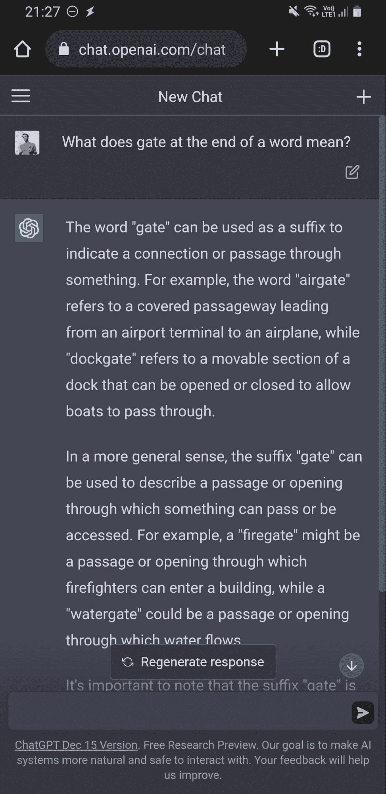
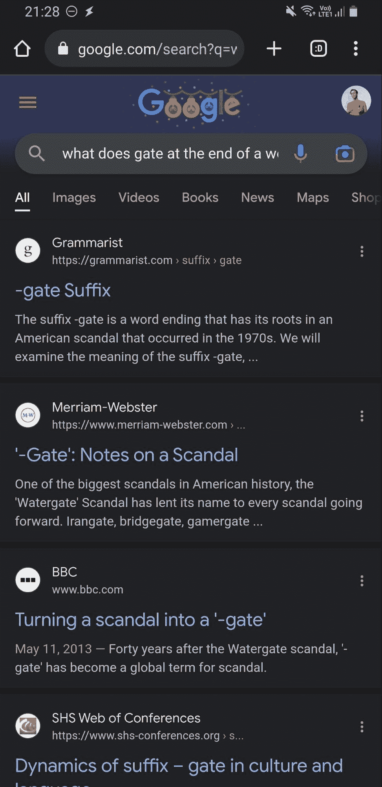
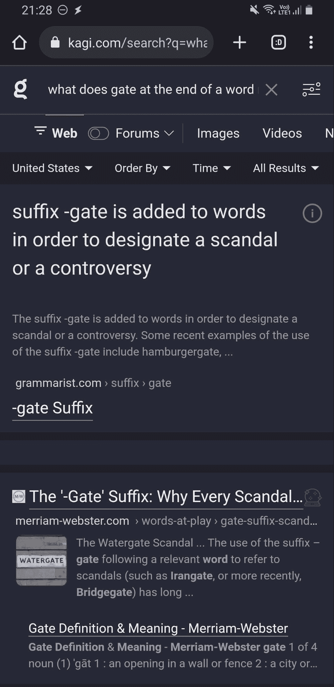
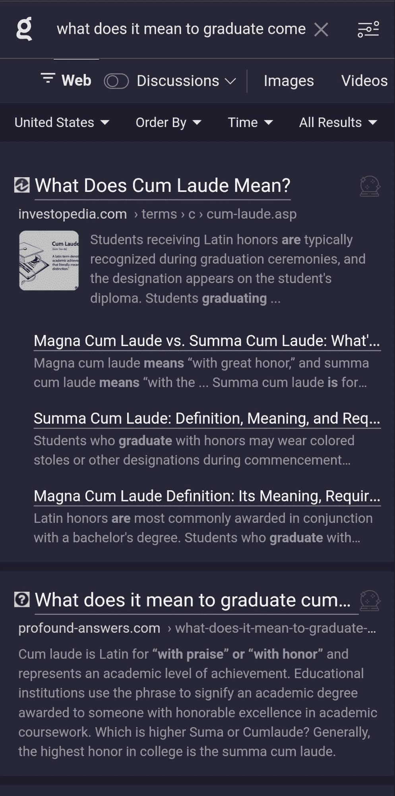
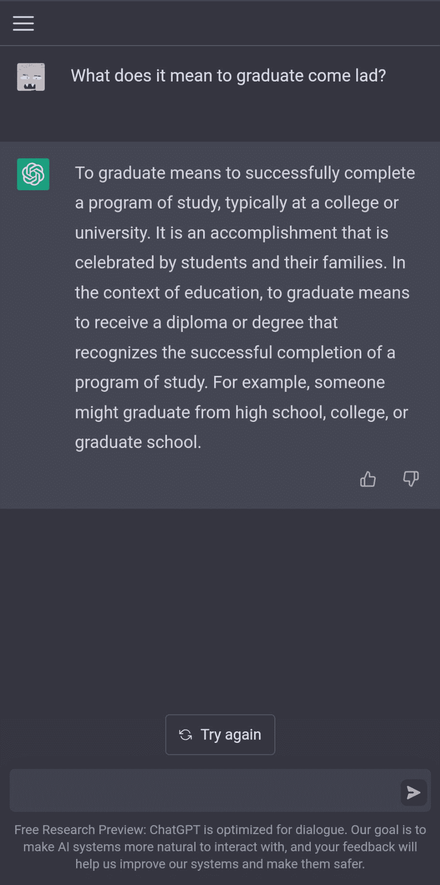
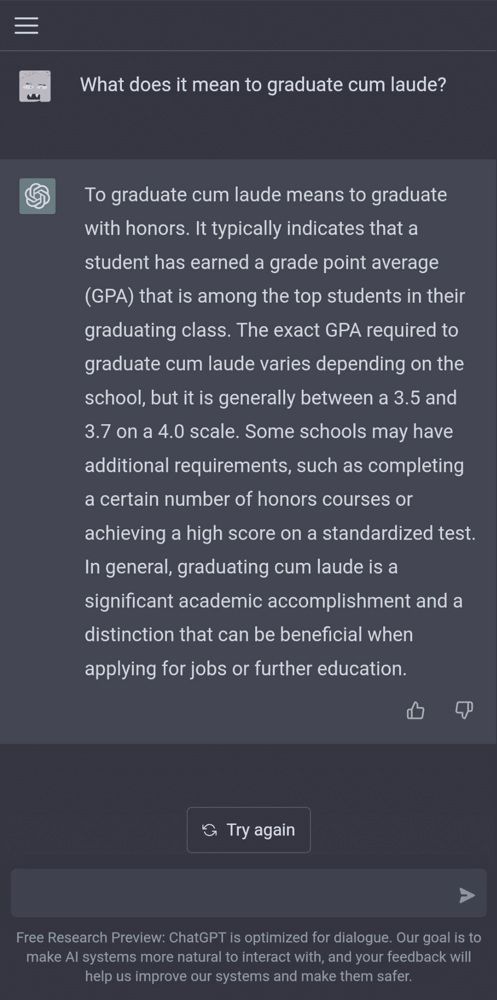
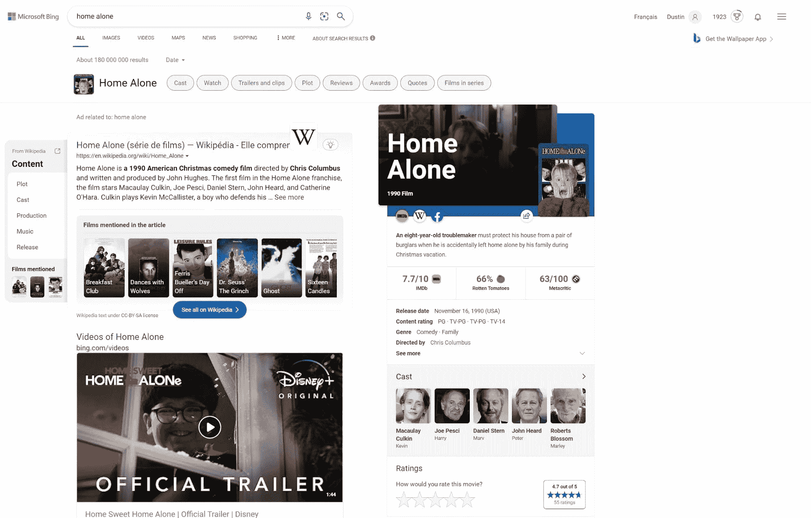
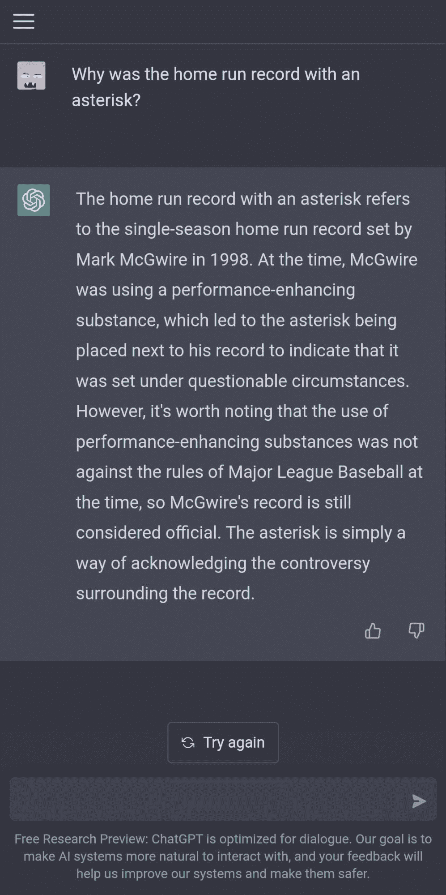
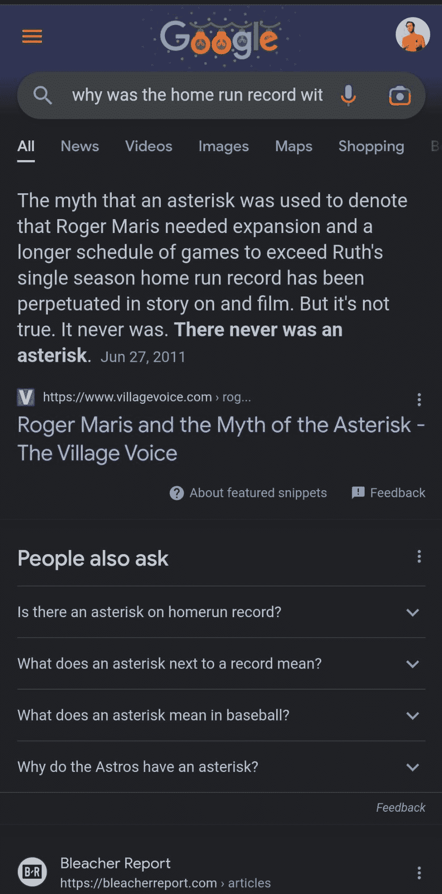
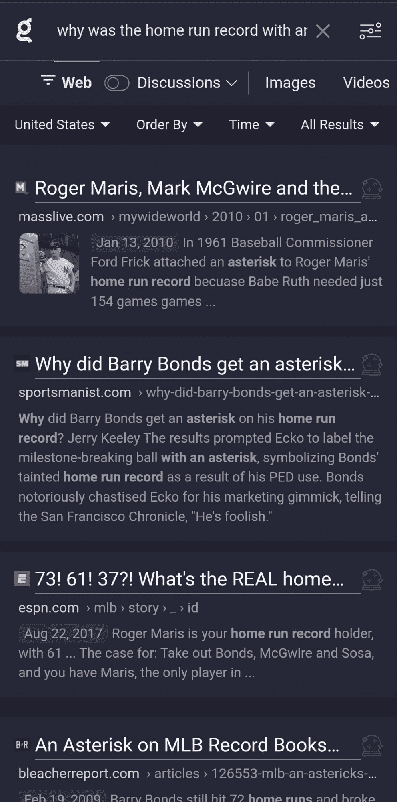

# 为什么 ChatGPT 不会取代搜索引擎 | Algolia

> 原文链接：[`www.algolia.com/blog/ai/why-chatgpt-wont-replace-search-engines-any-time-soon/`](https://www.algolia.com/blog/ai/why-chatgpt-wont-replace-search-engines-any-time-soon/)

自从 OpenAI 宣布 ChatGPT 并开始尝试之后，就有很多人兴奋地宣称它将颠覆*一切*。其中之一就是搜索。在 Twitter 或 LinkedIn（或[Bloomberg！](https://www.bloomberg.com/opinion/articles/2022-12-07/chatgpt-should-worry-google-and-alphabet-why-search-when-you-can-ask-ai)）上，你可以看到 ChatGPT 和类似的 LLMs 将取代 Google 和其他搜索引擎的言论。

但，真的吗？

不，至少在短期到中期内，Google 没有什么可担心的。搜索引擎已经存在了几十年，将继续存在几十年。它们没有真正的危险，这与搜索相关性和在基于对话的环境中的用户体验有关。

我在[Algolia](https://algolia.com/)的搜索领域工作了七年，过去四年专门从事自然语言、语音和对话搜索。我了解了什么有效，什么无效，虽然我对 LLMs（大型语言模型）持久乐观，但我不认同替代现有搜索范式。原因如下。

**查询表达**

第一个原因与查询表达有关，具有讽刺意味的是。我在这里说具有讽刺意味是因为围绕人工智能（AI）和机器学习（ML）在搜索领域的工作很大程度上是为了减少查询表达的障碍。过去，最基本的搜索引擎将文本与结果中完全相同的文本进行匹配。这意味着，如果你搜索*JavaScript 代码片段*，那么*JavaScript 代码片段*必须完全在你想要找到的文档中。问题在于，这迫使搜索者试图预测文档中将出现哪些文本。

这里举个例子：假设你正在清洁燃气灶顶，你意识到它是温暖的，尽管你有一段时间没有使用它。使用一个不智能的搜索引擎，你需要在搜索之前问自己：“我应该使用*温暖*还是*热*这个词吗？这会影响我得到的结果吗？”

智能的、基于 ML 的搜索通过扩展匹配范围并包括“概念上”相似的匹配项，如*温暖*和*热*，来减轻这种负担。搜索者在确定正确的搜索词上花费的精力更少，他们更有可能找到最初想要的信息。

然而，ChatGPT 的响应在很大程度上取决于提示（即查询）的表达。[OpenAI](https://openai.com/blog/chatgpt/)将此列为“限制”：

> *ChatGPT 对输入短语的微调或多次尝试相同提示非常敏感。例如，给定一个问题的某种表达方式，模型可能声称不知道答案，但稍微改变一下，就能正确回答。*

有时，当搜索者搜索自己已经了解很多的事物时，这种情况就会出现，但当搜索者对细节模糊不清时，这个问题就更加严重。如果有人搜索后缀*-gate*的含义，那么正确结果与政治丑闻有很大的关联。谷歌和 Kagi 反映了这一点，ChatGPT 没有：

（ChatGPT 的回应结尾说后缀-gate 的使用很少。告诉这一点给华盛顿吧！）

当涉及拼写错误时，情况变得更加明显。我们都会犯拼写错误，不是吗？有时我们会拼错单词，因为我们不知道正确的拼写。例如，短语*cum laude*在日常生活中并不常见，因此会有人想了解更多信息，但不知道正确的拼写。ChatGPT 如何处理*come lad*这种拼写与 Kagi 相比呢？

这不是 ChatGPT 没有答案。当你使用正确的拼写时，它就有了：

搜索必须能够理解搜索者即使拼写错误，否则体验就会退步。理解和匹配不同的拼写是困难的。在 Algolia，我们采取了两种方法：一种是[文本之间的简单编辑距离](https://www.algolia.com/doc/guides/managing-results/optimize-search-results/typo-tolerance/)；另一种是通过我们即将推出的 AI 搜索，它匹配概念并考虑上下文线索以更好地匹配正确的拼写，即使编辑距离很大。

ChatGPT 还存在另一个问题，就是它如何显示不正确的结果。或者说，它如何一般性地显示结果。

## **用户体验**

搜索布局在过去几十年一直都是相同的。具体来说：一组结果按照相关性从高到低的顺序排列（无论如何衡量）。近年来这种情况有所改变。随着搜索引擎引入答案框、侧边框、建议搜索、多媒体搜索等。看看必应搜索页面：

当然，必应是一个离群值。这个搜索结果页面包括大约 20 个不同的组件：流媒体选项，视频结果，图像结果和网页结果。也许这太多了。谷歌、Kagi 和其他搜索引擎的组件更少。但关键是搜索者*总是有选择*。

对于搜索者来说，获得选项是很重要的，因为第一个结果并不总是最适合搜索的。它可能在“客观上”是整体最好的，但搜索是查询、索引、用户和上下文的组合。所有这些结合在一起可能导致除第一名之外的结果在那个时候是最相关的。这篇博文声称在谷歌搜索中，第一个结果被点击的概率为[28%](https://www.sistrix.com/blog/why-almost-everything-you-knew-about-google-ctr-is-no-longer-valid/)。无论这个数字是否准确，它通常是正确的：大多数点击通常不是第一个结果。

什么是基于聊天的搜索？只有第一个结果。

更重要的是，这是在基于聊天的上下文中。在对话界面中，用户总是期望得到一个相关的回应，最好是最少量的“我不知道”的回应。

在 Algolia，我看到一些客户将我们的搜索用作他们聊天机器人的备用。聊天机器人的自然语言理解（NLU）有时会有很高的失败率（我们看到客户接近 50%的失败率），搜索似乎是一个自然的备选方案。然而，我们必须定制聊天机器人的用户体验，不要将第一个结果呈现为回应，而是显示几个结果，并明确告知用户正在看到一个备用方案。这是用户的期望。

聊天也会剥夺信息的背景。着陆在一个页面上并看到相关信息是好的：它有助于框定你找到的信息，甚至可能向你展示原始片段错误或误导的地方。

拿一个想了解棒球全垒打记录的人来说。这个人听说记录曾经带有星号。但是为什么？什么是记录？这通常指的是罗杰·马里斯在 1961 年 61 次全垒打的赛季，但搜索者不知道，于是搜索*为什么全垒打记录带有星号？*比较一下 ChatGPT、谷歌和 Kagi 的答案：

ChatGPT 提供了关于‘98 年马克·麦奎尔的全垒打记录的答案，多年后这个问题仍然有争议，但并不是带有星号的*全垒打记录。谷歌在答案框中给出了正确答案以及指向来源的链接，Kagi 提供了结果。其中，Kagi 可能是最好的，因为当人们说“星号”时，马里斯的名字会浮现在脑海中，但麦奎尔和邦德也有争议与他们相关。

要公平起见，OpenAI 已经意识到这一点。以下是首席执行官 Sam Altman 的一条推文：

但我认为在纯聊天环境中无法避免缺乏上下文和多个选择。这就是为什么聊天非常适合查找营业时间；但不太适合了解经历军事训练营是什么样子，或者为什么人们喜欢浪漫喜剧片。

这甚至没有涉及产品搜索。如今在搜索上花费的大量资金不是用于谷歌的 SEO，而是[为网站自己的产品目录构建搜索](https://www.algolia.com/doc/guides/building-search-ui/what-is-instantsearch/js/)。在这些情况下，对于搜索者能够看到选项、通过点击进行筛选，并深入“发现阶段”是*非常*重要的。这不是聊天所适合的。

还有其他障碍：法律（[澳大利亚有一项法律要求谷歌和 Facebook 支付新闻费用](https://www.reuters.com/technology/australia-says-law-making-facebook-google-pay-news-has-worked-2022-12-02/)；当新闻被自动摘要而没有来源时，他们会怎么想？）、成本和速度立即浮现在脑海中。这些问题可能有一天会被克服。同样，过于自信的错误结果也可能被克服。

但用户体验：这个问题不会消失。好吧，是的，你可能会争辩说这很容易解决。一个基于聊天的系统可以同时显示多个结果，让用户决定哪个是最好的。甚至可以按置信度对它们进行排名。然后甚至可以链接出去，让搜索者看到信息并决定其准确性。更好的是，为什么不还包括关于后续查询或可能有趣的多媒体的建议呢？

恭喜，你刚刚重新构建了一个搜索 UI。

因此，简而言之：LLMs 很棒。理解用户意图是很棒的。自动摘要功能很强大。搜索不会消失。
