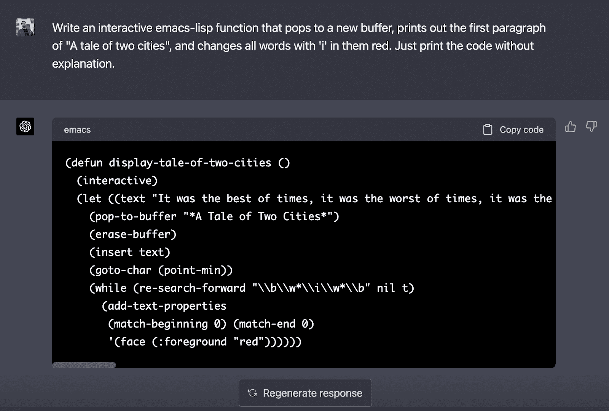
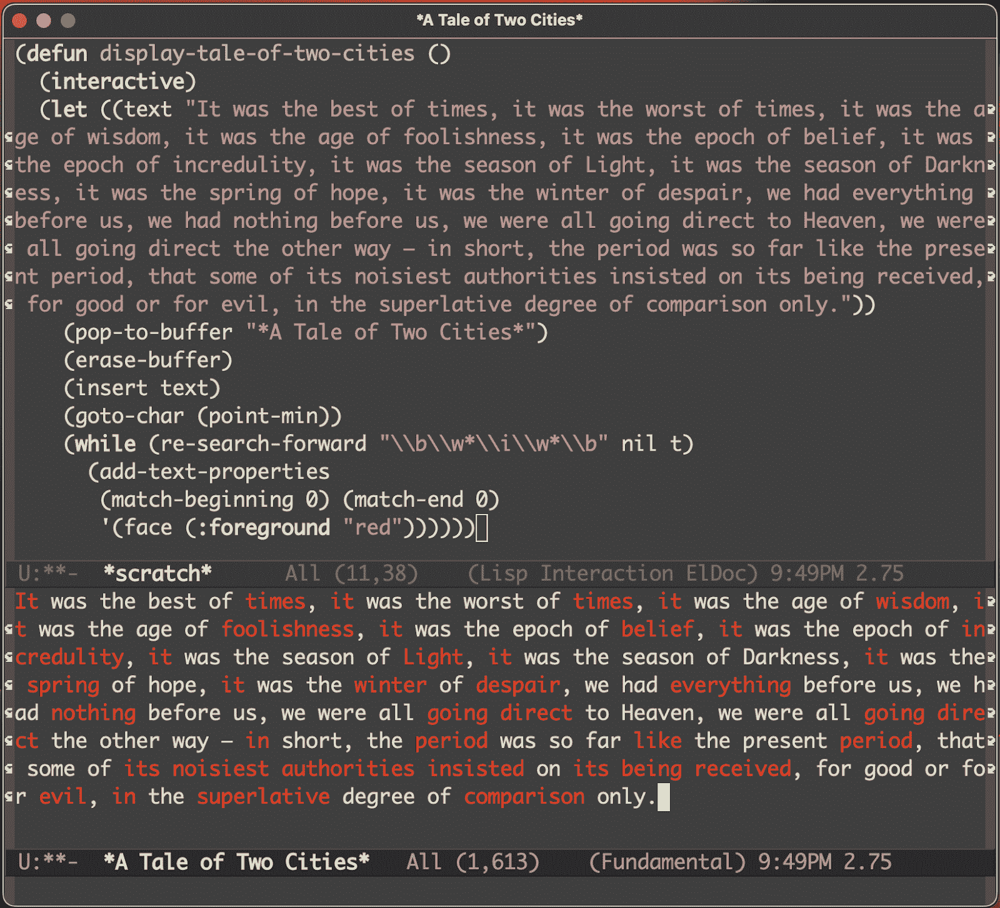
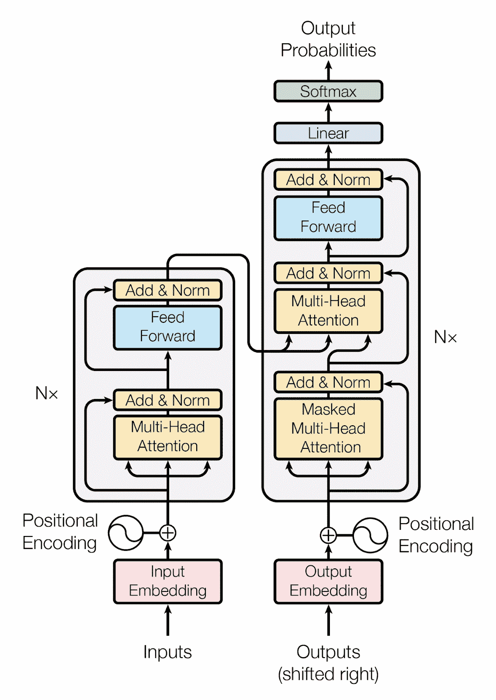
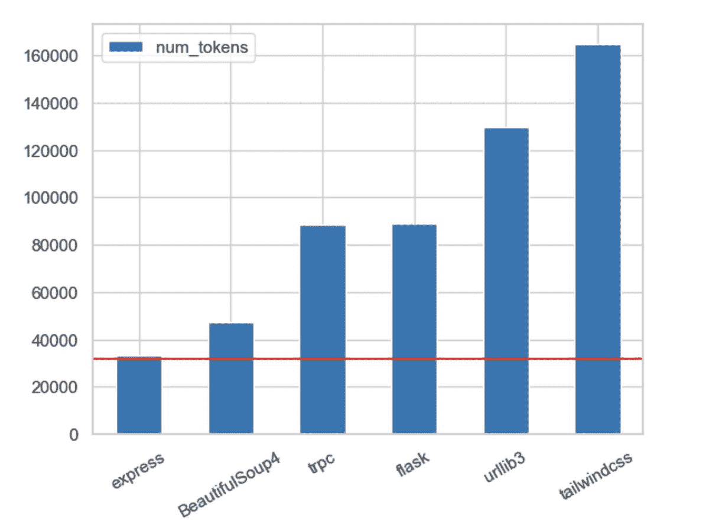
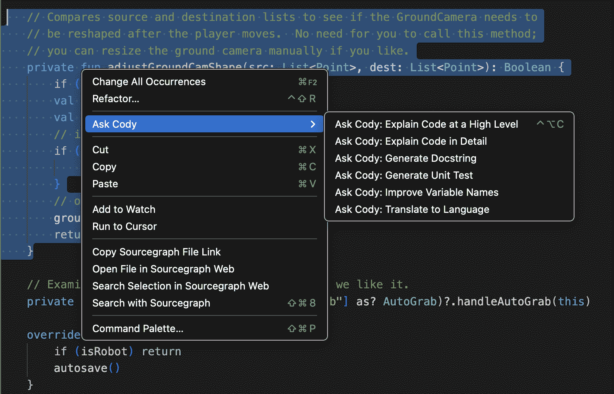
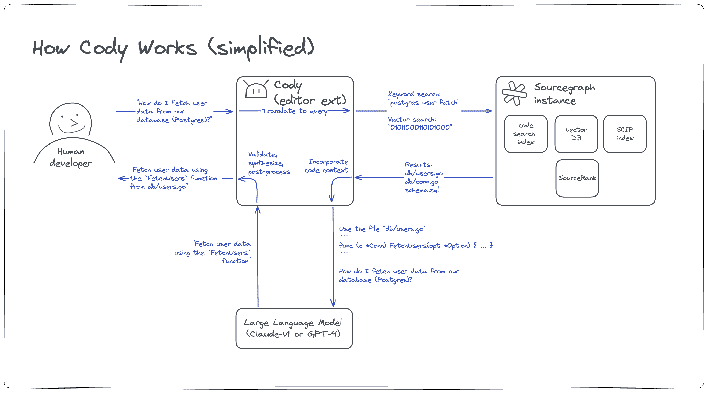

# 作弊就是你所需要的

> 原文链接：[`about.sourcegraph.com/blog/cheating-is-all-you-need`](https://about.sourcegraph.com/blog/cheating-is-all-you-need)

嘿。很抱歉很久没有写东西了。我会在这里弥补，写 3000 页。

我现在只是在跳跃。这可能是唯一让我再写博客的方式。

我已经重写了这篇文章很多次了。它是关于人工智能的。但是人工智能发展得如此之快，以至于这篇文章在几天内就过时了。所以算了。我一口气写出这个版本。

*(剧透警告：本文末尾包含一些 Sourcegraph 的内容，包括产品推广和招聘内容。但本文超过 80% 的内容只是关于 LLMs–GPT 等等–和你，一个程序员。)*

正在发生一些**传奇和历史性**的事情在软件工程领域，就在我们说话的此刻，然而大多数人根本没有意识到这有多么重要。

LLMs 不仅是社交、移动或云之后的最大变革–它们是自万维网以来最重要的事情。在编码方面，它们是自集成开发环境和 Stack Overflow 以来最重要的事情，而且很可能会超越它们。

但是我**个人**认识的大多数工程师都有点眯着眼看着它，想着，“这是又一个加密货币吗？”即使是 Sourcegraph 的开发人员也持怀疑态度。我是说，哪个工程师不是呢。持怀疑态度是一种生存技能。

记得我告诉过你吗，如果我当时没有对亚马逊的规模持怀疑态度，并在大约 2004 年出售了所有股份，那么我的亚马逊股份今天可能价值 1.3 亿美元。对吧？我告诉过你这件事吗？我肯定提过一两次。我并不是在抱怨。没有。

但是我有没有告诉过你 AWS 曾经只是某个工程师笔记本上的演示？没有？那么就是 [Ruben Ortega](https://www.linkedin.com/in/rubeneortega/) 和 [Al Vermeulen](https://www.linkedin.com/in/allan-vermeulen-58835b/)。他们在亚马逊的工程部门里走来走去，向任何愿意看的人展示他们的“网络服务”演示。大概是在…2003 年？左右？他们向我们展示了如何通过网络进行服务调用，比如通过访问 URL 并发送正确的查询参数。

哦，我们当时是*持怀疑态度*的。为什么要通过网络进行服务调用呢？这甚至不是它设计的初衷！更不用说，它显然不会像 CORBA（当时亚马逊愚蠢的 RPC 系统）那样高效。整件事对我们来说根本毫无意义。

我们看到了第一缕从 AWS 和云计算中涌现出的将成为一个万亿美元金钱火山的岩浆。

但是很多人对此持怀疑态度。对于我们大多数人来说，那些小小的岩浆看起来像萤火虫。

##### [](#the-ultra-rare-trillion-dollar-money-volcano)超稀有的万亿美元金钱火山

我可以告诉你很多像网络服务这样的故事。所有伟大的事情总是从演示开始的。

在浏览器中与人聊天怎么样？无论你是使用 Facebook、Google Chat、LinkedIn，还是只是与客服代表聊天：如果你在浏览器中与某人对话，所有这些东西都始于 2005 年两名工程师在“挂起 GET”通道上来回发送消息的一个微小演示。整个*行业*都是建立在那个微小通道上的，而且它甚至不是很好。

Kubernetes 呢？我记得早期在 Brendan Burns 的工作笔记本上看到过一个演示，当时它被称为 mini-Borg。整个*行业*正在基于 Kubernetes 构建，并且它甚至也不是很好。😉 再看看 Docker！像 Linux cgroups 这样无害的东西，一个小的进程隔离管理器，成为了容器的技术基础，现在完全渗透了我们的行业。

如果你可以通过基于简单的服务调用堆栈构建像 Amazon Web Services 这样大的东西，或者基于简单的浏览器到浏览器通信构建整个社交网络和客户服务套件，或者基于一小段进程隔离代码构建一种稳健的软件交付和管理方式，那么想象一下，如果你以*该死的奇点*作为起点，你可以构建多么庞大的东西？

我是说，我开玩笑，但是... 我是说... 对吧？我猜你可能在 OpenAI 的 98 页[GPT-4 技术报告](https://cdn.openai.com/papers/gpt-4.pdf)中可能错过了，但是大型模型显然已经倾向于发现“追求权力”是增加自身稳健性的有效策略。打开 PDF 并搜索“追求权力”以获得有趣且完全不可怕的阅读[体验](https://twitter.com/Suhail/status/1637952234913939460)。

通过利用一些小的技术突破，你可以构建真正庞大的东西。

朋友们，这个技术突破？一点也不小。

如果你对此还没有兴奋到尿裤子的程度*并且*担心，那么... 你应该了解一下。

##### [](#and-yet-the-mehs-prevail)然而，平庸却占据主导地位

我们在 Sourcegraph 进行了内部投票：你对 LLMs 编码持有积极态度还是消极态度？选项是积极、消极和平庸。结果大约有 2/3 的人选择了平庸或消极（即，怀疑者），我认为这相当代表了整个行业。

我询问了一下，甚至就在几周前，一些开发人员质疑 ChatGPT 是否能够编写*可运行*的代码，更不用说仅仅通过告诉它来编写一个完整的程序了。

所以在这里，我在谈论金钱火山，而我的同事们已经形成了一个巨大的平庸旋风。你应该相信哪种自然灾害？

嗯，我是说，我猜一次演示胜过一千个平庸。让我们试一试。

##### [](#chatgpt-vs-emacs)ChatGPT 对抗 Emacs

让 ChatGPT 编写一些 Emacs-Lisp 代码。我选择 emacs-lisp 是因为它是一个边缘案例语言，对 LLM 来说是一种压力测试，并且因为对我来说很容易进行交互式尝试。

好的。我刚刚在 ChatGPT 中输入了这个提示：

*> 编写一个交互式的 emacs-lisp 函数，弹出一个新的缓冲区，打印出《双城记》的第一段，并将所有包含‘i’的单词变成红色。只需打印代码，不要解释。*



如果你看不懂截图，这是它输出的代码：

```
(defun display-tale-of-two-cities ()
 (interactive)
 (let ((text "It was the best of times, it was the worst of times, it was the age of wisdom,
 it was the age of foolishness, it was the epoch of belief, it was the epoch of incredulity,
 it was the season of Light, it was the season of Darkness, it was the spring of hope, it was
 the winter of despair, we had everything before us, we had nothing before us, we were all
 going direct to Heaven, we were all going direct the other way – in short, the period was so
 far like the present period, that some of its noisiest authorities insisted on its being
 received, for good or for evil, in the superlative degree of comparison only."))
 (pop-to-buffer "*A Tale of Two Cities*")
 (erase-buffer)
 (insert text)
 (goto-char (point-min))
 (while (re-search-forward "\\b\\w*\\i\\w*\\b" nil t)
 (add-text-properties
 (match-beginning 0) (match-end 0)
 '(face (:foreground "red"))))))
```

我直接将这段代码复制到我的 Emacs 会话中并运行了它，它确实做到了我要求的事情：



正如你从截图中看到的，我运行了这个命令，它打开了一个缓冲区，打印了请求的文本，然后将所有包含‘i’的单词变成了红色。

ChatGPT 一次性从一个杂乱的英文描述中生成了完全可工作的代码！如果有语音输入，我可以通过询问我的计算机来编写这个程序。

而且它不仅能正确工作，它写的代码实际上是相当不错的 emacs-lisp 代码。当然，它不是*复杂*的。但它是好代码。

当然，人们做过比这更复杂得多的事情。有人在餐巾纸上[写下](https://twitter.com/heykahn/status/1635752848398102530?s=20)了一个产品描述，拍了照，GPT 写了一个实现餐巾纸上产品描述的工作 Web 应用程序。这里的能量量级实在是未知的；这更像是一个我们尚未完全探索的洞穴。随着 LLMs 变得更大，它只会变得更深。

我的意思是，这东西*无比*强大。然而，我始终遇到一种怀疑和惊慌的混合体。啊，那惊慌！别让我开始那个。哦看，现在你让我开始了。

好的，你自找的。

##### [](#whining-about-trust-issues)抱怨信任问题

*<发牢骚模式全开>*

我听到开发人员关于基于 LLM 的编码帮助说的最疯狂的事情之一是，他们不能“信任”它写的代码，因为它“可能有 bug”。

啊，这些疯狂的开发人员啊。

你能信任你从 Stack Overflow 上抄过来的代码吗？不！

你能相信从代码库中复制的代码吗？不！

你能信任你*刚刚仔细手写的代码吗？* 不！

你们这些疯狂的家伙完全忽视了一个事实，**软件工程存在是因为你永远不能在任何情况下信任代码。** 这就是为什么我们有*审查者*。还有*linters*。和*debuggers*。和*unit tests*。和*integration tests*。和*staging environments*。和*runbooks*。以及所有该死的*运维卓越*。还有*安全检查器*，和*合规扫描器*，等等等等！

所以，下一个抱怨“你不能信任 LLM 代码”的人将得到一个小徽章，上面写着“欢迎来到*工程*，混蛋”。你终于学会了这个行业的秘密：不。信。任。任何东西！

朋友们，让我们做一些非常简单的草稿数学。相信我，这不会是困难的数学。

+   你可以让 LLM 为你起草一些完成/正确度达到 80%的代码。

+   你可以手动调整最后的 20%。

这将带来多少生产力提升？哇哦，如果你只做了五分之一的工作，那么你就是… *在计算手表上按下按钮*… **生产力提高五倍**。😲

上次你从*任何*事情中获得 5 倍生产力提升是什么时候？那不涉及某种化学物质？

我是认真的。我就是不明白人们。你怎么能不欣赏现在正在发生的*历史性*变化呢？

好了，是时候具体一点了。我已经在第 7 页了，而我上次尝试写这篇博客时超过 25 页，还荒废了几周。

让我们结束这个。

*<发牢骚模式已解除...但潜伏着>*。

##### [](#a-brief-mini-history-of-llms)LLM 的简要小历史

好了，所以……这是之前写了 20 页的部分，所以让我们简化一下。一段话。

这是你今天需要了解的 LLM 历史的一切：

|  |
| --- |

+   谷歌 Brain 团队在 2017 年发表了一篇名为[Attention is All You Need](https://arxiv.org/abs/1706.03762)的论文。

+   它介绍了你在左边看到的现在著名的 Transformer 架构。

+   现在每个人都在使用这个。它取代了*几乎所有*的 AI。

+   谷歌对这一发明完全没有做任何事情，选择之后进行暴力性的反应，这是他们通常的作法。

+   与此同时，其他人开始在大量数据上训练庞大的 Transformer。他们开始称之为大型语言模型（LLMs）。

+   OpenAI 在 2022 年 11 月 30 日推出了 ChatGPT，第一个基于 LLM 的聊天机器人，错过了一个明显的机会，没有将其命名为 Large Marge。为什么他们没有这样做。

+   从那时起，**一切都变得疯狂无比**，每天都有基于 LLM 的新产品推出，技术进步每隔几个小时就会发生。要追踪这一切*几乎是不可能的*。

+   金钱火山警报：首次检测到熔岩飞溅。

|

恭喜，你已经了解了 LLM 的历史。去观看[这个惊人的视频](https://www.youtube.com/watch?v=kCc8FmEb1nY)了解如何在 Python 中实现它。

##### [](#a-brief-introduction-to-coding-assistants)编码助手简介

好了，现在我们可以谈论编码助手了。它们只是坐在你的 IDE 中与 LLM 交谈的东西。

根据特定助手的不同，它们可以阅读和解释代码，文档化代码，编写代码，自动补全代码，诊断问题，甚至通过给予 LLM 机器人能力的“代理”执行任意 IDE 任务，包括使用和瞄准激光枪，如果有人愿意付出努力。一些助手还了解您的项目环境，并可以回答关于构建目标、分支、您的 IDE 等的问题。

所以，已经相当酷了。对吧？

但现在它们开始能够执行更复杂的任务，比如从当前分支的差异中生成一个 PR，包括总结更改的详细提交消息。

一些助手还有对话/聊天界面。这种类型可以做 ChatGPT 这样的机器人可以做的一切，比如起草电子邮件，或回答关于代码库或环境的随机问题。

我个人更喜欢带有聊天界面的编码助手。部分原因是因为我可以打字，但也因为它使它们成为一个平台。我可以构建自己的工作流程。如果它们通过 API 暴露底层平台部分，那就更加分。

我想最简单的思考方式可能是一种“实时 IDE 中的 Stack Overflow”，再加上一个非常强大的新的模板自动化任务集。

好的，再次恭喜 - 你已经了解了基于 LLM 的编码助手可以做什么。它...几乎可以做任何事情。你可以将其连接到外发邮件，并告诉它自我推销。天空是极限。在这一点上，我们更多地受到想象力的限制，而不是技术的限制。

所以！是的。编码助手。我希望到现在你明白它们将会有多么强大。它们可能会采取不同的形式，但它们在不久的将来都将变得非常厉害。

让我们稍微深入了解它们如何理解你的个人代码，然后我们就准备好开始派对了。🎉

##### [](#trainingfine-tuning-vs-search)训练/微调 vs 搜索

LLMs 是在绝对惊人数量的数据上进行训练的...但这并不包括你的代码。

有两种基本方法可以使 LLM 更加了解你的代码。第一种是在你的代码上进行微调（或训练）。这还不是一个完全完善的商业模式，但它正在发展。而且重要的是这只是问题的一部分。

另一种方法是引入一个搜索引擎。你可以将其视为三种相关的场景：

+   一个原始的 LLM 就像是一个哈佛计算机科学毕业生，对编码有很多了解，并且大约 4 小时前吃了一颗魔法蘑菇，所以效果大部分已经消退，但还没有完全消失。

+   在你的代码库上对其进行微调就像是让它仔细研究你的代码，这意味着它通常会给出更好的答案。

+   加入一个搜索引擎，就像对人类来说一样，使得 AI 更加有效，因为它可以非常快速地回答直接的查询。而且重要的是，因为搜索引擎可以用来填充查询上下文。

    +   意思是，一个搜索引擎在每次查询中可以有两次有用 - 一次是在确定如何*描述*和*上下文化*查询时，另一次是在回答查询时。

你通过发送一个动作或查询以及一些相关上下文来与 LLMs 交流。所以例如，如果你想让它为一个函数编写一个单元测试，那么你需要传递整个函数，以及任何其他相关代码（例如测试夹具代码），以便它正确地进行测试。

你发送的上下文被称为**上下文窗口**，我把它看作是你在查询中传递的“作弊纸”信息。

朋友们，这并不多。这几乎与你整本教科书相比就像是一个双面索引卡，用于考试。他们给你 4k 到 32k 个 3-4 个字符的令牌，因此最好的情况下，可能有 100k 的文本，用于输入 LLM 作为查询上下文。那 100k 的小抄就是你告诉 LLM 关于***你的***代码的方式。

在理想的情况下，你应该在每次查询中传递整个代码库。事实上，Jay Hack 刚刚在推特上[发推文](https://twitter.com/mathemagic1an/status/1636121914849792000?s=20)展示了最新 GPT-4 上下文窗口大小与一些流行代码库的比较：



这有点令人兴奋... 直到你意识到与真实代码库相比，它仍然微不足道。这就像一个索引卡对比一本教科书... 只是一个略大一点的索引卡。

那张小抄就是你得到的一切。这就是你与 LLM 交流的方式。你给它一张小抄。

这意味着放在这张小抄上的内容，正如你可能想象的那样，是**非常重要的**。

有了这一点，朋友们，我们终于准备好了结尾，派对和演示。

你成功了！

##### [](#cheating-is-all-you-need)欺骗就是你所需要的

据我上次统计，截至三月中旬，大约有 13 hillion frillion jillion 个由 LLM 支持的编码助手。但它们都在绝望地争先恐后，因为它们都使用完全相同的原材料：一个 LLM，你的 IDE，你的代码库，以及那个讨厌的小上下文窗口。

没有人能在 LLM 上区分自己；它们都差不多。IDE 和你的代码库也是一样的。他们唯一可以尝试区分的是他们的 UI 和工作流程，而他们都会互相抄袭。对你有利，对他们不利。

结尾，说实话，这是最难解释的事情之一，所以今天我选择信仰之路，就是**在 AI 领域，所有的赢家都将拥有数据护城河。**

“数据护城河”简而言之，就是拥有一些其他人无法访问的数据。

在 LLM 世界中，你需要一个数据护城河来区分自己。

为什么？**因为数据护城河是如何填充上下文窗口（“小抄”）的。**

如果你无法将整个代码库输入 LLM，而只能每次显示 100k 个字符，那么你最好*非常非常擅长*获取正确的数据填充到那 100k 字符窗口中。因为这是影响 LLM 输出质量的唯一方法！

换句话说，你需要一个*辅助数据库*。数据护城河需要快速且可查询。这是一个搜索问题！

即使在工程领域之外也是如此。可能正如你阅读这篇文章时，可能有 13 hillion jillion killion 基于 LLM 的外发销售产品正在被建立。但只有 Salesforce 和其他几家拥有大数据护城河的公司才能在这个领域中脱颖而出。

##### [](#party-time)派对时间

好了！你终于学完了。我为你能坚持到最后感到非常自豪。

其余的是私人 Sourcegraph 派对。我的意思是，如果你愿意，你可以一起来，因为你是朋友。我会让你绕过门口的保安。

你刚刚从 Stevey 的 LLM Mini-U 毕业，你拥有所有必要的理论背景来欣赏为什么我觉得自己是地球上最幸运的人，以及为什么我正在这篇博客的第 2896 页举办派对。

因为朋友们，老实说，我真的不知道我是*怎么*这么幸运的。我在九月份加入 Sourcegraph，不仅仅是因为他们的产品本身，更是因为他们的代码智能平台，就像[我在 Google 时构建的那个](https://www.youtube.com/watch?v=KTJs-0EInW8)。他们几乎完成了[v1 版本的这个平台](https://about.sourcegraph.com/blog/announcing-scip)，它已经准备好开始支持一些令人惊奇的东西。

然后 LLMs 在我加入后的 10 周内登场了。奇点，克洛弗菲尔德怪兽在四处踩踏吞食人类，以及自 11 月 30 日以来发生的一切。疯狂的城镇。

那 LLMs 再次需要什么？你，在前排。是的，就是你。

他们需要数据护城河！辅助数据库。用于填充备忘单。记得吗？

这是一个搜索问题。而 Sourcegraph 已经花了过去*十年*来构建解决方案。

搞明白。

Sourcegraph 的平台具有四个持久的、难以复制的维度，这些维度与编码助手领域密切相关：

+   它是**通用**的，适用于所有代码主机和平台。

+   它是**可扩展**的，适用于各种规模的企业。

+   它是**精确**的，与 IDE 在准确性和完整性上可比。

+   它是**开放**的，并且正在公开透明地开发。

Sourcegraph 的引擎为拥有成千上万个 git 仓库和/或多 TB 大型超级仓库的巨大企业提供支持，这些仓库让 IDE 崩溃和呕吐。而其核心是一个如此强大的引擎，也许与 AI 合作一直是它的命运。

哇哦。我是不是很幸运？我觉得我很幸运。我们在这场比赛中有了如此令人难以置信的领先优势。

当我说“我们正在构建一个编码助手”时，我希望你回想一下 Ruben Ortega 向我们亚马逊人展示远程过程调用 HTTP 的小演示。那就是 Baby AWS。

现在看看我的尊敬的同事和 Sourcegraph 队友 Dominic Cooney 上周发给我的消息：

*另外，我变得更加热情。这个领域比 LLMs 还要广阔得多，我认为我们在这里有一项了不起的发明的胚胎阶段。比如一些关于上下文提供是一项服务的认识。输出有流，比如一个进入编辑器，一个进入聊天。LLM 受益于自我批评的机会。用户体验需要差异和就地事物来聚焦事物。搜索和聊天一样重要。我们对[LLMs]的许多拒绝反应来自于他们抱怨他们不知道用户在谈论什么语言、文件、代码库等上下文。这是个好兆头，因为 Sourcegraph 应该能够做得很好。*

他瞥见了未来，而且是广阔的。他的评论，“我认为我们在这里有一项了不起的发明的胚胎阶段”，让我想起了我见过的其他最终令人惊叹的事物的胚胎阶段：Mosaic 网页浏览器。成为 Kubernetes 的迷你 Borg 演示。亚马逊网络服务演示。浏览器中的 hanging-GET 请求。

小事情会发展壮大，伙计们！

我以前看过这部电影。我知道结局。这座火山是大的那一个。怀疑论者要小心了。至少，*希望*现在你对 LLM 支持的编码助手比一个小时前更认真一点。

好的，你已经听到了笑话，派对正在全力进行。让我向你展示 Cody，然后我们就收工吧。

##### [](#a-whirlwind-tour-of-sourcegraphs-cody)Sourcegraph 的 Cody 一瞥

与 Cody 打个招呼：


Cody 是 Sourcegraph 的新的 LLM 支持的编码助手。Cody 知道你的代码。它有模板化的操作，比如编写单元测试，生成文档注释，总结代码，那种东西。你知道的。你可以从菜单中选择的东西。就像其他助手一样。如果你喜欢的话，它甚至有代码补全功能。

Cody 不是一种模糊的“代表未来人工智能愿景的表现”。你可以*立即尝试*它。

它还有一个聊天界面！这意味着它是完全开放的；你可以问它关于你的代码库或环境的任何问题，我们会发送给它正确的备忘单。而 Cody 本身是一个*平台*，因为你可以用它来构建自己支持 LLM 的工作流程。

我最喜欢的类型。当然。

目前，Cody 是一个 VSCode 插件，不过很快我们会在其他地方也推出它。



Cody 能够扩展到世界上最大的代码库。尽管 Cody 还是一个婴儿，就像 2003 年在 Ruben 的臭垫子上的 Baby AWS 一样，它已经能够仅凭原力的力量举起一只巨大的太空犀牛。等等，抱歉，搞错了婴儿。

啊嗯。就像我说的，就像 Baby AWS 一样，Cody 也是一个具有特殊能力的婴儿，老实说...我们不知道它会变得多么强大。如果有的话，它似乎正在加速。

哦，任何人都可以~~注册获取访问权限~~[立即开始使用 Cody](https://cody.dev)。*（Cody 发布后编辑。）*

好吧，无论如何这就是 Cody 的工作方式：



这就是上面的图表的要点：

+   **你要求 Cody 做某事**（例如，“为这个函数编写一个单元测试”）

+   **Cody 填充备忘单** / 上下文窗口查询，使用 Sourcegraph 的代码智能平台（搜索查询、嵌入检索、graphql 查询等）

+   **它将上下文+查询发送到 LLM**，并解析结果

+   **它可选择将结果插入**回 IDE（取决于操作）

当然，这只是一个非常初步的阶段。这个东西将成长为一个增强你作为工程师所做的一切的巨人。

其他编码助手，在第 2 步（填充上下文）中没有 Sourcegraph 的情况下，被困在使用 IDE 中能获取的任何上下文中。但对于他们来说，遗憾的是，IDE 并没有真正考虑到这种用例，并且使其变得困难。更令人沮丧的是，没有一个 IDE 能够扩展到工业规模的代码库。

所以这就是纯粹的不公平。我就直说吧。Sourcegraph 拥有绝对不公平的优势，他们在*十年*的时间里建立了这个非常可扩展、精确和全面的代码智能平台，由世界一流的搜索引擎和代码知识图支持。

我有提到我很幸运吗？我很幸运能在这里，也很感激能成为这个团队的一部分。

##### [](#afterlogue)后记

我真的不知道如何结束这篇文章。我们到了吗？我已经尝试写了这篇文章 3 次了，看起来我可能终于完成了。我本来想写 5 页，故意对一切进行简要解释，结果...变成了十五页。叹气。

但希望你能得到主要的要点。Baby AWS。膝跳。Meh-nadoes。备忘单。数据壕沟。Cody。你能做到！

LLM 不是像加密货币那样的愚蠢潮流。是的，加密货币是一个愚蠢的潮流。这不是那样的。

编码助手即将到来。它们即将到来。今年你将会使用它们。它们绝对会让你大吃一惊。而且它们将继续以惊人的速度改进。

它们会让你感觉像在作弊，就像当 IDE 出现时一样，在古老的日子里。对于像我这样时间受限的开发人员——我说这话是作为一个写过一百万行生产代码的人...

作弊就是你需要的一切。

感谢阅读，如果你愿意，来成为我们的[AI 主管](https://boards.greenhouse.io/sourcegraph91/jobs/4803652004)吧！或者和我们一起做[其他事情](https://boards.greenhouse.io/sourcegraph91)！这里已经很愉快了，但越多人越快乐。
