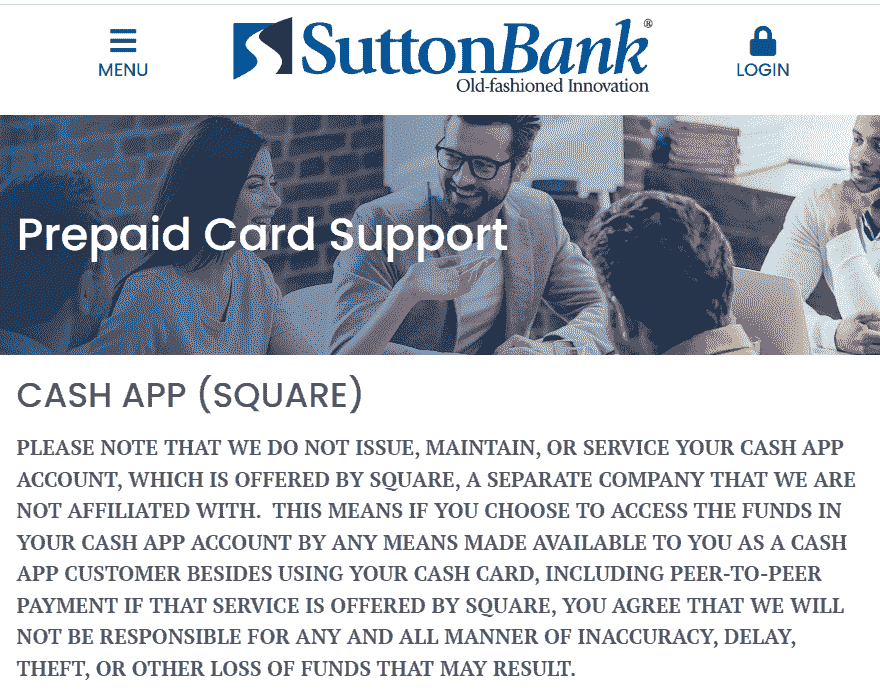

# Block：如何夸大用户指标和“无摩擦”欺诈促使内部人员套现超过 10 亿美元 – Hindenburg Research

> 原文链接：[`hindenburgresearch.com/block/`](https://hindenburgresearch.com/block/)

+   Block 公司，前身为 Square 公司，是一家市值 440 亿美元的公司，声称已经开发出一种“无摩擦”和“神奇”的金融技术，旨在赋予“未被银行服务”和“未被银行充分服务”的人群权力。

+   我们进行的为期 2 年的调查得出结论，Block 系统地利用了其声称正在帮助的人群。Block 业务背后的“魔力”并不是颠覆性创新，而是公司愿意促进对消费者和政府的欺诈，避免监管，将掠夺性贷款和费用打扮成革命性技术，并通过夸大的指标误导投资者。

+   我们的研究涉及与前员工、合作伙伴和行业专家的数十次采访，对监管和诉讼记录的广泛审查，以及 FOIA 和公共记录请求。

+   大多数分析师对 Block 的 Cash App 平台在疫情后激增感到兴奋，预计其拥有的 5100 万月度交易活跃用户和低客户获取成本将推动高利润增长，并作为未来推出新产品的平台。

+   然而，我们的研究表明，Block 极大地夸大了其真实用户数量，并低估了其客户获取成本。前员工估计，他们审查的账户中有 40%-75%是虚假的，涉及欺诈，或者是与单个个体相关的额外账户。

+   核心问题在于，Block 公司已经接纳了一个传统上非常“未被银行服务”的人群：罪犯。该公司对合规采取的“西部荒野”式的方法使得坏人可以轻松地为身份欺诈和其他诈骗行为大规模创建账户，然后迅速提取被盗资金。

+   即使用户被发现从事欺诈或其他被禁止的活动，Block 也会将账户列入黑名单，而不是禁止用户。一位前客服代表分享了屏幕截图，显示被列入黑名单的账户经常与数十甚至数百个其他*活跃*账户涉嫌欺诈有关。允许黑名单用户的现象如此普遍，以至于说唱歌手在嘻哈歌曲中吹嘘这一点。

+   Block 掩盖了有多少个体在 Cash App 平台上，通过报告充满虚假和重复账户的误导性“交易活跃”指标。Block 可以并且应该向投资者澄清有多少个独特的*人*实际上使用 Cash App 的估计。

+   CEO 杰克·多西公开宣称 Cash App 在数百首嘻哈歌曲中被提及，作为其主流吸引力的证据。对这些歌曲的审查显示，艺术家们通常不是在说唱 Cash App 的流畅用户界面，许多人描述使用它来欺诈、贩卖毒品甚至支付谋杀。[[在此观看我们的汇编视频](https://www.youtube.com/watch?v=StjWk3Mj-M4)]

+   “我通过 Cash App 付给了他们的打手”——Block 为一首名为“Cash App”的歌曲付费推广，该歌曲描述了通过该应用程序支付承包杀手。该歌曲的艺术家后来因企图谋杀被逮捕。

+   根据一家领先的非营利组织的报告，Cash App 也被“远远”列为美国报告的性交易中使用最多的应用程序。多个司法部投诉概述了 Cash App 如何被用于促进性交易，包括未成年人的性交易。

+   甚至有一个以 Cash App 命名的团伙：根据新闻报道和刑事记录，在 2021 年，巴尔的摩当局指控“Cash App”团伙成员在西巴尔的一个社区分发芬太尼。

+   除了促进犯罪活动的支付外，根据与前员工的多次采访，该平台还被大量欺诈账户和虚假用户所淹没。

+   明显扭曲的例子比比皆是：“杰克·多西”有多个假账户，其中一些似乎旨在欺骗 Cash App 用户。“埃隆·马斯克”和“唐纳德·特朗普”也有数十个。

+   为了测试这一点，我们将我们的账户变成了“唐纳德·特朗普”和“埃隆·马斯克”，并轻松地发送和接收了资金。我们在显然虚假的唐纳德·特朗普账户下订购了一张 Cash 卡，检查看看 Cash App 的合规是否会有问题——卡片很快就通过邮件送到了。

+   前员工描述了 Cash App 是如何压制内部关注和忽视用户请求帮助的，而犯罪活动和欺诈在其平台上猖獗。这似乎是通过有策略地无视反洗钱（AML）规则来增加 Cash App 用户群的努力。

+   COVID-19 大流行和全国封锁对 Block 当时的主要毛利驱动因素——商户服务构成了一种存在威胁。

+   在这种环境下，在 Cash App 的反合规自由竞争中，该应用程序促成了一波大规模的政府 COVID-19 救助支付。CEO 杰克·多西发推文称用户可以通过 Cash App “立即”获得政府支付，由于其无摩擦技术，“无需银行账户”。

+   在 Cash App 账户收到第一笔政府支付的几周内，各州都在寻求追回涉嫌欺诈支付的款项——华盛顿州希望从支付处理器那里追回超过 2 亿美元，而亚利桑那州则试图追回 5 亿美元，前员工告诉我们。

+   再次，迹象不容忽视。说唱歌手“Nuke Bizzle”制作了一部关于犯下 COVID 诈骗的流行音乐视频。几周后，他被逮捕并最终因犯下 COVID 诈骗罪被定罪。起诉书中唯一提到的支付提供商是 Cash App，用于促成欺诈支付。

+   我们提出公开记录请求，以了解 Block 在促成疫情救济欺诈方面的作用，并从几个州获得了答复。

+   马萨诸塞州试图从 Cash App 账户中追回超过 69,000 笔失业救济支付，仅在疫情爆发四个月后。Cash App 合作银行的可疑交易比例过高，超过摩根大通和富国银行等大型银行，尽管后者拥有 4 到 5 倍的存款账户。

+   在俄亥俄州，Cash App 的合作银行涉嫌与该州处理最多失业救济申请的银行相比，有 8 倍的可疑与疫情相关的失业救济支付，尽管后者处理的申请比 Cash App 多 2 倍，根据我们通过公开记录请求获得的数据。

+   数据显示，与俄亥俄州竞争对手相比，Cash App 的合作银行几乎有 10 倍的申请人通过另一位申请人使用的银行账户申请救济金 - 这是欺诈的明显红旗。

+   Block 存在明显的合规疏漏，使欺诈变得容易，例如允许单个账户代表来自各州的多个个人接收失业救济金，以及无效的地址验证。

+   为了保持增长动力，Cash App 忽视了内部员工的担忧，以及来自特勤局、美国劳工部 OIG、FinCEN 和州监管机构的警告，这些机构都明确指出多笔 COVID 救济支付进入同一账户是欺诈的明显迹象。

+   Block 报告称用户数量和收入在疫情期间激增，却忽略了大量存在的欺诈账户和支付的贡献。这项新业务为 Block 的股价带来了一次性大幅增长，股价在疫情期间 18 个月内上涨了 639%。

+   随着 Block 促成欺诈的股价飙升，联合创始人杰克·多尔西和詹姆斯·麦凯尔维在疫情期间共售出超过 10 亿美元的股票。其他高管，包括首席财务官阿姆里塔·阿胡贾和 Cash App 主管布莱恩·格拉萨多尼亚，也抛售了数百万美元的股票。

+   随着疫情期间 Cash App 用户的增加，我们的研究显示 Block 通过避开旨在保护商家的关键银行监管规定悄悄地增加了其盈利能力。“互换费”是商家接受各种支付卡使用的费用。

+   国会通过了一项法律，合法限制了拥有超过 100 亿美元资产的大型银行收取的“互换费”。尽管 Block 拥有 310 亿美元资产，但通过将支付路由通过一家小银行并向商家收取高额费用，避开了这些规定。

+   Block 在其备案中仅包含了一处模糊的提及，承认其从“互换费”中获得收入。它从未披露过这一类别的全部经济情况，然而根据 2022 年瑞士信贷研究报告，大约三分之一的 Cash App 收入来自这个不透明的来源。

+   竞争对手 PayPal 已经披露，其类似使用小银行以避免“互换费”上限的做法正在接受 SEC 和 CFPB 的调查。我们向 SEC 提交的《信息自由法案》（FOIA）请求表明，Block 可能也是类似调查的一部分。

+   Block 于 2022 年 1 月完成了 290 亿美元收购“现买现付”（BNPL）服务 Afterpay 的交易。Afterpay 被 Block 誉为一项重大的金融创新，允许用户购买鞋子或 T 恤等物品，并分期付款，只有在后续付款迟到时才会产生巨额费用。

+   Afterpay 的设计方式避开了其本国澳大利亚的负责任放贷规则，向用户提供信用形式，无需收入验证或信用检查。该服务在技术上不收取“利息”，但逾期费用可以达到等同于 289%的年化百分比。

+   收购失败了。在 Afterpay 被收购的 2022 年，合并实体的净亏损为 3.57 亿美元，加速自 2021 年合并前的 1.84 亿美元亏损。

+   菲奇评级报告显示，截至 2022 年 3 月，Afterpay 的拖欠率已经从 2021 年 6 月的 1.7%翻了一番至 4.1%。总处理量较去年同期下降了-4.8%。

+   Block 经常夸大其他平凡或掠夺性的收入来源作为技术突破。大约 31%的 Cash App 收入来自“即时存款”，Block 称其为自己开创的，并且像“魔术”一样运作。我们检查的其他主要竞争对手提供类似或更好费率的类似服务。

+   从纯粹的基本面来看，即使在考虑到我们调查结果之前，我们认为 Block 股票的下跌幅度在 65%至 75%之间。Block 报告了 2022 年同比 1%的营收下降和 5.407 亿美元的 GAAP 亏损。分析师对未来的 GAAP 无盈利预期，公司已警告可能不盈利。

+   尽管如此，Block 被视为一个盈利增长公司，以(i) 60 倍的 EV/EBITDA 倍数；(ii) 2023 年“调整后”盈利倍数为 41 倍；和(iii) 13.1 倍的有形账面价值比率，所有这些都与金融科技同行相去甚远。

+   尽管目前的倍数很高，Block 还面临来自关键竞争对手如 Zelle、Venmo/Paypal 以及智能手机巨头如苹果和谷歌快速增长的支付解决方案的威胁。苹果将 Apple Pay 的激活率从 2017 年的 20%增长到 2022 年的 70%以上，现在在数字钱包市场份额中领先。

+   总的来说，我们认为 Block 在关键指标上误导了投资者，并采用了掠夺性的产品和合规最差的做法，以推动增长并从促使对消费者和政府的欺诈中获利。

+   我们也相信杰克·多尔西（Jack Dorsey）已经建立了一个帝国，并积累了 50 亿美元的个人财富，声称深切关心他正在利用的人口统计数据。随着多尔西和高管们在 Block 的疫情飙升中已经出售了超过 10 亿美元的股权，他们已经确保无论其他人的结果如何，他们都会没事。

*初始披露：经过广泛研究，我们已经对 Block, Inc. (NYSE: SQ)的股票采取了空头头寸。本报告代表我们的意见，并鼓励每位读者进行自己的尽职调查。请查看我们报告底部的完整免责声明。*

*更新日期 3/26：关于 Afterpay 和 Block 的净损失的语言已经更新，以澄清这些数字的合并性质。* [[第 125 页](https://www.sec.gov/ix?doc=/Archives/edgar/data/1512673/000162828023004840/sq-20221231.htm)]

## **背景：Block 的早期起源**

由企业家杰克·多尔西（Jack Dorsey）创立的 Block, Inc. (SQ)是硅谷的宠儿，为商家和消费者提供支付和移动银行服务。

公司当时名为 Square，[于 2009 年](https://www.sec.gov/Archives/edgar/data/1512673/000162828023004840/sq-20221231.htm#:~:text=Square%20Ecosystem-,We%20started%20Block%20with%20the%20Square%20ecosystem%20in%20February%202009,-to%20enable%20businesses)开始运营，并提出了一个颠覆性的想法：一个可以插入智能手机耳机插孔的微型刷卡器，以便艺术家和供应商轻松接受信用卡支付。

（Square 的[原始](https://techland.time.com/2013/12/09/new-square-reader/)方形卡处理设备）

随后，该公司开发了类似平板电脑的销售点系统，这个市场[增长迅速](https://www.grandviewresearch.com/industry-analysis/point-of-sale-pos-software-market#:~:text=The%20global%20point%2Dof%2Dsale,10.8%25%20from%202023%20to%202030.)，导致包括 Toast 和 Clover 在内的公司之间的激烈竞争。一旦销售点市场适应了 Block 的颠覆，该公司便寻找其他地方来保持其增长故事的活力。

2013 年，跟随 PayPal 收购 Venmo 一个月后，Block [推出](https://squareup.com/us/en/press/square-cash-makes-sending-money-as-easy-as-sending-an-email)了 Square Cash，后来更名为 Cash App。它旨在通过为消费者提供金融服务来与 Venmo 竞争，首先是通过一个点对点的移动应用，用户可以在其中发送和接收资金。

2014 年，随着点对点借贷市场的[激增](https://www.ondeck.ca/press-releases/ondeck-surges-150-revenue-growth-total-loan-volume-exceeds-825-million/#:~:text=to%20Press%20Release-,OnDeck%20Surges%20With%20150%25%20Revenue%20Growth%3B%20Total,Loan%20Volume%20Exceeds%20%24825%20Million&text=(New%20York%2C%20NY)%20January,of%20%24100%20million%20in%20revenue.)，Block 开始向其商户基础提供短期贷款，直到贷款偿还完毕，Block 会从每笔交易中收取一定比例的费用。[[第 5 页](https://www.sec.gov/ix?doc=/Archives/edgar/data/1512673/000162828020002303/sq-20191231.htm#id8bae5fe3c0749768c99c56c3917a81e_16)] [[1](https://techcrunch.com/2014/03/06/ondeck-raises-77m-from-tiger-global-to-loan-smbs-working-capital/),[2](https://www.washingtonpost.com/business/wall-street-joins-the-peer-to-peer-loan-party/2013/09/05/3abffdec-13e1-11e3-a100-66fa8fd9a50c_story.html),[3](https://www.theguardian.com/money/2014/feb/15/peer-to-peer-lending-nicola-horlick)]

2017 年，Block 向更传统的银行业务扩展，通过[推出](https://www.vox.com/2017/5/4/15552912/square-cash-debit-card-black-rollout-launch-jack-dorsey)“Cash Card”，一张预付借记卡，允许用户在虚拟 Cash App 钱包之外进行交易。[[第 10 页](https://www.sec.gov/Archives/edgar/data/1512673/000162828022003825/sq-20211231.htm#:~:text=Cash%20Card%20is,for%20a%20fee.)]

2018 年，随着比特币价格和知名度的飙升，Cash App 允许用户将他们的 Cash App 钱包中的资金转入[比特币](https://www.cnbc.com/2018/01/31/jack-dorseys-square-launches-bitcoin-trading-for-all-cash-app-users-except-those-in-four-states.html)。

到 2019 年，随着 Robinhood 的普及，Block 也开始提供[免费股票交易](https://www.theverge.com/2019/10/24/20930659/square-cash-app-invest-stocks-commission-free-robinhood-competition)。[[第 14 页](https://www.sec.gov/Archives/edgar/data/1512673/000162828023004840/sq-20221231.htm#:~:text=Customers%20can%20also,the%20stocks%20applet.)]

## **看涨理由：Cash App 的快速普及将导致指数级、高利润增长**

在 2020 年之前，Block 的商户服务业务推动了公司的盈利能力。截至 2019 年底，商户服务业务贡献了 13.9 亿美元的毛利润，而面向消费者的 Cash App 只贡献了 4.576 亿美元的毛利润。[[1]](#_ftn1)

随着大流行期间许多商家关闭，个人激活了数百万现金 App 账户以接收政府刺激和失业救济金，这种情况发生了变化。

截至 2019 年底，根据公司给股东的 Q4 信函，现金 App 拥有 2400 万月活跃用户。[[第 2 页](https://www.sec.gov/Archives/edgar/data/1512673/000119312520050074/d888202dex991.htm#:~:text=quarter%20of%202019.-,Cash%20App%20had%20approximately%2024%C2%A0million%20monthly%20active%20customers%20in%20December%202019%2C%20achieving%2060%25%20year%2Dover%2Dyear%20growth.,-FOURTH%20QUARTER%20FINANCIAL)] 到 2020 年底，现金 App 报告称月活跃用户达到了 3600 万，目前已经 [增长](https://www.theinformation.com/briefings/blocks-cash-app-grows-to-51-million-users) 到 5100 万。[[第 2 页](https://www.sec.gov/Archives/edgar/data/1512673/000119312521052320/d128971dex991.htm#:~:text=Cash%20App%20continued%20to%20drive%20strong%20acquisition%20of%20new%20customers%20and%20retain%20its%20existing%20base%3A%20In%20December%2C%20Cash%20App%20had%20more%20than%2036%C2%A0million%20monthly%20transacting%20active%20customers%2C%20up%)]

用户增长的爆炸导致了更高的毛利润。到 2020 年底，现金 App 的毛利润达到了 12 亿美元，比去年同期增长了 170%，而商户服务的毛利润为 15 亿美元，比去年同期增长了 8%。[[2]](#_ftn2)

在 2021 年 11 月公司的 Q3 盈利电话会议中，杰克·多尔西 [解释](https://www.bamsec.com/transcripts/15003389?hl_id=4ym8j1ath) 了现金 App 是一个理想的平台，可以向客户推出新服务，因为其低客户获取成本，这归功于其病毒式吸引力：

> “因此，我们在点对点方面拥有这些令人难以置信的病毒式循环和网络效应，现在我们可以期待更多地成为商业前端。”

2022 年 9 月，Block 首席财务官阿姆里塔·阿胡加 [引用](https://www.bamsec.com/transcripts/15339401?hl_id=ekfphlrsp) 了公司收购现金 App 的例子，称这一战略创造了“一个令人难以置信的机会，特别是当您考虑到跨现金 App 8000 万年活跃用户的能力时。”[[3]](#_ftn3)

投资者现在押注于现金 App 不断增长的数百万用户将为 Block 未来的高利润金融产品创造一个成熟的市场。

> “Block 预计现金 App 商业将成为未来几年现金 App 主要毛利增长的驱动力，并相应进行投资，” 瑞士信贷 [表示](https://finance.yahoo.com/news/buy-now-pay-later-features-195352100.html?guccounter=1&guce_referrer=aHR0cHM6Ly93d3cuYmluZy5jb20v&guce_referrer_sig=AQAAAIc9C8X3JKsRouSQgwGG5fzt9SuE-o-gARvlgrUY_bpDNdpBuVpjU2RERfIRRoyK8f4un-Lv8A6DftNmG0U2Rh58kDVTodnk40HDHq3y3H9cy8tNaZQO5kZcP646f08kPOXxYlkd2fec7D4uA2looBLCyu0Y1GGnqePLgZh9_dW8) 在与 Block 的 2022 年 Q3 会议后。

分析师们强调了对 Cash App 的依赖是 Block 股票未来的关键驱动因素。

> **“在我们看来，Cash App 业务的表现仍然是股票的最重要驱动因素，”** 美国银行在 2022 年 10 月的一份报告中表示。

截至 2023 年 3 月 23 日，有 23 位卖方分析师对 Block 股票给出“买入”评级，5 位给出“持有”评级，只有 2 位给出“卖出”评级，根据[MarketBeat](https://www.marketbeat.com/stocks/NYSE/SQ/price-target/)。

公司的承诺吸引了像凯西·伍德（Cathie Wood）这样的知名投资者，她的 ARK 基金持有 Block 股票总额达 6.515 亿美元，占该经理持有的股份的 5%以上，根据[Cathie’s Ark](https://cathiesark.com/arkk/complete-holdings)，一家追踪 ARK 持股的网站。

## **现实情况：即使投资者完全忽略我们的调查，Block 的基本面仍存在 65%-75%的下行空间**

2022 年，Block 的营收较去年下降约 1%。[[第 69 页](https://www.sec.gov/Archives/edgar/data/1512673/000162828023004840/sq-20221231.htm#:~:text=Results%20of%20Operations-,Revenue%20(in%20thousands%2C%20except%20for%20percentages),-Year%20Ended%20December)] 按照 GAAP 标准，Block 在 2022 年[发布](https://www.sec.gov/Archives/edgar/data/1512673/000162828023004840/sq-20221231.htm#:~:text=During%20the%20year%20ended%20December%C2%A031%2C%202022%2C%20we%20generated%20a%20net%20loss%20of%20%24540.7%20million.%20As%20of%20December%C2%A031%2C%202022%2C%20we%20had%20an%20accumulated%20deficit%20of%20%24568.7%20million.) 2022 年度净亏损为 5.407 亿美元。根据 FactSet 的估计，分析师们预计 Block 将在 2023 年亏损 2.08 亿美元。Block 的 2022 年年度报告警告：

> “我们过去曾产生巨额净亏损，我们打算继续投资于我们的业务。因此，我们可能无法保持盈利。”[[第 25 页](https://www.sec.gov/Archives/edgar/data/1512673/000162828023004840/sq-20221231.htm#:~:text=We%20have%20generated%20significant%20net%20losses%20in%20the%20past%2C%20and%20we%20intend%20to%20continue%20to%20invest%20in%20our%20business.%20Thus%2C%20we%20may%20not%20be%20able%20to%20maintain%20profitability.)]

分析师们称 Cash App 是股票最重要的驱动因素，但随着资金流入和账户增长放缓，Cash App 显示出停滞迹象。

(来源：Block 2022 年年度报告[[第 8 页](https://www.sec.gov/ix?doc=/Archives/edgar/data/1512673/000162828023004840/sq-20221231.htm)]，红色标记为强调)

(来源：Block 2022 年年度报告[[第 7 页](https://www.sec.gov/ix?doc=/Archives/edgar/data/1512673/000162828023004840/sq-20221231.htm)]，红色标记为强调)

尽管其收入放缓、当前无盈利、对未来无盈利的警告以及 Cash App 的停滞迹象，投资者仍给予 Block 高估值倍数，这些倍数反映了对快速增长的预期。根据 FactSet 的数据，该公司的 EV/EBITDA 倍数为 60 倍，2023 年前瞻 P/E 比率为 40 倍，基于“调整后”的收益。

相比之下，Block 的竞争对手 Paypal 的 EV/EBITDA 倍数为 16.6 倍，调整后的 2023 年收益为 15.1 倍，这表明如果 Block 与同行持平交易，其下跌幅度为 62%-72%。

从有形账面价值来看，许多金融科技竞争对手如 Affirm、Robinhood、SoFi 和 Upstart 的交易倍数在 1.6 倍至 2.1 倍之间，而 Block 的交易倍数约为 13 倍有形账面价值。即使 Paypal 自重新成为上市公司以来每年增长收入并实现 GAAP 盈利，也以这一基础上的 25% 折扣交易，与 Block 相比。接近同行平均水平的重新定价将使 Block 下跌 77.5%。

(资料来源：FactSet)

为弥补这些基本现实，Block 在报告增长时广泛依赖非 GAAP 调整，尽管指标在下降。

**Block 将其 2022 年 5.407 亿美元的 GAAP 亏损转化为 6.13 亿美元的非 GAAP 利润**，通过调整成本，包括 2022 年超过 10 亿美元的股权补偿，根据公司网站上的[财务信息](https://investors.block.xyz/overview/default.aspx)。[[4]](#_ftn4)

Block 对非 GAAP 调整以报告利润的依赖程度随时间大幅增加。

(资料来源：Block 提交文件和 Hindenburg 分析)

我们正在进入一个时期，过去几年无休止的炒作和不切实际的估值开始面对更高利率的财务现实。

我们预计这种宏观逆风，加上下面列出的其他问题，将导致 Block 夸大的盈利声明和慷慨的估值倍数收缩。

# **第一部分：Block 对一个关键的“无银行账户”客户群体的拥抱：犯罪分子**

## **Block 将自己定位为一个使命驱动的公司，为“无银行账户”和其他被传统银行系统抛弃的人群提供服务**

创始人杰克·多尔西[描述](https://squareup.com/us/en/press/square-changes-name-to-block)了 Block 的业务具有“经济赋权的目的”。

公司表示，它选择为“[无银行账户](https://squareup.com/us/en/making-change/2019)”和“[银行账户不足](https://squareup.com/us/en/making-change/2019)”的人群提供服务，这些人群由于信用评分低或不存在、对银行的不信任以及高额费用而不参与传统银行业务。

（来源：Block/Square 网站 “[Making Change](https://squareup.com/us/en/making-change/2019)” 详细介绍了公司的社会和政治基础）

在 2017 年，Dorsey [描述](https://www.bamsec.com/transcripts/11001041?hl_id=nyds8ob5p) 了 Block 计划通过 Cash App 继续为缺乏银行服务的人群提供服务：

> “因此，从高层次来看，我们希望确保继续为一个未被服务的市场构建服务。这已经是过去近 9 年来真正将公司联系在一起的东西。”

这一策略的效果显而易见。2022 年 9 月的一项 [皮尤研究中心调查](https://www.pewresearch.org/fact-tank/2022/09/08/payment-apps-like-venmo-and-cash-app-bring-convenience-and-security-concerns-to-some-users/) 显示，Cash App 已经瞄准了低收入和少数族裔消费者。

Block 表示，通过从系统中消除摩擦并“添加一些魔力”，提供了独特易于访问的资金发送和接收方式。

> “我们的重点是真正观察我们的客户在做什么，” Dorsey [说](https://www.bamsec.com/transcripts/12077354?hl_id=vjmszcwqp) 公司在 2018 年的方法，“然后尽可能减少其中的摩擦，同时添加一些魔力。”

Cash App 的无摩擦方法让用户只需通过电子邮件或电话号码即可加入。

凭借其坚定的使命和易于使用的 Cash App 付款平台，Block 赢得了作为创新者和最知名的上市金融科技公司之一的声誉。

相比之下，我们发现该公司的支付系统似乎并没有提供明显的优势，与其主要竞争对手如 PayPal/Venmo、Zelle 或 Apple 相比。相反，它似乎只是将不合规作为一种策略来扩大其用户群。

## **“每个罪犯都有一个 Square Cash App 账户” – 前员工**

## **迹象难以忽视：甚至有一个以 Cash App 命名的帮派，成员因芬太尼分销而被捕**

我们的研究显示，Block 已经接纳了传统上非常缺乏银行服务的人群：罪犯。

Cash App 对不合规的接纳始于让用户轻松进入平台，轻松重新进入平台，即使他们的账户被关闭，也可以轻松匿名或者使用明显虚假的身份操作。

有一位前员工谈到注册 Cash App 时说：

> “这是敞开的。如果我是一个罪犯，我会这么做。”

另一位 Cash App 合作伙伴的前合规员工告诉我们，“每个罪犯都有一个 Square Cash App 账户。”

甚至有一个以 Cash App 命名的[帮派](https://www.youtube.com/watch?v=m2wBmu6TS-8)：2021 年，巴尔的摩当局逮捕了“Cash App”帮派成员，他们被指控在巴尔的摩西区分销芬太尼和可卡因，根据[巴尔的摩新闻报道](https://foxbaltimore.com/news/local/police-arrest-five-members-of-drug-trafficking-organization-cash-app)，以及刑事记录。

除了以 Cash App 命名的帮派外，许多司法部的起诉书详细描述了 Cash App 被帮派使用的情况，包括臭名昭著的[西诺洛亚卡特尔](https://www.dea.gov/press-releases/2021/06/29/takedown-sinaloa-cartel)，用于分销芬太尼和甲基苯丙胺等毒品。[[1](https://www.atf.gov/news/pr/twenty-two-people-indicted-their-roles-conspiracy-traffic-fentanyl-heroin-fentanyl-analogues),[2](https://www.justice.gov/usao-ndok/pr/oklahoma-inmate-pleads-guilty-running-drug-conspiracy),[3](https://www.justice.gov/usao-vt/pr/dajuan-williams-and-multiple-others-charged-nationwide-drug-and-money-laundering)]

举例来说，一份针对涉嫌甲基苯丙胺分销团伙的刑事[投诉书](https://www.justice.gov/file/1366621/download)描述了 Cash App 是帮派常用来转移非法毒品收益的方式：

（来源：司法部对一起甲基苯丙胺分销案的刑事[投诉书](https://www.justice.gov/file/1366621/download#page=10)，描述了毒贩广泛使用 Cash App 的情况。）

## **首席执行官杰克·多西发现 Cash App 在数百首嘻哈歌曲中被提及是“相当惊人”的，作为其影响力的一个衡量标准**

## **许多这些歌曲描述了 Cash App 在促进犯罪活动中的作用，包括雇凶杀人**

**2020 年 5 月，Block 首席执行官杰克·多西在摩根大通投资者会议上[发言](https://www.bamsec.com/transcripts/13214240?hl_id=ny35nwgwp)，谈到了 Cash App 如何通过成千上万次在嘻哈音乐中提及而进入流行文化：

> “我们的 Cash App 客户非常主流。这一点的证据是 - 我在通话中谈到过这一点，也许在之前的舞台上，但包含短语 Cash App 甚至以 Cash App 命名的嘻哈歌曲数量相当惊人。我认为现在已经超过 1,000 或 2,000 首了。”

在摩根大通 2021 年的会议上，多西再次向投资者[介绍](https://www.bamsec.com/transcripts/14799140?hl_id=n1sdok7dp)了以 Cash App 命名的歌曲数量之多，并描述了音乐如何成为一种与他人分享该应用对个人有多么有价值的方式，为他们提供了“如此多的实用性。”

对提及 Cash App 的歌曲进行审查显示，艺术家们通常不是在说唱 Cash App 的流畅用户界面和强大的软件集成工具包。

相反，歌词描述了通过 Cash App 轻松转移资金以促进欺诈、贩卖毒品，甚至支付谋杀的便利性。

[**[在这里听到提到现金 App 的歌曲合集]**](https://youtu.be/StjWk3Mj-M4)

## **“我通过现金 App 支付他们的打手”：** **Block 支付推广了一首名为“现金 App”的歌曲的视频，描述了通过该应用支付承包杀手**

## **艺人“22Gz”后来因企图谋杀被捕**

Block 推广了 22Gz 歌曲“[现金 App](https://www.youtube.com/watch?v=U860vaRAEzU)”的视频，描述了一场领地战争，艺人通过现金 App 支付职业杀手来谋杀他的对手，然后把他们的尸体塞进垃圾袋。视频开头艺人展示他的现金 App，同时做出“割喉”的动作。

(在这里[听 22Gz 的“现金 App”](https://www.youtube.com/watch?v=U860vaRAEzU)。)

歌曲继续：

> “我的背包里有一把枪。”
> 
> Blicky，bliki，跑下去，那里的藏匿处在哪里？
> 
> 我通过现金 App 支付他们的打手。
> 
> 像米切尔这样的射手，给他的帽子打了洞。
> 
> 我们把尸体塞进垃圾袋里。

据视频制作人称，Block 显然接受了公关活动，赞助了一场现金赠送活动来推广视频，有 481 人在 YouTube 上对比赛公告做出了回应。

视频制作公司 AKLO Studios 向我们确认现金 App 是赞助商。

艺人 22Gz 于 2022 年 6 月后来被[逮捕](https://nypost.com/2022/06/13/rapper-22gz-arrested-for-attempted-murder-getting-off-jfk-flight/)，被控在布鲁克林一家拥挤的夜总会中[涉嫌开枪](https://www.billboard.com/business/legal/22gz-arrested-attempted-murder-charge-1235087544/)，导致 3 人受伤。

我们联系了现金 App 工作室，希望能获得更完整的赞助歌曲清单，但截至目前尚未收到回复。

## **“现金 App”被引用为美国报告的性交易中“迄今为止”使用最多的应用程序，据一家领先的非营利组织称**

## **司法部的投诉概述了现金 App 如何被用于支付性交易，包括未成年人的性交易**

根据领先的非营利组织 Polaris Project 的说法，现金 App 在支持参与人口贩卖的罪犯中发挥着重要作用，该组织跟踪和打击美国的人口贩卖和性剥削。

在 2021 年 11 月的一篇[文章](https://www.moneylaundering.com/news/amid-pandemic-human-traffickers-collecting-fees-through-mobile-platforms/)中，Polaris Project 的高级主任 Sara Crowe 谈到了点对点应用的使用情况：

> “…就美国的性交易而言，迄今为止最常被提及的平台是现金 App。”

根据同一[文章](https://www.moneylaundering.com/news/amid-pandemic-human-traffickers-collecting-fees-through-mobile-platforms/)，现金 App 回应称拒绝与性交易和其他犯罪有关的所有支付。

但是，根据美国司法部发布的多份起诉书，详细说明了 Cash App 用于促进性交易，包括涉及未成年人的情况，似乎反驳了 Block 的回应。[[1](https://www.justice.gov/usao-sdoh/pr/miamisburg-man-who-solicited-more-170-minors-online-sentenced-25-years-prison),[2](https://www.justice.gov/usao-md/pr/baltimore-businessman-pleads-guilty-transportation-individual-engage-prostitution),[3](https://www.justice.gov/usao-wdmo/pr/springfield-man-indicted-purchasing-pornographic-images-videos-three-child-victims),[4](https://www.justice.gov/usao-ma/pr/canton-man-indicted-sex-trafficking-minor),[5](https://www.justice.gov/usao-wdnc/pr/asheville-man-sentenced-28-years-child-pornography-charges),[6](https://www.justice.gov/usao-wdla/pr/us-attorney-s-office-and-fbi-seeking-identify-potential-victims-connection-online-child)] 仅举一个例子，2021 年 12 月美国司法部的一份新闻稿详细说明了一名北卡罗来纳男子通过 Cash App 支付未成年受害者进行性行为：

再次，这些迹象是不容忽视的。除了大量提到 Cash App 的起诉书外，许多歌曲描述 Cash App 是支付非法性交易的首选方式，包括以该应用程序本身命名的歌曲。[[1](https://www.youtube.com/watch?v=h7Nl_rKcE58&t=51s), [2](https://www.youtube.com/watch?v=JAnS1CJC1oo&t=29s), [3](https://www.youtube.com/watch?v=UNZqm3dxd2w&t=42s), [4](https://www.youtube.com/watch?v=P2zoFerKFC4&t=37s), [5](https://www.youtube.com/watch?v=hgJJ3hwdtiM&t=93s), [6](https://www.youtube.com/watch?v=judM_Hq_E6o&t=18s&ab_channel=ABOVEALL)]

（来自歌曲“Cash App” by Executive Coop 的截图，该歌曲完全是关于用 Cash App 支付性交易。来源：[YouTube](https://www.youtube.com/watch?v=judM_Hq_E6o)）

据一位前合规员工称，他们反复看到迹象表明 Cash App 在性交易中的使用：

> “你会看到很多 Lyft 或 Uber 的乘车记录，总是在深夜，比如晚上 11 点到凌晨 5 点之间，一晚上多次乘车，诸如此类。”
> 
> “你会看到像酒店购买这样的事情，你会看到（设备）在旅行。所以它会像克利夫兰，俄亥俄州，然后像一个摩特 6，然后哥伦布，俄亥俄州，假日酒店，然后第二天他们在辛辛那提，然后第二天他们在肯塔基，然后他们飞到弗吉尼亚，你会看着它旅行。”

Block 似乎选择忽视这些迹象，而是拒绝“解除银行”用户，无论情况如何。

# **第二部分：Block 允许虚假账户在 Cash App 上蔓延，产生非法收入并夸大用户指标**

Cash App 上对非法活动的接受，以及围绕用户账户创建的宽松政策，似乎是 Block 的增长战略的一部分。

根据与参与 Cash App 的前员工进行的十多次采访，管理层的压力导致了对反洗钱（AML）和了解您的客户（KYC）法律的漠视行为。[[10]](#_ftn10)

结果导致了大量的虚假账户的出现，促成了欺诈活动，导致 Block 从增加的基于交易的收入以及夸大的用户指标中获益。

我们采访的多位前客服代表描述了 Cash App 的用户数据是如何被单个个体夸大的，这些个体拥有大量关联账户，有时数量达到数百个。这些账户通常与因欺诈或其他政策违规而被禁止的黑名单账户相关联。

## **Cash App 声称拥有 8000 万年度活跃交易用户，这是一个高度夸大的数字，鉴于平台上存在大量用户重复的证据**

Cash App 允许重复和欺诈账户的方法的副产品是多年来报告了夸大的活跃用户数量。

Cash App 的活跃交易用户数量 - 或在特定时间段内使用 1 个或多个 Cash App 服务的账户持有人 - 是一个备受关注的指标。[[第 7 页](https://www.sec.gov/Archives/edgar/data/1512673/000119312523046618/d460989dex991.htm#:~:text=A%20transacting%20active,for%20example%2C%20families).)] 它构成了 Block 声称具有强大网络效应和能够向其用户群交叉销售新产品和服务的基础。该公司最近报告称有 8000 万[年度活跃交易用户](https://www.bamsec.com/transcripts/15339401?hl_id=ekfphlrsp)，以及 5100 万月度活跃交易用户。[[11]](#_ftn11)

(Block 2022 年年度报告[[第 7 页](https://www.sec.gov/ix?doc=/Archives/edgar/data/1512673/000162828023004840/sq-20221231.htm)])

根据 Block 2022 年第一季度财务报表：

> “Cash App 的月度活跃交易用户增长以及客户在 Cash App 上使用我们的产品和服务的参与度对我们的成功和长期财务表现至关重要。” [[第 19 页](https://www.sec.gov/Archives/edgar/data/1512673/000162828022003825/sq-20211231.htm#:~:text=Growth%20in%20monthly,term%20financial%20performance.)]

我们询问了一位前 Cash App 员工，看到 Cash App 账户拥有十几个或更多账户连接的情况有多常见，这种情况下 Cash App 账户将被过度计数：

我们还询问前员工是否认为这表明 Cash App 在报告夸大的账户数量：

## **Cash App 的用户跟踪软件显示许多用户拥有数十甚至数百个账户，表明报告的用户指标被大幅夸大**

Cash App 使用了客户管理软件，帮助可视化用户账户如何通过各种数据片段相互关联，据前员工称。[[12]](#_ftn12)

许多看起来像下面这样，是一个相当标准的关系图，被审查的账户在最右侧，用一个带有黑点的三角形表示。

该账户通过共享的社保号码、电话号码、电子邮件地址、银行账户或设备与其他数十个账户相连。

前客服代表分享了去年拍摄的截图，以展示看似不同的账户之间的大量连接。

(Cash App CRM 图表的截图显示了与黑名单账户相关的用户账户示例。来源：前 Cash App 客服代表)

根据 CRM 程序中的传说，每个“灰色三角形”代表一个独特的“现金客户”。

此示例中的连接表明账户可以与同一人相关联，该人设置并放弃账户或同时维护许多账户，或两者兼而有之，根据前员工的说法。

## **“我们称之为谎言网络”**：**多账户连接是常见的，被视为可能欺诈的红旗**

## **前员工估计 40%-75%的账户是虚假的，涉及欺诈，或者是与单个实际个人相关的额外账户**

一位前客服员工估计，在典型的工作时间内，他们审查的账户中有 60%-70%会有超过十几个关联账户。另外两位前员工分别估计为 40%和 75%。

这些密集连接是欺诈的红旗，一位前员工表示：

> “你看到的那些只有大约 10 个其他账户与之关联的人，你知道，人们会假设他们一定在做一些风险的事情。”

这样的账户表明一个人可能根据窃取的信息创建了多个账户，他们通过一系列账户转移资金以掩盖其来源，或者他们因试图欺诈其他用户或公司而被系统踢出并多次返回违反政策。

一些账户有数百个其他账户链接。第三位前员工总结道：

> “说实话，我们都会开玩笑，我们会称之为‘谎言网络’。”

## **Cash App 的“谎言网络”始于用户只需使用电子邮件地址或电话号码即可创建账户的能力**

Cash App 根据用户提供的信息量不同，拥有不同级别的访问权限和功能——起点只需提供电子邮件地址或电话号码。

在 Block 的 2017 年第二季度[收益电话会议](https://www.bamsec.com/transcripts/10728997?hl_id=eje1ifhft)中，杰克·多尔西解释了公司如何依赖自动化技术来确保平台的安全：

> “自成立以来，我们一直在使用机器学习和数据科学来管理风险。我们不断寻找方法使我们的服务更加自动化和更易自助，而机器学习正是为此而生。”

Dorsey [解释说](https://www.bamsec.com/transcripts/10728997?hl_id=njbwiysy6)，由于其先进技术，“我们能够仅凭邮政编码、电子邮件地址或电话号码将个人引入 Square Cash。”

该过程几乎允许任何人加入平台，并与平台上的其他人发送和接收资金。

一位前合规员工表示，这总是一个冒险的提议，Block 坚持认为电话号码是现代社会等同于社会安全号码。

> “银行业并没有比 100 年前有太大的不同，”前员工告诉我们。这就是为什么合理的合规要求收集比电话号码或电子邮件更多的信息：“如果你欺骗了我，我需要找到你。”

公司继续允许人们通过提供电话号码或电子邮件和邮政编码来[设置](https://cash.app/help/us/en-us/6485-getting-started-with-cash-app)其最基本的账户。

（来源：Cash App 设置。请注意，步骤＃5 不是必需的）

Cash App 强调加入不需要[银行账户](https://cash.app/bank)：

## **Block 将黑名单列入账户，但不是个人，这让不良行为者很容易重新进入平台**

通过基于电子邮件地址或电话号码创建账户，Block 建立了一个系统，用户可以多次加入平台，即使因欺诈而被踢出。

一位前员工解释说，被踢出 Cash App 只是一个暂时的问题：

> “这不像 TSA 的禁飞名单。你知道，这有点像账户被关闭，然后他们会再试一次，也许能用一段时间，直到，你知道，也许下一个账户被关闭。”

下面的截图显示一个账户即使之前与有问题的账户关联，仍然可以处于活跃状态。

一位前员工解释说，Cash App 并不基于社会安全号码进行封禁，用户可以轻松换新电话号码或电子邮件地址重新进入平台。这个系统不仅适用于基本的 Cash App 账户，还适用于带有 Cash Card 的账户，Cash App 的预付卡：

> “Cash App 不会根据您的社会安全号码拒绝您。所以，他们会根据您的电子邮件或电话号码拒绝您，但如果您换一个新电话号码或新电子邮件，您可以通过重新获得卡，因为您不是被您的社会安全号码阻止的，所以您可以立即回来。”

对于骗子来说，这一切都不是新闻——因为被列入欺诈黑名单的用户很容易重新进入平台的能力是如此广为人知，以至于再次反映在流行文化中。

2020 年，一位名为 Teejayx6 的艺术家发布了一首名为“Cash App”的歌曲，重点讨论各种欺诈手段，包括[歌词](https://youtu.be/vlQZHAJYGB8?t=59)关于在账户被列入黑名单后重新进入平台有多容易的内容：

> “他们封禁了我的 Cash App，因为我发送了一千笔交易...我只是买了另一部手机，然后创建了一个 Cash App”.[[13]](#_ftn13)

## **明显的假身份案例层出不穷：“杰克·多西”拥有多个账户，其中一些似乎旨在欺诈 Cash App 用户**

## **还有数十个“埃隆·马斯克”和“唐纳德·特朗普”假账户**

另一个非法账户创建的迹象可以在冒充他人的 Cash App 用户数量中看到。

搜索名为“杰克·多西”的 Cash App 账户持有人会出现许多账户，其中一些带有“cash tags”，可能用于误导和欺诈其他用户。

这些包括“$CUSTOMERSERVICE2022”和“$dailysweepstakes”。

名为“埃隆·马斯克”的名字也出现在数十个明显的假冒或欺诈 Cash App 账户上。

我们在 11 月底发现了 50 个名为“唐纳德·特朗普”的 Cash App 账户，其中包括“cash tags”为“$donaldtrump24”和“$TrumpApproveDonation”的账户。

唐纳德·特朗普的官方竞选捐款似乎是通过“[Winred](https://winred.com/)”平台处理的，该平台不允许“P2P”支付选项，这表明为特朗普收集捐款的任何 Cash App 账户都是欺诈的。

对于一些世界上最知名和备受关注的人物来说，冒充他们变得很容易。对于普通用户来说，情况似乎也是如此，他们在社交媒体论坛如 Reddit 和美国商业局（BBB）上充斥着关于身份盗窃、账户黑客和假用户诈骗的[投诉](https://www.bbb.org/us/ca/oakland/profile/mobile-apps/cash-app-1116-919908/customer-reviews)。[[1](https://www.reddit.com/r/CashApp/comments/upeqf9/someone_is_fraudulent_opening_cash_app_accounts/),[2](https://www.reddit.com/r/CashApp/comments/tqlamx/cash_app_enabling_identity_theft/),[3](https://www.reddit.com/r/CashApp/comments/ey8zv8/victim_of_id_theft_received_cash_app_card_i_never/),[4](https://www.reddit.com/r/CashApp/comments/xxep1x/new_cash_app_accounts_opened_in_my_name_but_not/)]

## **根据前员工的说法，Cash App 的系统允许用户更改他们的姓名，使其与创建账户时提供的姓名不匹配**

## **为了测试这一点，我们把自己变成了唐纳德·特朗普和埃隆·马斯克。我们很容易地能够发送和接收资金**

Cash App 的[服务条款](https://cash.app/legal/us/en-us/tos#:~:text=You%20represent%20and,Trademark%20Policy.)规定用户在设置账户时同意提供准确信息，并确保添加到账户的任何信息都是“真实准确的”。

[条款](https://cash.app/legal/us/en-us/tos#:~:text=You%20may%20not%20select%20a%20%24Cashtag%20that%20misleads%20or%20deceives%20others%20as%20to%20your%20business%20or%20personal%20identity%20or%20creates%20an%20undue%20risk%20of%20chargebacks%20or%20mistaken%) 明确规定用户“不得选择一个会误导或欺骗他人关于您的业务或个人身份或会导致退款或错误付款风险过大的 $Cashtag”。

Cash App 没有提及欺骗性的屏幕名称，并允许用户在几个简单的步骤中更改这些名称和他们的照片。用户可以在不通知 Cash App 或对平台内部数据进行任何更改的情况下掩盖他们的个人身份。

为了测试这一点，(1) 我们创建了两个 Cash App 账户 (2) 将我们的外部形象更改为埃隆·马斯克和唐纳德·特朗普，(3) 成功地交换了资金。

## **我们为一个明显虚假的人物订购了一张 Cash App 卡片，看看 Block 的合规部门是否会提出异议**

## **我们迅速收到了我们的唐纳德·J·特朗普签证 Cash App 卡片**

更进一步，我们以这个化名订购了一张 Cash 卡，以查看 Cash App 的合规部门是否会对明显的不规则性提出异议。他们迅速给我们寄来了一张唐纳德·J·特朗普 Cash 卡。

(Cash 卡 [号码已编辑] 寄给了 Hindenburg 调查员，其真实姓名不是唐纳德·特朗普)

## **对普通用户的影响：一位牧师抱怨说骗子利用假冒账户从他的教区教友那里窃取了数百美元**

## **花了 2 个月、一篇新闻报道和一位国会议员才移除了虚假账户。钱款从未追回**

Cash App 在其平台上采取任何措施来纠正欺诈行为的速度极其缓慢，即使在备受关注的情况下也是如此。

巴索洛缪·奥尔牧师，密西西比州南哈文布什布朗宗教教会的牧师，据[媒体报道](https://churchleaders.com/news/433042-scammers-posing-as-mississippi-pastor-on-cashapp-steal-hundreds-of-dollars-in-gifts.html)称，数百美元被虚假 Cash App 账户骗走。

2022 年 6 月，奥尔发现他没有收到教友寄来的钱。他得知教友将他们的钱指向了设立的用于冒充他账户的欺诈 Cash App 账户。

在福克斯新闻采访奥尔关于这种情况的当天，假冒账户在 Cash App 上仍然活跃。

我们通过电话与牧师奥尔交谈，他表示当他最初接触公司时，被告知将加快调查进程，但什么也没发生：

> “我认为他们实际上什么也没做。”
> 
> “当我看到这种情况仍在继续时，我再次打电话给他们，并解释了情况，他们说他们会再次加快进度。这一次，当然，我牵涉了新闻，以及国会议员史蒂夫·科恩（田纳西州共和党）的办公室。”

几天后，欺诈账户消失了，但奥尔牧师和他的教区没有收到发送到这些账户的任何钱，奥尔也不指望他们会收到：

> “他们说，每当有人通过 Cash App 发送钱，你知道，如果你把钱发送给了错误的人，你只是把钱发送给了错误的人。”

**## **Block 通过报告误导性的“交易活跃”指标来混淆 Cash App 平台上有多少个人**

Block 的披露提到了“交易活跃”账户指标偏离其平台上真实用户数量的问题。但其模糊的披露暗示着“交易活跃”可能被轻微夸大，甚至*低估*——基本上是在暗示这是一个‘平衡’：

> “这些账户中的某些账户可能与一个或多个其他交易活跃账户共享一个别名标识符。这可能代表，除其他事项外，一个客户拥有多个账户或多个客户共享一个别名标识符（例如，家庭）。” [[第 7 页](https://www.sec.gov/ix?doc=/Archives/edgar/data/1512673/000162828023004840/sq-20221231.htm)]

我们认为这个解释是一个笑话。Cash App 可以很容易地提供一个更精确的估计，关于实际使用该平台的独特*人数*。毕竟，该公司为许多用户收集社会安全号码、银行信息和其他独特信息。

我们认为 Block 简单地选择不报告更准确的用户信息，因为报告夸大的用户指标有助于提高其股价。

## **Block 夸大的使用指标可能导致误导性的声明，即 Cash App 的每位新客户获取成本是竞争对手成本的“微不足道的一部分”**

## **现实：夸大的账户数量使 Cash App 报告的客户获取成本误导性地低**

除了报告夸大的“交易活跃”指标外，大量重复和欺诈账户可能扭曲另一个关键指标——客户获取成本——Block 管理层用来展示其与传统银行的效率对比。

2021 年 3 月，Block 的首席财务官 Amrita Ahuja [解释](https://www.bamsec.com/transcripts/14619176?hl_id=vkm-9qu56)了 Cash App 如何以不到 5 美元的成本获取新用户：

> “我们看到在这些领域的客户获取成本在‘20 年为 5 美元以下—在 2020 年为 5 美元以下。而且这是在我们的网络每年增长 50%至 3600 万月活跃用户的背景下。这 5 美元以下远远小于传统金融机构支付的费用。”

Ahuja [解释](https://www.bamsec.com/transcripts/14619176?hl_id=njozdcs3a)说，Cash App 之所以能够实现低成本，是因为网络效应，因为“一个客户可以以几乎零成本为我们带来一个新的 Cash App 客户”，通过邀请他们参与 Cash App 交易。

2022 年 5 月，Block 的 Cash App 负责人 Brian Grassadonia [解释说](https://www.bamsec.com/transcripts/15135545?hl_id=e16tljpj2)，虽然用户获取成本翻了一番达到了$10，但这个指标仍然代表了 Cash App 相对于传统银行的优势：

> “我们在 2021 年平均每个新的交易活跃账户的获取成本为$10。这只是我们行业内其他金融应用程序通常支付的一小部分，也是传统金融机构历来为获取新客户支付的微不足道的一部分。”[[14]](#_ftn14)

我们强烈怀疑 Block 报告的每个新“交易活跃”账户获取成本低得具有误导性，因为单个个人可能建立数十甚至数百个账户，包括虚假或欺诈账户。

## **自 2020 年 8 月以来，Block 一直面临着消费者金融保护局（CFPB）对其欺诈处理的调查**

## **根据 CFPB 的说法，Block 已经拖延了超过 2 年的调查**

## **2022 年 11 月，法院命令 Block 配合调查**

根据最近的法庭记录，CFPB 自 2020 年 8 月开始调查 Block。Block 在 2022 年 2 月的年度报告发布中才特别向投资者披露了这一调查，延迟了 1.5 年。

除了向投资者缓慢披露调查的存在之外，根据 CFPB 的说法，该公司还在“拖延”调查本身。

2022 年 8 月，更多关于调查的细节浮出水面，当 CFPB 提交[请愿书](https://www.slideshare.net/secret/J2JPfYSpl7bVtI)以执行其民事调查需求，或 CID（类似于传票）[[第 2 页](https://www.slideshare.net/secret/J2JPfYSpl7bVtI)]

（来源：CFPB 诉 Block, Inc.的法庭记录）

Block 向投资者模糊地声称 CFPB 和各州检察长的调查集中在其“处理客户投诉和纠纷”上。[[第 46 页](https://www.bamsec.com/filing/162828022012707?cik=1512673)][[第 154 页](https://www.sec.gov/Archives/edgar/data/1512673/000162828023004840/sq-20221231.htm#:~:text=The%20Company%20received%20Civil%20Investigative%20Demands%20(%E2%80%9CCIDs%E2%80%9D)%20from%20the%20Consumer%20Financial%20Protection%20Bureau%20(%E2%80%9CCFPB%E2%80%9D)%2C%20as%20well%20as%20from%20Attorneys%20General%20from%20multiple%20states%2C%20seeking%20the%20production%20of%20information%20related%20to%2C%20among%20other%20things%2C%20Cash%20App%E2%80%99s%20handling%20of%20customer%20complaints%20and%20disputes)]

与这些披露相反，法庭记录显示，CFPB 的调查主要集中在 Block 处理欺诈方面。具体来说，公司是否：

1.  “剥夺了消费者访问他们的资金的权利或未能充分解决客户对欺诈的担忧”或

1.  “…未能遵循解决错误和消费者对未经授权转账的责任的要求…”

2022 年 11 月，Block Inc 被[命令](https://www.reuters.com/legal/transactional/fintech-block-ordered-comply-with-cfpb-probe-2022-11-30/)遵守 CFPB 的[要求](https://fingfx.thomsonreuters.com/gfx/legaldocs/zgpobmexbvd/BANKING%20FINTECH%20CFPB%20order.pdf)，并在 2023 年 1 月 5 日之前提供响应文件。截至撰写本文时，CFPB 的调查仍在进行中。

## **直到最近，尽管联邦法律要求这样做，Block 未能为现金卡用户收集完整的社会安全号码，根据诉讼记录、前员工和我们自己的测试**

## **一位前员工表示 Cash App“不想打听别人的事”**

即使需要更高级别的身份验证 - 比如用户申请 Cash App 的预付借记卡时 - 入职流程仍然很松散。

根据[美国爱国者法案](https://www.govinfo.gov/content/pkg/PLAW-107publ56/pdf/PLAW-107publ56.pdf)，金融机构需要收集纳税人识别号，如社会安全号码。[[第 3 页](https://www.fdic.gov/news/financial-institution-letters/2021/fil21012b.pdf#page=3)]

预付卡，如 Cash App 发行的卡，被确定为与银行账户相同的客户识别要求。[[第 4 页](https://fincen.gov/sites/default/files/shared/InterAgencyGuidance20160318.pdf#page=4)] 然而，根据多位前员工的说法，Cash App 管理层抵制了这一要求：

> “这是一路上的争论，Square - 你应该从客户那里收集完整的九位数…然而，Cash App 只收集最后四位。”

另一位前员工证实：

> “我们没有完整的社会安全号码。”

诉讼记录证实了前员工的故事，包括 2021 年针对 Block 的[消费者欺诈](https://www.slideshare.net/secret/4GXkGOqGEb44dU)案件。在该案件中，2021 年 7 月，一位 Cash App 工程经理提交了一份宣誓书，详细说明了收到 Cash 卡的逐步过程，其中包括仅输入最后 4 位社会安全号码。该案件中的原告[宣誓书](https://www.slideshare.net/secret/vgIFA6a1xC5CLd)证实了相同的情况。

与要求用户社会安全号码的所有 9 位数字不同，Cash App 将提供的不完整信息通过名为[IDology](https://www.idology.com/)的第三方身份验证公司进行核实，以确定信息是否属于唯一个体，根据一位前员工的说法。

为什么要跳过这个基本的法律要求？一位前员工告诉我们：

> “他们不想验证客户。他们不想打听别人的事。”

提出太多问题与 Block 的“无摩擦”银行业务相冲突，正如 Block 的首席财务官 Amrita Ahuja 在 2020 年的一次投资银行会议中所描述的：

> “我们的抱负是提供人们今天从传统金融机构获得的价值和服务，并以尽可能无缝、易于入门、无摩擦、消费者友好的方式来实现。”

那种放任自流的方式是有风险的——一些摩擦是可取的，比如打断欺诈的“摩擦”。根据一位前员工：

> “我觉得我们对加入平台的要求非常宽松，然后就像，‘哦，我们想知道为什么我们看到欺诈发生’……那是因为欺诈这家公司和加入平台非常容易。”

## **Block 最近开始要求 Cash Card 用户提供完整的社会安全号码，现在承认这是法律要求，似乎是对先前违法行为的承认**

根据我们在 2022 年 6 月的自己的测试，Block 只需要社会安全号码的最后 4 位数字才能注册 Cash Card。

然而，截至我们在 2023 年 3 月的最新检查，该公司似乎已经做出了最近的改变，现在需要完整的 9 位数社会安全号码才能获得 Cash Card：

新的提示认识到完整的社会安全号码是法律要求，似乎是对过去违法行为的承认。这一变化是积极的，也似乎预示着更多未来的合规步骤。

这也引发了一个问题，即 Cash App 在公司的流程未能遵守法律的所有年份中，对所有被允许加入平台的个人进行了什么样的审查。

## **2021 年春季，Cash App 成立了一个专门负责验证准确用户数量的团队，但现在网络已经难以梳理，据前员工称**

## **用户数据不可靠，但 Cash App 仍向投资者报告夸大的数字**

根据前员工的说法，尽管这一指标对投资者至关重要，Cash App 花了 8 年时间专注于努力解开相互连接的用户的混乱，并确定准确的用户数量。

前员工描述了问题现在更难解决的情况。一位前员工表示，并非每个链接都表明两个账户由同一人操作，连接的账户并不总是表示欺诈。

有时，由于许多人通过单一设备（例如图书馆电脑或多次更换所有者的手机）注册该服务，导致不同的用户被链接在一起，从而不准确地连接各个所有者。

一位前员工表示，他们个人设置了第二个 Cash App 账户来跟踪婚礼费用，并表示人们拥有多个账户以用于不同目的，如企业或个人原因，这是很常见的。

每位用户的账户比例高意味着投资者无法获得准确的用户视图，一位与 Cash App 合作关系的前员工告诉我们：

> “当你发现有人以欺诈手段建立账户，然后注销账户，再建立账户，再注销账户，你知道，这只会夸大他们的数字。”

Cash App 专注于创建一个名为“身份团队”的小组，以尝试解决重复账户的问题，根据一位于 2022 年春季离职的前员工：

> “现在有一种趋势，即试图将单一身份与多个账户联系起来，试图更准确地了解 Cash App 上有多少真正的用户。”

## **从会计角度看，Cash App 将其点对点欺诈损失隐藏在“销售和营销”费用类别中**

## **一位前 Cash App 员工解释说，Block 将覆盖欺诈损失视为公共关系/营销问题**

鉴于 Cash App 的欺诈问题，如果 Block 管理层能够让公司的欺诈费用易于追踪将会很有帮助。相反，Cash App 的欺诈损失被纳入更广泛且可疑相关的费用类别中，使投资者无法分离成本。

与 Cash Card 交易相关的损失，以及其业务的商家端如欺诈性退款等损失，都被适当地列入 Block 的“交易和贷款损失”运营费用中。[[第 58 页](https://www.sec.gov/Archives/edgar/data/1512673/000162828022003825/sq-20211231.htm#:~:text=Transaction%20losses%20include,recovery%20of%20losses.)]

与此同时，点对点 Cash App 交易的损失消失在“销售和营销”费用这一不太可能的类别中。

Block 解释说，由于其核心的点对点货币传输服务是免费的，大部分费用与鼓励平台使用相关：

> “此外，与营收生成交易无直接关系的服务、激励措施和其他成本被记录为销售和营销费用，因为公司认为这些是鼓励使用 Cash App 的营销成本。” [[第 93 页]](https://www.sec.gov/Archives/edgar/data/1512673/000162828022003825/sq-20211231.htm#:~:text=In%20addition%2C%20services%2C%20incentives%2C%20and%20other%20costs%20to%20customers%20that%20are%20not%20directly%20related%20to%20a%20revenue%20generating%20transaction%20are%20recorded%20as%20sales%20and%20marketing%20expenses%2C%20as%20the%20Company%20considers%20these%20to%20be%20marketing%20costs%20to%20encourage%20the%20usage%20of%20Cash%20App.)
> 
> “这些费用包括但不限于，Cash App 点对点处理成本**和相关交易损失**，卡发行成本，客户推荐奖金和促销赠品……” [[第 58 页](https://www.sec.gov/Archives/edgar/data/1512673/000162828022003825/sq-20211231.htm#:~:text=These%20expenses%20include%2C%20but%20are%20not%20limited%20to%2C%20Cash%20App%20peer%2Dto%2Dpeer%20processing%20costs%20and%20transaction%20losses%2C%20card%20issuance%20costs%2C%20customer%20referral%20bonuses%2C%20and%20promotional%20giveaways)]（重点添加）

一位前 Cash App 员工解释说，Block 将覆盖欺诈交易视为一种公关行动：

> “你不希望看到公司卷入这种（欺诈）问题，因为这不是好的报道……在 2020 年或 2019 年的某个时候，有一些文章写到了这一点，这不是什么好东西。”

## **Cash App 欺诈成本就像“开着窗户跑暖气”——前员工**

不仅 Cash App 用户因 Cash App 平台上的欺诈而遭受损失，Block 也是如此，根据前员工的说法，Block 正在与欺诈作斗争，但却是一场失败的战斗。

一位前员工说，他们的经理解释说，Cash App 无法赚钱是因为与试图遏制欺诈相关的成本：

> “我知道我们被告知……[Cash App]基本上只是因为风险团队不得不做的所有阻止账户被接管以及所有欺诈性 Cash App 诈骗等等的事情而导致成本不断增加。我们被告知这基本上就像开着窗户跑暖气一样。”

另一位前客服代表告诉我们，在典型班次中，他们接听的电话中大约有一半来自他们认为试图实施欺诈的用户，通常是通过对他们的 Cash Card 上的商品或服务的费用提出争议来实现：

> “我正在努力清除我每天处理的 40%到 50%的欺诈活动账户。”

他们补充说，并非所有的欺诈都是有组织的专业犯罪活动。很多是针对平台的猖獗低级欺诈：

> “我不是说他们都是硬核黑帮分子，你知道，但至少是人们在线购物然后说他们没有买。”

Cash App 经常屈服，有一次自动退还任何少于 25 美元的有争议的卡费，同一位前员工告诉我们。代表们开始认出那些经常用卡支付食品送货然后要求退款的用户：

> “我希望我吃得像这个女孩一样好。”……这个女人确实每天都在我们这里吃午餐。”

另一位前员工告诉我们：

> “我觉得借记卡欺诈，那在我在那里的整个时间里都在一条持续上升的路径上。”

Cash App 在 2020 年进入时处于这种状态。被身份盗用横行，为欺诈分子和犯罪分子开放业务，经常不愿回应用户的求助，对合规员工的无效要求，以及向投资者掩盖其欺诈问题。

正是在这个时候，Block 承担了在疫情期间转移数十亿纳税人资金的关键角色。

# **第三部分：Block 如何通过促进数十亿美元的疫情救助欺诈来推动收入和用户增长**

**COVID-19 对 Block 的业务构成了生存威胁。在疫情爆发前，超过 65% 的 Block 收入来自商户密集的“基于交易”的费用。[[第 75 页](https://www.sec.gov/Archives/edgar/data/1512673/000151267319000003/a10-kfilingsquareinc2018.htm#:~:text=2016-,Revenue%3A,1%2C456%2C160,-Starbucks%20transaction%2Dbased)] 随着全国范围内小企业因“减缓病毒传播”而关闭，Block 面临其核心收入基础的崩溃。

作为回应，公司将重点转向 Cash App 在疫情救助中的潜在用途。2020 年 3 月 27 日，被称为“ CARES 法案”的联邦 COVID 救助立法 [签署成法](https://www.congress.gov/bill/116th-congress/house-bill/748)。该法案提供了包括扩大失业保险福利在内的支付，针对受 COVID-19 疫情影响的人群。

在 CARES 法案签署成法的前一天，多西 [发推文](https://twitter.com/jack/status/1243256628809322496) 表示 Block 已准备好立即帮助分发政府资金，强调其专注于没有银行账户的客户。

多西发推文说：“技术已经存在，可以今天将钱发放给大多数人（甚至那些没有银行账户的人）。…美国政府：让我们帮助你们。”

Cash App 很快开始 [提供](https://web.archive.org/web/20200410211052/https:/cash.app/help/us/en-us/1018-cash-app-the-stimulus-and-you) 这项服务，促使用户在 2020 年 4 月 10 日左右注册。在那一天，多西 [发推文](https://twitter.com/jack/status/1248711672337817601) 介绍了 Cash App 如何立即访问政府资金，再次强调用户不需要银行账户。

在多西的推文后的几周内，大约有 1100 万人激活了他们现有的 Cash App 账户上的直接存款功能，或者建立了新的支持存款的账户，帮助 Block 在关键时期报告强劲的指标。在 2020 年 5 月 7 日的 [收益电话](https://www.bamsec.com/transcripts/13113460?hl_id=n1dl7g4ec) 中，多西描述了 Cash App 用户数量的飙升情况：

> “显然，在四月份，政府刺激措施为我们提供了一个机会，帮助人们更快地收到他们的钱。正如我们提到的，我们的团队与我们的合作银行合作，将 2 月份拥有的 300 万个直接存款账户扩展到 1400 万个。”

资金涌入 Cash App 系统，一位前客服代表说：“这不是一根消防水龙带。就像大坝破裂一样。我是说，这太不可思议了。”

Dorsey“帮助”加快这些支付的提议，对用户来说代价高昂。Block 为加快支付而收取 0.5%至 1.75%的费用，否则需要 1-3 个工作日。这相当于大约 205%的年利率。

用户增长和相关收入使 Block 股价从 2020 年 3 月的 32 美元低点，多达多达一年后的 243.40 美元，涨幅超过 660%。

## **Cash App 的平台几乎立即受到各州要求收回失业资金的围攻**

Dorsey 的推文敦促没有银行账户的用户通过 Cash App 接收政府资金，成为诈骗者的诱饵。

Cash App 账户开始收到首笔政府支付的几周后，问题就开始出现，这些支付最终将包括刺激支付、失业金支付、租金援助和儿童税收抵免。

一位前员工解释说，随着各州开始意识到 COVID 救助欺诈的严重程度，Cash App 开始受到阻力：

> “我们某一天只是进来，打开所有系统，然后我们会收到一封电子邮件，上面写着，‘今天我们将会受到大量反对。北达科他州有，你知道，2 万个账户今天将被撤回。你知道另一个州有 10 万个账户今天将被撤回。’所以，我是说，根据各州发现的欺诈情况，我们知道今天将是一个糟糕的一天。”

大流行失业援助（PUA）特别容易受到欺诈的影响，因为它是为自雇和零工经济工作者而设的，他们自行验证自己的资格以获得福利，根据安全公司 ID.me 的说法，这与标准失业保险形成对比，后者支付给通过前雇主很容易验证其身份的个人。

各州迅速意识到，他们正在处理的许多 PUA 索赔是使用被盗身份进行的，并寻求收回资金。一位前员工告诉我们：

> “我们第一次与亚利桑那州交谈时，他们的欺诈交易金额已经达到了大约五亿美元。”
> 
> “华盛顿立刻就有两亿多美元。这些都是立刻发生的，所以我们说的是 2020 年 6 月左右。”

## **在俄亥俄州，疑似与疫情相关的失业支付到 Cash App 的合作银行比竞争对手亨廷顿银行收到的要高 8 倍，尽管亨廷顿处理的索赔数量是其两倍，这是根据我们通过公开记录请求获得的数据**

美国劳工部办公室的监察长办公室（OIG）在 2022 年 3 月作证称，各州共发放了总额为 1630 亿美元的不当疫情失业保险支付。[[第 6 页](https://www.oig.dol.gov/public/testimony/20220317.pdf#page=6)] 其他估计[显示](https://insights.id.me/article/calculating-the-road-to-losing-400-billion-dollars/)欺诈支付高达 4000 亿美元。

尽管可能永远无法完全了解损失的情况，但各州开始认识到造成的损害。我们向各州提交了公开记录请求，以了解它们识别失业救济金欺诈并从金融机构追回资金的努力。[^([17])](#_ftn17)

通过与俄亥俄州进行的公开记录请求获得的数据样本显示，Cash App 的合作银行 Sutton Bank 在该州收到了分发的所有 PUA 资金中约 956 亿美元，使 Sutton 成为总体第 5 大处理器。[[18]](#_ftn18)

数据显示，“Square” - 在疫情爆发初期的母公司名称 - 与 Sutton Bank 有关。

(来源：俄亥俄州就业和家庭服务部门通过公开记录请求获取)

Sutton Bank 为 32,120 名后来被州确定为“被拒绝”的索赔人收到了支付，原因是怀疑其资格不符合，包括欺诈原因。

相比之下，这几乎是亨廷顿银行支付的 3,884 名被拒绝索赔人数的 8 倍，亨廷顿银行是俄亥俄州 PUA 支付的最高处理器，金额为 19 亿美元 - 是 Sutton Bank 处理金额的两倍。

## **Cash App 的合作银行几乎有 10 倍的申请人数通过另一位索赔人使用的银行账户申请福利 - 这是欺诈的明显红旗 - 根据俄亥俄州数据**

俄亥俄州的数据显示，被标记为可疑 - 无论是否已支付或停止 - 的索赔中，有 31,726 笔来自使用过至少一个其他索赔人使用的 Sutton Bank 账户的申请人。

相比之下，俄亥俄州的数据显示，只有 3,390 笔交易被标记为可疑 - 无论是否已支付 - 涉及使用其他申请人使用的亨廷顿银行账户的申请人。

正如我们下面进一步展示的，Block 忽视了内部和外部警告，即多人使用相同的银行账号接收政府资金是欺诈的明显红旗。

## **马萨诸塞州试图从 Cash App 账户中收回超过 69,000 笔失业救济支付，这是根据通过公开记录请求获得的数据**

马萨诸塞州失业援助部门回应了我们的公开记录请求，展示了萨顿银行在可疑支付方面是第二大银行的[通信](https://www.slideshare.net/secret/haEvwrS8M6SqM9)。

有一次，代表国家的人民银行试图从萨顿（Sutton）那里收回 5000 万美元，大约占其寻求收回的总可疑资金的 10%。[^([19])](#_ftn19)

## **现金应用合作伙伴的可疑交易超过了摩根大通和富国银行，尽管这些银行拥有 4 倍至 5 倍的存款账户数量，根据马萨诸塞州的数据**

根据上表中马萨诸塞州的数据显示，通过现金应用合作伙伴萨顿银行发送的可疑支付比摩根大通高出 82%，比富国银行高出 108%。这些通过萨顿银行传输的远大于的可疑支付，尽管根据联邦存款保险公司（FDIC）的文件显示，摩根大通和富国银行的存款账户数量是现金应用直接存款账户的 4 倍至 5 倍。[[20]](#_ftn20) [[第 51 页](https://www.slideshare.net/secret/2n3KgQ2CBsjoJQ)] [[第 51 页](https://www.slideshare.net/secret/yN508imtVwHll2)]

除了萨顿银行之外，唯一有更多问题交易的银行是美国银行，其可疑交易量略高于萨顿银行的两倍多，但根据联邦存款保险公司（FDIC）的文件显示，美国银行在 2020 年的现金应用直接存款账户数量是萨顿银行的 8 倍。[[21]](#_ftn21) [[第 50 页](https://www.slideshare.net/secret/FOCtfpzbMnOz1s)]

简而言之，马萨诸塞州的数据清楚地表明，现金应用的合作伙伴银行在处理可疑的 COVID 救助交易方面存在不成比例的情况。

## **华盛顿州通过公开记录请求统计的欺诈损失显示，现金应用被用于转移的可疑被盗资金比富国银行和摩根大通的总和还要多**

我们还收到了华盛顿州就业安全部门对“2020 年 3 月 8 日至 2021 年 9 月 4 日之间确认或涉嫌的身份/冒名行骗欺诈记录”的公开记录请求的回应。我们收到了按银行路由号分类的欺诈支付明细。

美国国土安全部的一份[公告](https://www.documentcloud.org/documents/6891584-GIOC-Alert-20-027-I-State-Unemployment-Fraud-002.html)和安全公司[Agari](https://www.agari.com/blog/covid-19-unemployment-fraud-cares-act)的研究报告详细介绍了该州遭受的一次由名为“Scattered Canary”的尼日利亚骗局集团发起的攻击，该集团通过[Green Dot Bank](https://www.boston25news.com/news/health/legit-green-dot-customers-left-lurch-fraud-investigation-freezes-funds-lives-unemployed/T6CA5KQ2IBDYXJNJMYUWDWZ3GE/)和相关的[Go Bank](https://m.gobank.com/faq/direct-deposit)进行交易。这些银行名列欺诈支付榜首。

除此之外，现金 App 的合作银行涉嫌欺诈损失比其他任何银行都多，包括富国银行和摩根大通等规模更大的银行。

（来源：华盛顿州就业安全部公开记录请求）[[22]](https://hindenburgresearch.com/wp-admin/post.php?post=2520&action=edit#_ftn22)

根据数据，Sutton 银行账户持有人收到的涉嫌欺诈支付金额是富国银行和摩根大通银行账户持有人涉嫌欺诈支付金额的两倍以上，总计 29,442,879 美元。

## **Block 对欺诈明显迹象视而不见，尽管员工和政府发出警告**

**## **现金 App 合规流程中的多个关键疏漏促成了数十亿美元的政府支付欺诈**

尽管与银行系统整体存在与疫情相关的欺诈问题，但我们的调查显示，现金 App 合规流程中明显的疏漏促成了其与疫情相关的欺诈行为的不成比例。

尽管前员工的采访显示，Block 管理层大多忽视了有关这些疏漏的警告，以保护其增长引擎，尽管这对纳税人造成了后果。

### **合规疏漏＃1：允许单个账户接收来自各州多个个人的失业救济支付**

根据众多前员工的说法，现金 App 最大的疫情合规失败是公司愿意允许多个个人将支付款项汇入单一账户。

> “对名字匹配有很多反对意见，因为根据 NACHA 和 ACH 规则，你不必进行名字匹配，但是如果你意识到存在问题，这个账户从 7 个不同州的 72 个不同名字中收到失业救济支付，那就有问题。”

另一位前员工回忆起警告管理层，但毫无结果：

> “嘿，伙计们。这里有所有这些名字不匹配的情况。你有来自印第安纳州的约翰·史密斯进入一个名为佛雷德·弗林特斯通居住在加利福尼亚州的账户，这有什么意义？”

根据一位前员工的说法，这个问题经常出现，因为员工们试图弄清楚如何处理来自全国各地的多个失业救济支付进入账户的情况。

> “有些人花了好几个月才拿到他们的钱，当支票到来时，金额是 8500 美元，所以人们拿着这些支票，他们（的金额）是 8500 美元，所以人们拿着这些支票，他们（的金额）是 8500 美元，所以人们拿着这些支票，他们（的金额）是 8500 美元，所以人们拿着这些支票，他们（的金额）是 8500 美元，所以人们拿着这些支票，他们（的金额）是 8500 美元，所以人们拿着这些支票，他们（的金额）是 8500 美元，所以人们拿着这些支票，他们（的金额）是 8500 美元，所以人们拿着这些支票，他们（的金额）是 8500 美元，所以人们拿着这些支票，他们（的金额）是 8500 美元，所以人们拿着这些支票，他们（的金额）是 8500 美元，所以人们拿着这些支票，他们（的金额）是 8500 美元，所以人们拿着这些支票，他们（的金额）是 8500 美元，所以人们拿着这些支票，他们（的金额）是 8500 美元，所以人们拿着这些支票，他们（的金额）是 8500 美元，所以人们拿着这些支票，他们（的金额）是 8500 美元，所以人们拿着这些支票，他们（的金额）是 8500 美元，所以人们拿着这些支票，他们（的金额）是 8500 美元，所以人们拿着这些支票，他们（的金额）是 8500 美元，所以人们拿着这些支票，他们（的金额）是 8500 美元，所以人们拿着这些支票，他们（的金额）是 8500 美元，所以人们拿着这些支票，他们（的金额）是 8500 美元，所以人们拿着这些支票，他们（的金额）是 8500 美元，所以人们拿着这些支票，他们（的金额）是 8500 美元，所以人们拿着这些支票，他们（的金额）是 8500 美元，所以人们拿着这些支票，他们（的金额）是 8500 美元，所以人们拿着这些支票，他们（的金额）是 8500 美元，所以人们拿着这些支票，他们（的金额）是 8500 美元，所以人们拿着这些支票，他们（的金额）是 8500 美元，所以人们拿着这些支票，他们（的金额）是 8500 美元，所以人们拿着这些支票，他们（的金额）是 8500 美元，所以人们拿着这些支票，他们（的金额）是 8500 美元，所以人们拿着这些支票，他们（的金额）是 8500 美元，所以人们拿着这些支票，他们（的金额）是 8500 美元，所以人们拿着这些支票，他们（的金额）是 8500 美元，所以人们拿着这些支票，他们（的金额）是 8500 美元，所以人们拿着这些支票，他们（的金额）是 8500 美元，所以人们拿着这些支票，他们（的金额）是 8500 美元，所以人们拿着这些支票，他们（的金额）是 8500 美元，所以人们拿着这些支票，他们（的金额）是 8500 美元，所以人们拿着这些支票，他们（的金额）是 8500 美元，所以人们拿着这些支票，他们（的金额）是 8500 美元，所以人们拿着这些支票，他们（的金额）是 8500 美元，所以人们拿着这些支票，他们（的金额）是 8500 美元，所以人们拿着这些支票，他们（的金额）是 8500 美元，所以人们拿着这些支票，他们（的金额）是 8500 美元，所以人们拿着这些支票，他们（的金额）是 8500 美元，所以人们拿着这些支票，他们（的金额）是 8500 美元，所以人们拿着这些支票，他们（的金额）是 8500 美元，所以人们拿着这些支票，他们（的金额）是 8500 美元，所以人们拿着这些支票，他们（的金额）是 8500 美元，所以人们拿着这些支票，他们（的金额）是 8500 美元，所以人们拿着这些支票，他们（的金额）是 8500 美元，所以人们拿着这些支票，他们（的金额）是 8500 美元，所以人们拿着这些支票，他们（的金额）是 8500 美元，所以人们拿着这些支票，他们（的金额）是 8500 美元，所以人们拿着这些支票，他们（的金额）是 8500 美元，所以人们拿着这些支票，他们（的金额）是 8500 美元，所以人们拿着这些支票，他们（的金额）是 8500 美元，所以人们拿着这些支票，他们（的金额）是 8500 美元，所以人们拿着这些支票，他们（的金额）是 8500 美元，所以人们拿着这些支票，他们（的金额）是 8500 美元，所以人们拿着这些支票，他们（的金额）是 8500 美元，所以人们拿着这些支票，他们（的金额）是 8500 美元，所以人们拿着这些支票，他们（的金额）是 8500 美元，所以人们拿着这些支票，他们（的金额）是 8500 美元，所以人们拿着这些支票，他们（的金额）是 8500 美元，所以人们拿着这些支票，他们（的金额）是 8500 美元，所以人们拿着这些支票，他们（的金额）是 8500 美元，所以人们拿着这些支票，他们（的金额）是 8500 美元，所以人们拿着这些支票，他们（的金额）是 8500 美元，所以人们拿着这些支票，他们（的金额）是 8500 美元，所以人们拿着这些支票，他们（的金额）是 8500 美元，所以人们拿着这些支票，他们（的金额）是 8500 美元，所以人们拿着这些支票，他们（的金额）是 8500 美元，所以人们拿着这些支票，他们（的金额）是 8500 美元，所以人们拿着这些支票，他们（的金额）是 8500 美元，所以人们拿着这些支票，他们（的金额）是 8500 美元，所以人们拿着这些支票，他们（的金额）是 8500 美元，所以人们拿着这些支票，他们（的金额）是 8500 美元，所以人们拿着这些支票，他们（的金额）是 8500 美元，所以人们拿着这些支票，他们（的金额）是 8500 美元，所以人们拿着这些支票，他们（的金额）是 8500 美元，所以人们拿着这些支票，他们（的金额）是 8500 美元，所以人们拿着这些支票，他们（的金额）是 8500 美元，所以人们拿着这些支票，他们（的金额）是 8500 美元，所以人们拿着这些支票，他们（的金额）是 8500 美元，所以人们拿着这些支票，他们（的金额）是 8500 美元，所以人们拿着这些支票，他们（的金额）是 8500 美元，所以人们拿着这些支票，他们（的金额）是 8500 美元，所以人们拿着这些支票，他们（的金额）是 8500 美元，所以人们拿着这些支票，他们（的金额）是 8500 美元，所以人们拿着这些支票，他们（的金额）是 8500 美元，所以人们拿着这些支票，他们（的金额）是 8500 美元，所以人们拿着这些支票，他们（的金额）是 8500 美元，所以人们拿着这些支票，他们（的金额）是 8500 美元，所以人们拿着这些支票，他们（的金额）是 8500 美元，所以人们拿着这些支票，他们（的金额）是 8500 美元，所以人们拿着这些支票，他们（的金额）是 8500 美元，所以人们拿着这些支票，他们（的金额）是 8500 美元，所以人们拿着这些支票，他们（的金额）是 8500 美元，所以人们拿着这些支票，他们（的金额）是 8500 美元，所以人们拿着这些支票，他们（的金额）是 8500 美元，所以人们拿着这些支票，他们（的金额）是 8500 美元，所以人们拿着这些支票，他们（的金额）是 8500 美元，所以人们拿着这些支票，他们（的金额）是 8500 美元，所以人们拿着这些支票，他们（的金额）是 8500 美元，所以人们拿着这些支票，他们（的金额）是 8500 美元，所以人们拿着这些支票，他们（的金额）是 8500 美元，所以人们拿着这些支票，他们（的金额）是 8500 美元，所以人们拿着这些支票，他们（的金额）是 8500 美元，所以人们拿着这些支票，他们（的金额）是 8500 美元，所以人们拿着这些支票，他们（的金额）是 8500 美元，所以人们拿着这些支票，他们（的金额）是 8500 美元，所以人们拿着这

现金 App 合作伙伴的一位前员工描述了检查竞争对手如 Chime 是否允许名字不匹配，而 Block “拒绝”实施禁令：

> “我每天都在他们（竞争对手）的网站上查看他们的服务条款。他们做了什么改变？他们做了什么来阻止欺诈？Chime 唯一做的一件事就是他们说，‘看，如果你想发送 ACH，受益人的姓名必须与账户持有人的姓名匹配，否则就无法进行。’Square 拒绝这样做。”

Chime 服务条款的历史[网页截图](https://web.archive.org/web/20200928000923/https:/www.chime.com/policies/bancorp/deposit-account-agreement/)显示，该服务明确表示存款人的姓名必须与账户持有人的姓名相匹配。

（现金应用竞争对手 Chime 服务条款的历史截图，日期为[2020 年 9 月 28 日](https://web.archive.org/web/20200928000923/https:/www.chime.com/policies/bancorp/deposit-account-agreement/)）

与其解决问题，现金应用高管们提出了为何此类交易可能合法的奇怪情景。据一位前员工称，可能的解释包括现金应用账户被用作多个不同州份的多个个人的联合账户：

> “这有什么道理？…这些论点很愚蠢。‘哦，他们是联合的*因为*这些人无法开户。’好吧，这就是为什么我们有现金应用…现金应用—这无关紧要。它是给那些无法开户的人。”

忽视合规的好处是显而易见的，正如一位前合规员工所指出的：

> “大部分欺诈行为最初始于 2020 年 3 月，奇怪的是，这与 Square 的股价在 2020 年 3 月至 2020 年 10 月间增长了 200%相吻合，而在大流行支付停止后，欺诈行为显著减少。”

### **合规失误＃2：现金应用未运行地址验证安全检查，以捕捉身份盗窃，正如失业欺诈激增一样**

据前员工称，现金应用还未使用一项合规措施，该措施要求在卡片接受 ACH 付款之前进行地址验证。

通常，卡发行商要求用户通过邮寄卡片并激活卡片后才能使用。

这种简单的预防措施可以阻止身份盗贼，因为通常是使用身份盗贼的地址订购卡片。受害者将需要激活卡片，这将阻止诈骗。一位前雇员解释道：

> “所以，如果我用你被盗的身份开户，你收到了实体卡，你收到实体卡是因为你是受害者，但你不知道发生了什么。”

但是这种防欺诈措施再次制造了“摩擦”，减缓了现金应用用户立即获得资金的速度。在大流行期间，当支付和用户数量激增时，这可能会威胁到增长速度。

一名前员工表示，他们意识到这项合规措施没有实施，是因为有关无序卡片的投诉开始涌入 Cash App 和 Sutton Bank。当合规部门进行调查时，很明显这些账户是活跃的，并且已经收到可疑的付款：

> “卡片被寄到那个人那里。卡片没有被激活。那时我们意识到 Marqeta 关闭了这个功能，（发现）这些账户已经存在欺诈行为。”

第三名员工表示，公司还允许将卡片寄到未在档案中的地址，这一变化使欺诈者能够将卡片重定向到身份盗窃受害者的地址之外：

> “我相信有大量客户抱怨卡片被盗，送到错误的地址。所以当他们说‘好吧，让我们宽松一点，允许这些客户将它们[Cash 卡]寄到不同的地址’时，我认为这导致了更多的欺诈…”

再次，一首流行歌曲中庆祝了 Cash App 的一个关键合规漏洞，这首歌描述了如何利用 Cash App 进行欺诈。Money Man 的歌曲“Precise” [描述](https://genius.com/Money-man-precise-lyrics)了在亚特兰大一个社区的邮箱里放满 Cash App 卡片的情况：

> “我是导致封锁的原因。”
> 
> “我会在每个 Pine Hills 的邮箱里放一张 Cash App 卡。”
> 
> “如果我被关起来，我会统治我的牢房”

### **合规失误 #3-#5：“就像西部荒野一样”：Cash App 的验证流程忽略了其他身份盗窃的红旗，比如使用旧地址、未知电话号码和多人共享同一地址**

在批准新的 Cash 卡账户之前，申请人提供的信息会经过第三方安全公司 IDology 监督的验证流程，该公司会搜索迹象表明虚假或被盗的身份被用来建立账户，一名前员工解释道。

开设账户的决定部分基于 IDology 评分，反映了数据的一致性。

根据一名前员工的经验，一个可能降低评分但不会触发自动拒绝的情况是申请中包含一个旧地址，尽管申请人可能是在该地址仍然有效时通过数据泄露获得的。

根据一名前员工的说法，这一过程还允许未被识别的电话号码通过，为身份盗贼提供了机会，他们可以使用自己的电话验证账户，同时使用被盗信息创建账户。

根据一名前员工的说法，多个申请人居住在同一地址也不会导致申请被直接拒绝：

> “一个从未被识别的问题…就是同一地址有多个账户。所以，除了公寓或学生宿舍，会有同一地址的账户。比如，123 Main Street，那里可能有 125 个账户，而该地址是一栋独立屋”。

前雇员总结道：

> “他们真的没有任何控制。就像狂野西部一样。”

## **说唱歌手“Nuke Bizzle”，曾制作关于犯下 COVID 欺诈的音乐视频，后来因欺诈和其他罪行被判处 6 年以上的监禁**

## **起诉书中唯一提到的支付提供商是现金应用，用于促成欺诈性 COVID 救济支付**

“狂野西部”方法再次反映在流行文化中，使标志难以忽视。

2020 年 9 月 11 日，说唱歌手 Nuke Bizzle [发布](https://genius.com/Nuke-bizzle-edd-lyrics) 了一首名为“EDD”的歌曲，参考加利福尼亚州“就业发展部”分发的疫情失业救济。

这首歌完全聚焦于从政府盗取 COVID 救济资金的便利性，歌词提到了使用同一地址的多个姓名的方法：

> “如果你有名字和号码，我有地址，我们可以合作…失业如此甜蜜，我们这周有了 1.5 地”

这首歌还附带着后来的 [音乐视频](https://www.youtube.com/watch?v=K0ck7hTsug8)，其中包括 Bizzle 和他的搭档弯腰在电脑和手机上进行欺诈活动的场景。

(来源：[YouTube 歌曲“EDD”](https://www.youtube.com/watch?v=K0ck7hTsug8) 由 Fat Wizza & Nuke Bizzle 演唱，后者因 COVID 救济欺诈而被起诉)

歌词聚焦于从政府电子盗窃的便利性：

> “你是说我只需等待一封电子邮件就能获得 2 万的认证吗？
> 
> 该玩意比交易好（是的）
> 
> 快速让我成为一个骗子（是的）”

2020 年 9 月 23 日，在 Bizzle 的音乐自白发布不到 2 周后，他因欺诈指控被 [逮捕](https://www.cbsnews.com/losangeles/news/rapper-nuke-bizzle-to-be-arraigned-thursday-in-la-on-edd-fraud/)。据 [媒体报道](https://www.cbsnews.com/losangeles/news/rapper-nuke-bizzle-to-be-arraigned-thursday-in-la-on-edd-fraud/) 引述检察官称，他被捕时搜到了 8 张 COVID 救济借记卡，其中 7 张是其他人的名字。 

在起诉书中，唯一提到的电子点对点支付处理器是现金应用，Bizzle 曾用来促成部分涉嫌欺诈支付。

Bizzle 认罪并被判处 6 年以上的监禁。

## **现金应用的合规疏漏仍然被欺诈者利用，即使特勤局已经标记了允许此类交易的风险**

2020 年 7 月 6 日，特勤局和美国劳工部 OIG 发布了一份[公告](https://www.neach.org/Portals/0/USSS-DOL%20OIG%20UI%20Advisory%207_6_2020.pdf)，警告“一个广泛的犯罪计划”利用被盗身份收取失业金，并详细说明了 Cash App 经常忽视的交易类型的担忧。

特勤局警告称，账户持有人姓名和 ACH 汇款姓名不匹配；州政府向居住在州外的账户持有人支付款项；以及多个人的多笔付款进入同一账户 - 这些都是欺诈的红旗，而 Cash App 似乎忽视了。

## **“Square 拒绝…”听取监管警告：即使在 FINCEN 标记允许此类交易存在风险之后，Cash App 的合规失误仍然可以被诈骗者利用**

截至 2020 年 10 月 13 日，财政部金融犯罪执法网络（FINCEN）也在[警告](https://www.fincen.gov/sites/default/files/advisory/2020-10-13/Advisory%20Unemployment%20Insurance%20COVID%2019%20508%20Final.pdf)失业保险欺诈的红旗。

再次，警告集中在多个人在同一账户收到付款、收款人收到未在账户上列出的名字的付款以及州政府向看似居住在该州之外的个人支付的情况。

## **在某些情况下，Cash App 试图在州政府表示怀疑付款存在欺诈行为后收回资金**

**## **那时，“[诈骗者]已经提取现金并离开了” - 前员工**

一封通过马萨诸塞州失业援助部门公开记录请求获得的信函描述了 People’s Bank 正在努力为州政府追回通过欺诈手段获得的资金。

诈骗者很可能利用了 Cash App 的即时存款功能立即提取被盗资金，从而为 Block 带来收入增长，同时确保政府无法收回欺诈资金。

Cash App 合作伙伴的一名前员工描述了公司试图收回因涉嫌欺诈而损失的资金的失败尝试：

> “我们会发送一条应用内消息，基本上只是说，‘您的账户现在透支了。请存款。’然后，我们就这样留下了。那些足够老练的，也就是足够老练以至于已经链接了另一个欺诈账户的诈骗者，因为通常是这样发生的，他们已经提取现金并离开了。”

## **Cash App 最终实施了用于检测欺诈红旗的软件，但是在付款开始约 10 个月后才实施，并且根据前员工的说法，它继续忽略了姓名不匹配的情况**

**大约在 2021 年 1 月，即 Cash App 开始接受用户政府支付约 10 个月后，Block 实施了一个旨在在这些交易看起来可疑时阻止政府 ACH 转账的软件应用，根据前员工的说法。

尽管这是 Block 以前为保护纳税人资金所做的努力的改进，但该系统继续允许最严重的红旗存在 - Cash App 账户接收多个个人的付款。一位前员工告诉我们：

> “他们仍然允许账户中存在多个姓名不匹配。他们仍然说这没问题。他们一直说，‘仅仅姓名匹配并不等于欺诈’。”

另一位前员工表示，Cash App 最终开始使用其软件标记姓名不匹配，但后来决定在阻止付款之前允许 1 次姓名不匹配。

> “他们会让那一笔付款通过。然后下一笔会被阻止。”

骗子们很快就发现了这一点，导致他们创建了更多的 Cash App 账户，因为他们为每一笔交易设置了一个账户。

> “嗯，骗子们想出了这个办法。他们只做一次就结束了。他们知道下一次会被拒绝，所以他们会继续前进。”

## **Block 管理很少提到欺诈，在 2019-2021 年的收益电话会议中没有提到**

## **多西在 2022 年后仅两次提到欺诈，当他赞扬公司的欺诈和风险控制时**

尽管一切，管理层在与投资者交谈时几乎没有提到欺诈。我们审查的收益电话会议记录在 2019 年至 2021 年之间没有提到“欺诈”，在 2022 年仅提到了 2 次欺诈。

这两次[提及](https://www.bamsec.com/transcripts/15100114?hl_id=vyynulrdh)来自杰克·多西，讽刺的是他在 2022 年 3 月举行的 Block 2021 年第四季度收益电话会议上赞扬了公司在管理 Block 欺诈方面的记录（强调添加）：

> “因此，我们制定了管理所有这些事情的限制，我们的一个重要目标是确保我们正在寻找增加这些机会的机会，并同时**保持所有风险控制和欺诈，并继续做我们多年来做得很好的事情。**”

## **受到欺诈交易和虚假账户收入的推动，Block 的股价在疫情期间上涨了超过 639%**

**Block 记录了基于交易的收入，无论交易是否欺诈，并报告了庞大的用户增长，无论用户是否真实或从事非法活动。

来自订阅和服务的收入，主要由向 Cash App 用户和接受 Cash Card 的商家收取的费用组成，在疫情期间激增。到 2021 年底，这些收入从 2019 年底的 10 亿美元增长到 27 亿美元，增长了 170%。

公司的 Cash App 用户基数也在 2021 年底达到了 4000 万月活跃用户，较 2019 年底的 2400 万月活跃用户增长了近 70%。

Block 自身合规漏洞直接导致大量欺诈账户的大规模增加，可能有助于推动 Block 报告的收入激增，以及其高疫情期间的“月活跃交易用户”计数和较低的“客户获取成本”。

投资者对这些指标的增长给予了丰厚的回报。从 2020 年 3 月 20 日至 2021 年 8 月 5 日，Block 的股价从 38.09 美元上涨至 281.81 美元，增长超过 639%，市值一度超过 1200 亿美元。

## **套现—Block CEO 杰克·多尔西和联合创始人吉姆·麦凯尔维在疫情期间进行了一场大规模的抛售，抛售了超过 10 亿美元的 Block 股票**

**尽管数十亿美元的欺诈交易正在通过 Cash App 平台进行处理，Block 内部人士在 2020 年 3 月（疫情开始）至 2021 年 12 月 31 日之间进行了超过 10 亿美元的内部股票销售。

在疫情股票飙升的高峰期，杰克·多尔西（Jack Dorsey）在 Block 的历史最高点附近进行了 25 次销售。

根据我们的分析，从 2020 年 3 月 1 日至 2021 年 12 月 31 日，Block CEO 杰克·多尔西以高达每股 277.51 美元的价格出售了约 5.743 亿美元的股票。

Block 联合创始人兼董事詹姆斯·麦凯尔维（James McKelvey）在同一时期出售了约 4.682 亿美元的股票，价格高达 2021 年 8 月每股 261.38 美元。

总体而言，Block 内部人士在股价在 2021 年初上涨时增加了销售规模和量。

（来源：Gurufocus.com）

如今，Block 的股价比历史最高点低约 74%，市值为 440 亿美元。

# **第四部分：Cash App 的“无摩擦”和“神奇”商业模式建立在规避监管、通过过高费用剥削用户和炒作不存在的创新上**

Cash App 已经说服投资者，它是一家创新者和颠覆者。我们对其关键产品的审查表明，它只是追随大多数其他金融服务公司的脚步，专注于掠夺性定价，规避消费者保护法规，或者仅仅在竞争激烈的领域提供平庸的“跟风”服务。

## **Cash App 在其季度和年度报告中对一个关键收入来源“互换费”只做了一个模糊的提及**

## **尽管对这个问题不透明，瑞士信贷的一份报告显示，“互换费”占 2021 年 Cash App 收入的~35%，约为 892 百万美元—一个重要的收入来源**

Block 甚至未披露其 Cash Card 业务的最基本经济要素，包括 Cash App 对“互换费”的依赖。

“[互换费](https://www.bankrate.com/glossary/i/interchange-fee/)”是由接受借记卡和信用卡购买的商家支付的，[以便](https://www.bankrate.com/glossary/i/interchange-fee/)支付接受、处理和授权卡交易的成本。[[24]](#_ftn24)

多年来，Block 在其年度报告中仅限于对互换费做了一行文字的披露，没有包括任何数字：

> “当个人使用 Cash Card 购买时，Square 赚取互换费。” [[第 10 页](https://www.sec.gov/Archives/edgar/data/1512673/000162828022003825/sq-20211231.htm#:~:text=Square%20earns%20interchange%20fees%20when%20individuals%20make%20purchases%20with%20Cash%20Card.)]

在 2022 年，Block 的披露并未提供更多细节：

> “当使用 Cash App 卡进行购买时，我们也赚取互换费”，“当收取时，互换费被视为收入。” [[第 65 页](https://www.sec.gov/ix?doc=/Archives/edgar/data/1512673/000162828023004840/sq-20221231.htm)]

尽管 Block 对这个问题的不透明性，2022 年 10 月瑞士信贷的一份报告估计，“花费”，它说主要由 Cash Card 的互换费组成，占 2021 年 Cash App 收入的 892 百万美元，约占 35%。

## **拥有超过 100 亿美元资产的银行有“互换费”上限，这是国会实施的一项措施，合法阻止它们剥削商家**

## **尽管拥有 310 亿美元资产，Block 通过一个小银行路由支付来规避这些法规**

**我们怀疑我们知道 Block 对这个问题不透明的原因。

2010 年，国会根据[杜宾修正案](https://www.ecfr.gov/current/title-12/chapter-II/subchapter-A/part-235)对多德-弗兰克法案下的互换费用进行了限制，以确保这些费用“合理且与发卡方所承担的成本成比例”。杜宾修正案为小银行提供了豁免，即当发卡银行资产低于 100 亿美元时。[[25]](#_ftn25) [[第 235.5 节](https://www.ecfr.gov/current/title-12/chapter-II/subchapter-A/part-235)]

Block 几乎不符合“小”的定义，根据其最近的年度报告，资产达到了 310 亿美元。[[第 4 页](https://www.sec.gov/Archives/edgar/data/1512673/000162828023004840/sq-20221231.htm#:~:text=370%2C535-,Total%20assets,31%2C364%2C340,-%24)]

然而，该公司规避了互换费用上限，将典型零售交易的费用提高了估计的 1.27 倍至 5 倍，将这种膨胀成本加诸于许多其声称正在帮助的商家和小企业身上。[[26]](#_ftn26) [[27]](#_ftn27)

为了符合条件，Cash App 选择了 Sutton Bank 发行其预付借记卡。Sutton Bank 是根据 Durbin 豁免定义的小银行，并出现在联邦储备委员会的“豁免借记卡互换标准的机构”名单上。[[第 154 页](https://www.federalreserve.gov/paymentsystems/files/debitfees_exempt.pdf#page=154)]

尽管 Sutton Bank 被认为是 Cash App 预付借记卡的*发行方*，从而获得豁免，但该银行的作用很小，Cash App 提供卡片的营销、用户的注册以及客户支持。Sutton 在其网站上明确指出了这一点，彻底否认了与 Cash App 相关的角色和责任，只专注于 Cash Card 本身。

(来源：[Sutton 网站](https://www.suttonbank.com/)，除了作为技术卡发行者以避免银行监管外，彻底否认对 Cash App 账户持有人的责任)

简而言之，Sutton Bank 似乎主要被用作 Cash App 达到 Durbin 豁免要求的手段，从而使其能够向商家收取更高的互换费用。

## **PayPal 披露其使用小银行豁免权正在受到 SEC 的调查**

**2021 年 7 月 29 日，Block 的竞争对手 PayPal 在其季度报告中透露，美国证券交易委员会（“SEC”）要求其提供信息，询问其借记卡的互换收入是否符合监管要求。[[第 110 页](https://www.sec.gov/Archives/edgar/data/1633917/000163391723000033/pypl-20221231.htm#:~:text=We%20are%20responding,with%20this%20investigation.)]

> “我们已经回应了从[SEC](https://www.sec.gov/)收到的关于发行带有我们授权品牌的借记卡的银行支付的互换费是否符合美联储理事会第 II 条例的要求，以及关于公司品牌卡计划所赚取的营销费的报告的传票和信息请求。”

PayPal 股价在披露当天下跌了 6%，这也与其盈利发布同时发生。

公司的情况类似于 Cash App 与 Sutton Bank 的关系，PayPal 通过[Bancorp Bank](https://www.paypal.com/us/webapps/mpp/paypal-prepaid-mastercard)发行其预付借记卡，后者也符合小银行的资格。[[第 11 页](https://www.federalreserve.gov/paymentsystems/files/debitfees_exempt.pdf#page=11)]

与 Block 不同，PayPal 自 2015 年以来在其备案中声明其互换费用受监管风险。[[第 10 页](https://www.sec.gov/Archives/edgar/data/1633917/000163391716000113/pypl201510-k.htm#:~:text=Interchange%20Fees.,of%20regulatory%20challenge)]

## **根据我们收到的最新《信息自由法》（FOIA）回应，Block 可能是与互换费有关的未公开的 SEC 调查的一部分**

**考虑到 Block 和 PayPal 似乎都通过类似的方式避免互换费上限，我们向 SEC 提交了一份 FOIA 请求，以查看 Block 是否也是类似调查的对象。

我们使用与 PayPal 在其备案中用来描述 SEC 要求信息的相同语言提交了一份 FOIA 请求。SEC 的回应指出，由于这些文件是为“执法目的”编制的，与 Block 依赖豁免权以及相关营销费有关的某些文件不可用。

请注意，仅凭这一披露并不能确认 Block 本身是否正在接受调查。我们已经提出上诉以了解更多信息，到目前为止还没有收到回复。我们也已经联系了 Block，但尚未收到回复。

## **即时存款占据了 Cash App 2022 年收入的预计 31%**

## **公司表示自己开创了这项技术，其工作方式就像“魔术”一样**

Cash App 收入的另一个关键贡献者是其“即时存款”功能，据瑞士信贷估计，这一功能在 2022 年为 Cash App 总收入贡献了 31%，根据他们 2022 年 10 月的分析报告。

在[2022 年 5 月](https://www.bamsec.com/transcripts/15135545?hl_id=vj905b1ga)的 Block 投资者日演示中，Block 的 Cash App 负责人 Brian Grassadonia 解释了 Block 开创该服务的过程，并描述了通过即时存款发送资金的过程：

> “这种体验是神奇的，我们知道这是人们迫切需要的东西。”

## **即时存款并非“魔术”技术——这是一项昂贵的标准服务，普遍竞争对手以类似或更好的价格提供**

Block 的即时存款功能归结为基本的电子资金转移。一位前员工驳斥了它被用于 COVID 救助支付时被称为“魔术”软件的概念：

> “很多人更多地将其视为一种软件或基础设施优势，但实际上，这是因为我们愿意为人们提供资金，以便我们可以收回这笔钱。”

从骗子的角度来看，即时存款的一个好处是能够在发送者提出投诉之前迅速将资金移出系统，以及在 Cash App 或 Sutton Bank 对交易进行任何真正的审查之前。一旦资金通过即时存款离开账户，它们可以在接收账户[几分钟内](https://cash.app/legal/us/en-us/cashappterms#:~:text=Fee%20for%20expedited%20transfer%20from%20your%20Cash%20App%20account%20to%20a%20linked%20account.%20Funds%20are%20typically%20available%20within%20minutes.%20The%20applicable%20fee%20amount%20is%20disclosed%20at%20the%20time%20of%20the%20transaction.)内提取。

Block [收取](https://cash.app/help/us/en-us/3073-cash-out-speed-options#:~:text=Cash%20App%20offers%20standard%20deposits,instantly%20to%20your%20debit%20card.) 0.5%至 1.75%的费用用于接收即时存款交易，这一费率与许多同行和竞争对手提供类似即时存款和即时支付功能的费率相当或更差：

| **竞争对手** | **即时存款？** | **费用** | **来源** |
| --- | --- | --- | --- |
| Apple Pay | 是 | 1.50% | [链接](https://support.apple.com/en-us/HT207884#:~:text=20%2C000%20to%20your%20debit%20card%20or%20bank%20account.-,For%20Instant%20Transfer%2C%20a%201.5%20percent%20fee%20(with%20a%20minimum%20fee%20of%20%240.25%20and%20a%20maximum%20fee%20of%20%2415)%20is%20deducted%20from%20the%20amount%20of%20each%) |
| 美国银行 | 是 | 0% | [链接](https://www.bankofamerica.com/online-banking/service-agreement.go#cat5_topic4) |
| Block/Cash App | 是 | 0.5%-1.75% | [链接](https://cash.app/help/us/en-us/3073-cash-out-speed-options#:~:text=Instant%20Deposits%20are%20subject%20to%20a%200.5%25%20%2D1.75%25%20fee%20(with%20a%20minimum%20fee%20of%20%240.25)%20and%20arrive%20instantly%20to%20your%20debit%20card.) |
| 大通银行 | 是 | 1% | [链接](https://www.chase.com/business/banking/services/pay-and-transfer#:~:text=Enrollment%20in%20ACH%20Payment%20Services%20is%20required%20to%20activate%20real,or%20reversed%2C%20once%20processing%20begins.) |
| Google Pay | 是 | 1.50% | [链接](https://support.google.com/googlepay/answer/10197214?hl=en#:~:text=When%20you%20transfer%C2%A0money%20out%20of%20your%20balance%20through%20a%C2%A0debit%20card%2C%20transfers%20are%20usually%20instant.%20There%27s%20a%20fee%20of%201.5%25%20(minimum%20fee%20of%20%24.31)%20for%20these%C2%A0transactions.) |
| Stripe | 是 | 1% | [链接](https://stripe.com/docs/payouts/instant-payouts#:~:text=Instant%20Payouts%20cost%201%25%20of%20the%20payout%20amount%2C%20with%20a%20minimum%20fee%20of%20.50%20USD.) |
| Venmo/PayPal | 是 | 1.75% | [链接](https://www.paypal.com/ca/for-you/transfer-money/instant-transfer#:~:text=That%E2%80%99s%20why%20when%20you%20use%20Instant%20Transfer%2C%20you%E2%80%99ll%20only%20be%20charged%201.75%25%20of%20the%20transfer%20amount%20(up%20to%20%2425.00).) |
| Zelle | 是 | 0% | [链接](https://www.investopedia.com/what-is-zelle-7097991#:~:text=Unlike%20competitors%20such%20as%20Venmo%2C%20PayPal%2C%20and%20Cash%20App%2C%20Zelle%20does%20not%20charge%20an%20extra%20fee%20for%20an%20instant%20transfer.) |

根据媒体报道，全球实时支付领域的竞争日益激烈，几乎每家银行和支付提供商都提供并扩展该服务。 ([1](https://www.theclearinghouse.org/payment-systems/rtp),[2](https://www.americanbanker.com/payments/list/the-companies-at-the-forefront-of-real-time-payments),[3](https://thepaypers.com/interviews/the-retail-real-time-payments-revolution-is-here--1261795))

支付公司 [TheClearingHouse](https://www.theclearinghouse.org/payment-systems/rtp)，由世界上最大的银行拥有，于 5 年前推出了实时支付（RTP）网络—截至 [2022 年 11 月](https://www.theclearinghouse.org/payment-systems/rtp)，已有超过 285 家银行和信用合作社参与，包括一些世界上最大的银行。

2023 年 3 月 15 日，美联储 [宣布](https://www.federalreserve.gov/newsevents/pressreleases/other20230315a.htm) 将于 7 月推出 FedNow 服务，该服务“将使每家参与的金融机构，无论大小和地理位置，都能提供现代化的即时支付解决方案”。

简而言之，Block 公司的“即时存款”业务基本上只是许多竞争对手提供的昂贵功能，收费率可能会随着时间的推移而下降或几乎完全消失。

## **Block 公司的 290 亿美元收购交易：一家“买现付以后”（BNPL）服务，管理层表示为客户提供“负责任的支付选择”**

## **现实：该服务是为了避开其母国澳大利亚的负责任放贷法规而创建的**

2021 年 8 月，Block 公司 [宣布](https://squareup.com/us/en/press/square-announces-plans-to-acquire-afterpay) 以 290 亿美元的全股票方式收购了总部位于澳大利亚的 Buy Now Pay Later（BNPL）公司 Afterpay。该交易于 2022 年 1 月 [完成](https://investors.block.xyz/news/news-details/2022/Block-Inc.-Completes-Acquisition-of-Afterpay/default.aspx)。

BNPL 是一种短期融资选择，允许消费者分期付款购买商品，技术上是一种短期“免息”贷款，通过向商家收取固定费用并向消费者收取逾期费用来补贴。

Square 的 Cash App 业务负责人布莱恩·格拉萨多尼亚在 2021 年 8 月 1 日，也就是宣布收购 Afterpay 的当天告诉投资者（强调添加）：

> *“将 Afterpay 添加到 Cash App 将加强我们不断增长的全球消费者网络，同时为消费者提供灵活、**负责任的支付选择**…”*

“负责任”的概念与 Afterpay 的起源背道而驰，后者是围绕着避免澳大利亚的负责任放贷和消费者保护法律而建立的，根据当地的媒体报道。

Afterpay 不需要进行信用检查或收入验证，这通常是传统贷款所要求的，这是由于技术细节，例如收取“费用”而不是利息，并将其贷款期限限制为 8 周。

## **没有信用检查或收入验证，Afterpay 诱使客户超出其负担能力**

杰克·多尔西在宣布交易时赞扬了 Afterpay 对消费者的好处：

> *“Square 和 Afterpay 有着共同的目标。我们建立我们的业务是为了使金融系统更加公平、可访问和包容”.*

Afterpay 使金融系统变得“更加公平”的方法似乎是通过诱使信用低或无信用的消费者购买他们负担不起的商品，并使他们陷入他们没有预料到的债务和费用中。

大量媒体文章强调 Afterpay 鼓励不负责任的消费行为，通过提供信用购买几乎所有东西，从一双鞋到一件 T 恤。[[1](https://www.kidspot.com.au/news/i-couldve-bought-a-house-with-the-80k-i-blew-on-afterpay-its-disgusting/news-story/48484e5ff25faa565987db91b015538e),[2](https://www.dailymail.co.uk/femail/article-11016259/Woman-reveals-escaped-mountain-debt-addicted-Afterpay.html),[3](https://www.mamamia.com.au/shopping-addiction-personal-story/),[4](https://www.9news.com.au/videos/consumers-warned-against-afterpay-addiction/cjiczo5hy009e0go9omz78fdk),[5](https://www.vice.com/en/article/4axxpq/you-can-justify-everything-i-became-addicted-to-buy-now-pay-later)]

媒体报道表明，寻求为小额购买融资的消费者，可能甚至没有收入或信用，可能是最需要保护的消费者，而 Afterpay 正是避开这些规则的公司。

## **Block 鼓励借款人认为现在购买，以后付款并不是“只是另一种形式的债务”**

## **事实：如果客户付款迟到，Afterpay 将开始收取可能高达 289% 的等效年利率的费用**

Block 坚称使用 Afterpay 进行购买融资并不是“只是另一种形式的债务”。

Block 暗示，因为 Afterpay 只在付款迟到时收取费用，所以它并不会“将客户推向高利率的长期债务”。它还将其滞纳金称为“低且有上限”。

实际情况是，Afterpay 的滞纳金可能达到等效年利率高达 289%，比大多数惩罚性债务产品更糟糕。[[29]](#_ftn29)

## **Block 自己的财务报告将 Afterpay 的预付款列为其资产负债表上的“贷款”**

## **换句话说，Afterpay 只是另一种形式的债务**

进一步证明 Afterpay 是一种贷款，我们可以查看 Block 自己的财务报表，将 Afterpay 的付款分类为贷款。

根据其 10-K 文件，公司的“消费者应收款项”由“来自消费者的金额代表了公司的 BNPL 平台上已处理订单的未付分期付款”组成。[[第 120 页](https://www.sec.gov/Archives/edgar/data/1512673/000162828023004840/sq-20221231.htm#:~:text=消费者应收款项代表了来自消费者的未付分期付款的金额，这些分期付款是在公司上处理的订单上进行的。)]

（来源，Block 2022 年的 10-K 文件描述其 BNPL 应收款项[[第 121 页](https://www.sec.gov/Archives/edgar/data/1512673/000162828023004840/sq-20221231.htm#:~:text=以下表格显示了按逾期状态（以千为单位）分类的消费者应收款项的摊销成本。)])

上表还显示，Afterpay 逾期应收款项约 1.537 亿美元，占所有未偿贷款的约 7.6%。[[30]](#_ftn30)

## **根据惠誉的数据，从 2021 年 6 月（Block 收购之前）到 2022 年 3 月，Afterpay 的拖欠率翻了一番**

## **坏账准备金从 2021 年到 2022 年增长了 46%**

从财务角度看，Afterpay 的收购似乎是一个失败。在 Block 收购之前，Afterpay 报告显示拖欠率非常低。根据一份[报告](https://news.fintechnexus.com/b2b-will-be-the-centerpiece-of-the-future-bnpl-landscape/#:~:text=In%20the%20U.S.%2C%20Fitch%20Ratings%20reported%20that%20delinquency%20rates%20for%20BNPL%20provider%20Afterpay%20jumped%20from%201.7%25%20to%204.1%25%20between%20June%202021%20and%20March%202022%2C%20while%20the%20delinquency%20rates%20for%20sign)援引惠誉评级数据：

> “在美国，惠誉评级公司报告称，分期付款提供商 Afterpay 的拖欠率从 2021 年 6 月至 2022 年 3 月间从 1.7%上升至 4.1%，而重要信用卡的拖欠率保持在约 1.4%左右”。

除了拖欠率上升外，信用损失准备金从 2021 年的 1.099 亿美元增加到 2022 年的 2.037 亿美元。[[31]](#_ftn31) [[第 9 页](https://www.sec.gov/Archives/edgar/data/1512673/000119312522101660/d322667dex992.htm), [第 122 页](https://www.sec.gov/Archives/edgar/data/1512673/000162828023004840/sq-20221231.htm#:~:text=115%2C552-,Provision%20for%20credit%20losses,-203%2C670%C2%A0)] 

（来源：Block 2022 年 10-K [[第 122 页](https://www.sec.gov/Archives/edgar/data/1512673/000162828023004840/sq-20221231.htm#:~:text=115%2C552-,Provision%20for%20credit%20losses,-203%2C670%C2%A0)】）

这些激增的拖欠和信用损失影响了该产品的消费者，似乎削弱了 Block 声称其是一种由商家费用补贴的负责任的消费者产品的说法。

## **Afterpay 现在面临更严格的监管：2023 年 2 月，澳大利亚监管机构表示支持对分期付款领域进行“繁重监管”**

## **在美国，财政部和 CFPB 已经开始让分期付款符合现有的放贷规则，称分期付款“与其他形式的信贷类似”**

在其本土澳大利亚和美国，监管正在加强对 Afterpay 的压力。

2023 年 2 月，澳大利亚证券与投资委员会向澳大利亚财政部提交了一份声明，支持对分期付款领域进行“繁重监管”，根据澳大利亚金融评论报道。穆迪副总裁史蒂芬·图（Stephen Tu）在即将出台的监管上发表了看法：

> “在澳大利亚，曾经快速增长的 BNPL 行业正面临审查…所有 BNPL 提供商，包括 Afterpay，将面临更多的监管压力”。

2022 年 11 月 17 日，美国财政部[发布了一份报告](https://home.treasury.gov/system/files/136/Assessing-the-Impact-of-New-Entrant-Nonbank-Firms.pdf#page=119)，重点关注非银行消费者贷款人，其中指出（重点突出）：

*“财政部建议 CFPB 审查其权限，考虑**该机构是否以及如何直接监督更大规模的非银行消费者贷款人，包括 BNPL 和分期贷款提供商。“*** [[第 115 页，第五章：4.21 节](https://home.treasury.gov/system/files/136/Assessing-the-Impact-of-New-Entrant-Nonbank-Firms.pdf#page=119)]

2023 年 3 月 2 日，CFPB[发布了](https://www.consumerfinance.gov/data-research/research-reports/consumer-use-of-buy-now-pay-later-insights-from-the-cfpb-making-ends-meet-survey/)一份[研究报告](https://files.consumerfinance.gov/f/documents/cfpb_consumer-use-of-buy-now-pay-later_2023-03.pdf)关于 BNPL 的使用和人口统计情况。报告强调了 BNPL 向那些信用状况明显较差且更倾向于将 BNPL 作为最后手段的人提供贷款：

**> ** “…**BNPL 借款人平均更有可能负债累累，在信用卡上循环使用，拖欠传统信用产品，并使用高利率金融服务，如发薪日贷款、当铺贷款和透支，相比非 BNPL 借款人。

> “较低的信用评分导致传统信用产品的利率较高，这使得没有利息的现在购买、以后付款贷款成为许多借款人寻求的一种有吸引力的替代选择。”

报告发布伴随着 CFPB 主任罗希特·乔普拉（Rohit Chopra）的声明，他明确表示 BNPL 将面临更多的监管，与 Block 的坚持相反，BNPL“与其他形式的信用类似”：

> “由于现在购买、以后付款与其他形式的信用类似，我们正在努力确保借款人享有类似的保护，并且公司遵守类似的规则。”

要让 BNPL 借款人享有同等保护，像 Afterpay 这样的 BNPL 公司需要遵循信用卡公司遵循的相同适用性/信用检查程序和报告。这将增加 BNPL 提供商的行政和合规负担，并可能显著限制贷款增长。

# **结论：金融科技宠儿和其他一样**

传统银行家穿着西装领带在外面走动，这使得他们在野外相对容易被发现。对于普通人来说，这是一个有用的特征，因为他们可以适当地对待银行家，知道银行家经常加班利用人们、避免监管，并从政府中获取利益。

相比之下，杰克·多西（Jack Dorsey）总是穿着印有颜色斑斓的 T 恤和长着古鲁胡子，同时声称非常关心他正在利用的人群。

这是一种有效的现代营销方法——多西已经被普通人、硅谷精英和投资银行家们所赞扬，他正走上成为亿万富翁的道路。

但仔细观察 Block，你会发现它实际上并没有改变游戏规则——与传统金融服务公司一样，它的重点似乎是将掠夺性贷款和费用打扮成革命性产品，避免监管，并采纳最糟糕的合规政策，以从其促成对消费者和政府的欺诈中获利。

该公司似乎在打赌后果要么是“经营成本”，要么至少会*延后*发生。

无论哪种方式，我们预计光环将会褪去，投资者将意识到 Block 实际上是一个亏损的、无差异化的贷款和费用发起者。与许多同行在金融科技和银行业的公司一样，它最终将接近其净有形账面价值进行交易。

与此同时，多西和高管们已经在股价达到顶峰时出售了超过 10 亿美元的股权，确保他们将会没事，无论其他人的结果如何。

## **披露：我们持有 Block Inc. (NYSE: SQ) 的空头股票**

## **法律免责声明**

使用 Hindenburg Research 的研究需自担风险。在任何情况下，Hindenburg Research 或任何关联方均不对本报告中的任何信息导致的任何直接或间接交易损失承担责任。您进一步同意在就任何此处所涵盖的证券进行交易之前，自行进行研究和尽职调查，并在咨询您自己的财务、法律和税务顾问之后做出任何投资决策。您应当假定在任何做空报告或信函的发布日期，Hindenburg Research（可能与我们的成员、合作伙伴、关联方、雇员和/或顾问一起）以及我们的客户和/或投资者在此处所涵盖的所有股票（和/或该股票的期权）中持有空头头寸，因此在此处所涵盖的任何股票价格下跌时将获得显著收益。在发布任何报告或信函后，我们打算继续在此处所涵盖的证券上进行交易，无论我们最初的推荐、结论或意见如何，我们可能随时持有多头、空头或中性头寸。本报告不构成出售或购买任何证券的要约，也不得向任何在任何此类要约在该司法管辖区内是违法的人出售或出售任何证券。Hindenburg Research 在美国未注册为投资顾问，也未在任何其他司法管辖区进行类似注册。据我们的最佳能力和信念，此处包含的所有信息均准确可靠，并且已从我们认为准确可靠的公共来源获取，这些来源不是此处所涵盖的股票的内部人员或关联人员，也不可能对该发行人承担任何受托责任或保密责任。然而，此类信息按“原样”呈现，不附带任何种类的保证 - 无论是明示的还是暗示的。Hindenburg Research 对任何此类信息的准确性、及时性或完整性以及使用其所获得的结果不作任何明示或暗示的陈述，并不保证从其使用中获得的结果。所有意见均可能随时更改，Hindenburg Research 不承诺更新或补充本报告或此处包含的任何信息。

* * *

[[1]](#_ftnref1) 点击 Block 的[投资者关系](https://investors.block.xyz/overview/default.aspx)页面上的“历史财务信息”以下载这些指标。

[[2]](#_ftnref2) 点击 Block 的[投资者关系](https://investors.block.xyz/overview/default.aspx)页面上的“历史财务信息”以下载这些指标。

[[3]](#_ftnref3) 这段引用来自 Block 在 2022 年 9 月举行的高盛 Communacopia + Technology Conference 上的 Transcript（对于上面链接的付费读者）。

[[4]](#_ftnref4) Block 最近才承认其员工基于股票的薪酬是一个实际支出，未来需要在其非 GAAP 指标中进行核算，这留下了一个重大的漏洞需要填补。

[[5]](#_ftnref5) 引自 Square Inc.的 2017 年第三季度财报电话会议（对于上面链接付费墙的读者）。

[[6]](#_ftnref6) 引自 Block Inc. 2022 年投资者日[演示文稿](https://s29.q4cdn.com/628966176/files/doc_downloads/2022/05/Block-Investor-Day-2022-Cash-App.pdf)。

[[7]](#_ftnref7) 引自 Square Inc.的 2018 年第三季度财报电话会议（对于上面链接付费墙的读者）。

[[8]](#_ftnref8) 这段引用来自于 Block 在 2020 年 6 月举行的摩根大通科技、媒体和通信大会上的讲话记录（对于上面链接付费墙的读者）。

[[9]](#_ftnref9) 这段引用来自于 Block 在 2021 年 6 月举行的摩根大通科技、媒体和通信大会上的讲话记录（对于上面链接付费墙的读者）。

[[10]](#_ftnref10) 作为一家货币服务企业，Block 受反洗钱法的要求约束。Block 没有直接根据 KYC 法律的义务，尽管其银行合作伙伴有。

[[11]](#_ftnref11) 这段引用来自于 Block 在 2022 年 9 月举行的高盛 Communacopia + Technology 大会上的讲话记录（对于上面链接付费墙的读者）。

[[12]](#_ftnref12) 这款软件也在员工的 LinkedIn 个人资料中有描述。（示例：[1](https://www.linkedin.com/in/thomas-rohlfing-836367105/)，[2](https://www.linkedin.com/in/emelia-downs-5174201a6/)）

[[13]](#_ftnref13) [Teejayx6](https://en.wikipedia.org/wiki/Teejayx6)开创了一种名为“scam rap”/“scammer rap”的嘻哈音乐亚流，他在歌曲中唱到身份盗窃、信用卡欺诈和其他骗局。底特律当地媒体[报道](https://www.deadlinedetroit.com/articles/27935/hbo_show_chronicles_fraud-fueled_rise_of_detroit_scam_rapper_teejayx6)称，除了他的音乐，Teejayx6 还销售一本名为“Fraud Bible”的在线目录，其中分类列出各种骗局，其中有一个名为“Cash App Method”的整个[子目录](https://www.reddit.com/r/unethicallifehacks/comments/hjnq8a/teejay_2020_fraud_bible_cheap_cash_app_method/)。有关被列入黑名单用户如何通过新信息（如借记卡或电话号码）重新进入 Cash App 平台的能力也在消费者论坛上广泛报道（[示例](https://www.reddit.com/r/CashApp/comments/hspjqq/comment/fybymsq/)）。

[[14]](#_ftnref14) 请注意，Cash App 用户在注册和使用过程中会收到提示，他们可以邀请新朋友获得$15，这比声称的每位客户获取成本为$5-$10 要*高*。

[[15]](#_ftnref15) “身份团队”似乎属于一个更广泛的部门，称为“健康”，根据团队的工作描述。[[1](https://www.linkedin.com/jobs/view/3526145921/?eBP=CwEAAAGG7-XYIkKTam909c3bEaKm71qZXomS_hqBjALpyCu8OjAMIG_EWt-AV0v_THfH22QxxU8m-b-6bf-hfrCriO-AxbxrSNatjoZO9xJWMqmGonp9wYCefUqIuR5_OJIFfS3xRP9MQo11Z7ZPLeENz0igqV0K4rPdMNm4APoNS9M8R243QPD3GkjxjeUxsDIe8efQ58IOmA4fT2oNbrdkKg2AwdN2iKlGOdlb7wfmEaxN7-c0SDbHfFp-djexxxRZ71WTRArwYb8eirjUsBDlrqax-Ev8WPSYhOoVizof_BDXNMrEuoX4uV1K8Yilag1dlTPBfJkFGREOeGldmif_PzrqpEeH5CTifo2WI7MsI5Hag9bF-mldX6-BCsBEYkObkg&recommendedFlavor=ACTIVELY_HIRING_COMPANY&refId=W%2FU0rQRbqwXc5Ve6ycf9%2Bg%3D%3D&trackingId=dm0%2FHpAIZox2aRck5NAUSg%3D%3D&trk=flagship3_search_srp_jobs),[2](https://jobs.smartrecruiters.com/Square/743999835565381-software-engineer-identity-verification-customer-limits-health)] 工作描述称“健康”组表示该部门的目的是“构建产品和功能，以检测和防止在我们所有核心产品领域中对 Cash App 的不当使用”，并且该组将寻求限制“对不良或其他未经授权的行为者的访问”。（另见：[Cash App 健康工程团队](https://careers.smartrecruiters.com/Square/cash-app-engineering-health-team))

[[16]](#_ftnref16) Block [收取](https://cash.app/help/us/en-us/3073-cash-out-speed-options#:~:text=Cash%20App%20offers%20standard%20deposits,instantly%20to%20your%20debit%20card.) 0.5% 到 1.75% 的费用来加快支付，通常需要 1-3 天。取费用的中点（1.125%）和天数的中点（2）这将相当于一个简单的年化利率等效率约为 205%。

[[17]](#_ftnref17) 包括[伊利诺伊州](https://www.dropbox.com/s/z0hsm6rytnvoigz/Illinois%20FOIA%20Response_Redactedx.pdf?dl=0)和[马里兰州](https://www.dropbox.com/s/eczzjubf550bxu4/Maryland%20FOIA%20Response%207.07.53%20AM_Redacted.pdf?dl=0)在内的几个州失业机构告诉我们，根据州法律，他们无法在不提起诉讼的情况下收回付款。其他州，包括明尼苏达州，告诉我们，他们无法在没有法院命令的情况下发布任何属于银行交易的信息。

[[18]](#_ftnref18) 根据一位前员工的说法，Sutton 银行处理的绝大多数政府刺激和失业救济支付都是给 Cash App 客户的，尽管金融科技初创公司 Albert 可能占了一小部分。

[[19]](#_ftnref19) 马萨诸塞州公开发布了[数据](https://www.mass.gov/news/update-nationwide-unemployment-scam-targets-massachusetts-claimants-0)，涉及 2020 年 4 月至 2021 年 1 月之间发放的总计 6.87 亿美元的欺诈和可疑失业救济支付。假设 Sutton 保持其 10% 的比例，这一活动将占据约 6900 万美元的问题交易。

[[20]](#_ftnref20) 可以通过访问 FFIEC 的[网站](https://cdr.ffiec.gov/public/ManageFacsimiles.aspx)，选择“通话报告”，将报告日期筛选到“2020 年 6 月 30 日”，并搜索机构名称“富国银行全国协会”和“摩根大通银行全国协会”来复制此搜索。

[[21]](#_ftnref21) 可以通过访问 FFIEC 的[网站](https://cdr.ffiec.gov/public/ManageFacsimiles.aspx)，选择“通话报告”，将报告日期筛选到“2020 年 6 月 30 日”，并搜索机构名称“美国银行全国协会”来复制此搜索。

[[22]](#_ftnref22) 银行通过[`bank.codes/us-routing-number-checker/`](https://bank.codes/us-routing-number-checker/)提供的路由号与华盛顿州就业安全部门提供的路由号匹配。

[[23]](#_ftnref23) 现金应用的银行合作伙伴 Sutton 公开[引用](https://www.marqeta.com/wp-content/uploads/marqeta-subprocessors.pdf)其使用 Idology 进行 KYC 身份验证检查。

[[24]](#_ftnref24) 该公司未提供有关向接受现金卡的商家收取的互换费率的详细信息，也未说明该费率如何在包括 Visa、Marqeta（其处理合作伙伴）和官方发卡行 Sutton Bank 在内的多个合作伙伴之间共享。

[[25]](#_ftnref25) 例外明确规定;“[小发行人的豁免...适用于（i）***发行人持有被借记的账户***；以及（ii）发行人，***连同其关联方***，资产不到 100 亿美元。”

[[26]](#_ftnref26) 现金卡使用[Visa](https://cash.app/help/us/en-us/3080-cash-card-get-started)的互换费率表。

[[27]](#_ftnref27) 我们使用了一个典型的[CPS/Retail](https://www.cardfellow.com/blog/cps-retail-debit-prepaid/)交易，金额为$50，用于费用比较。根据 Visa 的费率表[[第 5 页](https://usa.visa.com/dam/VCOM/download/merchants/visa-usa-interchange-reimbursement-fees.pdf)]，预付卡的豁免互换费=（$50 * 1.15% = $0.58）+ $0.15 固定费 = $0.73，而标准互换费=（$50 * 0.05% = $0.03）+ $0.21 固定费 = $0.23，导致每笔交易对商家征收额外$0.50 的费用。

[[28]](#_ftnref28) 除了滞纳金外，使用 Afterpay 的用户如果在处理付款时账户余额不足，还将受到[透支费](https://papers.ssrn.com/sol3/papers.cfm?abstract_id=4230633)的影响。

[[29]](#_ftnref29) Afterpay 的[条款](https://www.afterpay.com/en-US/installment-agreement)规定，“与特定订单相关的滞纳费总额不得超过购买时订单价值的 25%”。举例来说，对于一笔 96 美元的购买，其中 72 美元通过 Afterpay 融资，如果三次付款延迟，每次付款将产生 8 美元的滞纳费，总计 24 美元的费用。这相当于一个 289%的简单年利率，基于 42 天的贷款（“分四次付款”为期 6 周）。这个计算不考虑任何可能在每次失败付款尝试中被收取的透支银行费用，从而增加用户的费用。

[[30]](#_ftnref30) 这个数字反映了截至 2022 年 12 月 31 日的总逾期贷款减去 2.294 亿美元的现金在途。

[[31]](#_ftnref31) Afterpay 2021 年的信用损失准备以澳元报告，并按当时的汇率转换为美元。2022 年 12 月 31 日的汇率为 0.72711=109,875,046 美元。
