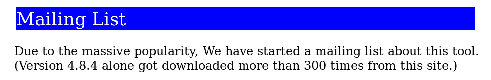

# curl 的二十五年 | daniel.haxx.se

> 原文链接：[`daniel.haxx.se/blog/2023/03/20/twenty-five-years-of-curl/`](https://daniel.haxx.se/blog/2023/03/20/twenty-five-years-of-curl/)

快乐时光总是过得很快。今天是[curl](https://curl.se/)的 25 周年。

curl 项目最初非常谦卑，是一个几乎没有人知道的小型重命名的 URL 传输工具，前几年几乎没有人知道。它解决了我的个人问题，

## 当时的我

我发布了第一个 curl 版本，并且自那时起打包了每一个版本。我发布第一个 curl 版本的那天，我 27 岁，当时在**Frontec Tekniksystem**担任软件工程师，主要为瑞典较大的产品开发公司的嵌入式系统进行合同开发。在 90 年代末的几年里，我会在瑞典电信巨头爱立信做一些项目。

自从 80 年代中期我得到第一台计算机以来，我就喜欢编程和开发。在 90 年代，我已经建立了一个日常时间表，在晚上我的另一半上床睡觉时，我会熬夜，然后在业余时间再花一两个小时进行开发。这基本上是我在前几十年里如何找到时间投入到我的项目中的。少睡觉。少其他事情。

## 逐渐并不断改进

curl 开发背后的概念一直是逐渐和迭代地改进所有方面。保持行为，但增强代码，添加测试用例，改进文档。一遍又一遍，年复一年。永不停止。如下面的时间线所示。

同样地，并没有突然的特定时刻，curl 突然变得流行，用户数量激增。相反，用户数量和工具库的受欢迎程度逐渐而持续地增长。1998 年几乎没有用户。到 2010 年，用户已经达到数亿。

我们实际上并不知道现在有多少用户或安装了 libcurl。仅仅基于世界上有 70 亿智能手机和 10 亿平板电脑这一事实，我们可以估计它的安装量远远超过**一百亿**。

## 在 curl 之前

我的互联网传输之旅始于 1996 年末，当时我下载了*httpget* 0.1，以便每天自动下载货币汇率，以使我的 IRC 机器人的货币兑换转换器能够正确工作。httpget 有一些缺陷，所以我发送了修复，但作者 Rafael 很快决定我可以接管这个东西的维护。所以我接手了。

我添加了 GOPHER 支持，更改了项目名称，添加了 FTP 支持，然后在 1998 年初开始添加 FTP 上传支持...

## 1998 年

最初的 curl 标志。

1998 年 3 月 20 日，curl 4.0 发布，因为它是建立在之前命名为 httpget 和 urlget 的项目之上，所以在其生日时已经有 2,200 行代码。它支持三种协议：HTTP、GOPHER 和 FTP，并拥有 24 个命令行选项。

curl 的第一个发布并不是特别的事件，因为我已经在之前一年多发布了 httpget 和 urlget 的版本，所以虽然这是一个新名称，但也是“又一个发布”，因为我已经做过很多次了。

我们在第一个 curl 年就添加了 HTTPS 和 TELNET 支持，同时也推出了第一个 curl 手册页。curl 最初是 GPL 许可的，但在那个第一个日历年 1998 年内我就转换为 MPL 许可。

第一个 SSL 支持由 SSLeay 提供。这个项目在 1998 年末过渡为 OpenSSL。

1998 年 8 月，我们在开源目录网站 freshmeat.net 上添加了 curl。

第一个 curl 网页发布在 `http://www.fts.frontec.se/~dast`。（wayback 机器存档的最古老版本是 [1998 年 12 月](https://web.archive.org/web/19981202234521/http://www.fts.frontec.se:80/~dast/curl/)）

1998 年 11 月，我在网站上添加了一条关于令人震惊的成功的说明，因为最新版本已经被下载了**300 次**！成功和受欢迎程度远非瞬间之间就能达到的。

1998 年 11 月 curl 网站的截图

在这第一年，我们发布了 20 个 curl 版本。我们再也没有重复过这一壮举。

## 1999 年

我们创建了第一个配置脚本，添加了对 cookies 的支持，并在 Debian Linux 中作为一个软件包出现。

curl 网站迁移到 `http://curl.haxx.nu`。

我们通过这一年增加了对 DICT、LDAP 和 FILE 的支持。现在支持 8 种协议。

在 1999 年的最后几天，我们将 curl 代码导入了一个名为 Sourceforge 的新服务。curl 中的所有后续提交计数都从这次导入开始。1999 年 12 月 29 日。

## 2000 年

私下里，我在 2000 年初换了工作，但白天继续做嵌入式合同开发。

.se 顶级域的规则发生了变化，我们将 curl 网站迁移到 `[curl.haxx.se](http://curl.haxx.se)`。

我结婚了。

2000 年 8 月，我们发布了 curl 7.1，事情发生了变化。这个版本引入了我们决定称为 libcurl 的库，因为我们想不出更好的名字。此时项目代码行数为 17,200 行。

libcurl API 的灵感来自于 `fopen()` 的工作方式，只返回一个不透明句柄，并且可以使用 `ioctl()` 来设置选项。

从一开始，将 curl 创建为一个库是我一直以来的想法，因为在那之前我已经意识到一个好的库可以为应用程序带来的力量。

[curl 的第一个 CVE](https://curl.se/docs/CVE-2000-0973.html) 被报告。

用户发现这个库很有用，并增加了对 curl 的使用。libcurl 的最早采用者之一是 PHP 语言，他们决定将 libcurl 作为默认的 HTTP/URL 传输引擎。

我们创建了第一个测试套件。

## 2001

我们更改了许可证，并根据新的 curl 许可证（实际上是 MIT）以及 MPL 提供了 curl。稍微修改 curl 许可证的想法是一个疯狂的想法，但其原因已经被遗忘。

我们添加了对 HTTP/1.1 和 IPv6 的支持。

六月份，感谢文件中列出了 67 位贡献者。这是一个团队的努力。我们在三月份超过了 1,100 次提交，在七月份 curl 有了 20,000 行代码。

苹果在 Mac OS X 中捆绑了 curl，当 curl 7.7.2 在 Mac OS X 10.1 中发布时。

## 2002

测试套件包含了 79 个测试用例。

我们放弃了 MPL 选项。我们再也不会玩许可证更改游戏了。

我们添加了对[HTTP 上的 gzip 压缩](https://zlib.net/)的支持，并学会了如何使用 SOCKS 代理。

## 2003

引入了 curl 的“自动构建”系统：志愿者在他们的机器上运行脚本，频繁下载、构建和运行 curl 测试，并将结果通过电子邮件发送回我们的中央服务器进行报告和分析。这些事情在现代 CI 系统出现之前就已经存在了。

我们为 HTTP 添加了 Digest、NTLM 和 Negotiate 身份验证的支持。

八月份我们提供了 40 个单独的 man 页面。

添加了对 FTPS 的支持，协议编号为 9。

我的第一个孩子，Agnes，出生了。

我分叉了 ares 项目，并开始了[c-ares 项目](https://c-ares.org/)，为 curl 和其他项目提供和维护一个进行异步名称解析的库。这个项目后来也变得相当受欢迎和广泛使用。

## 2004

2003 年初，curl 有 32,700 行代码。

我们让 curl 支持“大文件”，那时指的是支持大于 2 和 4 千兆字节的文件。

我们实现了对 IDN，国际域名的支持。

## 2005

GnuTLS 成为第二个受支持的 TLS 库。用户现在可以选择他们想要使用的 TLS 库。

多亏了瑞典“Internetfonden”的资助，我从工作中休假，实现了第一个版本的[multi_socket() API](https://everything.curl.dev/libcurl/drive/multi-socket)，以允许应用程序更快地进行更多并行传输。

[git](https://git-scm.com/)诞生了，他们迅速采用了 curl 进行 HTTP(S)传输。

TFTP 成为 curl 支持的第 10 种协议。

## 2006

我们决定放弃对“第三方 FTP 传输”的支持，这使我们因修改后的 ABI 而提升了 SONAME。最近的这种提升。这引发了一些争论。我们了解到提升 SONAME 对用户来说是多么困难。

[wolfSSL](https://wolfssl.com/)的前身 cyassl 成为 curl 支持的第三个 SSL 库。

我们添加了对 HTTP/1.1 Pipelining 的支持，并在年底接受了 Adobe 的合同开发工作，并添加了对 SCP 和 SFTP 的支持。

作为 SCP 和 SFTP 工作的一部分，我迈出了一个相当大的步伐，并后来成为[libssh2 项目](https://libssh2.org/)的维护者。这个项目也被广泛使用。

我有了第二个孩子，我的儿子 Rex。

## 2007

现在有 51,500 行代码，我们增加了对第四个 SSL 库 NSS 的支持。

我们增加了对 LDAPS 的支持，并合并了对 OS/400 的第一个端口。

对于 curl 7.16.1，我们增加了对`[--libcurl](https://everything.curl.dev/libcurl/libcurl)`的支持。可能是我最喜欢的 curl 命令行选项。生成使用 libcurl 的源代码，重复命令行传输。

四月份，curl 有 348 个测试用例。

## 2008

到目前为止，命令行工具已经增长到拥有 126 个命令行选项。在 curl 的前十年中增长了 5 倍。

三月份，我们的提交次数超过了 10,000 次。

我加入了[httpbis 工作组邮件列表](https://lists.w3.org/Archives/Public/ietf-http-wg/)，并开始在 IETF 和 HTTP 协议的工作中积极参与。

Solaris 发行了 curl 和 libcurl。Linux 上的 Adobe Flash 播放器使用了 libcurl。

九月份，curl 的贡献者总数达到了 654 人。

## 2009

在[FLOSS Weekly 51](https://twit.tv/shows/floss-weekly/episodes/51)上，我第一次在[播客](https://daniel.haxx.se/podcasts.html)中谈到了 curl。

我们引入了使用[cmake](https://cmake.org/)构建 curl 的支持。这个决定仍在讨论中，人们质疑它是否真的有帮助。为了使循环完整，cmake 本身使用了 libcurl。

七月份，IETF 75 会议在斯德哥尔摩举行，这是我第一次亲自见到几位个人协议英雄，他们创造并继续致力于 HTTP 协议：Mark、Roy、Larry、Julian 等。

八月份，我辞去了工作，[为自己的公司 Haxx 工作](https://daniel.haxx.se/blog/2009/08/30/going-full-time-haxx/)，但仍在进行合同开发。那时主要是做嵌入式 Linux。

多亏又一份合同，我为 curl 引入了对 IMAP(S)、SMTP(S)和 POP3(S)的支持，将支持的协议数量提升到 19 个。

我获得了[2009 年北欧自由软件奖](https://daniel.haxx.se/blog/2009/11/14/i-won-it-you-guys-are-the-best/)，以表彰我在 curl、c-ares 和 libssh2 上的工作。

## 2010

我们增加了对 RTSP 和 RTMP(S)的支持。

PolarSSL 成为第 6 个支持的 SSL 库。

我们从 CVS 切换到 git 版本控制系统，同时也从 Sourceforge 切换到[GitHub](https://github.com/)。从那时起，我们正确和适当地跟踪提交的作者，这在 CVS 中要困难得多。

增加了对 AxTLS 库的支持。这是第 7 个版本。

## 2011

超过 80,000 行代码。

[cookie RFC 6265 发布](https://daniel.haxx.se/blog/2011/04/28/the-cookie-rfc-6265/)。我参与其中并做了一些小的贡献。

我们引入了`[checksrc](https://github.com/curl/curl/blob/master/docs/CHECKSRC.md)`脚本，用于验证源代码是否符合 curl 的代码风格。一开始很简单，随着时间的推移得到改进并变得更加严格。

我收到了来自谷歌员工的 [感谢](https://daniel.haxx.se/blog/2011/12/06/a-special-thank-you-from-google/)，最终为我带来了一些谷歌周边产品。

我们超过了 100 位独立的提交者。

## 2012

149 个命令行选项。

增加了对 Schannel 和 Secure Transport 的支持。

当我试图估算 curl 用户数量时，我最终估计他们有 [5.5 亿](https://daniel.haxx.se/blog/2012/05/16/300m-users/)。这是我早期意识到 *哇，curl 到处都是！* 的一个体现。

在整个 2012 年，有 67 位提交作者。

## 2013

增加了对 GSKit 的支持，这是主要用于 OS/400 的 TLS 库。第 10 种支持的 TLS 库。

四月份，贡献者人数超过了 1,000 人，我们达到了 800 多个测试用例。

我们重构了内部结构，确保一切都是非阻塞的，并且我们称之为“内部使用多传输”，这样易用的接口只是多传输的一个包装器。

最初的 HTTP/2 支持尝试被合并（由伟大的 [nghttp2](https://nghttp2.org/) 库提供支持），以及使用 Happy Eyeballs 方法进行连接的支持。

我们创建了我们的前两个 CI 作业。

## 2014

我在 Mozilla 的 Firefox 网络团队开始工作，远程从瑞典的家中工作。这是我职业生涯中第一次主要从事网络和 HTTP 等工作，与 curl 的工作有很大的重叠。直到这一刻，我生活的两个方面一直奇怪地分开。Mozilla 允许我在 curl 上花费一些工作时间。

共有 161 个命令行选项和 20 个报告的 CVE。

59 个 man 页面在七月份爆炸性增长到了 270 个 man 页面，当时每个 libcurl 选项都有自己的独立页面。

我们增加了对 [libressl](https://www.libressl.org/) OpenSSL 分支的支持，并移除了对 QsoSSL 的支持。仍然支持 10 种 TLS 库。

九月份，代码行数达到了 105,000 行。

增加了对 SMB(S) 24 协议的支持。

## 2015

增加了对 BoringSSL 和 mbedTLS 的支持。

我们引入了支持使用 HTTP/2 进行适当的多路传输。当多个传输共享一个连接时，这是架构上的一次相当激进的范式变化。进行了大量的重构，直到 HTTP/2 支持变得稳定。

随后是我们对 HTTP/2 服务器推送的第一次支持。

我们完全转向了 GitHub 的工作模式，使用其问题跟踪器并进行拉取请求。

第一份 [HTTP/2 RFC 在五月份发布](https://daniel.haxx.se/blog/2015/05/15/rfc-7540-is-http2/)。我想我对背后的工作组努力做出了一点贡献。

今年我的 HTTP/2 工作部分由 Netflix 赞助，这是一场在仍然受雇于 Mozilla 并为其工作的情况下发生的舞蹈。

20,000 次提交。

我开始写作 [everything curl](https://everything.curl.dev/)。

我们还添加了对[libpsl](https://github.com/rockdaboot/libpsl)的支持，使用[公共后缀列表](https://publicsuffix.org/)来更好地处理 cookie。

## 2016 年

curl 默认切换到使用 HTTP/2 进行 HTTPS 传输。

五月，curl 具有 185 个命令行选项。

我们有了[新标志](https://daniel.haxx.se/blog/2016/05/27/a-new-curl-logo/)，现在这个。由 Soft Dreams 的 Adrian Burcea 设计。

添加了对 HTTPS 代理和 TLS 1.3 的支持。

curl 被[Cure 53 审计](https://daniel.haxx.se/blog/2016/11/23/curl-security-audit/)。

一家名为瑞典技术网站将我评为瑞典第二好的开发者，因为我在 curl 上的工作。

年底代码行数达到 115,500 行。

## 2017 年

curl 支持使用多个 TLS 库构建和使用，并在启动时选择使用哪个。

Fastly 联系并慷慨地[开始托管](https://daniel.haxx.se/blog/2017/05/02/a-curl-delivery-network/)curl 网站以及我的个人网站。这有助于解决以前博客文章过于受欢迎而导致网站无法支撑的不稳定性，并使 curl 网站对全球更多人变得更快。自那时起，他们一直是该项目的忠实赞助商。

2017 年春天，我们举办了有史以来第一次的实体开发者大会，[curl up](https://github.com/curl/curl-up/wiki)，作为二十多名 curl 粉丝和开发者前往德国纽伦堡度过一个周末，什么都不做，只做 curl 相关的事情。

六月，我被[拒绝前往美国](https://daniel.haxx.se/blog/2017/06/28/denied-entry/)。随后，这使我陷入了一场漫长而痛苦的冒险，试图获得美国签证。

第一个[SSLKEYLOGFILE](https://everything.curl.dev/usingcurl/tls/sslkeylogfile#sslkeylogfile)支持到位，我们引入了新的 MIME API 和对 brotli 压缩的支持。

curl 项目被纳入[OSS-Fuzz 项目](https://google.github.io/oss-fuzz/)，该项目立即开始指出我们代码中的错误。从那时起，他们一直在不停地对 curl 进行模糊测试。

十月，我被授予[波尔海姆奖](https://daniel.haxx.se/blog/2017/10/20/my-night-at-the-museum/)。瑞典最古老且可能是最负盛名的工程奖。该奖项自 1876 年设立并颁发至今。一枚真正的金质奖牌，由瑞典国王亲自颁发给我。奖牌上甚至刻有我的名字。

## 2018 年

添加了对 DNS over HTTPS 的支持，并引入了新的 URL API，允许应用程序以与 curl 完全相同的方式解析 URL。

我参加了[Changelog 播客并谈论了 curl](https://changelog.com/podcast/299)的 20 周年。

微软开始捆绑 curl 与 Windows 一起发布。但是[curl 别名仍然存在](https://daniel.haxx.se/blog/2016/08/19/removing-the-powershell-curl-alias/)。

我们引入了对第二个 SSH 库的支持，因此现在 SCP 和 SFTP 可以由[libssh](https://libssh.org)提供支持，除了已支持的[libssh2](https://libssh2.org/)库。

我们增加了对 MesaLink 的支持，但放弃了对 AxTLS 的支持。共计 12 个 TLS 库。

代码行数达到了 129,000 行。在 GitHub 上获得了 1 万颗星。

为了接受捐赠，我们被要求在[Open Collective](https://opencollective.com/curl)上创建一个账户，于是我们这样做了。这后来成为项目接受捐赠和赞助的一个良好渠道。

2018 年 11 月，决定将 HTTP-over-QUIC 协议正式成为 HTTP/3。

年底时有 27 个 CI 作业。运行了超过 1200 个测试用例。

## 2019 年

我[开始为 wolfSSL 工作](https://daniel.haxx.se/blog/2019/02/02/im-on-team-wolfssl/)，全职从事 curl 工作。花了 21 年才让 curl 成为我的工作。

我们添加了对 Alt-Svc 的支持，并移除了一直存在问题的 HTTP/1.1 Pipelining 的支持。

我们推出了我们的第一个 curl[漏洞赏金](https://curl.se/docs/bugbounty.html)计划，自那以来我们一直有效地进行着漏洞赏金活动。与[hackerone](https://hackerone.com/curl)合作。我们已经支付了近 5 万美元的奖励金用于发现 45 个漏洞（截至 2023 年 2 月）。

增加了对[AmiSSL](https://github.com/jens-maus/amissl)和[BearSSL](https://bearssl.org/)的支持：共计 14 个库。

我们合并了[对 HTTP/3 的初始支持](https://daniel.haxx.se/blog/2019/08/05/first-http-3-with-curl/)，由[quiche](https://docs.quic.tech/quiche/)库提供支持，稍后还使用了第二个库：[ngtcp2](https://github.com/ngtcp2/ngtcp2)。因为为什么不使用多个后端呢？

我们开始提供 curl 的“官方”[docker 镜像](https://hub.docker.com/r/curlimages/curl)。

## 2020 年

curl 工具获得了并行传输功能，可以使用`-w`以 JSON 格式输出数据，而令人恐惧的`--help`输出被清理整理得更好，分成了子类别。

2020 年 3 月，对于[curl 7.69.0](https://youtu.be/X7Jlv87Nb8Y)，我开始进行发布视频演示，进行直播。

[curl 网站](https://curl.se/)迁移到了`curl.se`，而[everything curl](https://everything.curl.dev/)迁移到了`curl.dev`域名。

MQTT 成为第 25 个支持的协议。

第一次添加了对 HSTS 的支持，以及对 zstd 压缩的支持。

[wolfSSH](https://www.wolfssl.com/products/wolfssh/)成为第三个支持的 SSH 库。

我们移除了对 PolarSSL 的支持。

初始[对 hyper 的支持](https://daniel.haxx.se/blog/2020/10/09/rust-in-curl-with-hyper/)作为 HTTP/1 和 HTTP/2 的替代后端。

2020 年 11 月，在新冠疫情期间，我[终于获得了美国签证](https://daniel.haxx.se/blog/2020/11/09/a-us-visa-in-937-days/)。

第 90 个 CI 作业在年底前刚刚创建。

## 2021 年

放弃了对 MesaLink 的支持，但增加了对 rustls 的支持。共计 13 个 TLS 库。

Ingenuity 登陆火星，而 [curl 帮助实现了这一切](https://daniel.haxx.se/blog/2021/04/19/mars-2020-helicopter-contributor/)。

收到了一封非常不愉快的 [死亡威胁邮件](https://un.curl.dev/emails/slaughter)，来自一个深感困惑的人，责怪我发生在他身上的各种不好的事情。

在 GitHub 上获得了 20,000 颗星。

支持 GOPHERS。共支持 26 种协议。

187 个个人在今年合并的提交中拥有作者身份。

## 2022

合并了对 WebSocket 的初始支持（`WS://` 和 `WSS://` URL）以及一个新的处理它的 API。共支持 28 种协议。

我们添加了 `[--json](https://daniel.haxx.se/blog/2022/02/02/curl-dash-dash-json/)` 命令行选项，libcurl 得到了一个新的 [header API](https://daniel.haxx.se/blog/2022/03/22/a-headers-api-for-libcurl/)，然后也使命令行工具得到了新的“header picking”能力，添加到 `-w`。我们还添加了 `[--rate](https://daniel.haxx.se/blog/2022/05/23/curl-offers-repeated-transfers-at-slower-pace/)` 和 `[--url-query](https://daniel.haxx.se/blog/2022/11/10/append-data-to-the-url-query/)`。

[HTTP/3 RFC](https://datatracker.ietf.org/doc/html/rfc9114) 在 6 月发布。

[msh3](https://github.com/nibanks/msh3) 成为第三个支持的 HTTP/3 库。

Trail of Bits 进行了由 [OpenSSF](https://openssf.org/) 赞助的 [curl 安全审计](https://daniel.haxx.se/blog/2022/12/21/the-2022-curl-security-audit/)。

第 212 个 curl 发布是在 12 月完成的。GitHub 上创建了第 **10,000** 个问题。

## 2023

年初：155,100 行代码。486 个 man 页面。1560 个测试用例。2,771 个贡献者。1,105 个提交作者。132 个 CVE。122 个 CI 作业。29,733 次提交。48,580 美元的漏洞赏金。249 个命令行选项。28 种协议。13 个 TLS 库。3 个 SSH 库。3 个 HTTP/3 库。

引入对 HTTP/3 的支持，并回退到旧版本，使其使用起来更少出错。

3 月 13 日，我们超过了 **30,000** 次提交。

3 月 20 日，我们发布了 curl 8.0.0。距离第一个 curl 发布已经整整 25 年。

## 保持相关性

在过去的 25 年里，我们都停止使用和遗忘了许多软件、工具和服务。事物来来去去。一切都有它的时机，许多项目在某个时刻无法跟上并被其他东西取代。

我认为 curl 仍然是一个非常相关的软件项目，拥有大量用户和用例。我想这部分是因为我们密切维护它，并充满关怀和爱。我们让它做用户想要的事情。保持更新，跟上潮流，运行最新版本，支持最新的安全措施，成为您想要使用和参与的项目。以身作则。

## 我的生活永远被 curl 染色

将 curl 发展到这一步，并且能够全职从事我的爱好项目是一个梦想成真。curl 是我生活的重要组成部分。

我在 2019 年在葡萄牙度假时的照片。

话虽如此，curl 是一个团队的努力，没有我们所有出色的贡献者，它永远不会起飞或成为真正的东西。人们会称我为“curl 的那个人”，有些人会说这是“我的”项目，但每一个曾经接近这个项目的人都知道我们的团队不仅仅是我一个人。

## 25 年

那天我 26 岁找到了 httpget。我在发行 curl 时已经 27 岁了。去年 11 月我已经 52 岁了。

我在 curl 上工作的时间比在任何公司工作的时间都长。我的孩子们都还没有这么大。25 年前我还没有住在我现在的房子里。25 年前 Google 和 Firefox 都不存在。

许多现在使用 curl 的用户在我开始开发它时甚至还没有出生。

## 超过二十五

我觉得有义务添加这一部分，因为人们会问。

我不知道未来会发生什么。我从来不擅长预测或预测，坦率地说，我总是尽量避免占卜。我希望能继续活跃在项目中，并继续与客户端互联网传输工作，只要这仍然有趣，人们愿意使用我的工作成果。

在项目中再过 25 年我还会在吗？curl 那时还会有影响力吗？我不知道。让我们拭目以待！
